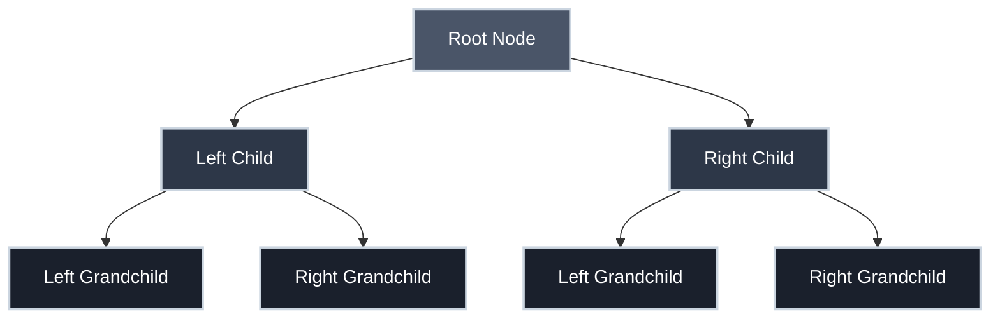
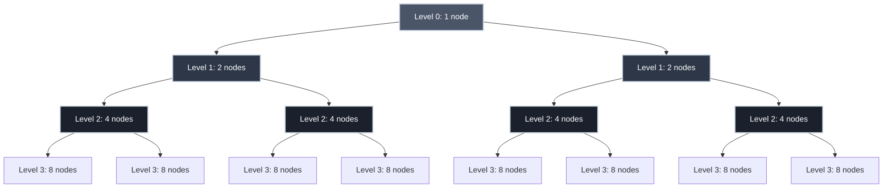
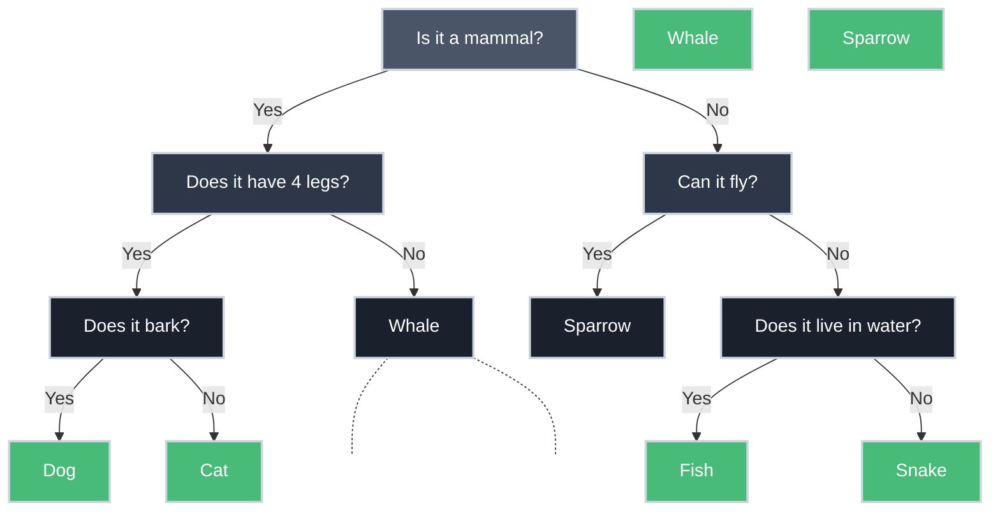
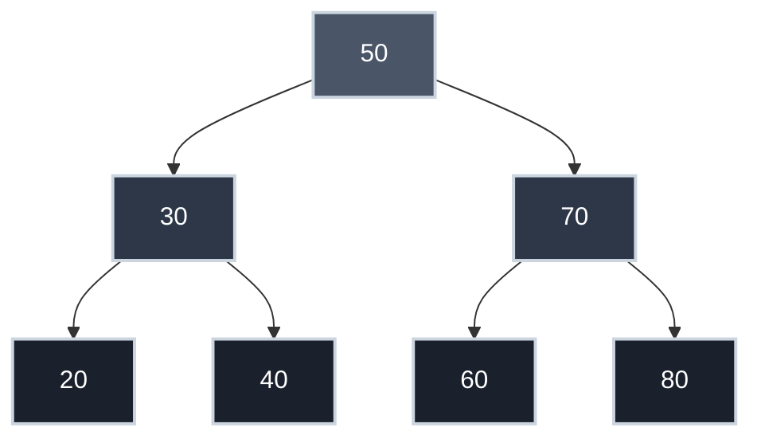

# Binary Trees and Binary Representation

When you fill out a form and select your country from a dropdown menu, how does the system find "United States" among 195 countries in milliseconds? When a compiler checks your code's syntax tree for errors, what structure lets it traverse thousands of nodes efficiently? When your computer represents the number 42, why does it use `101010` instead of `42`?

The answer to all three lies in understanding binary—both as a number system and as a tree structure. Binary representation is the foundation of how computers store everything, while binary trees are the foundation of how computers organize and search through that everything.

## The Binary Number System

### What is Binary?

Binary is a base-2 number system, using only two digits: `0` and `1`. Each digit is called a **bit** (binary digit).

**Decimal (base-10) vs. Binary (base-2):**

| Decimal | Binary | Calculation |
|:--------|:-------|:------------|
| 0 | 0 | 0 |
| 1 | 1 | 1 |
| 2 | 10 | \(1 \times 2^1 + 0 \times 2^0\) |
| 3 | 11 | \(1 \times 2^1 + 1 \times 2^0\) |
| 4 | 100 | \(1 \times 2^2 + 0 \times 2^1 + 0 \times 2^0\) |
| 5 | 101 | \(1 \times 2^2 + 0 \times 2^1 + 1 \times 2^0\) |
| 7 | 111 | \(1 \times 2^2 + 1 \times 2^1 + 1 \times 2^0\) |
| 42 | 101010 | \(1 \times 2^5 + 0 \times 2^4 + 1 \times 2^3 + 0 \times 2^2 + 1 \times 2^1 + 0 \times 2^0\) |

Each position represents a power of 2, just as decimal positions represent powers of 10.

### Why Binary?

Computers use binary because digital circuits have two stable states:

- **Voltage high** (typically ~5V or ~3.3V) → represents `1`
- **Voltage low** (typically ~0V) → represents `0`

This physical constraint makes binary natural for electronic computers. A transistor is either conducting or not. A magnetic region on a hard drive is magnetized north or south. A laser reading a CD detects a pit or a land.

**Two states are reliable.** Trying to distinguish between ten voltage levels (for decimal) would require extreme precision and be error-prone.

??? tip "Historical Context: Binary's Journey from Ancient Mathematics to Modern Computing"

    **Ancient Origins of Binary Arithmetic**

    Binary arithmetic has deep roots. Indian mathematician Pingala described binary-like patterns in prosody around 300 BCE. Later, Gottfried Wilhelm Leibniz formalized binary arithmetic in 1679 and recognized its connection to Boolean logic—a connection that would prove essential for computing centuries later.

    **The Decimal Computer Experiments (1940s-1950s)**

    Binary wasn't always the obvious choice for electronic computers. In the 1940s and early 1950s, several pioneering computers experimented with **decimal** (base-10) representation, since humans naturally think in decimal.

    **Notable decimal computers:**

    - **ENIAC (1945)**: Used decimal representation with 10-state vacuum tube rings to store each digit. Each decimal digit required 10 vacuum tubes in a ring counter configuration—far more complex than binary's simple on/off states.
    - **IBM 650 (1953)**: A commercial decimal computer that stored data using bi-quinary code (a hybrid approach using 7 bits to represent each decimal digit).
    - **UNIVAC I (1951)**: Used excess-3 binary-coded decimal (BCD), where each decimal digit was encoded in 4 bits.

    **Why binary won:**

    1. **Simplicity**: Binary logic gates and circuits are far simpler to design and build.
    2. **Reliability**: Two voltage levels are easier to distinguish than ten, especially as components age or temperatures fluctuate.
    3. **Efficiency**: Binary arithmetic circuits (adders, multipliers) are more straightforward than decimal equivalents.
    4. **Error correction**: Binary systems made it easier to detect and correct errors using parity bits and other techniques.

    By the late 1950s, the industry had largely standardized on binary.

    **Binary Trees in Computing (1960s-1970s)**

    Binary trees became fundamental to computer science in the 1960s:

    - **1962**: Donald Knuth's work on tree algorithms (later published in *The Art of Computer Programming*)
    - **1962**: Adelson-Velsky and Landis invented AVL trees (self-balancing binary search trees)
    - **1972**: Rudolf Bayer invented B-trees (generalization for databases)

    **The lesson?** Sometimes the system that's easiest for *machines* to process trumps the system that's easiest for *humans* to read—and we build translation layers (like decimal I/O) to bridge the gap. Today, binary representation and binary trees underpin databases, compilers, file systems, and machine learning.

### The Power of Binary

Binary is remarkably expressive:

- **8 bits** (1 byte) can represent \(2^8 = 256\) different values (0-255)
- **16 bits** can represent \(2^{16} = 65{,}536\) values
- **32 bits** can represent \(2^{32} = 4{,}294{,}967{,}296\) values (4.3 billion)
- **64 bits** can represent \(2^{64} = 18{,}446{,}744{,}073{,}709{,}551{,}616\) values (18.4 quintillion)

With binary, computers can represent:

- **Integers**: Positive and negative whole numbers
- **Floating-point numbers**: Decimals and scientific notation
- **Text**: ASCII, Unicode (each character is a number)
- **Images**: Pixel colors (RGB values)
- **Audio**: Sample amplitudes
- **Video**: Sequences of images
- **Instructions**: CPU opcodes
- **Memory addresses**: Locations in RAM

**Everything** a computer processes—from your email to a movie to the operating system itself—is ultimately bits.

## Why Abstraction is Still Necessary

Given that binary can represent anything—numbers, text, images, sound—why do we need abstraction?

=== ":material-brain: Cognitive Overload"

    Working directly with bits is impractical for humans.

    **Representing the number 1,000,000:**

    - **Binary**: `11110100001001000000` (20 bits)
    - **Decimal**: `1000000` (7 digits)
    - **Hexadecimal**: `F4240` (5 characters)

    Hexadecimal is an abstraction over binary (each hex digit = 4 bits), making it easier to read and write.

=== ":material-comment-question: Semantic Meaning"

    Bits have no inherent meaning—context determines interpretation.

    **The bit sequence `01000001` could mean:**

    - The number 65 (unsigned integer)
    - The letter 'A' (ASCII encoding)
    - The number \(1.52 \times 10^{-43}\) (part of a floating-point number)
    - An instruction opcode (CPU operation)

    **Abstraction provides meaning:** High-level languages let you write `'A'` instead of `01000001`, making intent clear.

=== ":material-chip: Hardware Complexity"

    Modern CPUs have billions of transistors. Writing programs at the bit level would be:

    - Extremely tedious (millions of lines for simple tasks)
    - Error-prone (one wrong bit = program crash)
    - Unportable (different CPUs use different instruction sets)

    **Abstraction layers solve this:**

    | Layer | Example | Abstracts Over |
    |:------|:--------|:---------------|
    | **Hardware** | Transistors, logic gates | Physics (voltage, current) |
    | **Machine Code** | `10110000 01100001` | Gate-level operations |
    | **Assembly** | `MOV AL, 97` | Binary opcodes |
    | **High-Level** | `char letter = 'A';` | Assembly instructions |
    | **Libraries** | `print("Hello")` | Low-level I/O details |

    Each layer hides complexity, letting programmers focus on solving problems rather than managing bits.

=== ":material-speedometer: Efficiency"

    Sometimes binary isn't the most efficient representation for specific tasks.

    **Example: DNA Sequences**

    DNA has four bases (A, C, G, T). You could encode each base in binary:

    - `A = 00`, `C = 01`, `G = 10`, `T = 11` (2 bits each)

    But specialized data structures (suffix trees, hash tables) provide faster search and comparison, even though they ultimately use binary underneath.

    **Abstraction enables optimization:** You can change the underlying representation without changing the program logic.

??? tip "Abstraction in Data Structures"

    The concept of hiding implementation details behind clean interfaces is formalized in **[Abstract Data Types (ADTs)](../data_structures/abstract_data_types_and_stack.md)**.

    An ADT defines *what* a data structure does (its operations and behavior) without specifying *how* it's implemented. This separation allows you to swap implementations—switching from an array-based stack to a linked-list-based stack—without changing any code that uses it.

    Binary trees themselves can be implemented many ways (arrays, linked nodes, etc.), but users of the tree only care about operations like insert, search, and traverse.

## Binary Trees

### What is a Binary Tree?

A binary tree is a hierarchical data structure where each **node** has at most two children, conventionally called **left** and **right**.

**Structure:**



**Terminology:**

| Term | Definition |
|:-----|:-----------|
| **Root** | The topmost node (no parent) |
| **Leaf** | A node with no children |
| **Parent** | A node with children |
| **Child** | A node with a parent |
| **Sibling** | Nodes sharing the same parent |
| **Depth** | Number of edges from root to a node |
| **Height** | Maximum depth in the tree |
| **Level** | All nodes at the same depth |

### Formal Definition

A binary tree is either:

1. **Empty** (no nodes), or
2. A **root node** with two subtrees (left and right), each of which is itself a binary tree

This recursive definition mirrors how binary trees are used—operations on trees often recursively operate on subtrees.

## The Exponential Power of Depth

Here's where binary trees become fascinating: **depth determines capacity exponentially**.

### Levels and Capacity

At each level of a binary tree, the maximum number of nodes **doubles**:

| Level | Max Nodes | Calculation | Total Nodes (cumulative) |
|:------|:----------|:------------|:-------------------------|
| 0 (root) | 1 | \(2^0\) | 1 |
| 1 | 2 | \(2^1\) | 3 |
| 2 | 4 | \(2^2\) | 7 |
| 3 | 8 | \(2^3\) | 15 |
| 4 | 16 | \(2^4\) | 31 |
| 5 | 32 | \(2^5\) | 63 |
| \(n\) | \(2^n\) | \(2^n\) | \(2^{n+1} - 1\) |

??? tip "Key Insight: Exponential Growth"

    A binary tree of depth \(n\) has \(2^n\) nodes at the bottom level.

    This exponential relationship is why binary trees are so powerful for representing choices, decisions, and hierarchical data. Each additional level doubles the capacity—making even shallow trees surprisingly expressive.

### Example: Depth 3 Binary Tree



**Total capacity:** \(2^3 = 8\) distinct values can be represented at the leaves.

If each path from root to leaf represents a unique answer to yes/no questions:

- At depth 1: 2 possible outcomes
- At depth 2: 4 possible outcomes
- At depth 3: 8 possible outcomes
- At depth 10: 1,024 possible outcomes
- At depth 20: 1,048,576 possible outcomes (over a million!)

This exponential growth makes binary trees extraordinarily efficient for representing choices, decisions, and searches.

## Binary Trees for Distinction

A binary tree can **distinguish** among different values by assigning each leaf a unique path from the root.

### Example: 20 Questions Game

The classic "20 Questions" game leverages this principle. With 20 yes/no questions, you can distinguish among \(2^{20} = 1{,}048{,}576\) possible answers.

**Simplified Example (3 questions, 8 animals):**



Each path from root to leaf uniquely identifies one animal. With depth 3, we can distinguish up to 8 animals (though this example uses 6).

### Binary Search Trees

A **binary search tree** (BST) is a binary tree where:

- Left subtree contains only values **less than** the node's value
- Right subtree contains only values **greater than** the node's value

This structure enables **logarithmic search time** for balanced trees. Each comparison eliminates half of the remaining items, so the number of steps grows as \(\log_2 n\) (we'll explore this "Big O notation" in our algorithms section). In practical terms: searching 1,000,000 items requires only about 20 comparisons, because \(\log_2 1{,}000{,}000 \approx 20\). Double the data to 2,000,000 items? You only need 21 comparisons—one more.

**Example BST (numbers):**



To find 40:

1. Start at 50 → 40 < 50, go left
2. At 30 → 40 > 30, go right
3. Found 40 ✓

Only 3 comparisons instead of scanning all 7 nodes sequentially.

## Real-World Applications

=== "Decision Trees"

    **Machine Learning**

    Binary trees model decisions in AI systems:

    - Each node represents a feature test
    - Each leaf represents a classification
    - Depth determines model complexity

=== "Expression Trees"

    **Compilers**

    The expression `2 + 3 * 4` becomes a binary tree:

    ```mermaid
    graph TD
        Plus["+"] --> Two["2"]
        Plus --> Times["*"]
        Times --> Three["3"]
        Times --> Four["4"]

        style Plus fill:#4a5568,stroke:#cbd5e0,stroke-width:2px,color:#fff
        style Times fill:#2d3748,stroke:#cbd5e0,stroke-width:2px,color:#fff
        style Two fill:#1a202c,stroke:#cbd5e0,stroke-width:2px,color:#fff
        style Three fill:#1a202c,stroke:#cbd5e0,stroke-width:2px,color:#fff
        style Four fill:#1a202c,stroke:#cbd5e0,stroke-width:2px,color:#fff
    ```

    Evaluating the tree (post-order traversal) correctly computes `2 + (3 * 4) = 14`.

    See **[Scheme & Parse Trees](scheme_and_parse_trees.md)** for a perfect example of how code structure maps directly to these trees.

    See **[How Parsers Work](how_parsers_work.md)** for a deep dive into how these trees are built.

=== "File Systems"

    Directory hierarchies are trees:

    ```
    /
    ├── home/
    │   ├── user/
    │   │   ├── documents/
    │   │   └── pictures/
    │   └── shared/
    └── var/
        └── log/
    ```

    Though not strictly binary (nodes can have many children), the principle of hierarchical organization is the same.

=== "Compression"

    **Huffman Encoding**

    Huffman trees assign shorter binary codes to frequent characters:

    - Frequent characters: shorter paths (fewer bits)
    - Rare characters: longer paths (more bits)

    This is how ZIP files and JPEG images achieve compression.

## Practice Problems

??? question "Practice Problem 1: Binary Conversion"

    Convert the decimal number 100 to binary.

    Show your work using powers of 2.

    ??? tip "Solution"

        **Method 1: Repeated Division by 2**

        ```
        100 ÷ 2 = 50 remainder 0  (rightmost bit)
         50 ÷ 2 = 25 remainder 0
         25 ÷ 2 = 12 remainder 1
         12 ÷ 2 =  6 remainder 0
          6 ÷ 2 =  3 remainder 0
          3 ÷ 2 =  1 remainder 1
          1 ÷ 2 =  0 remainder 1  (leftmost bit)
        ```

        **Reading remainders bottom-up:** `1100100`

        **Method 2: Powers of 2**

        100 = 64 + 32 + 4
            = \(2^6 + 2^5 + 2^2\)
            = `1100100` in binary

        **Verification:** \(1 \times 64 + 1 \times 32 + 0 \times 16 + 0 \times 8 + 1 \times 4 + 0 \times 2 + 0 \times 1 = 100\) ✓

??? question "Practice Problem 2: Tree Depth Calculation"

    How many distinct values can a binary tree of depth 7 distinguish?

    If you're building a decision tree for classifying animals and need to distinguish among 500 species, what minimum depth is required?

    ??? tip "Solution"

        **Part 1: Depth 7**

        A binary tree of depth \(n\) can distinguish \(2^n\) values.

        Depth 7: \(2^7 = 128\) distinct values

        **Part 2: 500 Species**

        Need \(2^n \geq 500\)

        - \(2^8 = 256\) (too small)
        - \(2^9 = 512\) ✓ (sufficient)

        **Minimum depth:** 9

        **Verification:** With 9 yes/no questions, you can distinguish among 512 different animals, which covers all 500 species.

??? question "Practice Problem 3: Binary Search Tree Search"

    Given this binary search tree, trace the path to find the value 35:

    ```
           50
          /  \
        30    70
       /  \   / \
      20  40 60 80
         /
        35
    ```

    How many comparisons are needed? How does this compare to linear search?

    ??? tip "Solution"

        **Trace:**

        1. Start at 50 → 35 < 50, go **left**
        2. At 30 → 35 > 30, go **right**
        3. At 40 → 35 < 40, go **left**
        4. Found 35 ✓

        **Comparisons needed:** 4

        **Linear search comparison:** If the tree were stored as a flat list [50, 30, 70, 20, 40, 60, 80, 35], linear search would need to check each element until finding 35 → **8 comparisons** (worst case).

        **BST is 2x faster** in this example. For larger trees, the advantage grows exponentially—searching 1 million items requires ~20 BST comparisons vs. up to 1 million linear comparisons.

??? question "Practice Problem 4: Abstraction Necessity"

    The 8-bit binary sequence `11000001` could represent:

    - An unsigned integer
    - A signed integer (two's complement)
    - An ASCII character
    - Part of a machine instruction

    What value does it represent in each case? Why does this demonstrate the need for abstraction?

    ??? tip "Solution"

        **Interpretations:**

        1. **Unsigned integer:** 1×128 + 1×64 + 1×1 = **193**
        2. **Signed integer (two's complement):** First bit is 1 (negative). Flip bits: `00111110`, add 1: `00111111` = 63, so the value is **-63**
        3. **ASCII character:** Decimal 193 = **'Á'** (Latin capital A with acute accent in extended ASCII)
        4. **Machine instruction:** Could be an opcode like `RET` (return from function) in some CPU architectures

        **Why abstraction is needed:**

        The same bit pattern has **four completely different meanings** depending on context. Without type systems and high-level languages that label data (int, char, instruction, etc.), programmers would need to track every bit's intended meaning manually—a recipe for catastrophic errors.

        Abstraction lets you write `int x = -63;` or `char c = 'Á';`, making the intent explicit and preventing misinterpretation.

## Key Takeaways

| Concept | Meaning |
|:--------|:--------|
| **Binary Number System** | Base-2 representation using only 0 and 1 |
| **Binary Tree** | Hierarchical structure where each node has ≤ 2 children |
| **Depth** | Number of edges from root to a node |
| **Exponential Growth** | Tree of depth \(n\) can distinguish \(2^n\) values |
| **Binary Search Tree** | Binary tree with left < parent < right ordering |
| **Abstraction** | Hiding bit-level details to provide semantic meaning and manage complexity |
| **Logarithmic Time** | Search efficiency \(\log_2 n\) where doubling data adds only one more step |

## Why Binary Trees Matter

Understanding binary trees reveals:

- **How computers organize information efficiently** (databases, file systems)
- **[How compilers parse code](how_parsers_work.md)** (syntax trees, expression evaluation)
- **How search algorithms work** (binary search, decision trees)
- **How exponential growth creates power** (20 questions → 1 million possibilities)
- **Why logarithmic time is so valuable** (\(\log_2(1{,}000{,}000) \approx 20\) comparisons)

Binary representation is the foundation—binary trees are the structure built on that foundation. Together, they explain how computers transform electrical signals into everything from spreadsheets to streaming video.

## Further Reading

- **David Evans, [Introduction to Computing](https://computingbook.org/)** — Chapter 1 covers binary trees and representation
- **[Computational Thinking](computational_thinking.md)** — Decomposition and abstraction in action
- **[How Parsers Work](how_parsers_work.md)** — Building syntax trees from code
- **[Recursive Transition Networks](recursive_transition_networks.md)** — Trees in parsing and grammars
- **Donald Knuth, *The Art of Computer Programming, Volume 1*** — Definitive reference on tree algorithms

---

Binary is the language of computers. Binary trees are the grammar. You can't truly understand computing without understanding both—and how they work together to turn simple on/off signals into the complex systems we use every day.

## Video Summary

<div class="video-wrapper">
  <iframe src="https://www.youtube.com/embed/suiBcUgYx_8" title="Binary Trees and Binary Representation" allow="accelerometer; autoplay; clipboard-write; encrypted-media; gyroscope; picture-in-picture; web-share" allowfullscreen></iframe>
</div>
