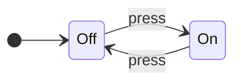
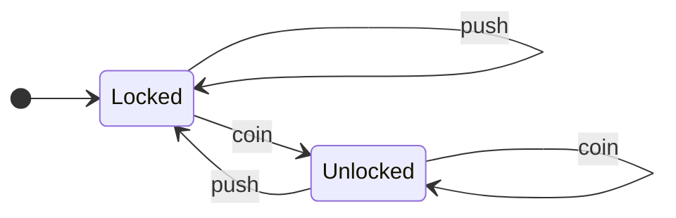
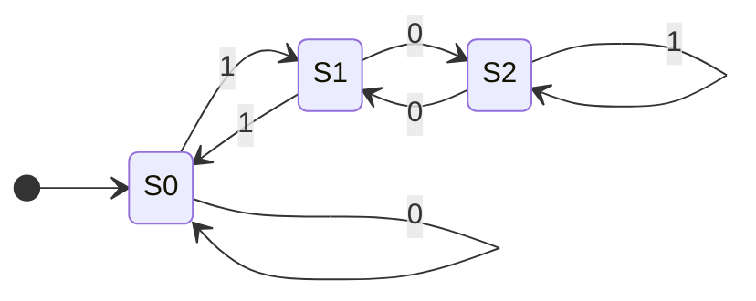
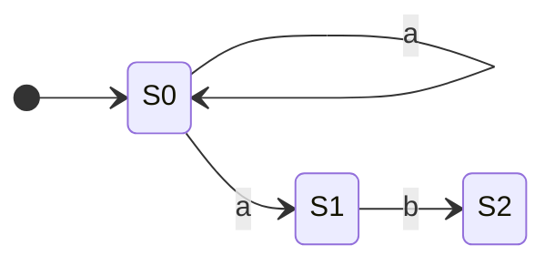
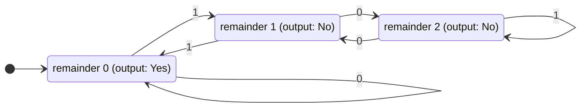
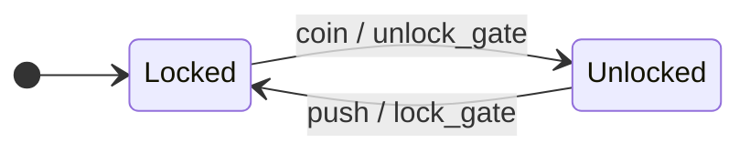
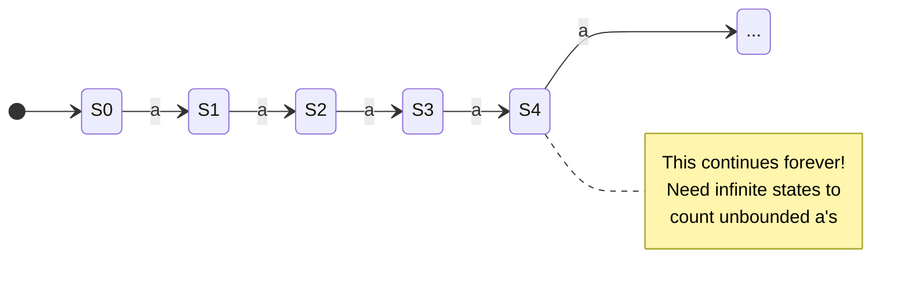
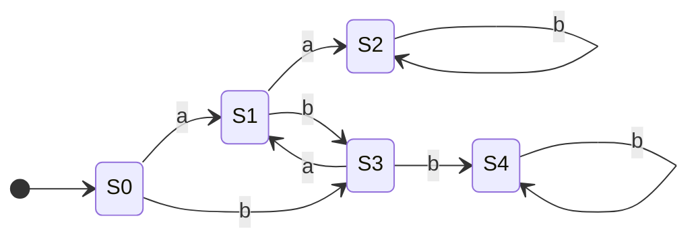
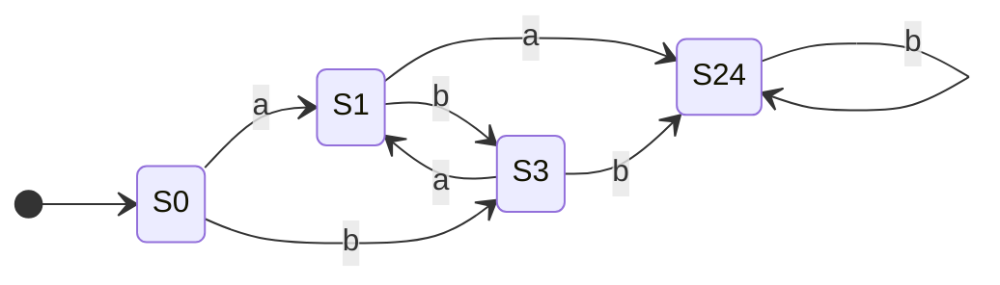

# Finite State Machines (FSMs)

Imagine modeling any system that moves through distinct states—a traffic light cycling through red, yellow, and green; a turnstile that's either locked or unlocked; a video game enemy switching between patrolling, chasing, and attacking. These are all **Finite State Machines**, one of the most elegant and foundational models in computer science.

FSMs are everywhere: traffic lights, vending machines, elevators, video game AI, text parsers, network protocols, compilers. Once you understand them, you'll start seeing them in everything. 👀

Understanding FSMs requires [computational thinking](computational_thinking.md): **decomposing** systems into states, **recognizing patterns** in transitions, **abstracting** away implementation details, and **designing algorithms** to process inputs.

## What is a Finite State Machine?

A Finite State Machine is an abstract model of computation that:

- Has a finite number of **states** (hence the name)
- Starts in an **initial state**
- **Transitions** between states based on inputs
- May have one or more **accepting states** (success!)

That's it. No infinite memory, no complex calculations—just states and transitions.



This is an FSM for a light switch. Two states (On, Off), one input (press), deterministic behavior. Simple, but powerful.

## Formal Definition

For the mathematically inclined, an FSM is a 5-tuple \((Q, \Sigma, \delta, q_0, F)\):

| Symbol | Meaning |
|:-------|:--------|
| \(Q\) | Finite set of states |
| \(\Sigma\) | Finite alphabet (possible inputs) |
| \(\delta\) | Transition function \((state \times input \to state)\) |
| \(q_0\) | Initial state |
| \(F\) | Set of accepting/final states |

Don't worry if that looks intimidating—we'll work with diagrams.

## Example: Turnstile

A classic FSM example is a subway turnstile:



**States:** Locked, Unlocked

**Inputs:** coin, push

**Behavior:**

- Start Locked
- Insert coin → Unlocked
- Push while Unlocked → Locked (you go through)
- Push while Locked → stays Locked (nothing happens)
- Insert coin while Unlocked → stays Unlocked (thanks for the extra money! 💰)

This is a complete specification of turnstile behavior. No ambiguity.

## Example: Validating Binary Numbers Divisible by 3

Here's where FSMs get interesting. Can we build a machine that accepts binary numbers divisible by 3?



**Formal Definition of this FSM:**

- \(Q = \{S0, S1, S2\}
- \(\Sigma = \{0, 1\}
- \(q_0 = S0
- \(F = \{S0\}
- \(\delta\) is defined by the following table:

| State | Input '0' | Input '1' |
|:------|:----------|:----------|
| **S0**| S0        | S1        |
| **S1**| S2        | S0        |
| **S2**| S1        | S2        |

**States represent remainders when dividing by 3:**

- S0 = remainder 0 (divisible by 3!)
- S1 = remainder 1
- S2 = remainder 2

**Trace through "110" (binary for 6):**

1. Start at S0 (remainder 0)
2. Read '1': move to S1 (1 mod 3 = 1)
3. Read '1': move to S0 (3 mod 3 = 0)
4. Read '0': stay at S0 (6 mod 3 = 0)
5. End at S0 — accept! 6 is divisible by 3. ✓

??? tip "Try It Yourself"

    Trace "101" (binary for 5). Does it end in an accepting state?

    What about "1001" (binary for 9)?

## Deterministic vs Non-Deterministic

### Deterministic FSM (DFA)

Every state has exactly one transition for each input. Given a state and input, you *always* know where to go next.

### Non-Deterministic FSM (NFA)

A state might have:

- Multiple transitions for the same input
- Transitions on "ε" (epsilon) — moving without consuming input
- No transition for some inputs



From S0, reading 'a' could go to S0 *or* S1. Non-deterministic!

**The magic:** NFAs and DFAs are equally powerful. Any NFA can be converted to an equivalent DFA (though the DFA might have more states). NFAs are often easier to design; DFAs are easier to implement. Best of both worlds! ✨

## Mealy vs. Moore Machines

FSMs can be further categorized into two types based on how they produce output: **Moore machines** and **Mealy machines**.

### Moore Machine

In a Moore machine, the output is determined *only by the current state*.

- **Example:** Our "divisible by 3" FSM is a Moore machine. The "output" (whether the number so far is divisible by 3) is determined just by being in state `S0`. It doesn't matter how you got there.



### Mealy Machine

In a Mealy machine, the output is determined by both the *current state and the input*. The output is associated with the *transition*.

- **Example:** A vending machine giving change is a Mealy machine. If you're in the "10 cents" state and you input a quarter, the output is "dispense item and give 5 cents change".



Here, the output (`unlock_gate`, `lock_gate`) is written on the transition path, separated by a `/`.

### Key Difference

| Machine | Output Depends On | Example |
|:--------|:------------------|:--------|
| **Moore** | State only | "Is this number valid?" |
| **Mealy** | State and Input | "On this input, do X" |

Any Moore machine can be converted to an equivalent Mealy machine, and vice versa. They are computationally equivalent, but one might be more convenient for a specific problem.

??? info "Historical Note: Who Were Moore and Mealy?"

    These machines are named after the computer scientists who formalized these models in the 1950s:

    **Moore Machine** - Named after **Edward F. Moore** (1925-2003), an American mathematician and computer scientist. He described this model in his 1956 paper "Gedanken-experiments on Sequential Machines."

    **Mealy Machine** - Named after **George H. Mealy** (1927-2010), who published "A Method for Synthesizing Sequential Circuits" in 1955, describing machines where output depends on both state and input.

    Both were working at Bell Labs during this era, which was a hotbed of early computer science and information theory research (along with folks like Claude Shannon). Their models became fundamental tools in digital circuit design and formal language theory.

## FSMs and Regular Languages

### What's a "Language" in Computer Science?

A language is simply a set of valid strings. Examples:

- "All strings that start with 'a' and end with 'b'"
- "All valid email addresses"
- "All binary numbers divisible by 3"
- "All strings with balanced parentheses"

### What Does "Recognize" Mean?

An FSM "recognizes" a language if it can correctly accept valid strings (ending in an accepting state) and reject invalid ones (ending in a non-accepting state). The FSM is essentially a validator—give it a string, and it tells you whether it belongs to the language.

### The Fundamental Equivalence

FSMs recognize exactly the **regular languages**—the same languages described by regular expressions. This isn't a coincidence. These three formalisms describe **exactly the same class of languages:**

| Formalism | Description |
|:----------|:------------|
| FSM (DFA/NFA) | State diagrams |
| Regular Expression | Pattern syntax (`a*b+`) |
| Regular Grammar | Production rules |

**Practical meaning:** If you can write a regex for something, you can build an FSM for it, and vice versa. They're two different notations for the **exact same thing**.

### Examples: Regular vs. Not Regular

✅ **Regular languages** (FSM ✓, Regex ✓):

- "Strings with even number of a's" — Regex: `(b*ab*ab*)*`
- "Strings ending with '.com'" — Regex: `.*\.com`
- "Binary numbers divisible by 3" — (we built this FSM earlier!)

❌ **Not regular languages** (FSM ✗, Regex ✗):

- "Same number of a's and b's" — needs counting/memory
- "Balanced parentheses" — needs a stack to track nesting
- \(a^nb^n\) (equal a's and b's) — needs unbounded counting

### What FSMs *Cannot* Do

FSMs have no memory beyond their current state. This means they can't:

- Count unbounded quantities ("same number of a's and b's")
- Match nested structures (balanced parentheses)
- Remember arbitrary history

**Example: The "Equal A's and B's" Language**

The language \(\ L = \{a^nb^n \mid n \geq 0\} \) is NOT regular. This notation means "n a's followed by n b's, where n is any number 0 or greater":

- When n=0: "" (empty string)
- When n=1: "ab"
- When n=2: "aabb"
- When n=3: "aaabbb"
- When n=100: 100 a's followed by 100 b's

**Why FSMs Can't Handle This:**

To validate these strings, you'd need to:

1. Count the a's: "I saw 5 a's"
2. **Remember that count**: "I need to see exactly 5 b's"
3. Count the b's and compare: "1... 2... 3... 4... 5... match!"

FSMs can't do step 2. To remember any possible count, you'd need states like:

- state_0_as, state_1_as, state_2_as, state_3_as, ..., state_1000_as, ...

Here's what this impossible FSM would look like:



But there are **infinitely many possible counts**, and FSMs must have a **FINITE** number of states. That's the fundamental limitation.

**Contrast with "divisible by 3":** That FSM only needs 3 states (remainder 0, 1, or 2) because we track the remainder, not the actual count. The remainder is bounded—it's always 0, 1, or 2. Counting to arbitrary numbers is unbounded.

For languages requiring this kind of counting or nesting (like balanced parentheses), we need more powerful models that add memory to the state machine concept—like a call stack that tracks where we are in nested structures.

## Real-World FSMs

=== ":material-traffic-light: Traffic Light Controller"

    ```mermaid
    stateDiagram-v2
        direction LR

        [*] --> Green
        Green --> Yellow: timer
        Yellow --> Red: timer
        Red --> Green: timer
    ```

    Real traffic lights are more complex (handling multiple directions, pedestrian buttons, sensors), but the core is an FSM.

=== ":material-gamepad-variant: Video Game AI"

    Enemy behavior in many games:

    ```mermaid
    stateDiagram-v2
        direction LR

        [*] --> Patrol
        Patrol --> Chase: see_player
        Chase --> Attack: in_range
        Chase --> Patrol: lose_player
        Attack --> Chase: player_fled
        Attack --> Patrol: player_dead
    ```

    This creates believable behavior from simple rules. 🎮 Not bad for a bunch of circles and arrows.

=== ":material-network: TCP Connection"

    Network protocols are often specified as FSMs:

    ```mermaid
    stateDiagram-v2
        direction LR

        [*] --> CLOSED
        CLOSED --> LISTEN: passive_open
        CLOSED --> SYN_SENT: active_open
        LISTEN --> SYN_RCVD: recv_SYN
        SYN_SENT --> ESTABLISHED: recv_SYN_ACK
        SYN_RCVD --> ESTABLISHED: recv_ACK
        ESTABLISHED --> FIN_WAIT: close
        ESTABLISHED --> CLOSE_WAIT: recv_FIN
    ```

    (Simplified—the real TCP state diagram has more states and transitions.)

=== ":material-code-tags: Lexical Analysis"

    When a compiler reads your code, the first step is **tokenizing**—breaking the code into meaningful chunks called **tokens**.

    **Example:** The code `x = 42 + y` gets broken into tokens:

    - `x` (identifier/variable name)
    - `=` (operator)
    - `42` (number)
    - `+` (operator)
    - `y` (identifier/variable name)

    Compilers use FSMs to recognize different token types. Here are two FSMs—one for **numbers**, one for **identifiers** (variable/function names):

    !!! note "State Names"
        The state names like "InNumber" and "InIdentifier" are descriptive labels that tell us what the FSM is currently doing:

        - **InNumber** = "currently in the middle of reading a number"
        - **InIdentifier** = "currently in the middle of reading an identifier"

        Just like "Locked/Unlocked" for a turnstile, these names help us understand what's happening in each state.

    **Recognizing Numbers:**

    ```mermaid
    stateDiagram-v2
        direction LR

        [*] --> Start
        Start --> InNumber: digit (0-9)
        InNumber --> InNumber: digit
        InNumber --> [*]: space/operator
    ```

    **Recognizing Identifiers:**

    ```mermaid
    stateDiagram-v2
        direction LR

        [*] --> Start
        Start --> InIdentifier: letter (a-z)
        InIdentifier --> InIdentifier: letter/digit
        InIdentifier --> [*]: space/operator
    ```

    **How it works:**

    - See a **digit** (0-9) first → InNumber state, keep reading digits until hitting something else (space, operator, etc.) → emit a number token
    - See a **letter** (a-z, A-Z) first → InIdentifier state, keep reading letters/digits until hitting something else → emit an identifier token

    **Example trace for `x42`:**

    1. Start state
    2. See 'x' (letter) → InIdentifier
    3. See '4' (digit, allowed in identifiers) → stay InIdentifier
    4. See '2' (digit) → stay InIdentifier
    5. See space → done, emit identifier token `x42`

    This is how compilers turn source code text into structured tokens for parsing!

## Beyond FSMs: Adding Memory

While FSMs are powerful for many tasks, they hit a fundamental limitation: they can't count or handle nested structures. More powerful computational models extend FSMs by adding memory:

| Feature | FSM | Extended Models |
|:--------|:----|:----------------|
| Memory | Current state only | State + stack/tape |
| Power | Regular languages | Context-free & beyond |
| Recursion | No | Yes |
| Nesting | Can't handle | Handles naturally |
| Simplicity | Simpler | More powerful |

These extended models essentially add a stack or other memory structure to track nesting depth, enabling recognition of nested structures like parentheses, HTML tags, and programming language syntax.

## Implementing an FSM

FSMs translate directly into code. Here's a turnstile implementation:

=== ":material-language-python: Python - Class-Based"

    ```python title="Turnstile FSM in Python" linenums="1"
    class Turnstile:
        def __init__(self):
            self.state = "locked"  # (1)!

        def transition(self, input):  # (2)!
            if self.state == "locked":  # (3)!
                if input == "coin":
                    self.state = "unlocked"  # (4)!
                # push while locked: stay locked

            elif self.state == "unlocked":
                if input == "push":
                    self.state = "locked"  # (5)!
                # coin while unlocked: stay unlocked

            return self.state

    # Usage
    t = Turnstile()
    print(t.transition("push"))   # locked
    print(t.transition("coin"))   # unlocked
    print(t.transition("push"))   # locked
    ```

    1. Initial state - turnstile starts locked
    2. Process an input event and transition to next state
    3. Check current state to determine which transitions are valid
    4. Transition from locked to unlocked when coin inserted
    5. Transition from unlocked to locked when pushed

=== ":material-language-javascript: JavaScript - Class-Based"

    ```javascript title="Turnstile FSM in JavaScript" linenums="1"
    class Turnstile {
        constructor() {  // (1)!
            this.state = "locked";  // (2)!
        }

        transition(input) {
            if (this.state === "locked") {  // (3)!
                if (input === "coin") {
                    this.state = "unlocked";
                }
                // push while locked: stay locked
            } else if (this.state === "unlocked") {
                if (input === "push") {
                    this.state = "locked";
                }
                // coin while unlocked: stay unlocked
            }

            return this.state;  // (4)!
        }
    }

    // Usage
    const t = new Turnstile();
    console.log(t.transition("push"));   // locked
    console.log(t.transition("coin"));   // unlocked
    console.log(t.transition("push"));   // locked
    ```

    1. Constructor method called automatically when creating new instance with `new`
    2. Instance property using `this` - each Turnstile object has its own state
    3. Use strict equality `===` for string comparison (preferred over `==` in JavaScript)
    4. Return current state after transition for convenient chaining and logging

=== ":material-language-go: Go - Class-Based"

    ```go title="Turnstile FSM in Go" linenums="1"
    package main

    import "fmt"

    type Turnstile struct {  // (1)!
        state string
    }

    func NewTurnstile() *Turnstile {  // (2)!
        return &Turnstile{state: "locked"}  // (3)!
    }

    func (t *Turnstile) Transition(input string) string {  // (4)!
        if t.state == "locked" {
            if input == "coin" {
                t.state = "unlocked"
            }
            // push while locked: stay locked
        } else if t.state == "unlocked" {
            if input == "push" {
                t.state = "locked"
            }
            // coin while unlocked: stay unlocked
        }

        return t.state
    }

    func main() {
        t := NewTurnstile()
        fmt.Println(t.Transition("push"))   // locked
        fmt.Println(t.Transition("coin"))   // unlocked
        fmt.Println(t.Transition("push"))   // locked
    }
    ```

    1. Define struct type - Go's way of grouping data (like a class without inheritance)
    2. Constructor function pattern - Go convention to prefix with "New" and return pointer
    3. Return address (&) of struct initialized with field syntax
    4. Method with pointer receiver (*Turnstile) - allows modifying the struct's state

=== ":material-language-rust: Rust - Class-Based"

    ```rust title="Turnstile FSM in Rust" linenums="1"
    #[derive(Debug)]  // (1)!
    enum State {  // (2)!
        Locked,
        Unlocked,
    }

    struct Turnstile {
        state: State,
    }

    impl Turnstile {
        fn new() -> Self {
            Turnstile { state: State::Locked }
        }

        fn transition(&mut self, input: &str) -> &State {  // (3)!
            match (&self.state, input) {  // (4)!
                (State::Locked, "coin") => self.state = State::Unlocked,
                (State::Unlocked, "push") => self.state = State::Locked,
                _ => {}  // (5)!
            }

            &self.state  // (6)!
        }
    }

    fn main() {
        let mut t = Turnstile::new();
        println!("{:?}", t.transition("push"));   // Locked
        println!("{:?}", t.transition("coin"));   // Unlocked
        println!("{:?}", t.transition("push"));   // Locked
    }
    ```

    1. Derive Debug trait to enable printing State values with `{:?}` format
    2. Enum for type-safe states - compiler ensures only Locked or Unlocked exist
    3. Mutable reference (&mut) required to modify state; return immutable reference
    4. Match on tuple (state, input) - Rust's powerful pattern matching handles all cases
    5. Wildcard pattern `_` matches any unhandled case (no transition, stay in current state)
    6. Return reference to internal state (borrowing, not transferring ownership)

=== ":material-language-java: Java - Class-Based"

    ```java title="Turnstile FSM in Java" linenums="1"
    public class Turnstile {
        private String state;  // (1)!

        public Turnstile() {  // (2)!
            this.state = "locked";
        }

        public String transition(String input) {
            if (state.equals("locked")) {  // (3)!
                if (input.equals("coin")) {
                    state = "unlocked";
                }
                // push while locked: stay locked
            } else if (state.equals("unlocked")) {
                if (input.equals("push")) {
                    state = "locked";
                }
                // coin while unlocked: stay unlocked
            }

            return state;
        }

        public static void main(String[] args) {
            Turnstile t = new Turnstile();
            System.out.println(t.transition("push"));   // locked
            System.out.println(t.transition("coin"));   // unlocked
            System.out.println(t.transition("push"));   // locked
        }
    }
    ```

    1. Private field with public methods (encapsulation) - standard Java pattern
    2. Constructor with same name as class - initializes state
    3. Use `.equals()` for string comparison (not `==` which compares references)

=== ":material-language-cpp: C++ - Class-Based"

    ```cpp title="Turnstile FSM in C++" linenums="1"
    #include <iostream>
    #include <string>

    class Turnstile {
    private:
        std::string state;

    public:
        Turnstile() : state("locked") {}  // (1)!

        std::string transition(const std::string& input) {  // (2)!
            if (state == "locked") {  // (3)!
                if (input == "coin") {
                    state = "unlocked";
                }
                // push while locked: stay locked
            } else if (state == "unlocked") {
                if (input == "push") {
                    state = "locked";
                }
                // coin while unlocked: stay unlocked
            }

            return state;
        }
    };

    int main() {
        Turnstile t;
        std::cout << t.transition("push") << std::endl;   // locked
        std::cout << t.transition("coin") << std::endl;   // unlocked
        std::cout << t.transition("push") << std::endl;   // locked
        return 0;
    }
    ```

    1. Initializer list - more efficient than assignment in constructor body
    2. Pass string by const reference to avoid copying (performance optimization)
    3. C++ allows `==` for string comparison (std::string overloads the operator)

Or using a transition table:

=== ":material-language-python: Python - Table-Driven"

    ```python title="Table-Driven FSM Implementation" linenums="1"
    transitions = {  # (1)!
        ("locked", "coin"): "unlocked",
        ("locked", "push"): "locked",
        ("unlocked", "coin"): "unlocked",
        ("unlocked", "push"): "locked",
    }

    def next_state(current, input):  # (2)!
        return transitions.get((current, input), current)  # (3)!

    # Usage
    state = "locked"
    state = next_state(state, "push")   # locked
    state = next_state(state, "coin")   # unlocked
    state = next_state(state, "push")   # locked
    ```

    1. Define all state transitions as a dictionary mapping (state, input) tuples to next states
    2. Look up the next state based on current state and input
    3. Use .get() with current state as default - if transition not defined, stay in current state

=== ":material-language-javascript: JavaScript - Table-Driven"

    ```javascript title="Table-Driven FSM Implementation" linenums="1"
    const transitions = new Map([  // (1)!
        [JSON.stringify(["locked", "coin"]), "unlocked"],  // (2)!
        [JSON.stringify(["locked", "push"]), "locked"],
        [JSON.stringify(["unlocked", "coin"]), "unlocked"],
        [JSON.stringify(["unlocked", "push"]), "locked"],
    ]);

    function nextState(current, input) {
        const key = JSON.stringify([current, input]);  // (3)!
        return transitions.get(key) || current;  // (4)!
    }

    // Usage
    let state = "locked";
    state = nextState(state, "push");   // locked
    state = nextState(state, "coin");   // unlocked
    state = nextState(state, "push");   // locked
    ```

    1. Map data structure for efficient key-value lookups
    2. Use JSON.stringify to create string keys from [state, input] arrays (Map requires unique keys)
    3. Convert current state and input to same JSON string format for lookup
    4. Use logical OR `||` to return current state if no transition found (default behavior)

=== ":material-language-go: Go - Table-Driven"

    ```go title="Table-Driven FSM Implementation" linenums="1"
    package main

    import "fmt"

    type StateInput struct {  // (1)!
        state string
        input string
    }

    var transitions = map[StateInput]string{  // (2)!
        {"locked", "coin"}:   "unlocked",  // (3)!
        {"locked", "push"}:   "locked",
        {"unlocked", "coin"}: "unlocked",
        {"unlocked", "push"}: "locked",
    }

    func nextState(current, input string) string {
        key := StateInput{current, input}
        if next, ok := transitions[key]; ok {  // (4)!
            return next
        }
        return current  // (5)!
    }

    func main() {
        state := "locked"
        state = nextState(state, "push")   // locked
        state = nextState(state, "coin")   // unlocked
        state = nextState(state, "push")   // locked
        fmt.Println(state)
    }
    ```

    1. Define custom struct to use as map key (Go maps require comparable types)
    2. Map with struct keys - Go's type-safe alternative to tuples
    3. Struct literal syntax - field names optional when in declaration order
    4. Two-value assignment from map lookup: value and "ok" boolean (comma-ok idiom)
    5. Return current state if key not found in map (default behavior)

=== ":material-language-rust: Rust - Table-Driven"

    ```rust title="Table-Driven FSM Implementation" linenums="1"
    use std::collections::HashMap;

    fn next_state(current: &str, input: &str,
                  transitions: &HashMap<(&str, &str), &str>) -> &str {  // (1)!
        transitions.get(&(current, input)).unwrap_or(&current)  // (2)!
    }

    fn main() {
        let transitions: HashMap<(&str, &str), &str> = [  // (3)!
            (("locked", "coin"), "unlocked"),
            (("locked", "push"), "locked"),
            (("unlocked", "coin"), "unlocked"),
            (("unlocked", "push"), "locked"),
        ].iter().cloned().collect();  // (4)!

        let mut state = "locked";
        state = next_state(state, "push", &transitions);   // locked
        state = next_state(state, "coin", &transitions);   // unlocked
        state = next_state(state, "push", &transitions);   // locked
        println!("{}", state);
    }
    ```

    1. HashMap with tuple keys - Rust tuples are hashable and implement Eq/Hash
    2. unwrap_or returns reference to current state if key not found (Option handling)
    3. Type annotation shows HashMap maps (&str, &str) tuples to &str values
    4. Convert array to HashMap using iterator: iter() creates iterator, cloned() copies elements, collect() builds HashMap

=== ":material-language-java: Java - Table-Driven"

    ```java title="Table-Driven FSM Implementation" linenums="1"
    import java.util.HashMap;
    import java.util.Map;

    class StateInput {  // (1)!
        String state;
        String input;

        StateInput(String state, String input) {
            this.state = state;
            this.input = input;
        }

        @Override
        public boolean equals(Object o) {  // (2)!
            if (!(o instanceof StateInput)) return false;
            StateInput si = (StateInput) o;
            return state.equals(si.state) && input.equals(si.input);
        }

        @Override
        public int hashCode() {  // (3)!
            return state.hashCode() * 31 + input.hashCode();
        }
    }

    public class FSM {
        private static Map<StateInput, String> transitions = new HashMap<>();

        static {  // (4)!
            transitions.put(new StateInput("locked", "coin"), "unlocked");
            transitions.put(new StateInput("locked", "push"), "locked");
            transitions.put(new StateInput("unlocked", "coin"), "unlocked");
            transitions.put(new StateInput("unlocked", "push"), "locked");
        }

        public static String nextState(String current, String input) {
            return transitions.getOrDefault(new StateInput(current, input), current);  // (5)!
        }

        public static void main(String[] args) {
            String state = "locked";
            state = nextState(state, "push");   // locked
            state = nextState(state, "coin");   // unlocked
            state = nextState(state, "push");   // locked
            System.out.println(state);
        }
    }
    ```

    1. Custom class needed as HashMap key (Java doesn't have tuple literals)
    2. Override equals() to define structural equality (required for HashMap lookups)
    3. Override hashCode() to match equals() contract (multiply by prime 31 to reduce collisions)
    4. Static initializer block - runs once when class loads to populate transitions
    5. getOrDefault() returns current state if key not in map (cleaner than null check)

=== ":material-language-cpp: C++ - Table-Driven"

    ```cpp title="Table-Driven FSM Implementation" linenums="1"
    #include <iostream>
    #include <map>
    #include <string>
    #include <utility>

    using StateInput = std::pair<std::string, std::string>;  // (1)!

    std::map<StateInput, std::string> transitions = {  // (2)!
        {{"locked", "coin"}, "unlocked"},  // (3)!
        {{"locked", "push"}, "locked"},
        {{"unlocked", "coin"}, "unlocked"},
        {{"unlocked", "push"}, "locked"},
    };

    std::string nextState(const std::string& current, const std::string& input) {
        StateInput key = {current, input};
        auto it = transitions.find(key);  // (4)!
        return (it != transitions.end()) ? it->second : current;  // (5)!
    }

    int main() {
        std::string state = "locked";
        state = nextState(state, "push");   // locked
        state = nextState(state, "coin");   // unlocked
        state = nextState(state, "push");   // locked
        std::cout << state << std::endl;
        return 0;
    }
    ```

    1. Type alias for std::pair - provides tuple-like behavior for map keys
    2. std::map automatically ordered by keys (uses < operator on pairs)
    3. Nested braces: outer for map entry, inner for pair construction
    4. find() returns iterator to element (or end() if not found)
    5. Ternary operator checks if iterator valid, accesses value with ->second, else returns current

The table-driven approach scales better for complex FSMs.

## Minimizing FSMs

Two FSMs are equivalent if they accept the same language. Often, an FSM can be **minimized**—reduced to fewer states while maintaining the same behavior.

### What Does "Minimal" Mean?

A minimal DFA is the smallest possible FSM (fewest states) that still recognizes the same language. Sometimes you can build different FSMs that accept exactly the same strings, but one has more states than necessary.

**Example:** Two FSMs that both accept "strings ending in 'ab'" :

- **Bloated version** (5 states): Might have redundant states that behave identically—like having two different "saw an 'a'" states
- **Minimal version** (3 states): Start → SawA → SawAB (accepting)

Both accept the same language, but the minimal one is more efficient.

### Minimization Example

Consider an FSM that accepts strings containing either "aa" or "bb" as a substring.

**A non-minimal FSM:**

This FSM works, but states `S2` and `S4` are redundant. They are both accepting states, and from there on, any input leads back to the same state. They are functionally identical.



**The minimal FSM:**

By merging the equivalent states `S2` and `S4` into a single accepting state (`S24`), we get a minimal FSM that recognizes the exact same language with fewer states.



### Why Minimize?

- **Fewer states** = less memory
- **Fewer transitions** = faster lookup
- **Canonical form** = minimal DFAs for the same language are identical, enabling comparison

### Hopcroft's Algorithm

**Hopcroft's algorithm** automatically finds and removes redundant states from any DFA, producing the minimal version. It's like a "compression" algorithm for FSMs.

**When is this useful?**

When you write a regex like `a*b+`, there are automatic algorithms that convert it into an FSM. But the generated FSM often has extra, redundant states. Minimization algorithms clean this up, giving you the most efficient FSM possible.

## Practice Problems

??? question "Practice Problem 1: Design an FSM"

    Create an FSM that accepts strings over {a, b} that contain an even number of a's.

    Hint: How many states do you need? What do they represent?

??? question "Practice Problem 2: Vending Machine"

    Design an FSM for a vending machine that:

    - Accepts nickels (5¢), dimes (10¢), and quarters (25¢)
    - Dispenses when total reaches 30¢ or more
    - Returns to start after dispensing

    What are your states? (Hint: think about accumulated amounts)

??? question "Practice Problem 3: Prove It's Not Regular"

    The language \( L = \{a^nb^n \mid n \geq 0\} \) is not regular.

    Try to design an FSM for it. Where do you get stuck?
    What would you need that an FSM doesn't have?

## Key Takeaways

| Concept | Meaning |
|:--------|:--------|
| **State** | A configuration the machine can be in |
| **Transition** | Rule for moving between states |
| **Initial State** | Where computation begins |
| **Accepting State** | Success! Input is valid |
| **DFA** | Deterministic — one transition per input |
| **NFA** | Non-deterministic — multiple options possible |
| **Regular Language** | What FSMs can recognize |

## Further Reading

More articles coming soon on related topics:

- [Regular Expressions](regular_expressions.md) — Another notation for regular languages
- [Recursive Transition Networks](recursive_transition_networks.md) — FSMs with recursion
- [Backus-Naur Form](backus_naur_form.md) — Describing context-free languages

---

FSMs are the "hello world" of computation theory—simple enough to fully understand, powerful enough to be genuinely useful. Every computer scientist should have them in their mental toolkit. They're proof that sometimes, constraints (finite states, no memory) force elegant solutions. 🔄

## Video Summary

<div class="video-wrapper">
  <iframe src="https://www.youtube.com/embed/PfGFLUkiv74" title="Finite State Machines" allow="accelerometer; autoplay; clipboard-write; encrypted-media; gyroscope; picture-in-picture; web-share" allowfullscreen></iframe>
</div>