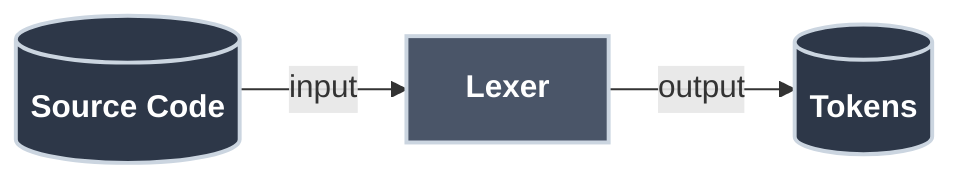
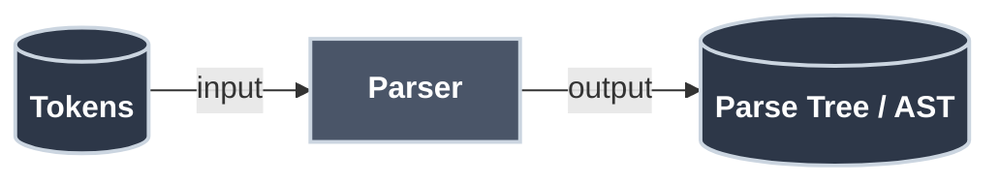
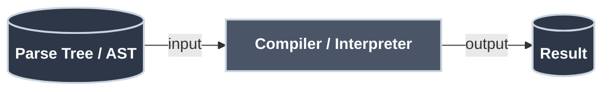
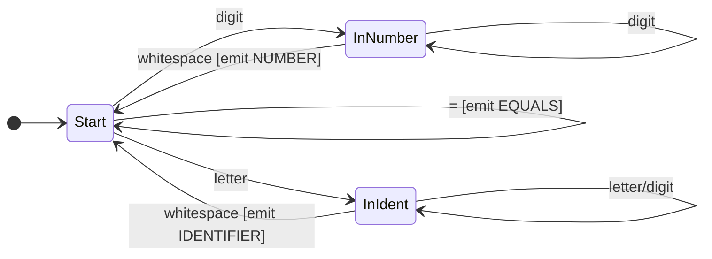

# How Parsers Work

You've learned about [RTNs](recursive_transition_networks.md), [BNF](backus_naur_form.md), and [Finite State Machines](finite_state_machines.md). These are all ways to *describe* languages. But how do we actually *use* these descriptions to process text? How does Python know that `print("hello")` is valid but `print("hello` isn't?

The answer is **parsing**—the process of analyzing text according to a grammar. It's how compilers understand your code, how browsers render HTML, and how your JSON config files become usable data. 🎯

## Why Is Parsing Necessary?

Computers can't directly understand text—not even simple code like `x = 2 + 3`. Here's why parsing is essential:

**The Problem: Text is ambiguous and unstructured**

When you write `2 + 3 * 4`, you know multiplication happens first. But to a computer, it's just a string: `"2 + 3 * 4"`. How does it know:

- What's an operator vs. a number?
- Which operation happens first?
- Whether the syntax is valid?
- How to represent nested structures like `f(g(x))`?

**What Happens Without Parsing?**

Imagine trying to execute code directly from text:

- `"x = 2 + 3 * 4"` - Which `+` or `*` do you do first?
- `"if (x > 5) print(x)"` - Where does the condition end and the body begin?
- `"func(a, b)"` - How do you know `func` is a function call and `a, b` are arguments?

You'd need custom logic for every possible code pattern. It's chaos.

**The Solution: Structured Representation**

Parsing transforms unstructured text into a **tree structure** that:

1. ✓ Validates syntax ("Is this valid code?")
2. ✓ Captures meaning ("What operations are being done?")
3. ✓ Shows relationships ("Which operations happen first?")
4. ✓ Enables execution ("Now I can evaluate/compile this!")

Without parsing, you can't compile, execute, or even validate code. It's the bridge between human-readable text and computer-executable instructions.

## The Big Picture

When a compiler or interpreter processes your code, it goes through three stages:

**Step 1: Lexical Analysis**


**Step 2: Parsing**


**Step 3: Compilation/Interpretation**


| Stage | Input | Output | What It Does |
|:------|:------|:-------|:-------------|
| **Lexer** | Source Code | Tokens | Breaks text into meaningful chunks<br/>Example: `"x = 42"` → `[ID:x, EQUALS, NUM:42]` |
| **Parser** | Tokens | Parse Tree / AST | Builds a tree structure from tokens<br/>Example: Tokens → Tree with assignment node |
| **Compiler/Interpreter** | Parse Tree / AST | Result | Executes or compiles the tree<br/>Example: Tree → machine code or output |

!!! info "What is AST?"

    **AST** stands for **Abstract Syntax Tree** - a simplified tree structure representing the code's meaning and structure, without unnecessary syntax details. More details below!

We'll focus on the first two stages: lexing and parsing.

## Stage 1: Lexical Analysis (Lexing)

The **lexer** (or tokenizer) breaks raw text into meaningful chunks called **tokens**. It's like turning a stream of characters into a stream of words.

### What Tokens Look Like

For the expression `total = price * 2 + tax`:

| Token Type | Value |
|:-----------|:------|
| IDENTIFIER | "total" |
| EQUALS | "=" |
| IDENTIFIER | "price" |
| STAR | "*" |
| NUMBER | "2" |
| PLUS | "+" |
| IDENTIFIER | "tax" |

The lexer doesn't understand grammar—it just recognizes patterns. "Is this a number? A keyword? An operator?" That's all it asks. Simple creature, the lexer. 🔍

### Lexer Implementation

Lexers are typically implemented as [Finite State Machines](finite_state_machines.md) and use [Regular Expressions](regular_expressions.md) to define token patterns:



Here's a simple lexer implementation:

=== ":material-language-python: Python - Lexer"

    ```python title="Simple Lexer in Python" linenums="1"
    import re

    TOKEN_SPEC = [  # (1)!
        ('NUMBER',   r'\d+'),
        ('IDENT',    r'[a-zA-Z_][a-zA-Z0-9_]*'),
        ('PLUS',     r'\+'),
        ('MINUS',    r'-'),
        ('STAR',     r'\*'),
        ('SLASH',    r'/'),
        ('EQUALS',   r'='),
        ('LPAREN',   r'\('),
        ('RPAREN',   r'\)'),
        ('SKIP',     r'[ \t]+'),  # (2)!
    ]

    def tokenize(text):
        tokens = []
        pos = 0  # (3)!
        while pos < len(text):
            for token_type, pattern in TOKEN_SPEC:  # (4)!
                regex = re.compile(pattern)
                match = regex.match(text, pos)  # (5)!
                if match:
                    if token_type != 'SKIP':  # (6)!
                        tokens.append((token_type, match.group()))
                    pos = match.end()  # (7)!
                    break
            else:  # (8)!
                raise SyntaxError(f"Unknown character: {text[pos]}")
        return tokens

    print(tokenize("x = 42 + y"))
    # Output: [('IDENT', 'x'), ('EQUALS', '='), ('NUMBER', '42'),
    #          ('PLUS', '+'), ('IDENT', 'y')]
    ```

    1. Define all token types and their regex patterns as (name, pattern) tuples
    2. SKIP tokens (whitespace) are recognized but not added to the output
    3. Track current position in the input string
    4. Try each token pattern in order until one matches
    5. Try to match the pattern at the current position
    6. Only add non-whitespace tokens to the result
    7. Move position forward past the matched token
    8. If no pattern matches, we have an invalid character

=== ":material-language-javascript: JavaScript - Lexer"

    ```javascript title="Simple Lexer in JavaScript" linenums="1"
    const TOKEN_SPEC = [
        ['NUMBER',  /\d+/],
        ['IDENT',   /[a-zA-Z_][a-zA-Z0-9_]*/],
        ['PLUS',    /\+/],
        ['MINUS',   /-/],
        ['STAR',    /\*/],
        ['SLASH',   /\//],
        ['EQUALS',  /=/],
        ['LPAREN',  /\(/],
        ['RPAREN',  /\)/],
        ['SKIP',    /[ \t]+/],
    ];

    function tokenize(text) {
        const tokens = [];
        let pos = 0;

        while (pos < text.length) {
            let matched = false;

            for (const [tokenType, pattern] of TOKEN_SPEC) {
                const regex = new RegExp('^' + pattern.source);
                const match = text.slice(pos).match(regex);

                if (match) {
                    if (tokenType !== 'SKIP') {
                        tokens.push([tokenType, match[0]]);
                    }
                    pos += match[0].length;
                    matched = true;
                    break;
                }
            }

            if (!matched) {
                throw new SyntaxError(`Unknown character: ${text[pos]}`);
            }
        }

        return tokens;
    }

    console.log(tokenize("x = 42 + y"));
    // Output: [['IDENT', 'x'], ['EQUALS', '='], ['NUMBER', '42'],
    //          ['PLUS', '+'], ['IDENT', 'y']]
    ```

=== ":material-language-go: Go - Lexer"

    ```go title="Simple Lexer in Go" linenums="1"
    package main

    import (
        "fmt"
        "regexp"
    )

    type TokenSpec struct {
        tokenType string
        pattern   *regexp.Regexp
    }

    type Token struct {
        Type  string
        Value string
    }

    func tokenize(text string) ([]Token, error) {
        tokenSpecs := []TokenSpec{
            {"NUMBER", regexp.MustCompile(`^\d+`)},
            {"IDENT", regexp.MustCompile(`^[a-zA-Z_][a-zA-Z0-9_]*`)},
            {"PLUS", regexp.MustCompile(`^\+`)},
            {"MINUS", regexp.MustCompile(`^-`)},
            {"STAR", regexp.MustCompile(`^\*`)},
            {"SLASH", regexp.MustCompile(`^/`)},
            {"EQUALS", regexp.MustCompile(`^=`)},
            {"LPAREN", regexp.MustCompile(`^\(`)},
            {"RPAREN", regexp.MustCompile(`^\)`)},
            {"SKIP", regexp.MustCompile(`^[ \t]+`)},
        }

        tokens := []Token{}
        pos := 0

        for pos < len(text) {
            matched := false

            for _, spec := range tokenSpecs {
                match := spec.pattern.FindString(text[pos:])
                if match != "" {
                    if spec.tokenType != "SKIP" {
                        tokens = append(tokens, Token{spec.tokenType, match})
                    }
                    pos += len(match)
                    matched = true
                    break
                }
            }

            if !matched {
                return nil, fmt.Errorf("unknown character: %c", text[pos])
            }
        }

        return tokens, nil
    }

    func main() {
        tokens, _ := tokenize("x = 42 + y")
        fmt.Println(tokens)
        // Output: [{IDENT x} {EQUALS =} {NUMBER 42} {PLUS +} {IDENT y}]
    }
    ```

=== ":material-language-rust: Rust - Lexer"

    ```rust title="Simple Lexer in Rust" linenums="1"
    use regex::Regex;

    #[derive(Debug)]
    struct Token {
        token_type: String,
        value: String,
    }

    fn tokenize(text: &str) -> Result<Vec<Token>, String> {
        let token_specs = vec![
            ("NUMBER", Regex::new(r"^\d+").unwrap()),
            ("IDENT", Regex::new(r"^[a-zA-Z_][a-zA-Z0-9_]*").unwrap()),
            ("PLUS", Regex::new(r"^\+").unwrap()),
            ("MINUS", Regex::new(r"^-").unwrap()),
            ("STAR", Regex::new(r"^\*").unwrap()),
            ("SLASH", Regex::new(r"^/").unwrap()),
            ("EQUALS", Regex::new(r"^=").unwrap()),
            ("LPAREN", Regex::new(r"^\(").unwrap()),
            ("RPAREN", Regex::new(r"^\)").unwrap()),
            ("SKIP", Regex::new(r"^[ \t]+").unwrap()),
        ];

        let mut tokens = Vec::new();
        let mut pos = 0;

        while pos < text.len() {
            let remaining = &text[pos..];
            let mut matched = false;

            for (token_type, pattern) in &token_specs {
                if let Some(mat) = pattern.find(remaining) {
                    if *token_type != "SKIP" {
                        tokens.push(Token {
                            token_type: token_type.to_string(),
                            value: mat.as_str().to_string(),
                        });
                    }
                    pos += mat.end();
                    matched = true;
                    break;
                }
            }

            if !matched {
                return Err(format!("Unknown character: {}", &text[pos..pos+1]));
            }
        }

        Ok(tokens)
    }

    fn main() {
        let tokens = tokenize("x = 42 + y").unwrap();
        println!("{:?}", tokens);
        // Output: [Token { token_type: "IDENT", value: "x" }, ...]
    }
    ```

=== ":material-language-java: Java - Lexer"

    ```java title="Simple Lexer in Java" linenums="1"
    import java.util.*;
    import java.util.regex.*;

    class Token {
        String type;
        String value;

        Token(String type, String value) {
            this.type = type;
            this.value = value;
        }

        @Override
        public String toString() {
            return "(" + type + ", " + value + ")";
        }
    }

    class Lexer {
        static class TokenSpec {
            String type;
            Pattern pattern;

            TokenSpec(String type, String pattern) {
                this.type = type;
                this.pattern = Pattern.compile("^" + pattern);
            }
        }

        public static List<Token> tokenize(String text) {
            List<TokenSpec> specs = Arrays.asList(
                new TokenSpec("NUMBER", "\\d+"),
                new TokenSpec("IDENT", "[a-zA-Z_][a-zA-Z0-9_]*"),
                new TokenSpec("PLUS", "\\+"),
                new TokenSpec("MINUS", "-"),
                new TokenSpec("STAR", "\\*"),
                new TokenSpec("SLASH", "/"),
                new TokenSpec("EQUALS", "="),
                new TokenSpec("LPAREN", "\\("),
                new TokenSpec("RPAREN", "\\)"),
                new TokenSpec("SKIP", "[ \\t]+")
            );

            List<Token> tokens = new ArrayList<>();
            int pos = 0;

            while (pos < text.length()) {
                boolean matched = false;

                for (TokenSpec spec : specs) {
                    Matcher matcher = spec.pattern.matcher(text.substring(pos));
                    if (matcher.find()) {
                        if (!spec.type.equals("SKIP")) {
                            tokens.add(new Token(spec.type, matcher.group()));
                        }
                        pos += matcher.end();
                        matched = true;
                        break;
                    }
                }

                if (!matched) {
                    throw new RuntimeException("Unknown character: " + text.charAt(pos));
                }
            }

            return tokens;
        }

        public static void main(String[] args) {
            List<Token> tokens = tokenize("x = 42 + y");
            System.out.println(tokens);
            // Output: [(IDENT, x), (EQUALS, =), (NUMBER, 42), (PLUS, +), (IDENT, y)]
        }
    }
    ```

=== ":material-language-cpp: C++ - Lexer"

    ```cpp title="Simple Lexer in C++" linenums="1"
    #include <iostream>
    #include <vector>
    #include <regex>
    #include <string>
    #include <stdexcept>

    struct Token {
        std::string type;
        std::string value;
    };

    struct TokenSpec {
        std::string type;
        std::regex pattern;
    };

    std::vector<Token> tokenize(const std::string& text) {
        std::vector<TokenSpec> specs = {
            {"NUMBER", std::regex(R"(^\d+)")},
            {"IDENT", std::regex(R"(^[a-zA-Z_][a-zA-Z0-9_]*)")},
            {"PLUS", std::regex(R"(^\+)")},
            {"MINUS", std::regex(R"(^-)")},
            {"STAR", std::regex(R"(^\*)")},
            {"SLASH", std::regex(R"(^/)")},
            {"EQUALS", std::regex(R"(^=)")},
            {"LPAREN", std::regex(R"(^\()")},
            {"RPAREN", std::regex(R"(^\))")},
            {"SKIP", std::regex(R"(^[ \t]+)")}
        };

        std::vector<Token> tokens;
        size_t pos = 0;

        while (pos < text.length()) {
            bool matched = false;
            std::string remaining = text.substr(pos);

            for (const auto& spec : specs) {
                std::smatch match;
                if (std::regex_search(remaining, match, spec.pattern)) {
                    if (spec.type != "SKIP") {
                        tokens.push_back({spec.type, match.str()});
                    }
                    pos += match.length();
                    matched = true;
                    break;
                }
            }

            if (!matched) {
                throw std::runtime_error("Unknown character: " +
                                       std::string(1, text[pos]));
            }
        }

        return tokens;
    }

    int main() {
        auto tokens = tokenize("x = 42 + y");
        for (const auto& tok : tokens) {
            std::cout << "(" << tok.type << ", " << tok.value << ") ";
        }
        std::cout << std::endl;
        // Output: (IDENT, x) (EQUALS, =) (NUMBER, 42) (PLUS, +) (IDENT, y)
        return 0;
    }
    ```

This produces a **list of tokens**, where each token is a tuple of `(TOKEN_TYPE, VALUE)`. The lexer has broken the input string into meaningful pieces that the parser can work with.

## Stage 2: Parsing

The **parser** takes tokens and builds a structured representation—usually a tree—according to the grammar rules.

### Why Trees?

A flat list of tokens doesn't capture the **structure** and **relationships** in code. Consider `2 + 3 * 4`:

- As tokens: `[NUM:2, PLUS, NUM:3, STAR, NUM:4]` - just a flat sequence
- As a tree: Shows that `3 * 4` happens first (nested deeper), then `2 +` the result

Trees naturally represent:

1. **Operator precedence**: Deeper operations execute first (`*` before `+`)
2. **Hierarchical structure**: Nested expressions, function calls, code blocks
3. **Grammar rules**: Each tree node represents a grammar rule being applied
4. **Evaluation order**: Walk the tree to know what to compute when

Without a tree, you'd need complex logic to figure out "which operation happens first?" The tree makes it obvious—start at the leaves, work up to the root.

??? tip "Connection to BNF and RTN"

    Remember [BNF](backus_naur_form.md) and [RTN](recursive_transition_networks.md) from earlier? They're grammar notations that **describe** valid syntax. The parser uses these rules to **build** the tree:

    - **Each BNF rule becomes a tree node**: When the parser applies `<expression> ::= <term> "+" <term>`, it creates an expression node with two term children
    - **RTN paths trace tree construction**: Following an RTN from start to end corresponds to building a subtree
    - **Recursion in grammar = Recursion in tree**: Nested expressions in code become nested nodes in the tree

    The grammar is the blueprint; the tree is the structure built from that blueprint. The parser is the construction worker following the plans.

### Parse Trees vs Abstract Syntax Trees

**Parse Tree (Concrete Syntax Tree):** Shows every grammar rule applied.

**Abstract Syntax Tree (AST):** Simplified tree focusing on meaning, not syntax.

For `2 + 3 * 4`:

```text title="Concrete Syntax Tree"
         Expression
              |
    +---------+---------+
    |         |         |
  Term       '+'      Term
    |                   |
  Factor        +-------+-------+
    |           |       |       |
   '2'        Term     '*'   Factor
               |
            Factor              '4'
               |
              '3'
```

```text title="Abstract Syntax Tree"
        +
       / \
      2   *
         / \
        3   4
```

The AST is what most compilers actually work with.

!!! tip "Scheme: Where Parse Tree = AST"
    In **[Scheme & Parse Trees](scheme_and_parse_trees.md)**, you'll see a language where the written code *is* the AST. Because Scheme uses prefix notation with explicit parentheses `(+ 1 (* 2 3))`, there is no ambiguity, and the parse tree matches the code structure 1:1.

!!! info "Why ASTs Drop Punctuation"

    Notice how the AST doesn't include parentheses, commas, or semicolons? That's intentional. Once you've parsed the code and built the tree structure, punctuation has served its purpose—it told the parser how to group things.

    **What gets dropped:**
    - Parentheses `()` - the tree structure already shows grouping
    - Commas `,` - already represented as multiple children
    - Semicolons `;` - just statement separators, not meaningful after parsing
    - Keywords like `then`, `do` - the tree node type already captures the meaning

    **What gets kept:**
    - Operators `+`, `-`, `*` - needed to know which operation to perform
    - Literals `42`, `"hello"` - the actual values
    - Identifiers `x`, `foo` - variable and function names

    The AST keeps only what's needed for execution or compilation. This makes it smaller and easier to work with than the full parse tree.

??? tip "SQL Execution Plans: A Related Concept"

    If you've worked with databases, you might recognize tree structures from SQL execution plans. They're related but different:

    **Parse Tree/AST** (what parsers build):
    - Represents the **syntactic structure** of the code
    - Shows what the query *means* grammatically
    - Created during parsing (before execution)

    **Execution Plan** (what query optimizers build):
    - Represents the **execution strategy** for running the query
    - Shows *how* to efficiently execute the query (which indexes, join order, etc.)
    - Created after parsing, during query optimization

    The full pipeline is: `SQL text → Lexer → Parser → AST → Query Optimizer → Execution Plan → Results`

    When database administrators tune queries by examining execution plans, they're looking at a tree structure that comes *after* parsing—it's the optimized plan for executing the already-parsed query. Both are trees showing hierarchical operations, but the AST captures syntax while the execution plan captures runtime strategy.

## Grammar Ambiguity

Some grammars are **ambiguous**—they allow multiple valid parse trees for the same input. This is a problem because the program's meaning becomes unclear.

### The Classic Example: Dangling Else

Consider this grammar for if-statements:

```bnf title="Ambiguous If-Statement Grammar" linenums="1"
<statement> ::= <if-statement> | <other>
<if-statement> ::= "if" <condition> "then" <statement>
                 | "if" <condition> "then" <statement> "else" <statement>
```

Now parse this code:

```
if a then if b then x else y
```

**Two valid parse trees exist:**

**Interpretation 1:** The `else` belongs to the inner `if`:
```
if a then (if b then x else y)
```

**Interpretation 2:** The `else` belongs to the outer `if`:
```
if a then (if b then x) else y
```

Both are valid according to the grammar! This is the **Dangling Else** problem.

### How Languages Solve It

Most languages resolve this through **precedence rules**:

1. **Convention**: The `else` matches the nearest unmatched `if` (Interpretation 1)
2. **Require explicit delimiters**: Python uses indentation; C uses braces `{ }`
3. **Require `end` keywords**: Pascal and Ada make all blocks explicit

### Why Ambiguity Matters for Parsing

- **Parsers must make choices**: When faced with ambiguity, the parser picks one interpretation (usually via precedence rules)
- **Different parsers might choose differently**: Without explicit rules, two implementations could parse the same code differently
- **Grammar design is crucial**: Good language design avoids ambiguity through careful grammar construction

**Key insight:** Ambiguity is a property of the **grammar**, not the parser. A well-designed grammar eliminates ambiguity before parsing begins.

## Parsing Strategies

Not all grammars are equally easy to parse, and different approaches have different trade-offs. Think of parsing strategies like different tools in a toolbox—a hammer for some jobs, a screwdriver for others.

### Choosing Your Approach

**Why Different Strategies?**

Different parsing strategies exist because:

1. **Grammar constraints**: Some grammars are ambiguous or have features (like left-recursion) that break certain parsing approaches
2. **Implementation complexity**: Hand-written parsers need simplicity; generated parsers can be more complex
3. **Error handling**: Some strategies give better error messages than others
4. **Performance**: Different strategies have different speed and memory characteristics
5. **Parsing power**: Some strategies can handle more complex grammars than others

**Which Strategy Should You Use?**

| Situation | Recommended Strategy | Why? |
|:----------|:--------------------|:-----|
| **Writing by hand** | Top-down (Recursive Descent) | Easy to understand, maps directly to grammar, good error messages |
| **Using a parser generator** | Bottom-up (LR/LALR) | More powerful, handles more grammars, tools do the hard work |
| **Simple expressions** | Top-down | Quick to implement, sufficient for most expression grammars |
| **Complex language (C, Java)** | Bottom-up (via tool) | Handles complex grammar features, proven at scale |
| **Educational purposes** | Top-down | Easier to understand and trace execution |

For most projects: start with **recursive descent** (top-down) because it's intuitive. Only reach for more powerful strategies when you hit limitations.

=== ":material-arrow-down-bold: Top-Down Parsing (LL)"

    **Strategy:** Start with the goal (e.g., "program") and work down to terminals.

    **Recursive Descent** is the most intuitive top-down approach. Each grammar rule becomes a function:

    Given this grammar:

    ```bnf title="Expression Grammar" linenums="1"
    <expression> ::= <term> { ("+" | "-") <term> }
    <term> ::= <factor> { ("*" | "/") <factor> }
    <factor> ::= NUMBER | "(" <expression> ")"
    ```

    !!! warning "Left Recursion: A Top-Down Parser Killer"

        Top-down parsers **cannot handle left-recursive grammars**. A rule like this will cause infinite recursion:

        ```bnf
        <expression> ::= <expression> "+" <term>   # ❌ Left-recursive!
        ```

        **Why it breaks:** When `parse_expression()` is called, the first thing it does is call `parse_expression()` again (to match `<expression>`), which calls `parse_expression()` again, forever. The parser never consumes a token!

        **The fix:** Rewrite left recursion as iteration (loops):

        ```bnf
        # Instead of:
        <expression> ::= <expression> "+" <term>

        # Use:
        <expression> ::= <term> { "+" <term> }
        ```

        The `{ }` notation means "zero or more," which translates to a `while` loop in code. This is why our grammar above uses `{ ... }` - it avoids left recursion.

        **Bottom-up parsers** (LR) handle left recursion naturally, which is one reason they're more powerful.

    Here's a recursive descent parser implementation:

    === ":material-language-python: Python - Parser"

        ```python title="Recursive Descent Parser in Python" linenums="1"
        class Parser:
            def __init__(self, tokens):
                self.tokens = tokens  # (1)!
                self.pos = 0  # (2)!

            def current_token(self):
                if self.pos < len(self.tokens):
                    return self.tokens[self.pos]
                return None

            def consume(self, expected_type=None):  # (3)!
                token = self.current_token()
                if expected_type and token[0] != expected_type:
                    raise SyntaxError(f"Expected {expected_type}, got {token}")
                self.pos += 1  # (4)!
                return token

            def parse_expression(self):  # (5)!
                """expression = term { ('+' | '-') term }"""
                left = self.parse_term()  # (6)!

                while self.current_token() and self.current_token()[0] in ('PLUS', 'MINUS'):
                    op = self.consume()[1]
                    right = self.parse_term()
                    left = ('binop', op, left, right)  # (7)!

                return left

            def parse_term(self):  # (8)!
                """term = factor { ('*' | '/') factor }"""
                left = self.parse_factor()

                while self.current_token() and self.current_token()[0] in ('STAR', 'SLASH'):
                    op = self.consume()[1]
                    right = self.parse_factor()
                    left = ('binop', op, left, right)

                return left

            def parse_factor(self):  # (9)!
                """factor = NUMBER | '(' expression ')'"""
                token = self.current_token()

                if token[0] == 'NUMBER':
                    self.consume()
                    return ('number', int(token[1]))

                elif token[0] == 'LPAREN':  # (10)!
                    self.consume('LPAREN')
                    expr = self.parse_expression()  # (11)!
                    self.consume('RPAREN')
                    return expr

                else:
                    raise SyntaxError(f"Unexpected token: {token}")

        # Usage
        tokens = tokenize("2 + 3 * 4")
        parser = Parser(tokens)
        ast = parser.parse_expression()
        print(ast)
        # Output: ('binop', '+', ('number', 2), ('binop', '*', ('number', 3), ('number', 4)))
        ```

        1. Store the list of tokens from the lexer
        2. Track current position in the token list
        3. Consume one token and optionally validate its type
        4. Move to the next token after consuming
        5. Handles lowest precedence operators (+ and -)
        6. Start by parsing the higher-precedence term
        7. Build a binary operation node combining left and right operands
        8. Handles medium precedence operators (* and /)
        9. Handles highest precedence: numbers and parenthesized expressions
        10. Handle parenthesized sub-expressions
        11. Recursively parse the expression inside parentheses

    === ":material-language-javascript: JavaScript - Parser"

        ```javascript title="Recursive Descent Parser in JavaScript" linenums="1"
        class Parser {
            constructor(tokens) {
                this.tokens = tokens;
                this.pos = 0;
            }

            currentToken() {
                if (this.pos < this.tokens.length) {
                    return this.tokens[this.pos];
                }
                return null;
            }

            consume(expectedType = null) {
                const token = this.currentToken();
                if (expectedType && token[0] !== expectedType) {
                    throw new SyntaxError(`Expected ${expectedType}, got ${token}`);
                }
                this.pos++;
                return token;
            }

            parseExpression() {
                // expression = term { ('+' | '-') term }
                let left = this.parseTerm();

                while (this.currentToken() &&
                       ['PLUS', 'MINUS'].includes(this.currentToken()[0])) {
                    const op = this.consume()[1];
                    const right = this.parseTerm();
                    left = ['binop', op, left, right];
                }

                return left;
            }

            parseTerm() {
                // term = factor { ('*' | '/') factor }
                let left = this.parseFactor();

                while (this.currentToken() &&
                       ['STAR', 'SLASH'].includes(this.currentToken()[0])) {
                    const op = this.consume()[1];
                    const right = this.parseFactor();
                    left = ['binop', op, left, right];
                }

                return left;
            }

            parseFactor() {
                // factor = NUMBER | '(' expression ')'
                const token = this.currentToken();

                if (token[0] === 'NUMBER') {
                    this.consume();
                    return ['number', parseInt(token[1])];
                }

                if (token[0] === 'LPAREN') {
                    this.consume('LPAREN');
                    const expr = this.parseExpression();
                    this.consume('RPAREN');
                    return expr;
                }

                throw new SyntaxError(`Unexpected token: ${token}`);
            }
        }

        // Usage
        const tokens = tokenize("2 + 3 * 4");
        const parser = new Parser(tokens);
        const ast = parser.parseExpression();
            console.log(ast);
            // Output: ['binop', '+', ['number', 2], ['binop', '*', ['number', 3], ['number', 4]]]
        ```

    === ":material-language-go: Go - Parser"

        ```go title="Recursive Descent Parser in Go" linenums="1"
        package main

        import "fmt"

        type ASTNode interface{}

        type Parser struct {
            tokens []Token
            pos    int
        }

        func NewParser(tokens []Token) *Parser {
            return &Parser{tokens: tokens, pos: 0}
        }

        func (p *Parser) currentToken() *Token {
            if p.pos < len(p.tokens) {
                return &p.tokens[p.pos]
            }
            return nil
        }

        func (p *Parser) consume(expectedType ...string) Token {
            token := p.currentToken()
            if token == nil {
                panic("Unexpected end of tokens")
            }
            if len(expectedType) > 0 && token.Type != expectedType[0] {
                panic(fmt.Sprintf("Expected %s, got %s", expectedType[0], token.Type))
            }
            p.pos++
            return *token
        }

        func (p *Parser) parseExpression() ASTNode {
            // expression = term { ('+' | '-') term }
            left := p.parseTerm()

            for p.currentToken() != nil &&
                (p.currentToken().Type == "PLUS" || p.currentToken().Type == "MINUS") {
                op := p.consume().Value
                right := p.parseTerm()
                left = []interface{}{"binop", op, left, right}
            }

            return left
        }

        func (p *Parser) parseTerm() ASTNode {
            // term = factor { ('*' | '/') factor }
            left := p.parseFactor()

            for p.currentToken() != nil &&
                (p.currentToken().Type == "STAR" || p.currentToken().Type == "SLASH") {
                op := p.consume().Value
                right := p.parseFactor()
                left = []interface{}{"binop", op, left, right}
            }

            return left
        }

        func (p *Parser) parseFactor() ASTNode {
            // factor = NUMBER | '(' expression ')'
            token := p.currentToken()

            if token.Type == "NUMBER" {
                p.consume()
                return []interface{}{"number", token.Value}
            }

            if token.Type == "LPAREN" {
                p.consume("LPAREN")
                expr := p.parseExpression()
                p.consume("RPAREN")
                return expr
            }

            panic(fmt.Sprintf("Unexpected token: %v", token))
        }

        func main() {
            tokens, _ := tokenize("2 + 3 * 4")
            parser := NewParser(tokens)
            ast := parser.parseExpression()
                fmt.Printf("%v\n", ast)
                // Output: [binop + [number 2] [binop * [number 3] [number 4]]]
            }
        ```

    === ":material-language-rust: Rust - Parser"

        ```rust title="Recursive Descent Parser in Rust" linenums="1"
        #[derive(Debug, Clone)]
        enum ASTNode {
            Number(i32),
            BinOp {
                op: String,
                left: Box<ASTNode>,
                right: Box<ASTNode>,
            },
        }

        struct Parser {
            tokens: Vec<Token>,
            pos: usize,
        }

        impl Parser {
            fn new(tokens: Vec<Token>) -> Self {
                Parser { tokens, pos: 0 }
            }

            fn current_token(&self) -> Option<&Token> {
                self.tokens.get(self.pos)
            }

            fn consume(&mut self, expected_type: Option<&str>) -> Result<Token, String> {
                match self.current_token() {
                    None => Err("Unexpected end of tokens".to_string()),
                    Some(token) => {
                        if let Some(exp) = expected_type {
                            if &token.token_type != exp {
                                return Err(format!("Expected {}, got {}", exp, token.token_type));
                            }
                        }
                        self.pos += 1;
                        Ok(token.clone())
                    }
                }
            }

            fn parse_expression(&mut self) -> Result<ASTNode, String> {
                // expression = term { ('+' | '-') term }
                let mut left = self.parse_term()?;

                while let Some(token) = self.current_token() {
                    if token.token_type == "PLUS" || token.token_type == "MINUS" {
                        let op = self.consume(None)?.value;
                        let right = self.parse_term()?;
                        left = ASTNode::BinOp {
                            op,
                            left: Box::new(left),
                            right: Box::new(right),
                        };
                    } else {
                        break;
                    }
                }

                Ok(left)
            }

            fn parse_term(&mut self) -> Result<ASTNode, String> {
                // term = factor { ('*' | '/') factor }
                let mut left = self.parse_factor()?;

                while let Some(token) = self.current_token() {
                    if token.token_type == "STAR" || token.token_type == "SLASH" {
                        let op = self.consume(None)?.value;
                        let right = self.parse_factor()?;
                        left = ASTNode::BinOp {
                            op,
                            left: Box::new(left),
                            right: Box::new(right),
                        };
                    } else {
                        break;
                    }
                }

                Ok(left)
            }

            fn parse_factor(&mut self) -> Result<ASTNode, String> {
                // factor = NUMBER | '(' expression ')'
                match self.current_token() {
                    None => Err("Unexpected end of tokens".to_string()),
                    Some(token) => {
                        if token.token_type == "NUMBER" {
                            let value = token.value.parse::<i32>().unwrap();
                            self.consume(None)?;
                            Ok(ASTNode::Number(value))
                        } else if token.token_type == "LPAREN" {
                            self.consume(Some("LPAREN"))?;
                            let expr = self.parse_expression()?;
                            self.consume(Some("RPAREN"))?;
                            Ok(expr)
                        } else {
                            Err(format!("Unexpected token: {:?}", token))
                        }
                    }
                }
            }
        }

        fn main() {
            let tokens = tokenize("2 + 3 * 4").unwrap();
            let mut parser = Parser::new(tokens);
            let ast = parser.parse_expression().unwrap();
                println!("{:?}", ast);
                // Output: BinOp { op: "+", left: Number(2), right: BinOp { op: "*", left: Number(3), right: Number(4) } }
            }
        ```

    === ":material-language-java: Java - Parser"

        ```java title="Recursive Descent Parser in Java" linenums="1"
        import java.util.*;

        interface ASTNode {}

        class NumberNode implements ASTNode {
            int value;
            NumberNode(int value) { this.value = value; }
            @Override
            public String toString() { return "Number(" + value + ")"; }
        }

        class BinOpNode implements ASTNode {
            String op;
            ASTNode left, right;
            BinOpNode(String op, ASTNode left, ASTNode right) {
                this.op = op;
                this.left = left;
                this.right = right;
            }
            @Override
            public String toString() {
                return "BinOp(" + op + ", " + left + ", " + right + ")";
            }
        }

        class Parser {
            List<Token> tokens;
            int pos;

            Parser(List<Token> tokens) {
                this.tokens = tokens;
                this.pos = 0;
            }

            Token currentToken() {
                if (pos < tokens.size()) {
                    return tokens.get(pos);
                }
                return null;
            }

            Token consume(String expectedType) {
                Token token = currentToken();
                if (token == null) {
                    throw new RuntimeException("Unexpected end of tokens");
                }
                if (expectedType != null && !token.type.equals(expectedType)) {
                    throw new RuntimeException("Expected " + expectedType + ", got " + token.type);
                }
                pos++;
                return token;
            }

            Token consume() {
                return consume(null);
            }

            ASTNode parseExpression() {
                // expression = term { ('+' | '-') term }
                ASTNode left = parseTerm();

                while (currentToken() != null &&
                       (currentToken().type.equals("PLUS") || currentToken().type.equals("MINUS"))) {
                    String op = consume().value;
                    ASTNode right = parseTerm();
                    left = new BinOpNode(op, left, right);
                }

                return left;
            }

            ASTNode parseTerm() {
                // term = factor { ('*' | '/') factor }
                ASTNode left = parseFactor();

                while (currentToken() != null &&
                       (currentToken().type.equals("STAR") || currentToken().type.equals("SLASH"))) {
                    String op = consume().value;
                    ASTNode right = parseFactor();
                    left = new BinOpNode(op, left, right);
                }

                return left;
            }

            ASTNode parseFactor() {
                // factor = NUMBER | '(' expression ')'
                Token token = currentToken();

                if (token.type.equals("NUMBER")) {
                    consume();
                    return new NumberNode(Integer.parseInt(token.value));
                }

                if (token.type.equals("LPAREN")) {
                    consume("LPAREN");
                    ASTNode expr = parseExpression();
                    consume("RPAREN");
                    return expr;
                }

                throw new RuntimeException("Unexpected token: " + token);
            }

            public static void main(String[] args) {
                List<Token> tokens = Lexer.tokenize("2 + 3 * 4");
                Parser parser = new Parser(tokens);
                ASTNode ast = parser.parseExpression();
                    System.out.println(ast);
                    // Output: BinOp(+, Number(2), BinOp(*, Number(3), Number(4)))
                }
            }
        ```

    === ":material-language-cpp: C++ - Parser"

        ```cpp title="Recursive Descent Parser in C++" linenums="1"
        #include <iostream>
        #include <vector>
        #include <memory>
        #include <string>
        #include <stdexcept>

        struct ASTNode {
            virtual ~ASTNode() = default;
            virtual std::string toString() const = 0;
        };

        struct NumberNode : ASTNode {
            int value;
            NumberNode(int v) : value(v) {}
            std::string toString() const override {
                return "Number(" + std::to_string(value) + ")";
            }
        };

        struct BinOpNode : ASTNode {
            std::string op;
            std::unique_ptr<ASTNode> left;
            std::unique_ptr<ASTNode> right;

            BinOpNode(std::string o, std::unique_ptr<ASTNode> l, std::unique_ptr<ASTNode> r)
                : op(o), left(std::move(l)), right(std::move(r)) {}

            std::string toString() const override {
                return "BinOp(" + op + ", " + left->toString() + ", " + right->toString() + ")";
            }
        };

        class Parser {
            std::vector<Token> tokens;
            size_t pos;

        public:
            Parser(const std::vector<Token>& toks) : tokens(toks), pos(0) {}

            const Token* currentToken() {
                if (pos < tokens.size()) {
                    return &tokens[pos];
                }
                return nullptr;
            }

            Token consume(const std::string& expectedType = "") {
                auto token = currentToken();
                if (!token) {
                    throw std::runtime_error("Unexpected end of tokens");
                }
                if (!expectedType.empty() && token->type != expectedType) {
                    throw std::runtime_error("Expected " + expectedType + ", got " + token->type);
                }
                pos++;
                return *token;
            }

            std::unique_ptr<ASTNode> parseExpression() {
                // expression = term { ('+' | '-') term }
                auto left = parseTerm();

                while (currentToken() &&
                       (currentToken()->type == "PLUS" || currentToken()->type == "MINUS")) {
                    std::string op = consume().value;
                    auto right = parseTerm();
                    left = std::make_unique<BinOpNode>(op, std::move(left), std::move(right));
                }

                return left;
            }

            std::unique_ptr<ASTNode> parseTerm() {
                // term = factor { ('*' | '/') factor }
                auto left = parseFactor();

                while (currentToken() &&
                       (currentToken()->type == "STAR" || currentToken()->type == "SLASH")) {
                    std::string op = consume().value;
                    auto right = parseFactor();
                    left = std::make_unique<BinOpNode>(op, std::move(left), std::move(right));
                }

                return left;
            }

            std::unique_ptr<ASTNode> parseFactor() {
                // factor = NUMBER | '(' expression ')'
                auto token = currentToken();

                if (token->type == "NUMBER") {
                    consume();
                    return std::make_unique<NumberNode>(std::stoi(token->value));
                }

                if (token->type == "LPAREN") {
                    consume("LPAREN");
                    auto expr = parseExpression();
                    consume("RPAREN");
                    return expr;
                }

                throw std::runtime_error("Unexpected token: " + token->type);
            }
        };

        int main() {
            auto tokens = tokenize("2 + 3 * 4");
            Parser parser(tokens);
            auto ast = parser.parseExpression();
                std::cout << ast->toString() << std::endl;
                // Output: BinOp(+, Number(2), BinOp(*, Number(3), Number(4)))
                return 0;
            }
        ```

    This is a **tree structure represented as nested tuples**—our AST! Each tuple is a node:

    - `('binop', '+', left, right)` = a binary operation node with operator `+`
    - `('number', 2)` = a leaf node containing the value `2`
    - The nesting shows the tree structure: `2 + (3 * 4)`

    Compare this to the lexer's flat list of tokens—the parser has transformed that flat list into a hierarchical tree that captures the meaning and precedence.

    ??? tip "Notice the Structure"

        The parser functions mirror the grammar exactly:

        - `parse_expression` handles `+` and `-`
        - `parse_term` handles `*` and `/`
        - `parse_factor` handles numbers and parentheses

        This is why BNF translates so directly into code!

    ??? tip "Recursion and the Call Stack"

        Notice how `parse_factor` can call `parse_expression`, which calls `parse_term`, which calls `parse_factor` again? This mutual recursion works because each function call is managed by the **[function call stack](../data_structures/abstract_data_types_and_stack.md#1-function-call-stack)**.

        When parsing `(2 + 3)`, the call stack looks like:
        ```
        parse_factor()      ← handles the parentheses
          → parse_expression() ← handles the + inside
            → parse_term()
              → parse_factor() ← handles 2
        ```

        When the innermost call completes, it returns to the previous function—classic LIFO behavior. Without the call stack, recursive parsing would be impossible.

    **How It Handles Operator Precedence:**

    Our grammar naturally handles precedence! Here's why:

    1. `expression` handles `+` and `-`
    2. `term` handles `*` and `/`
    3. `factor` handles numbers and parentheses

    Since `term` is nested inside `expression`, multiplication happens "deeper" in the tree—which means it's evaluated first.

    For `2 + 3 * 4`:

    ```
         +          (evaluated last)
        / \
       2   *        (evaluated first)
          / \
         3   4
    ```

    Result: 2 + (3 * 4) = 14 ✓

    **Adding More Precedence Levels:**

    Want to add exponentiation (`^`) with highest precedence?

    ```bnf title="Grammar with Exponentiation" linenums="1"
    <expression> ::= <term> { ("+" | "-") <term> }
    <term> ::= <power> { ("*" | "/") <power> }
    <power> ::= <factor> [ "^" <power> ]
    <factor> ::= NUMBER | "(" <expression> ")"
    ```

    Notice `<power>` calls itself on the right side—this makes `^` right-associative: \(2^{3^4} = 2^{(3^4)}\).

=== ":material-arrow-up-bold: Bottom-Up Parsing (LR)"

    **Strategy:** Start with tokens and combine them into larger structures, building the parse tree from the leaves up to the root.

    **How it works:**

    - Begin with individual tokens
    - Recognize patterns that match the right-hand side of grammar rules
    - "Reduce" those patterns to non-terminals
    - Continue until reaching the start symbol

    **Advantages:**

    - More powerful than top-down (handles more grammars)
    - Naturally handles left-recursive grammars
    - Can detect syntax errors earlier

    **Disadvantages:**

    - More complex to implement by hand
    - Harder to understand and debug
    - Error messages can be less intuitive

    **In practice:** Bottom-up parsers are typically generated by tools like [YACC](https://en.wikipedia.org/wiki/Yacc) and [GNU Bison](https://www.gnu.org/software/bison/) rather than written by hand. These tools take a grammar specification and automatically generate efficient parser code.

### Understanding LL and LR

Now that we've seen both approaches, let's compare them:

| Type | Reads | Builds Tree | Used By |
|:-----|:------|:------------|:--------|
| **LL(k)** | Left-to-right | Leftmost derivation (top-down) | Recursive descent, [ANTLR](https://www.antlr.org/) |
| **LR(k)** | Left-to-right | Rightmost derivation (bottom-up) | [YACC](https://en.wikipedia.org/wiki/Yacc), [GNU Bison](https://www.gnu.org/software/bison/) |

**What "Leftmost" and "Rightmost" Derivation Mean:**

These terms describe the order in which the parser builds the parse tree:

**Leftmost Derivation (LL - Top-Down):**

- Start with the goal (e.g., `<expression>`)
- Expand grammar rules from left to right, top to bottom
- Like reading: start with the big picture, fill in details left-to-right

```text
Example: 2 + 3
<expression>
  → <term> + <term>           (expand expression)
  → <number> + <term>          (expand leftmost term first)
  → 2 + <term>                 (substitute 2)
  → 2 + <number>               (expand remaining term)
  → 2 + 3                      (substitute 3)
```

**Rightmost Derivation (LR - Bottom-Up):**

- Start with the tokens (e.g., `2`, `+`, `3`)
- Combine them into larger structures, working right-to-left when choosing what to reduce
- Like building with blocks: start with pieces, assemble upward

```text
Example: 2 + 3
2 + 3
  → <number> + 3               (reduce rightmost number first)
  → <number> + <number>        (reduce left number)
  → <term> + <term>            (reduce to terms)
  → <expression>               (reduce to expression)
```

For practical purposes: **LL is top-down** (goal → tokens), **LR is bottom-up** (tokens → goal). The "leftmost/rightmost" distinction matters for formal theory but the key difference is the direction.

### Understanding Lookahead: The "(k)" Parameter

The "(k)" means **how many tokens ahead the parser peeks** to decide which grammar rule to apply.

**LL(1) - One Token Lookahead:**

When parsing, you often need to decide between alternatives. With LL(1), you look at the **next token** to decide:

            ```python title="LL(1) Lookahead Example" linenums="1"
    # Grammar rule with alternatives:
    # <factor> ::= NUMBER | "(" <expression> ")"
    
    def parse_factor(self):
        token = self.current_token()  # Look at next token
    
        if token[0] == 'NUMBER':      # Lookahead says: it's a number
            return self.parse_number()
        elif token[0] == 'LPAREN':    # Lookahead says: it's a parenthesized expr
            return self.parse_paren_expr()
            ```

One token is enough to decide which path to take.

**When You Need More Lookahead:**

Some grammars need LL(2) or LL(3):

```text
# Ambiguous with LL(1):
<statement> ::= "if" <expr> "then" <stmt>
              | "if" <expr> "then" <stmt> "else" <stmt>
```

After seeing `if`, both rules start the same way. You might need to look ahead 3-4 tokens to distinguish them.

**Why Lookahead Matters:**

- **LL(1)** is simplest and most efficient (what recursive descent typically uses)
- **LL(k)** for k>1 requires more complex logic
- **LR(1)** is more powerful than LL(1) - can handle more grammars with just 1 token lookahead
- More lookahead = more memory and complexity

Most hand-written parsers use LL(1) because it's simple. Parser generators can handle larger k values automatically.

## Working with Parse Trees

Once you have a parse tree or AST, you need to do something with it—evaluate it, compile it, or analyze it. This section covers common operations.

### Evaluating the AST

Once you have an AST, you can walk it to compute results:

=== ":material-language-python: Python - Evaluator"

            ```python title="AST Evaluator in Python" linenums="1"
        def evaluate(node):  # (1)!
            if node[0] == 'number':  # (2)!
                return node[1]
    
            elif node[0] == 'binop':  # (3)!
                op, left, right = node[1], node[2], node[3]  # (4)!
                left_val = evaluate(left)  # (5)!
                right_val = evaluate(right)
    
                if op == '+': return left_val + right_val  # (6)!
                if op == '-': return left_val - right_val
                if op == '*': return left_val * right_val
                if op == '/': return left_val / right_val
    
            raise ValueError(f"Unknown node type: {node[0]}")
    
        # Using our earlier AST
        ast = ('binop', '+', ('number', 2), ('binop', '*', ('number', 3), ('number', 4)))
        print(evaluate(ast))  # 14
            ```

    1. Recursively evaluate an AST node and return its computed value
    2. Base case: if it's a number node, return its value
    3. If it's a binary operation, evaluate both operands and apply the operator
    4. Unpack the operator and operands from the tuple
    5. Recursively evaluate left and right subtrees first
    6. Apply the operator to the evaluated operands

=== ":material-language-javascript: JavaScript - Evaluator"

    ```javascript title="AST Evaluator in JavaScript" linenums="1"
    function evaluate(node) {
        if (node[0] === 'number') {
            return node[1];
        }

        if (node[0] === 'binop') {
            const [, op, left, right] = node;
            const leftVal = evaluate(left);
            const rightVal = evaluate(right);

            if (op === '+') return leftVal + rightVal;
            if (op === '-') return leftVal - rightVal;
            if (op === '*') return leftVal * rightVal;
            if (op === '/') return leftVal / rightVal;
        }

        throw new Error(`Unknown node type: ${node[0]}`);
    }

    // Using our earlier AST
    const ast = ['binop', '+', ['number', 2], ['binop', '*', ['number', 3], ['number', 4]]];
    console.log(evaluate(ast));  // 14
    ```

=== ":material-language-go: Go - Evaluator"

    ```go title="AST Evaluator in Go" linenums="1"
    func evaluate(node ASTNode) float64 {
        switch n := node.(type) {
        case []interface{}:
            nodeType := n[0].(string)

            if nodeType == "number" {
                switch v := n[1].(type) {
                case int:
                    return float64(v)
                case float64:
                    return v
                }
            }

            if nodeType == "binop" {
                op := n[1].(string)
                left := evaluate(n[2])
                right := evaluate(n[3])

                switch op {
                case "+": return left + right
                case "-": return left - right
                case "*": return left * right
                case "/": return left / right
                }
            }
        }

        panic(fmt.Sprintf("Unknown node type: %v", node))
    }

    // Using our earlier AST
    ast := []interface{}{"binop", "+", []interface{}{"number", 2},
                        []interface{}{"binop", "*", []interface{}{"number", 3},
                        []interface{}{"number", 4}}}
    fmt.Println(evaluate(ast))  // 14
    ```

=== ":material-language-rust: Rust - Evaluator"

    ```rust title="AST Evaluator in Rust" linenums="1"
    fn evaluate(node: &ASTNode) -> Result<i32, String> {
        match node {
            ASTNode::Number(n) => Ok(*n),

            ASTNode::BinOp { op, left, right } => {
                let left_val = evaluate(left)?;
                let right_val = evaluate(right)?;

                match op.as_str() {
                    "+" => Ok(left_val + right_val),
                    "-" => Ok(left_val - right_val),
                    "*" => Ok(left_val * right_val),
                    "/" => Ok(left_val / right_val),
                    _ => Err(format!("Unknown operator: {}", op)),
                }
            }
        }
    }

    // Using our earlier AST
    let ast = ASTNode::BinOp {
        op: "+".to_string(),
        left: Box::new(ASTNode::Number(2)),
        right: Box::new(ASTNode::BinOp {
            op: "*".to_string(),
            left: Box::new(ASTNode::Number(3)),
            right: Box::new(ASTNode::Number(4)),
        }),
    };
    println!("{}", evaluate(&ast).unwrap());  // 14
    ```

=== ":material-language-java: Java - Evaluator"

    ```java title="AST Evaluator in Java" linenums="1"
    public static int evaluate(ASTNode node) {
        if (node instanceof NumberNode) {
            return ((NumberNode) node).value;
        }

        if (node instanceof BinOpNode) {
            BinOpNode binOp = (BinOpNode) node;
            int leftVal = evaluate(binOp.left);
            int rightVal = evaluate(binOp.right);

            switch (binOp.op) {
                case "+": return leftVal + rightVal;
                case "-": return leftVal - rightVal;
                case "*": return leftVal * rightVal;
                case "/": return leftVal / rightVal;
            }
        }

        throw new RuntimeException("Unknown node type: " + node.getClass());
    }

    // Using our earlier AST
    ASTNode ast = new BinOpNode("+",
        new NumberNode(2),
        new BinOpNode("*", new NumberNode(3), new NumberNode(4))
    );
    System.out.println(evaluate(ast));  // 14
    ```

=== ":material-language-cpp: C++ - Evaluator"

    ```cpp title="AST Evaluator in C++" linenums="1"
    int evaluate(const ASTNode* node) {
        if (auto num = dynamic_cast<const NumberNode*>(node)) {
            return num->value;
        }

        if (auto binOp = dynamic_cast<const BinOpNode*>(node)) {
            int leftVal = evaluate(binOp->left.get());
            int rightVal = evaluate(binOp->right.get());

            if (binOp->op == "+") return leftVal + rightVal;
            if (binOp->op == "-") return leftVal - rightVal;
            if (binOp->op == "*") return leftVal * rightVal;
            if (binOp->op == "/") return leftVal / rightVal;
        }

        throw std::runtime_error("Unknown node type");
    }

    // Using our earlier AST
    auto ast = std::make_unique<BinOpNode>("+",
        std::make_unique<NumberNode>(2),
        std::make_unique<BinOpNode>("*",
            std::make_unique<NumberNode>(3),
            std::make_unique<NumberNode>(4)
        )
    );
    std::cout << evaluate(ast.get()) << std::endl;  // 14
    ```

This tree-walking interpreter is the simplest approach. Real interpreters might:

- Compile the AST to bytecode
- Optimize the tree before execution
- Generate machine code

### Error Handling

Good parsers give helpful error messages:

            ```python title="Error Handling in Parser" linenums="1"
    def consume(self, expected_type):
        token = self.current_token()
        if token is None:  # (1)!
            raise SyntaxError(f"Unexpected end of input, expected {expected_type}")
        if token[0] != expected_type:  # (2)!
            raise SyntaxError(
                f"Line {self.line}, column {self.column}: "  # (3)!
                f"Expected {expected_type}, got {token[0]} ('{token[1]}')"
            )
        self.pos += 1
        return token
            ```

1. Check if we've run out of tokens unexpectedly
2. Validate that the token type matches what we expected
3. Provide location information (line and column) for better error messages

More sophisticated parsers can:

- **Recover** from errors and continue parsing
- **Suggest** corrections ("Did you mean...?"')
- **Highlight** the exact location of the problem

## Parser Generators

Writing parsers by hand is educational, but for real projects, consider parser generators:

| Tool | Language | Grammar Style |
|:-----|:---------|:--------------|
| **[ANTLR](https://www.antlr.org/)** | Java, Python, etc. | EBNF-like |
| **[PLY](https://www.dabeaz.com/ply/)** | Python | YACC-like |
| **[Lark](https://github.com/lark-parser/lark)** | Python | EBNF |
| **[Peggy](https://peggyjs.org/)** (formerly PEG.js) | JavaScript | PEG |
| **[GNU Bison](https://www.gnu.org/software/bison/)** | C/C++ | YACC |

You write the grammar, the tool generates the parser code. ✨ Laziness is a virtue in programming.

**Example with Lark (Python):**

            ```python title="Parser Generator with Lark" linenums="1"
    from lark import Lark
    
    grammar = """  # (1)!
        start: expr  # (2)!
        expr: term (("|"|"-") term)*  # (3)!
        term: factor (("*"|"/") factor)*  # (4)!
        factor: NUMBER | "(" expr ")"  # (5)!
        NUMBER: /\d+/  # (6)!
        %ignore " "  # (7)!
    """
    
    parser = Lark(grammar)  # (8)!
    tree = parser.parse("2 + 3 * 4")
    print(tree.pretty())
            ```

1. Define grammar using EBNF-like syntax as a multi-line string
2. Entry point of the grammar - must start with an expression
3. Expression handles lowest precedence: addition and subtraction
4. Term handles higher precedence: multiplication and division
5. Factor handles highest precedence: numbers and parenthesized expressions
6. Define what a NUMBER token looks like using regex
7. Ignore whitespace in the input
8. Create parser from grammar - Lark generates all parsing code automatically

## Real-World Parsing

=== ":material-code-json: JSON Parser"

    JSON is simple enough to parse by hand:

    ```
    value   = object | array | string | number | "true" | "false" | "null"
    object  = "{" [ pair { "," pair } ] "}"
    pair    = string ":" value
    array   = "[" [ value { "," value } ] "]"
    ```

    Most languages have built-in JSON parsers because it's so common. The grammar is regular enough that a hand-written recursive descent parser works well.

=== ":material-language-html5: HTML Parser"

    HTML is messy—browsers handle malformed HTML gracefully. Real HTML parsers use complex error recovery:

    ```html title="Malformed HTML Example" linenums="1"
    <p>This is <b>bold and <i>italic</b> text</i>
    ```

    Technically invalid, but browsers render it anyway! The web is wild.

    **Why HTML parsing is hard:**

    - Browsers must handle broken HTML (unclosed tags, misnested elements)
    - Contextual parsing rules (what's valid inside `<script>` differs from `<div>`)
    - Historical quirks mode for backward compatibility

=== ":material-code-braces: Programming Language Parsers"

    Modern language parsers are sophisticated:

    **Error recovery** — IDE features like syntax highlighting and autocomplete work even with incomplete/invalid code

    **Incremental parsing** — Fast re-parsing on edits by only updating changed parts of the tree

    **Loose parsing** modes — Handle incomplete code during typing for real-time feedback

## Practice Problems

??? question "Challenge 1: Add Unary Minus"

    Modify the expression grammar and parser to handle unary minus:

    - `-5`
    - `2 + -3`
    - `-(-4)`

    Where does the new rule go in the precedence hierarchy?

??? question "Challenge 2: Parse Variable Assignments"

    Extend the grammar to handle:

    ```
    x = 10
    y = x + 5
    ```

    You'll need to track variable names and store their values.

??? question "Challenge 3: Error Messages"

    Improve the parser to give line and column numbers in error messages.
    What information do you need to track during lexing?

## Key Takeaways

| Concept | What It Does |
|:--------|:-------------|
| **Lexer** | Breaks text into tokens |
| **Parser** | Builds tree from tokens |
| **Token** | Meaningful chunk (keyword, number, operator) |
| **AST** | Tree representing program structure |
| **Recursive Descent** | Each grammar rule = one function |
| **Precedence** | Handled by grammar structure (nesting depth) |

## Further Reading

- [Binary Trees & Representation](binary_trees_and_representation.md) — Tree structures and hierarchical data
- [Recursive Transition Networks](recursive_transition_networks.md) — Visual grammars
- [Backus-Naur Form](backus_naur_form.md) — Grammar notation
- [Finite State Machines](finite_state_machines.md) — Foundation for lexers
- [**Crafting Interpreters**](https://craftinginterpreters.com/) by Robert Nystrom — Free online book, excellent deep dive

---

Parsing bridges the gap between human-readable text and computer-manipulable structure. It's where theory meets practice—where BNF rules become working code. Once you understand parsing, you can build your own languages, transform code, and peek behind the curtain of every compiler and interpreter you use. That's real power. 🔧

## Video Summary

<div class="video-wrapper">
  <iframe src="https://www.youtube.com/embed/UXlUo_-aKA8" title="How Parsers Work" allow="accelerometer; autoplay; clipboard-write; encrypted-media; gyroscope; picture-in-picture; web-share" allowfullscreen></iframe>
</div>