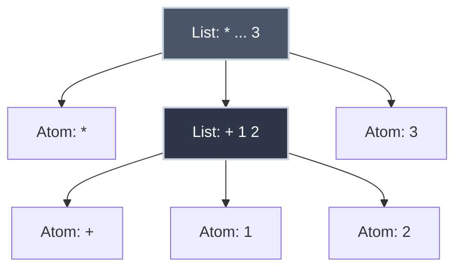

# Scheme, Lisp, and Parse Trees

When you write `3 + 4 * 5` in mathematics, everyone agrees it means `3 + (4 * 5) = 23`, not `(3 + 4) * 5 = 35`. Operator precedence rules—memorized through years of schooling—determine this. But what if there were a notation that never needed precedence rules? What if the structure of the expression itself made evaluation order crystal clear?

Enter **Lisp** and its dialect **Scheme**: languages where parentheses aren't decorative—they're structural. Where `(+ 3 (* 4 5))` is unambiguous. Where the written form directly reflects the parse tree that represents it.

Understanding Scheme's prefix notation and its parse trees reveals something profound: the notation you choose shapes how you think about computation.

??? tip "The Lisp Family: A Quick Map"

    If you’ve heard of **Emacs Lisp (Elisp)** or **Common Lisp**, you’re looking at the same family tree. Lisp isn’t a single language, but a lineage of dialects that share the same "code is data" DNA.

    -   **Common Lisp**: The "industrial" version—massive, feature-rich, and standardized.
    -   **Emacs Lisp (Elisp)**: The specialized dialect used to build and extend the Emacs text editor. (Yes, the editor is mostly written in its own language.)
    -   **Scheme**: The "academic" version—minimalist, elegant, and the focus of this article.

    We use Scheme because its syntax is so stripped-down that you can’t help but see the underlying structure of the computation.

## What is Scheme?

In most programming languages, you write:

```
3 + 4
```

This is **infix notation**—the operator (`+`) sits between its operands.

In Scheme, you write:

```scheme
(+ 3 4)
```

This is **prefix notation**—the operator comes first, followed by its operands.

**Comparison:**

| Notation | Addition | Multiplication | Nested |
|:---------|:---------|:---------------|:-------|
| **Infix** | `3 + 4` | `4 * 5` | `3 + 4 * 5` |
| **Prefix (Scheme)** | `(+ 3 4)` | `(* 4 5)` | `(+ 3 (* 4 5))` |

### Why Prefix Notation?

**Advantages:**

1. **No precedence rules needed**: Parentheses make structure explicit
2. **Uniform syntax**: Everything is `(function arg1 arg2 ...)`
3. **Easy to parse**: No need for precedence-climbing or [shunting-yard algorithms](how_parsers_work.md)
4. **Variable number of arguments**: `(+ 1 2 3 4 5)` works naturally

**Disadvantages:**

1. **Unfamiliar**: Humans learn infix in school
2. **Lots of parentheses**: Can be harder to read for complex expressions

## S-Expressions

The term **S-expression** (symbolic expression) sounds complex, but it describes a very simple, recursive structure.

Think of it like a system of **nested boxes**:

1.  **Atoms**: These are the contents. A number (`42`) or a symbol (`+`) is an atom. It cannot be split further.
2.  **Lists**: These are the boxes. A list is wrapped in parentheses `( ... )`.

**The Golden Rule:** A list can contain atoms, *or it can contain other lists.*

| Type | Definition | Examples |
|:-----|:-----------|:---------|
| **Atom** | A fundamental unit (number, symbol, string) | `42`, `x`, `+`, `"hello"` |
| **List** | A container holding zero or more S-expressions | `(1 2 3)`, `(a (b c) d)`, `()` |

Because lists can contain lists, you naturally build a **tree structure**.

### Visualizing S-Expressions

Consider the S-expression: `(* (+ 1 2) 3)`

It is a **List** containing three things:

1.  **Atom**: `*`
2.  **List**: `(+ 1 2)` (which itself contains three atoms)
3.  **Atom**: `3`

If we draw this hierarchy, it is identical to a tree:



### Why "Symbolic"?

In most languages (like C or Java), variable names like `x` or `calculate` disappear when you compile the code—they turn into memory addresses.

In an **S-expression**, symbols (words like `x`, `foo`, `+`) are distinct data types, just like numbers. The language can manipulate words and names as easily as it manipulates math. This is why it's called a *Symbolic* Expression.

??? info "Under the Hood: How does the CPU handle symbols?"

    In languages like C, a variable name like `radius` is completely erased during compilation and replaced with a memory address (e.g., `0x7ffe...`). The CPU only sees the address.

    In Lisp/Scheme, symbols **persist** during execution because the language uses an **Environment**: a giant lookup table in memory.

    1.  **The Environment**: When you call `(square 7)`, the language looks up the symbol `square` in its table to find the code it needs to run.
    2.  **Pointers**: To keep this fast, the language "interns" symbols. Every instance of `x` in your code points to the exact same "Symbol Object" in memory. The CPU doesn't compare the string "x"; it just compares the memory pointers to see if they match.
    3.  **Code as Data**: Because symbols aren't erased, a Lisp program can read its own source code, move symbols around, and even generate new functions while it is running.

**Examples of valid S-expressions:**

```scheme
42                  ; Atom (number)
hello               ; Atom (symbol)
(1 2 3)             ; List of three atoms
(+ 1 2)             ; List (function call)
(+ (* 2 3) 4)       ; List containing another list (nested)
()                  ; The Empty List (also called "nil")
```

### Lists as Code

In Scheme, **code is lists**. A function call is a list where:

- The first element is the function (operator)
- Remaining elements are arguments (operands)

```scheme
(+ 1 2)             ; Call function + with arguments 1 and 2
(* 3 4)             ; Call function * with arguments 3 and 4
(- 10 5)            ; Call function - with arguments 10 and 5
```

This **homoiconicity** (code as data) makes Lisp/Scheme uniquely powerful for metaprogramming—programs that manipulate programs.

??? tip "Common Misconception: Code vs. Data"

    When we say "Code is Data," we don't mean **hardcoding** (mixing magic numbers or strings into your logic), which is generally bad practice.

    We mean that the **structure** of the program is exposed as a data structure you can edit.

    -   **In Python/Java:** Code is text. To change it, you have to cut and paste strings.
    -   **In Lisp:** Code is a **List**. You can use standard list functions (like `map` or `reverse`) to rewrite your own program while it is loading. This allows you to add new features to the language (like loops or classes) without waiting for the compiler developers to add them.

### Special Forms: Breaking the Rules

There is one catch. Normally, Scheme evaluates **all** arguments before passing them to a function. But some things, like defining variables, wouldn't work if we did that.

```scheme
(define x 10)
```

If `define` were a normal function, Scheme would try to find the value of `x` *before* running the line. But `x` doesn't exist yet!

To handle this, Scheme has **Special Forms** (like `define`, `if`, and `quote`) that have their own custom evaluation rules. They don't evaluate all their arguments.

## Reading Scheme Expressions

Let's build intuition by reading Scheme expressions aloud.

=== ":material-numeric-1-box: Simple"

    ```scheme
    (+ 5 6)
    ```

    **Read as:** "Add 5 and 6"
    **Evaluates to:** `11`

    ```scheme
    (* 7 8)
    ```

    **Read as:** "Multiply 7 and 8"
    **Evaluates to:** `56`

=== ":material-numeric-2-box: Nested"

    ```scheme
    (+ (+ 5 6) (* 7 8))
    ```

    **Read as:** "Add the result of (add 5 and 6) to the result of (multiply 7 and 8)"

    **Step-by-step evaluation:**

    1. Evaluate inner expressions first:
       - `(+ 5 6)` → `11`
       - `(* 7 8)` → `56`
    2. Substitute results: `(+ 11 56)`
    3. Evaluate outer expression: `67`

    !!! abstract "Key Insight"
        The structure of nested parentheses **directly mirrors** the evaluation order. Innermost expressions evaluate first, working outward.

=== ":material-numeric-3-box: Complex"

    ```scheme
    (+ (* 2 3) (- 10 4) 5)
    ```

    **Read as:** "Add the result of (multiply 2 and 3), the result of (subtract 4 from 10), and 5"

    **Evaluation:**

    1. `(* 2 3)` → `6`
    2. `(- 10 4)` → `6`
    3. `(+ 6 6 5)` → `17`

    **Notice:** `+` can take more than two arguments in Scheme—another advantage of prefix notation.

## Parse Trees for Scheme

A **[parse tree](binary_trees_and_representation.md)** (or **abstract syntax tree**, AST) represents the grammatical structure of an expression as a tree.

For Scheme, the correspondence between written form and parse tree is particularly direct—parentheses literally define tree structure.

=== ":material-tree: Simple Tree"

    **Expression:** `(+ 5 6)`

    **Structure:**
    - **Root**: The operator `+`
    - **Children**: The operands `5` and `6`

    ```mermaid
    graph TD
        Plus["+"] --> Five["5"]
        Plus --> Six["6"]

        style Plus fill:#4a5568,stroke:#cbd5e0,stroke-width:2px,color:#fff
        style Five fill:#2d3748,stroke:#cbd5e0,stroke-width:2px,color:#fff
        style Six fill:#2d3748,stroke:#cbd5e0,stroke-width:2px,color:#fff
    ```

=== ":material-forest: Nested Tree"

    **Expression:** `(+ (+ 5 6) (* 7 8))`

    **Structure:**
    - **Root**: Outer `+` operator
    - **Left subtree**: `(+ 5 6)`
    - **Right subtree**: `(* 7 8)`

    ```mermaid
    graph TD
        RootPlus["+"] --> LeftPlus["+"]
        RootPlus --> RightTimes["*"]
        LeftPlus --> Five["5"]
        LeftPlus --> Six["6"]
        RightTimes --> Seven["7"]
        RightTimes --> Eight["8"]

        style RootPlus fill:#4a5568,stroke:#cbd5e0,stroke-width:2px,color:#fff
        style LeftPlus fill:#4a5568,stroke:#cbd5e0,stroke-width:2px,color:#fff
        style RightTimes fill:#4a5568,stroke:#cbd5e0,stroke-width:2px,color:#fff
        style Five fill:#2d3748,stroke:#cbd5e0,stroke-width:2px,color:#fff
        style Six fill:#2d3748,stroke:#cbd5e0,stroke-width:2px,color:#fff
        style Seven fill:#2d3748,stroke:#cbd5e0,stroke-width:2px,color:#fff
        style Eight fill:#2d3748,stroke:#cbd5e0,stroke-width:2px,color:#fff
    ```

    **Evaluation order** (post-order traversal):

    1. Evaluate left subtree: `5 + 6 = 11`
    2. Evaluate right subtree: `7 * 8 = 56`
    3. Evaluate root: `11 + 56 = 67`

=== ":material-pencil: Drawing Algorithm"

    **How to draw a parse tree from Scheme:**

    1. The outermost parentheses define the root node (the operator)
    2. Each argument becomes a child
    3. If an argument is itself a list (nested expression), recurse

    **Example:** `(* (+ 3 4) (- 10 5) 2)`

    ```mermaid
    graph TD
        Times["*"] --> Plus["+"]
        Times --> Minus["-"]
        Times --> Two["2"]
        Plus --> Three["3"]
        Plus --> Four["4"]
        Minus --> Ten["10"]
        Minus --> Five["5"]

        style Times fill:#4a5568,stroke:#cbd5e0,stroke-width:2px,color:#fff
        style Plus fill:#4a5568,stroke:#cbd5e0,stroke-width:2px,color:#fff
        style Minus fill:#4a5568,stroke:#cbd5e0,stroke-width:2px,color:#fff
        style Two fill:#2d3748,stroke:#cbd5e0,stroke-width:2px,color:#fff
        style Three fill:#2d3748,stroke:#cbd5e0,stroke-width:2px,color:#fff
        style Four fill:#2d3748,stroke:#cbd5e0,stroke-width:2px,color:#fff
        style Ten fill:#2d3748,stroke:#cbd5e0,stroke-width:2px,color:#fff
        style Five fill:#2d3748,stroke:#cbd5e0,stroke-width:2px,color:#fff
    ```
    **Evaluation:**

    1. `(+ 3 4)` → `7`
    2. `(- 10 5)` → `5`
    3. `(* 7 5 2)` → `70`

## Evaluation Order: Post-Order Traversal

Scheme expressions evaluate using **post-order traversal**:

1. Evaluate left subtree
2. Evaluate right subtree
3. Apply operator at root

This ensures arguments are computed before the function that uses them—a fundamental principle in most programming languages.

### Example: `(+ (+ 5 6) (* 7 8))`

**Tree:**

```
       +
      / \
     +   *
    / \ / \
   5  6 7  8
```

**Post-order traversal:**

1. Visit left subtree (`+`):
   - Visit `5` (leaf) → value is `5`
   - Visit `6` (leaf) → value is `6`
   - Apply `+` → `5 + 6 = 11`
2. Visit right subtree (`*`):
   - Visit `7` (leaf) → value is `7`
   - Visit `8` (leaf) → value is `8`
   - Apply `*` → `7 * 8 = 56`
3. Visit root (`+`):
   - Apply `+` to results → `11 + 56 = 67`

**Result:** `67`

The tree structure **guarantees** correct evaluation order—no precedence rules needed.

## The Ambiguity Problem

Why did Lisp choose such a strange notation? To eliminate **ambiguity**.

Infix notation (standard math) is inherently ambiguous. Consider:

`3 + 4 * 5`

Does this mean `(3 + 4) * 5` or `3 + (4 * 5)`?

To solve this, we rely on **Precedence Rules** (PEMDAS). You have to memorize that `*` beats `+`. These are "invisible parentheses" that the parser adds for you. Scheme removes the need for invisible rules by forcing you to make the structure explicit.

=== ":material-help-circle-outline: Infix (Implicit)"

    **Expression:** `3 + 4 * 5`

    **The Problem:**
    Who owns the `4`? Does `+` claim it, or does `*` claim it? The notation doesn't say.

    **The Fix:**
    We apply an arbitrary rule: "Multiplication before Addition." We need a **lookup table** of rules to read the code.

    **The Hidden Tree:**
    The computer implicitly builds this tree based on the rulebook:

    ```mermaid
    graph TD
        T1["3"] --- T2["+"] --- T3["4"] --- T4["*"] --- T5["5"]

        subgraph Rules ["The Rulebook (PEMDAS)"]
            R1["Rule: * beats +"]
        end

        Plus["+"] --> Three["3"]
        Plus --> Times["*"]
        Times --> Four["4"]
        Times --> Five["5"]

        T3 --> Rules
        Rules -.-> Plus

        style Plus fill:#4a5568,stroke:#cbd5e0,stroke-width:2px,color:#fff
        style Times fill:#4a5568,stroke:#cbd5e0,stroke-width:2px,color:#fff
        style Rules fill:#2d3748,stroke:#cbd5e0,stroke-width:2px,color:#fff
        style R1 fill:#48bb78,stroke:#cbd5e0,stroke-width:2px,color:#fff
    ```

=== ":material-check-circle-outline: Prefix (Explicit)"

    **Expression:** `(+ 3 (* 4 5))`

    **The Solution:**
    There is no question about who owns the `4`. It is physically inside the `(* ...)` list. The structure is undeniable.

    **The Explicit Tree:**
    The notation maps 1:1 to the tree.

    ```mermaid
    graph TD
        Plus["+"] --> Three["3"]
        Plus --> Times["*"]
        Times --> Four["4"]
        Times --> Five["5"]
        style Plus fill:#4a5568,stroke:#cbd5e0,stroke-width:2px,color:#fff
        style Times fill:#4a5568,stroke:#cbd5e0,stroke-width:2px,color:#fff
    ```

### Why Parsers Love Prefix

The difference in complexity is staggering when you try to write a program to read these expressions.

**Parsing Infix (`3 + 4 * 5`) requires:**

1.  **Tokenizing**: Breaking string into parts.
2.  **Precedence Logic**: Knowing `*` > `+`.
3.  **Associativity Logic**: Knowing `1 - 2 - 3` is `(1 - 2) - 3`.
4.  **Complex Algorithms**: Shunting-yard (Dijkstra) or Operator-precedence parsing.

**Parsing Prefix (`(+ 3 (* 4 5))`) requires:**

1.  **Tokenizing**.
2.  **Recursion**: "See a paren? Start a new node."

There is no Step 3 or 4. The parser is trivial:

```python title="Simple Scheme Parser" linenums="1"
def parse(tokens):  # (1)!
    token = tokens.pop(0)
    if token == '(':
        operator = tokens.pop(0)  # (3)!
        operands = []
        while tokens[0] != ')':  # (4)!
            operands.append(parse(tokens))  # (5)!
        tokens.pop(0)  # (6)!
        return (operator, operands)
    else:
        return int(token)  # (7)!
```

1. Recursively parse a list of tokens
2. If we see an opening paren, we're starting a new expression
3. First token after '(' is the operator
4. Collect all operands until we hit the closing paren
5. Each operand might itself be an expression, so recurse
6. Consume the closing paren
7. Base case: if it's not a paren, it's a number (or symbol)

**No precedence table needed.** Structure is explicit.

## Historical Context

=== ":material-creation: The Birth of Lisp"

    **Lisp** was created by John McCarthy in 1958 at MIT as part of his research on artificial intelligence. McCarthy wanted a language that:

    - Could manipulate symbolic expressions (not just numbers)
    - Treated code as data (enabling metaprogramming)
    - Supported recursive functions naturally

    S-expressions were McCarthy's solution—simple, uniform, and powerful.

=== ":material-school: Scheme"

    **Scheme** emerged from MIT in 1975 as Guy Steele and Gerald Sussman explored λ-calculus and programming language semantics. They wanted a "purer" Lisp:

    - Lexical scoping (instead of dynamic)
    - First-class continuations
    - Tail-call optimization
    - Minimalist design

    Scheme's simplicity made it ideal for teaching and research, culminating in the influential textbook **Structure and Interpretation of Computer Programs** (SICP) by Abelson and Sussman (1984).

=== ":material-graph: Influence"

    Lisp's ideas permeate modern programming:

    - **Garbage collection**: Pioneered by Lisp (McCarthy, 1960)
    - **First-class functions**: Lisp made them mainstream
    - **Closures**: Scheme formalized them
    - **Dynamic typing**: Common in scripting languages
    - **Homoiconicity**: Inspired Clojure, Julia's metaprogramming

    Even languages that don't look like Lisp (JavaScript, Python, Ruby) adopted its core ideas.

## Scheme in Action

=== ":material-calculator: Basic Arithmetic"

    Scheme arithmetic supports variable arguments naturally.

    ```scheme
    (+ 1 2 3 4 5)       ; 15 (variadic function)
    (* 2 3 4)           ; 24
    (- 10 3)            ; 7
    (/ 20 4)            ; 5
    ```

    **Nested Arithmetic:**

    ```scheme
    (+ (* 2 3) (/ 10 2) (- 8 3))
    ; Evaluates to: (+ 6 5 5) → 16
    ```

=== ":material-function: Variables & Functions"

    Definitions use `define`. Notice how defining a function looks just like calling it, but with a body.

    ```scheme
    (define pi 3.14159)
    (define radius 5)
    (* pi (* radius radius))    ; Area of circle: 78.53975
    ```

    **Defining Functions:**

    ```scheme
    (define (square x)
      (* x x))

    (square 7)          ; 49
    ```

=== ":material-call-split: Control Flow"

    Scheme uses `if` for conditional logic. It returns a value (like the ternary operator `? :` in C-style languages) rather than executing statements.

    ```scheme
    (define (abs x)
      (if (< x 0)
          (- x)
          x))

    (abs -5)            ; 5
    (abs 3)             ; 3
    ```

=== ":material-refresh: Recursion"

    Recursion is the primary way to loop in Scheme.

    ```scheme
    (define (factorial n)
      (if (<= n 1)
          1
          (* n (factorial (- n 1)))))

    (factorial 5)       ; 120
    ```

    ??? tip "Recursion and the Call Stack"

        Every recursive call relies on the **[function call stack](../data_structures/abstract_data_types_and_stack.md#function-call-stack)**—a fundamental data structure that manages function execution.

        When `(factorial 5)` runs, the stack grows with each recursive call:
        ```
        factorial(5)
          → factorial(4)
            → factorial(3)
              → factorial(2)
                → factorial(1)  ← base case reached, starts returning
        ```

        Each call waits on the stack until its nested call completes, then pops off and returns its result. This LIFO behavior is what makes recursion possible.

## Why Study Scheme?

You might reasonably ask: why learn Scheme when modern languages like Python, JavaScript, or Rust dominate industry?

=== ":material-lightbulb: Conceptual Clarity"

    Scheme strips away syntax complexity, letting you focus on computational concepts:

    - Recursion without boilerplate
    - [Higher-order functions](../programming_languages/procedures_and_higher_order_functions.md) without ceremony
    - Closures and scope made explicit

=== ":material-file-tree: Understanding Parsers"

    Scheme's direct mapping from text to parse tree demystifies how languages work. Once you see how prefix notation avoids precedence, you understand why parsing infix is hard.

=== ":material-function-variant: Functional Programming"

    Scheme is functional-first, teaching patterns now common in JavaScript, Python, Haskell, and Rust:

    - `map`, `filter`, `reduce`
    - Immutability
    - Function composition

=== ":material-history: Historical Perspective"

    Understanding Lisp/Scheme helps you appreciate language evolution. Many "modern" features (lambdas, closures, garbage collection) were invented in Lisp decades ago.

=== ":material-school: Academic Rigor"

    Scheme's minimalism makes it perfect for studying:

    - Programming language semantics
    - Interpreters and compilers
    - Type theory and λ-calculus

    MIT's SICP remains a gold standard in CS education precisely because Scheme gets out of the way, letting ideas shine through.

## Practice Problems

??? question "Practice Problem 1: Reading Scheme"

    What does this Scheme expression evaluate to?

    ```scheme
    (+ (* 3 4) (- 10 2) 5)
    ```

    Show the evaluation steps.

    ??? tip "Solution"

        **Expression:** `(+ (* 3 4) (- 10 2) 5)`

        **Step 1: Evaluate subexpressions**

        - `(* 3 4)` → `12`
        - `(- 10 2)` → `8`

        **Step 2: Substitute results**

        - `(+ 12 8 5)`

        **Step 3: Evaluate outer expression**

        - `12 + 8 + 5 = 25`

        **Answer:** `25`

??? question "Practice Problem 2: Convert Infix to Prefix"

    Convert this infix expression to Scheme prefix notation:

    ```
    (5 + 6) * (7 - 2)
    ```

    Then draw the parse tree.

    ??? tip "Solution"

        **Infix:** `(5 + 6) * (7 - 2)`

        **Prefix (Scheme):** `(* (+ 5 6) (- 7 2))`

        **Parse Tree:**

        ```mermaid
        graph TD
            Times["*"] --> Plus["+"]
            Times --> Minus["-"]
            Plus --> Five["5"]
            Plus --> Six["6"]
            Minus --> Seven["7"]
            Minus --> Two["2"]

            style Times fill:#4a5568,stroke:#cbd5e0,stroke-width:2px,color:#fff
            style Plus fill:#4a5568,stroke:#cbd5e0,stroke-width:2px,color:#fff
            style Minus fill:#4a5568,stroke:#cbd5e0,stroke-width:2px,color:#fff
            style Five fill:#2d3748,stroke:#cbd5e0,stroke-width:2px,color:#fff
            style Six fill:#2d3748,stroke:#cbd5e0,stroke-width:2px,color:#fff
            style Seven fill:#2d3748,stroke:#cbd5e0,stroke-width:2px,color:#fff
            style Two fill:#2d3748,stroke:#cbd5e0,stroke-width:2px,color:#fff
        ```

        **Evaluation:**

        1. `(+ 5 6)` → `11`
        2. `(- 7 2)` → `5`
        3. `(* 11 5)` → `55`

        **Answer:** `55`

??? question "Practice Problem 3: Draw Parse Tree"

    Draw the parse tree for this Scheme expression:

    ```scheme
    (+ (+ 5 6) (* 7 8))
    ```

    Then trace the post-order evaluation.

    ??? tip "Solution"

        **Parse Tree:**

        ```mermaid
        graph TD
            RootPlus["+"] --> LeftPlus["+"]
            RootPlus --> RightTimes["*"]
            LeftPlus --> Five["5"]
            LeftPlus --> Six["6"]
            RightTimes --> Seven["7"]
            RightTimes --> Eight["8"]

            style RootPlus fill:#4a5568,stroke:#cbd5e0,stroke-width:2px,color:#fff
            style LeftPlus fill:#4a5568,stroke:#cbd5e0,stroke-width:2px,color:#fff
            style RightTimes fill:#4a5568,stroke:#cbd5e0,stroke-width:2px,color:#fff
            style Five fill:#2d3748,stroke:#cbd5e0,stroke-width:2px,color:#fff
            style Six fill:#2d3748,stroke:#cbd5e0,stroke-width:2px,color:#fff
            style Seven fill:#2d3748,stroke:#cbd5e0,stroke-width:2px,color:#fff
            style Eight fill:#2d3748,stroke:#cbd5e0,stroke-width:2px,color:#fff
        ```

        **Post-Order Evaluation:**

        1. Visit left subtree (`+`):
           - Visit `5` → `5`
           - Visit `6` → `6`
           - Apply `+` → `5 + 6 = 11`
        2. Visit right subtree (`*`):
           - Visit `7` → `7`
           - Visit `8` → `8`
           - Apply `*` → `7 * 8 = 56`
        3. Visit root (`+`):
           - Apply `+` → `11 + 56 = 67`

        **Answer:** `67`

??? question "Practice Problem 4: Complex Nesting"

    Evaluate this Scheme expression step-by-step:

    ```scheme
    (* (+ 1 2) (- 10 (/ 8 2)) (+ 3 3))
    ```

    ??? tip "Solution"

        **Expression:** `(* (+ 1 2) (- 10 (/ 8 2)) (+ 3 3))`

        **Step 1: Evaluate innermost subexpressions**

        - `(/ 8 2)` → `4`

        **Step 2: Substitute and evaluate next level**

        - `(+ 1 2)` → `3`
        - `(- 10 4)` → `6`
        - `(+ 3 3)` → `6`

        **Step 3: Evaluate outer expression**

        - `(* 3 6 6)` → `108`

        **Answer:** `108`

## Key Takeaways

| Concept | Meaning |
|:--------|:--------|
| **Prefix Notation** | Operator comes before operands: `(+ 1 2)` |
| **S-Expression** | Atom or list of S-expressions |
| **Parse Tree** | Tree representation of expression structure |
| **Post-Order Traversal** | Evaluate children before parent (bottom-up) |
| **Homoiconicity** | Code is data; programs are lists |
| **No Precedence Rules** | Parentheses make structure explicit |
| **Scheme/Lisp** | Languages using prefix notation and S-expressions |

## Why Scheme Matters

Scheme and prefix notation reveal:

- **How notation shapes thought**: Explicit structure changes how you reason about programs
- **How parsers work**: Prefix notation is trivial to parse; infix requires precedence
- **How trees encode meaning**: Parse trees are the "compiled" form of expressions
- **How code can be data**: S-expressions let programs manipulate programs
- **How functional programming works**: Scheme pioneered ideas now common in modern languages

You don't need to write Scheme professionally to benefit from understanding it. The insights it provides—about parsing, recursion, abstraction, and the relationship between notation and computation—are universal.

## Further Reading

- **Abelson & Sussman, [Structure and Interpretation of Computer Programs](https://mitp-content-server.mit.edu/books/content/sectbyfn/books_pres_0/6515/sicp.zip/index.html)** — The definitive Scheme textbook
- **David Evans, [Introduction to Computing](https://computingbook.org/)** — Chapter 2 covers RTNs and parsing
- **[Recursive Transition Networks](recursive_transition_networks.md)** — How grammars define parse trees
- **[Computational Thinking](computational_thinking.md)** — Abstraction and decomposition in practice

---

Scheme strips programming down to its essence: [functions](../programming_languages/procedures_and_higher_order_functions.md), data, and recursion. What remains is computation in its purest form—no syntax tricks, no precedence tables, just structure made explicit through parentheses. It's not the notation most programmers use daily, but understanding it changes how you think about all the notations you do use.

## Video Summary

<div class="video-wrapper">
  <iframe src="https://www.youtube.com/embed/2v6XPK6N4ok" title="Scheme and Parse Trees" allow="accelerometer; autoplay; clipboard-write; encrypted-media; gyroscope; picture-in-picture; web-share" allowfullscreen></iframe>
</div>