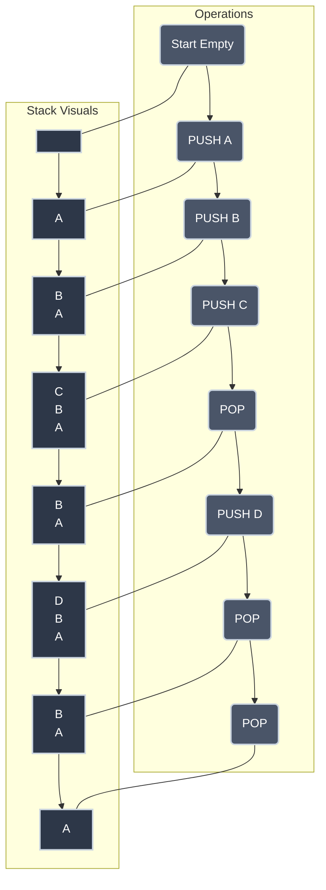

# Abstract Data Types and the Stack

Imagine you're at a fancy restaurant. You order your food, and a chef prepares it in the kitchen. Do you, as the diner, need to know every single ingredient, every whisk, every chop, or the exact brand of whisk the chef used? Probably not. You care about the delicious meal that arrives, not the culinary mechanics behind it.

In computer science, we often deal with complexity by abstracting it away. We care about *what* a data structure does, not necessarily *how* it's implemented under the hood. This powerful idea leads us to **Abstract Data Types (ADTs)**, and one of the most fundamental ADTs you'll encounter is the **Stack**.

Get ready to dive into the world of "black boxes" and discover how a simple pile of plates can secretly run half the software you use every day.

## What is an Abstract Data Type (ADT)?

An **Abstract Data Type (ADT)** is a logical description of what a data structure represents, *without specifying how it's implemented*. It defines the data, the operations you can perform on it, and the behavior those operations exhibit.

Think of an ADT as a contract or a blueprint. It tells you *what* you can do, but not *how* it's done.

### Formal Definition

Mathematically, an ADT can be defined by its state and the transitions between those states. For a Stack, we can represent its behavior using the following notation:

| Component | Mathematical Notation | Description |
|:----------|:----------------------|:------------|
| **Data Set** | $D$ | The set of all possible elements that can be stored in the stack |
| **Stack State** | $S$ | A sequence of elements $(e_1, e_2, \dots, e_n)$ where $e_n$ is the top |
| **Push** | $push: S \times D \to S$ | Adds an element to the top: $push((e_1, \dots, e_n), e) = (e_1, \dots, e_n, e)$ |
| **Pop** | $pop: S \to S \times D$ | Removes and returns the top element: $pop((e_1, \dots, e_n)) = ((e_1, \dots, e_{n-1}), e_n)$ |
| **Peek** | $peek: S \to D$ | Returns the top element without removing it: $peek((e_1, \dots, e_n)) = e_n$ |
| **Is Empty** | $isEmpty: S \to \{True, False\}$ | Returns True if the sequence is empty, False otherwise |

### The Vending Machine Analogy

In the article about [Procedures and Higher-Order Functions](../programming_languages/procedures_and_higher_order_functions.md), we mentioned that [a vending machine is a great analogy for hiding complexity](../programming_languages/procedures_and_higher_order_functions.md#the-vending-machine-analogy). ADTs are very similar:

- **Buttons (Operations):** `Insert Money`, `Select Item`, `Get Change`. You know what these buttons do.
- **Display (Data):** Shows `Item A: $1.50`, `Item B: Out of Stock`. You know what information is available.
- **Internal Mechanism (Implementation):** Motors, wires, sensors, inventory management system. You **don't** need to know this to use the machine.

If the vending machine owner decides to replace the internal coin mechanism with a credit card reader, you still use the `Select Item` operation—the *behavior* remains the same, even if the *implementation* changes. That's abstraction in action!

### Why ADTs are Awesome

1. **Modularity:** Code becomes easier to organize and maintain.
2. **Flexibility:** You can change the underlying implementation without affecting the rest of the program, as long as the ADT's contract is upheld.
3. **Encapsulation:** Details are hidden, preventing accidental misuse or modification.
4. **Clarity:** Focus on the problem you're solving, not the nitty-gritty storage details.

## Historical Context: The Evolution of the "Cellar"

The concept of the stack wasn't just "discovered"—it was engineered to solve specific problems in early computing.

- **1945: Alan Turing** used the terms "bury" and "unbury" for stacks in his design of the Automatic Computing Engine (ACE). He needed a way to keep track of return addresses during sub-routine calls.
- **1955: Friedrich L. Bauer and Klaus Samelson** applied for a patent for "The Cellar Principle" (Stapelprinzip). They recognized that a "cellar" (stack) was the perfect structure for evaluating mathematical expressions.
- **1957: Charles Hamblin** introduced Reverse Polish Notation (RPN) and stack-based evaluation, which became the foundation for many early calculators and programming languages like Forth and PostScript.

That's not hyperbole—it's history. The stack is one of the oldest and most enduring structures in computer science.

## The Stack: A LIFO Love Story

One of the simplest yet most powerful ADTs is the **Stack**. If you've ever piled books on your desk or plates in a cupboard, you already understand its core principle.

A Stack is a collection of items that follows the **Last-In, First-Out (LIFO)** principle. This means the last item added to the stack is always the first one to be removed.

### Core Stack Operations

The Stack ADT typically defines a few essential operations:

- **`PUSH(item)`:** Adds an `item` to the top of the stack.
- **`POP()`:** Removes and returns the `item` from the top of the stack. If the stack is empty, it usually results in an error.
- **`PEEK()` / `TOP()`:** Returns the `item` at the top of the stack *without removing it*.
- **`IS_EMPTY()`:** Checks if the stack contains any items.
- **`SIZE()`:** Returns the number of items currently in the stack.

### Visualizing a Stack

Let's see a stack in action with some pushes and pops:



## Implementing a Stack (The How, Hidden by the ADT)

The beauty of an ADT is that its users don't care about the implementation. But for us curious computer scientists, it's good to know how a Stack can be built.

Two common ways to implement a Stack are:

1. **Using an Array/List:** `PUSH` appends to the end; `POP` removes from the end. This is highly efficient if the array can dynamically resize.
2. **Using a Linked List:** `PUSH` adds a new node at the beginning (making it the new head); `POP` removes the head node.

### Multi-Language Implementation

Here is a Stack implementation using dynamic arrays (the most common approach) in several popular languages:

=== ":material-language-python: Python"

    ```python title="Stack Implementation in Python" linenums="1"
    class Stack:
        def __init__(self):
            self.data = []  # (1)!

        def push(self, item):
            self.data.append(item)  # (2)!

        def pop(self):
            if self.is_empty():
                raise IndexError("Pop from empty stack")
            return self.data.pop()  # (3)!

        def peek(self):
            if self.is_empty():
                return None
            return self.data[-1]  # (4)!

        def is_empty(self):
            return len(self.data) == 0

        def size(self):
            return len(self.data)
    ```

    1. Python lists are dynamic arrays, perfect for a stack.
    2. Appending to the end of a list is O(1) amortized.
    3. `pop()` without an index removes the last item.
    4. Access the last element without removing it.

=== ":material-language-javascript: JavaScript"

    ```javascript title="Stack Implementation in JavaScript" linenums="1"
    class Stack {
        constructor() {
            this.data = [];  // (1)!
        }

        push(item) {
            this.data.push(item);  // (2)!
        }

        pop() {
            if (this.isEmpty()) {
                throw new Error("Stack is empty");
            }
            return this.data.pop();  // (3)!
        }

        peek() {
            return this.isEmpty() ? null : this.data[this.data.length - 1];  // (4)!
        }

        isEmpty() {
            return this.data.length === 0;
        }

        size() {
            return this.data.length;
        }
    }
    ```

    1. JavaScript arrays are dynamic and work perfectly as stacks.
    2. The `push()` method appends to the end in O(1) time.
    3. The `pop()` method removes and returns the last element.
    4. Uses a ternary operator to return null for empty stacks.

=== ":material-language-go: Go"

    ```go title="Stack Implementation in Go" linenums="1"
    package main

    import "errors"

    type Stack struct {
        data []interface{}  // (1)!
    }

    func (s *Stack) Push(item interface{}) {
        s.data = append(s.data, item)  // (2)!
    }

    func (s *Stack) Pop() (interface{}, error) {
        if s.IsEmpty() {
            return nil, errors.New("stack is empty")  // (3)!
        }
        item := s.data[len(s.data)-1]
        s.data = s.data[:len(s.data)-1]  // (4)!
        return item, nil
    }

    func (s *Stack) Peek() (interface{}, error) {
        if s.IsEmpty() {
            return nil, errors.New("stack is empty")
        }
        return s.data[len(s.data)-1], nil
    }

    func (s *Stack) IsEmpty() bool {
        return len(s.data) == 0
    }
    ```

    1. Uses `interface{}` to allow any type (consider using generics in Go 1.18+).
    2. The `append()` function handles slice growth automatically.
    3. Idiomatic Go returns errors instead of throwing exceptions.
    4. Slice reslicing removes the last element efficiently.

=== ":material-language-rust: Rust"

    ```rust title="Stack Implementation in Rust" linenums="1"
    struct Stack<T> {  // (1)!
        data: Vec<T>,
    }

    impl<T> Stack<T> {
        fn new() -> Self {
            Stack { data: Vec::new() }
        }

        fn push(&mut self, item: T) {  // (2)!
            self.data.push(item);
        }

        fn pop(&mut self) -> Option<T> {  // (3)!
            self.data.pop()
        }

        fn peek(&self) -> Option<&T> {  // (4)!
            self.data.last()
        }

        fn is_empty(&self) -> bool {
            self.data.is_empty()
        }
    }
    ```

    1. Generic type `T` allows the stack to hold any type safely.
    2. `&mut self` borrows the stack mutably for modification.
    3. Returns `Option<T>` - idiomatic Rust for operations that can fail.
    4. Returns a reference `&T` since peek doesn't take ownership.

=== ":material-language-java: Java"

    ```java title="Stack Implementation in Java" linenums="1"
    import java.util.ArrayList;

    public class Stack<T> {  // (1)!
        private ArrayList<T> data = new ArrayList<>();  // (2)!

        public void push(T item) {
            data.add(item);
        }

        public T pop() {
            if (isEmpty()) {
                throw new RuntimeException("Stack is empty");  // (3)!
            }
            return data.remove(data.size() - 1);
        }

        public T peek() {
            if (isEmpty()) {
                return null;
            }
            return data.get(data.size() - 1);
        }

        public boolean isEmpty() {
            return data.isEmpty();
        }
    }
    ```

    1. Generic type parameter `<T>` provides type safety.
    2. ArrayList automatically resizes as needed.
    3. Throws unchecked exception for empty stack (alternatively use Optional<T>).

=== ":material-language-cpp: C++"

    ```cpp title="Stack Implementation in C++" linenums="1"
    #include <vector>
    #include <stdexcept>

    template <typename T>  // (1)!
    class Stack {
    private:
        std::vector<T> data;  // (2)!

    public:
        void push(const T& item) {  // (3)!
            data.push_back(item);
        }

        T pop() {
            if (isEmpty()) {
                throw std::runtime_error("Stack is empty");
            }
            T item = data.back();
            data.pop_back();
            return item;
        }

        T peek() const {  // (4)!
            if (isEmpty()) {
                throw std::runtime_error("Stack is empty");
            }
            return data.back();
        }

        bool isEmpty() const {
            return data.empty();
        }
    };
    ```

    1. Template allows generic type-safe stack implementation.
    2. `std::vector` provides dynamic array with automatic memory management.
    3. Pass by const reference to avoid unnecessary copying.
    4. `const` method indicates peek doesn't modify the stack.

## Real-World Applications of Stacks

Stacks aren't just academic exercises; they power many features you use daily!
{: #function-call-stack}

=== ":material-function-variant: Function Call Stack"

    This is perhaps the most critical use of a stack in computing.

    When a program calls a function, a **stack frame** (containing local variables and return addresses) is **pushed** onto the call stack. When the function finishes, its frame is **popped**, and execution returns to the caller. This LIFO behavior is why [recursion](../building_blocks/recursive_transition_networks.md) works—the last function called is the first one to finish. (Pack a lunch; recursion can get deep!)

=== ":material-undo: Undo/Redo"

    <div id="undo-redo"></div>

    Ever hit ++ctrl+z++? That's a stack at work!

    Each action you perform is **pushed** onto an "undo stack." When you "undo," the last action is **popped** and reversed. Often, that popped action is then **pushed** onto a "redo stack," allowing you to move back and forth through your history.

=== ":material-xml: Expression Parsing"

    <div id="expression-parsing"></div>

    [Compilers and interpreters](../building_blocks/how_parsers_work.md) use stacks extensively to validate syntax and evaluate math.

    - **Parentheses Matching:** As a parser reads code, it pushes opening brackets onto a stack and pops them when it sees a closing bracket. If the types don't match or the stack isn't empty at the end, the code is invalid.
    - **RPN Evaluation:** Calculators use stacks to evaluate expressions like `3 4 + 5 *` (which equals 35) without needing parentheses.

=== ":material-web: Browser History"

    <div id="browser-history"></div>

    Your web browser's "Back" button is a classic stack. As you navigate to new pages, your URLs are **pushed** onto a history stack. Clicking "Back" **pops** the current URL and takes you to the one underneath it.

## Practice Problems

??? question "Practice Problem 1: Stack State Tracing"

    Starting with an empty stack, perform the following sequence of operations. What is the final state of the stack (from top to bottom), and what values are returned by the `POP` operations?

    1. `PUSH('X')`
    2. `PUSH('Y')`
    3. `POP()`
    4. `PUSH('Z')`
    5. `PUSH('W')`
    6. `POP()`
    7. `PEEK()`

    ??? tip "Solution"

        | Operation | Stack State (Top -> Bottom) | Returned Value |
        |:---|:---|:---|
        | Start | `[]` | N/A |
        | `PUSH('X')` | `['X']` | N/A |
        | `PUSH('Y')` | `['Y', 'X']` | N/A |
        | `POP()` | `['X']` | `'Y'` |
        | `PUSH('Z')` | `['Z', 'X']` | N/A |
        | `PUSH('W')` | `['W', 'Z', 'X']` | N/A |
        | `POP()` | `['Z', 'X']` | `'W'` |
        | `PEEK()` | `['Z', 'X']` | `'Z'` |

        **Final Stack State:** `['Z', 'X']`
        **Values returned by POP:** 'Y', 'W'

??? question "Practice Problem 2: Balanced Delimiters"

    Using a stack, determine if the string `"{ [ ( ) ] }"` is balanced. Describe the steps.

    ??? tip "Solution"

        1.  Iterate through the string:
        2.  `{`: Push to stack. Stack: `['{']`
        3.  `[`: Push to stack. Stack: `['[', '{']`
        4.  `(`: Push to stack. Stack: `['(', '[', '{']`
        5.  `)`: Pop from stack (`(`). Match found! Stack: `['[', '{']`
        6.  `]`: Pop from stack (`[`). Match found! Stack: `['{']`
        7.  `}`: Pop from stack (`{`). Match found! Stack: `[]`
        8.  End of string and stack is empty: **Balanced!**

??? question "Practice Problem 3: Reverse a String"

    Write pseudocode using a stack to reverse the string "STACK".

    ??? tip "Solution"

        ```text title="Reverse String Pseudocode" linenums="1"
        function REVERSE_STRING(input)
            s = CREATE_STACK()
            for each char in input:
                PUSH(s, char)
            
            result = ""
            while NOT IS_EMPTY(s):
                result = result + POP(s)
            
            return result
        endfunction
        ```

        1. Push 'S', 'T', 'A', 'C', 'K'. Stack: `['K', 'C', 'A', 'T', 'S']`
        2. Pop characters: 'K', then 'C', then 'A', then 'T', then 'S'.
        3. Result: "KCATS" (reversed).

## Key Takeaways

| Concept | Meaning |
|:--------|:--------|
| **Abstract Data Type (ADT)** | A logical contract defining data and operations, hiding implementation details |
| **Stack** | A linear data structure following the **Last-In, First-Out (LIFO)** principle |
| **PUSH / POP** | The two primary operations for adding and removing the top element |
| **Call Stack** | The system-level stack that manages function calls and local variables |
| **LIFO** | The fundamental rule of stacks: the newest item is the first one out |

## Why ADTs and Stacks Matter

Understanding Abstract Data Types, particularly the Stack, is foundational to mastering computer science.

- **ADTs teach you to think about interfaces first:** Before you optimize or implement, you define the "what" and the "how it behaves." This leads to cleaner, more maintainable code.
- **The Stack is everywhere:** From the lowest levels of your operating system (the call stack) to the highest levels of application design (undo/redo, browser history), its simple LIFO rule provides elegant solutions to complex problems.
- **It demystifies complex systems:** Knowing about the call stack helps you debug programs, understand recursion, and grasp how a CPU manages execution.

## Further Reading

- **David Evans, [Introduction to Computing](https://computingbook.org/)** — Chapter 6 covers the Stack ADT and its applications in more detail.
- **[Computational Thinking](../building_blocks/computational_thinking.md)** — Abstraction as a key problem-solving tool.
- **[Procedures and Higher-Order Functions](../programming_languages/procedures_and_higher_order_functions.md)** — How functions enable modularity and abstraction.

---

The Stack might just be a humble pile of items, but it's one of computing's unsung heroes, silently managing the flow of control and data, always ready to hand you the very last thing you put in.
