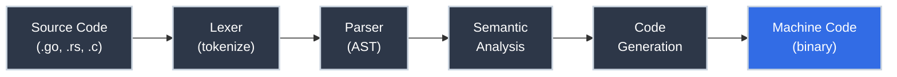
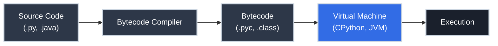

# Compilers vs. Interpreters: How Your Code Becomes Execution

You've heard "Python is interpreted, Go is compiled" hundreds of times. When you `go build`, something happens and you get a binary. When you `python app.py`, something else happens. But what, exactly?

The question matters more than trivia. It explains why Go programs start instantly and Python programs spin up a virtual machine. It explains why TypeScript errors appear in your editor before you run anything. It explains why your Java stack trace points to a source file line number even though the JVM is running bytecode. And it explains what actually happens to those 500 lines of Python you just wrote before a single one executes.

!!! info "Learning Objectives"

    By the end of this article, you'll be able to:

    - Describe the compilation pipeline: source code → tokens → AST → IR → machine code
    - Distinguish compilers, interpreters, bytecode VMs, and JIT compilers — and give real examples of each
    - Explain why compiled and interpreted languages report errors at different times
    - Connect build times, deployment artifacts, and stack trace formats to the compile/interpret choice
    - Reason about the performance trade-offs between ahead-of-time compilation and JIT compilation

## Where You've Seen This

The compile/interpret distinction shapes your daily development workflow:

- **Build times** — `cargo build` takes minutes on a large Rust project; `python script.py` starts instantly. That asymmetry is compilation work happening at different times.
- **Error timing** — a Go or Rust type error appears during `build`, before any code runs; a Python `TypeError` appears at runtime, only when that code path executes
- **Deployment artifacts** — shipping a Go service means shipping a single binary; shipping a Python service means shipping source files plus a Python runtime
- **Docker image size** — Go programs compile to a single static binary that runs in a `FROM scratch` container; Python requires the interpreter, stdlib, and all dependencies
- **IDE autocomplete** — TypeScript's language server can autocomplete and flag errors because it compiles your code in the background as you type
- **`pyc` files** — the `.pyc` files Python creates in `__pycache__` are bytecode, an intermediate form between source and machine code; Python is more complex than "purely interpreted"

## Why This Matters for Production Code

=== ":material-lightning-bolt: Performance Characteristics"

    Compiled languages (C, C++, Rust, Go) translate your source code into native machine instructions *before* the program runs. At runtime, the CPU executes those instructions directly — no translation overhead.

    Interpreted languages (classic Python, Ruby, original JavaScript) parse and execute your source code instruction by instruction at runtime. Each operation involves the interpreter figuring out what to do — function lookup, type checking, dispatch — that compiled languages resolved at build time.

    The performance difference can be 10–100× for compute-bound workloads. This is why game engines, database internals, and operating system kernels are written in C/C++/Rust, while web frameworks and scripting are comfortable in Python/Ruby.

    Modern JIT-compiled languages (JVM languages, PyPy, V8 JavaScript) narrow this gap by compiling hot code paths to native machine code at runtime — trading startup time for sustained performance.

=== ":material-bug: Error Detection Timing"

    When compilation happens affects when you discover bugs:

    | Error type | Compiled (before run) | Interpreted (at runtime) |
    |:-----------|:----------------------|:------------------------|
    | Type mismatch | Always caught | Only if that code path runs |
    | Missing variable | Always caught | Only when that line executes |
    | Syntax error | Always caught | Potentially at startup |
    | Logic error | Never caught by either | Only when triggered |

    This is why "interpreted" and "dynamically typed" tend to go together: without a compilation step, type checking has to happen at runtime anyway. And it's why adding TypeScript to JavaScript (a compiled type-checking layer over an interpreted language) caught so many real bugs: it moved type errors from runtime to compile time.

=== ":material-package-variant: Deployment and Portability"

    Compiled binaries are architecture-specific: code compiled for Linux/amd64 won't run on macOS/arm64 without recompilation. This is why Go and Rust projects use cross-compilation targets (`GOOS=linux GOARCH=amd64 go build`).

    Interpreted languages trade this for portability: Python code runs on any platform with a Python interpreter. The bytecode formats (`.pyc`, `.class`) add another layer — bytecode compiled once runs on any machine with the right virtual machine. This is the "Write Once, Run Anywhere" proposition Java made in 1995.

=== ":material-wrench: Debugging Experience"

    Interpreters can provide extremely precise error location: "line 47 of `utils.py`" because the interpreter knows exactly which source line it's currently executing. Source maps in transpiled JavaScript provide the same experience.

    Compiled languages without debug symbols lose source-level information entirely — the binary just knows addresses. Debug builds (`-g` flags) embed source location information back into the binary so debuggers can show you source lines. The production binaries you ship usually strip this for size.

## What a Compiler Actually Does

A compiler is a program that translates source code in one language into equivalent code in another language. Usually the target is machine code (native instructions for a specific CPU), but it could also be bytecode or even another high-level language.

The compilation pipeline has distinct phases:



1. **Lexing (tokenizing)** — the source text is split into tokens: keywords (`func`, `if`), identifiers (`userName`), operators (`+`, `:=`), literals (`42`, `"hello"`)
2. **Parsing** — tokens are arranged into an Abstract Syntax Tree (AST) that represents the grammatical structure of the program (see [How Parsers Work](how_parsers_work.md))
3. **Semantic analysis** — type checking, name resolution, scope analysis; this is where `undefined variable` and type mismatch errors come from
4. **Code generation** — the verified AST is translated into machine instructions or an intermediate representation

All of this happens before your program runs. When it fails, you get a compile error. When it succeeds, you get a binary.

## What an Interpreter Actually Does

An interpreter does all the same analysis — parsing, type checking, name resolution — but does it **at runtime**, just before executing each piece of code.

The simplest model: the interpreter reads one statement, executes it, reads the next, executes it, and so on. This is the "live translator" mental model.


The consequence: every time the program runs, the interpreter does this work again from scratch. This is the source of the startup overhead you see when you `python -c "print('hi')"` — Python is parsing the file, building an AST, and setting up the execution environment before `print` even runs.

## Error Timing in Practice

The most concrete difference between compiled and interpreted languages is *when* a type error gets caught. The same logical mistake — passing a number where a string is expected — is caught at completely different points:

=== ":material-language-python: Python"

    ```python title="Type Error at Runtime (Python)" linenums="1"
    def greet(name: str) -> str:
        return "Hello, " + name

    greet(42)  # TypeError: can only concatenate str (not "int") to str
    # Caught only when this line executes — if it's in a branch that never runs,
    # the bug is invisible. The `: str` annotation is a hint, not enforcement.
    ```

    **When caught:** runtime, only if the code path executes.

=== ":material-language-javascript: JavaScript"

    ```javascript title="Silent Coercion (JavaScript)" linenums="1"
    function greet(name) {
        return "Hello, " + name;
    }

    console.log(greet(42));  // "Hello, 42" — no error, JavaScript coerces 42 to "42"
    // The bug silently "succeeds". TypeScript would catch this at compile time:
    // function greet(name: string): string { ... }
    // greet(42);  // TS2345: Argument of type 'number' is not assignable to 'string'
    ```

    **When caught:** never in JavaScript (silent coercion). TypeScript catches it before any code runs.

=== ":material-language-go: Go"

    ```go title="Type Error at Compile Time (Go)" linenums="1"
    package main

    import "fmt"

    func greet(name string) string {
        return "Hello, " + name
    }

    func main() {
        fmt.Println(greet(42))
        // cannot use 42 (untyped int constant) as string value in argument to greet
    }
    // go build fails — no binary is produced
    ```

    **When caught:** compile time. `go build` rejects this before a single instruction executes.

=== ":material-language-rust: Rust"

    ```rust title="Type Error at Compile Time (Rust)" linenums="1"
    fn greet(name: &str) -> String {
        format!("Hello, {}", name)
    }

    fn main() {
        println!("{}", greet(42));
        // error[E0308]: mismatched types — expected `&str`, found integer
    }
    // rustc produces no binary
    ```

    **When caught:** compile time. The Rust compiler rejects the mismatch before producing any output.

=== ":material-language-java: Java"

    ```java title="Type Error at Compile Time (Java)" linenums="1"
    public class Greeting {
        public static String greet(String name) {
            return "Hello, " + name;
        }

        public static void main(String[] args) {
            System.out.println(greet(42));
            // error: incompatible types: int cannot be converted to String
        }
    }
    // javac fails — no .class file is produced
    ```

    **When caught:** compile time. `javac` rejects this before the JVM processes it.

=== ":material-language-cpp: C++"

    ```cpp title="Type Error at Compile Time (C++)" linenums="1"
    #include <iostream>
    #include <string>

    std::string greet(std::string name) {
        return "Hello, " + name;
    }

    int main() {
        std::cout << greet(42) << std::endl;
        // error: no matching function for call to 'greet(int)'
    }
    // g++ / clang++ produce no binary
    ```

    **When caught:** compile time. The C++ compiler rejects the type mismatch before producing any object code.

## The Hybrid Reality: Bytecode and Virtual Machines

Modern "interpreted" languages rarely operate purely as described above. Python, Ruby, Lua, and the JVM languages all use a **hybrid approach**:

1. **Compile to bytecode** — the source is compiled to a compact intermediate representation (Python's `.pyc` files, Java's `.class` files). This step catches syntax errors and does some optimization.
2. **Execute bytecode in a virtual machine** — a specialized interpreter reads bytecode instructions (which are simpler and more uniform than source code) and executes them.



Java's bytecode portability is the design intention: compile once to `.class` files, run on any JVM on any platform. Python's `.pyc` files are a performance optimization: avoid re-parsing the source file on the next run.

## JIT Compilation: The Best of Both

**Just-In-Time (JIT) compilation** takes the hybrid approach further: the virtual machine monitors which code runs frequently ("hot paths") and compiles those specific pieces to native machine code at runtime.

The result: JIT-compiled code starts with interpreted performance (slow), then approaches native performance as the JIT identifies and compiles hot paths.

- **V8** (Node.js, Chrome) JIT-compiles JavaScript — this is why Node.js is fast enough for production servers despite JavaScript being "interpreted"
- **JVM HotSpot** JIT-compiles Java bytecode — mature Java applications often match C++ performance after warmup
- **PyPy** is a JIT-compiled Python implementation — 5–50× faster than CPython for compute-bound code

The trade-off: JIT compilation adds complexity and startup cost. This is why Lambda functions and short-lived containers pay a "cold start" penalty — the JIT hasn't had time to optimize the hot paths yet.

## Summary Table

| Approach | When translation happens | Examples | Trade-offs |
|:---------|:------------------------|:---------|:-----------|
| **Compiled** | Before runtime | Go, Rust, C, C++ | Fast runtime; slow build; early error detection |
| **Interpreted** | At runtime | Classic Python, Ruby, Shell | Flexible; portable; slower; late error detection |
| **Bytecode VM** | Bytecode at build, execution at runtime | CPython, JVM languages | Portable bytecode; moderate performance |
| **JIT** | Hot paths at runtime | V8, HotSpot, PyPy | Near-native performance after warmup; cold start cost |
| **Transpiled** | Build time, target is another language | TypeScript → JS, Babel | Source-level benefits; adds build step |

## Technical Interview Context

The compile/interpret distinction is relevant for system design interviews, language choice discussions, and questions about build pipelines and deployment.

??? question "Why does Go start up faster than Python?"

    Go compiles to native machine code ahead of time; the resulting binary runs directly on the CPU. Python parses source and compiles to bytecode on first run (caching the result in `__pycache__`), then starts the CPython VM on every invocation. The difference is when translation work happens — AOT vs. at runtime.

??? question "What causes Lambda / container cold start latency?"

    JIT-compiled runtimes (JVM, Node.js V8) need time to identify hot paths and compile them to native code. A freshly initialized container starts with interpreted bytecode execution; cold start latency is the cost of the JIT not yet having warmed up.

??? question "What is AOT vs JIT compilation?"

    Ahead-of-time (AOT) compiles before the program runs (Go, Rust, C); the binary is fully optimized at build time. Just-in-time (JIT) compiles hot paths at runtime (JVM, V8, PyPy); startup is slower but the JIT can optimize based on actual runtime behavior.

??? question "Why does TypeScript need a build step if JavaScript doesn't?"

    TypeScript adds a compilation phase that type-checks your code and emits JavaScript. This catches type errors at build time — before any code runs — at the cost of a build step. It's a compiled layer over an interpreted language: the type safety of static analysis without changing the runtime.

## Practice Problems

??? question "Practice 1: Choosing a Compilation Strategy"

    You're building a CLI tool that will be distributed to users across macOS, Linux, and Windows. It needs to start in under 100ms and have no runtime dependencies (no "please install Python first").

    Which approach — compiled, bytecode VM, or interpreted — best fits this use case? Why?

    ??? tip "Answer"

        **Compiled** (Go or Rust are popular choices for exactly this use case).

        - No runtime dependencies: a compiled binary is self-contained
        - Sub-100ms startup: no interpreter or VM startup overhead
        - Cross-platform: compile separate binaries for each target OS/arch (`GOOS=linux GOARCH=amd64 go build`)

        Tools like `kubectl`, `gh` (GitHub CLI), `ripgrep`, and `exa` are all compiled Go or Rust for these exact reasons.

??? question "Practice 2: Diagnosing Error Timing"

    For each scenario, identify whether the error would be caught at compile time or at runtime, and why.

    a. In TypeScript: calling a method that doesn't exist on a type
    b. In Python: dividing by zero in a function that's only called when the user provides input `0`
    c. In Go: assigning a string to a variable declared as `int`
    d. In any language: an infinite loop with no exit condition

    ??? tip "Answer"

        a. **Compile time** — TypeScript's compiler checks method existence against type definitions during `tsc`; error appears before any code runs.

        b. **Runtime** — Python only executes this code path when the user provides `0`; the error appears as a `ZeroDivisionError` at runtime, only when triggered.

        c. **Compile time** — Go is statically typed; `go build` rejects this type mismatch before the program runs.

        d. **Neither** — neither compilers nor interpreters can detect arbitrary infinite loops (this is the Halting Problem; it's theoretically undecidable). The program just runs forever.

## Key Takeaways

| Concept | What to Remember |
|:--------|:----------------|
| Compiler | Translates entire program to machine code before runtime; errors at build time |
| Interpreter | Translates and executes line by line at runtime; errors at execution time |
| Bytecode | Intermediate form between source and machine code; portable across platforms |
| Virtual Machine | The interpreter that runs bytecode (CPython, JVM, CLR) |
| JIT | Compiles hot code paths to native instructions at runtime; near-native speed after warmup |
| Static typing + compiled | Type errors caught before runtime; why Go/Rust/TypeScript catch bugs early |
| Cold start | Cost of JIT warmup or interpreter startup; matters for serverless and short-lived containers |

## Further Reading

**On This Site**

- [How Parsers Work](how_parsers_work.md) — the lexing and parsing phases that both compilers and interpreters share
- [Finite State Machines](finite_state_machines.md) — the theory behind lexers; how source text is tokenized
- [Regular Expressions](regular_expressions.md) — the pattern matching that drives tokenization

**External**

- [*Introduction to Computing*](https://computingbook.org/) by David Evans, Chapter 3 — the motivation for formal languages over natural languages, and Scheme as an example of a language designed for interpretation
- [*Crafting Interpreters*](https://craftinginterpreters.com/) by Robert Nystrom — a complete walk-through of building both a tree-walking interpreter and a bytecode VM

The next time someone says "Python is slow" or "Go is fast," you now know what that actually means: it's a statement about when translation work happens and what the runtime overhead of that translation is. Neither approach is universally better — they're different trade-offs for different problems.
