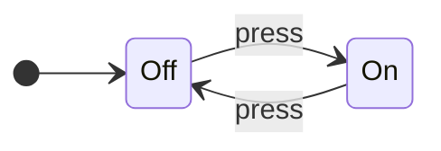
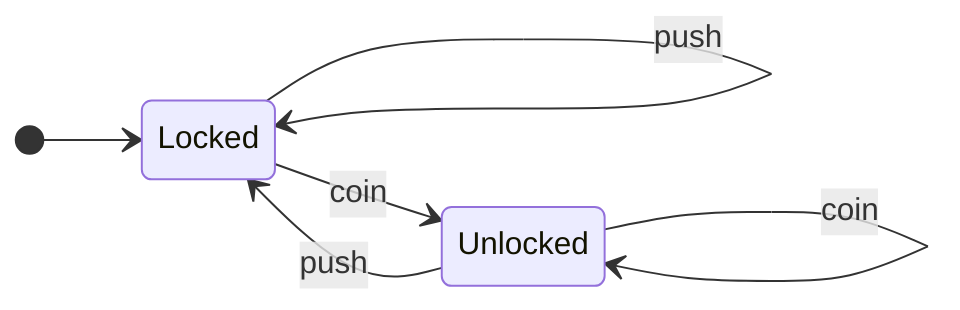
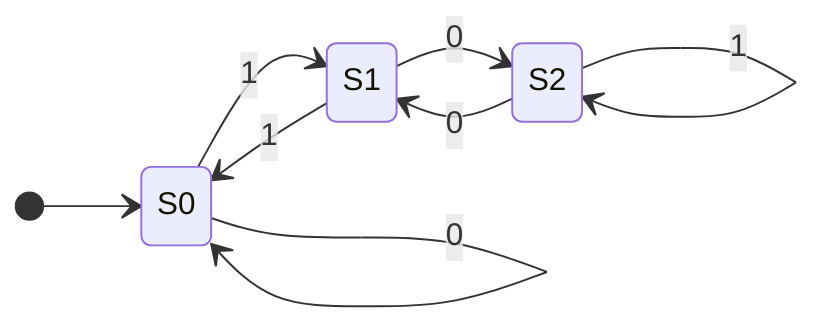
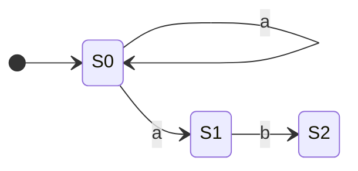
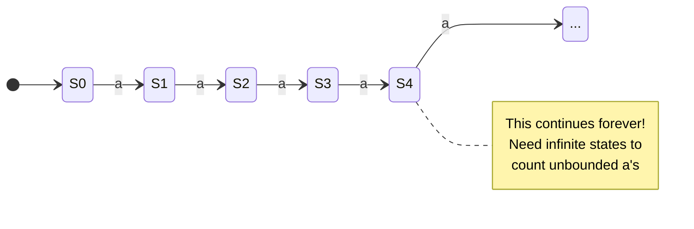

# Finite State Machines (FSMs)

You've written authentication flows that move users through states: unauthenticated → logging in → authenticated → session expired. You've read TCP connection states in debugging output: `LISTEN`, `SYN_SENT`, `ESTABLISHED`, `CLOSE_WAIT`. You've built form validation that changes behavior based on whether input is empty, invalid, or valid. All of these are implementations of the same theoretical model.

**This is that model.**

A Finite State Machine is a formal model of computation that describes any system which moves through a fixed set of states based on inputs. Understanding FSMs formally gives you a precise vocabulary for designing state-dependent systems — and explains why regex engines, lexers, and network protocols work the way they do.

Understanding FSMs requires [computational thinking](computational_thinking.md): **decomposing** systems into states, **recognizing patterns** in transitions, **abstracting** away implementation details, and **designing algorithms** to process inputs.

!!! info "Learning Objectives"

    By the end of this article, you'll be able to:

    - Define an FSM using the formal 5-tuple: states, alphabet, transition function, initial state, and accepting states
    - Design an FSM from a prose description of a system's behavior
    - Distinguish deterministic (DFA) from non-deterministic (NFA) finite automata and explain the tradeoffs
    - Implement an FSM in code and explain why explicit state machines improve testability
    - Identify what FSMs cannot do — and why that boundary matters for regex and parsers

## Where You've Seen This

FSMs appear throughout production software:

- **TCP/IP protocol** — every TCP connection moves through states (`LISTEN` → `SYN_RECEIVED` → `ESTABLISHED` → `FIN_WAIT` → `CLOSED`). The Linux kernel's TCP implementation is essentially one large FSM
- **Regex engines** — every regular expression compiles to an FSM internally. This is why regex matching is fast: it's a single linear pass through an FSM, not recursive backtracking (usually)
- **Lexers** — the first stage of every compiler or parser breaks source text into tokens using FSMs. Each token type (identifier, number, string literal) is recognized by a state machine
- **Authentication flows** — unauthenticated → authenticating → authenticated → expired → locked is a classic FSM. Implementing it explicitly prevents bugs like "how did a locked user end up in the authenticated state?"
- **Game AI** — enemies with patrol → alert → attack → retreat states; game characters with idle → running → jumping → falling states
- **Network protocols** — HTTP, SMTP, FTP, WebSockets all define state machines for connection lifecycle

## What is a Finite State Machine?

A Finite State Machine is an abstract model of computation that:

- Has a finite number of **states** (hence the name)
- Starts in an **initial state**
- **Transitions** between states based on inputs
- May have one or more **accepting states** (success!)

That's it. No infinite memory, no complex calculations—just states and transitions.



This is an FSM for a light switch. Two states (On, Off), one input (press), deterministic behavior. Simple, but powerful.

## Formal Definition

For the mathematically inclined, an FSM is a 5-tuple \((Q, \Sigma, \delta, q_0, F)\):

| Symbol | Meaning |
|:-------|:--------|
| \(Q\) | Finite set of states |
| \(\Sigma\) | Finite alphabet (possible inputs) |
| \(\delta\) | Transition function \((state \times input \to state)\) |
| \(q_0\) | Initial state |
| \(F\) | Set of accepting/final states |

Don't worry if that looks intimidating—we'll work with diagrams.

## Example: Turnstile

A classic FSM example is a subway turnstile:



**States:** Locked, Unlocked

**Inputs:** coin, push

**Behavior:**

- Start Locked
- Insert coin → Unlocked
- Push while Unlocked → Locked (you go through)
- Push while Locked → stays Locked (nothing happens)
- Insert coin while Unlocked → stays Unlocked (thanks for the extra money! 💰)

This is a complete specification of turnstile behavior. No ambiguity.

## Example: Validating Binary Numbers Divisible by 3

Here's where FSMs get interesting. Can we build a machine that accepts binary numbers divisible by 3?



**Formal Definition of this FSM:**

- \(Q = \{S0, S1, S2\}
- \(\Sigma = \{0, 1\}
- \(q_0 = S0
- \(F = \{S0\}
- \(\delta\) is defined by the following table:

| State | Input '0' | Input '1' |
|:------|:----------|:----------|
| **S0**| S0        | S1        |
| **S1**| S2        | S0        |
| **S2**| S1        | S2        |

**States represent remainders when dividing by 3:**

- S0 = remainder 0 (divisible by 3!)
- S1 = remainder 1
- S2 = remainder 2

**Trace through "110" (binary for 6):**

1. Start at S0 (remainder 0)
2. Read '1': move to S1 (1 mod 3 = 1)
3. Read '1': move to S0 (3 mod 3 = 0)
4. Read '0': stay at S0 (6 mod 3 = 0)
5. End at S0 — accept! 6 is divisible by 3. ✓

??? tip "Try It Yourself"

    Trace "101" (binary for 5). Does it end in an accepting state?

    What about "1001" (binary for 9)?

## Deterministic vs Non-Deterministic

### Deterministic FSM (DFA)

Every state has exactly one transition for each input. Given a state and input, you *always* know where to go next.

### Non-Deterministic FSM (NFA)

A state might have:

- Multiple transitions for the same input
- Transitions on "ε" (epsilon) — moving without consuming input
- No transition for some inputs



From S0, reading 'a' could go to S0 *or* S1. Non-deterministic!

**The magic:** NFAs and DFAs are equally powerful. Any NFA can be converted to an equivalent DFA (though the DFA might have more states). NFAs are often easier to design; DFAs are easier to implement. Best of both worlds! ✨

## FSMs and Regular Languages

### What's a "Language" in Computer Science?

A language is simply a set of valid strings. Examples:

- "All strings that start with 'a' and end with 'b'"
- "All valid email addresses"
- "All binary numbers divisible by 3"
- "All strings with balanced parentheses"

### What Does "Recognize" Mean?

An FSM "recognizes" a language if it can correctly accept valid strings (ending in an accepting state) and reject invalid ones (ending in a non-accepting state). The FSM is essentially a validator—give it a string, and it tells you whether it belongs to the language.

### The Fundamental Equivalence

FSMs recognize exactly the **regular languages**—the same languages described by regular expressions. This isn't a coincidence. These three formalisms describe **exactly the same class of languages:**

| Formalism | Description |
|:----------|:------------|
| FSM (DFA/NFA) | State diagrams |
| Regular Expression | Pattern syntax (`a*b+`) |
| Regular Grammar | Production rules |

**Practical meaning:** If you can write a regex for something, you can build an FSM for it, and vice versa. They're two different notations for the **exact same thing**.

### Examples: Regular vs. Not Regular

✅ **Regular languages** (FSM ✓, Regex ✓):

- "Strings with even number of a's" — Regex: `(b*ab*ab*)*`
- "Strings ending with '.com'" — Regex: `.*\.com`
- "Binary numbers divisible by 3" — (we built this FSM earlier!)

❌ **Not regular languages** (FSM ✗, Regex ✗):

- "Same number of a's and b's" — needs counting/memory
- "Balanced parentheses" — needs a stack to track nesting
- \(a^nb^n\) (equal a's and b's) — needs unbounded counting

### What FSMs *Cannot* Do

FSMs have no memory beyond their current state. This means they can't:

- Count unbounded quantities ("same number of a's and b's")
- Match nested structures (balanced parentheses)
- Remember arbitrary history

**Example: The "Equal A's and B's" Language**

The language \(\ L = \{a^nb^n \mid n \geq 0\} \) is NOT regular. This notation means "n a's followed by n b's, where n is any number 0 or greater":

- When n=0: "" (empty string)
- When n=1: "ab"
- When n=2: "aabb"
- When n=3: "aaabbb"
- When n=100: 100 a's followed by 100 b's

**Why FSMs Can't Handle This:**

To validate these strings, you'd need to:

1. Count the a's: "I saw 5 a's"
2. **Remember that count**: "I need to see exactly 5 b's"
3. Count the b's and compare: "1... 2... 3... 4... 5... match!"

FSMs can't do step 2. To remember any possible count, you'd need states like:

- state_0_as, state_1_as, state_2_as, state_3_as, ..., state_1000_as, ...

Here's what this impossible FSM would look like:



But there are **infinitely many possible counts**, and FSMs must have a **FINITE** number of states. That's the fundamental limitation.

**Contrast with "divisible by 3":** That FSM only needs 3 states (remainder 0, 1, or 2) because we track the remainder, not the actual count. The remainder is bounded—it's always 0, 1, or 2. Counting to arbitrary numbers is unbounded.

For languages requiring this kind of counting or nesting (like balanced parentheses), we need more powerful models that add memory to the state machine concept—like a call stack that tracks where we are in nested structures.

## Real-World FSMs

=== ":material-traffic-light: Traffic Light Controller"

    ```mermaid
    stateDiagram-v2
        direction LR

        [*] --> Green
        Green --> Yellow: timer
        Yellow --> Red: timer
        Red --> Green: timer
    ```

    Real traffic lights are more complex (handling multiple directions, pedestrian buttons, sensors), but the core is an FSM.

=== ":material-gamepad-variant: Video Game AI"

    Enemy behavior in many games:

    ```mermaid
    stateDiagram-v2
        direction LR

        [*] --> Patrol
        Patrol --> Chase: see_player
        Chase --> Attack: in_range
        Chase --> Patrol: lose_player
        Attack --> Chase: player_fled
        Attack --> Patrol: player_dead
    ```

    This creates believable behavior from simple rules. 🎮 Not bad for a bunch of circles and arrows.

=== ":material-network: TCP Connection"

    Network protocols are often specified as FSMs:

    ```mermaid
    stateDiagram-v2
        direction LR

        [*] --> CLOSED
        CLOSED --> LISTEN: passive_open
        CLOSED --> SYN_SENT: active_open
        LISTEN --> SYN_RCVD: recv_SYN
        SYN_SENT --> ESTABLISHED: recv_SYN_ACK
        SYN_RCVD --> ESTABLISHED: recv_ACK
        ESTABLISHED --> FIN_WAIT: close
        ESTABLISHED --> CLOSE_WAIT: recv_FIN
    ```

    (Simplified—the real TCP state diagram has more states and transitions.)

=== ":material-code-tags: Lexical Analysis"

    When a compiler reads your code, the first step is **tokenizing**—breaking the code into meaningful chunks called **tokens**.

    **Example:** The code `x = 42 + y` gets broken into tokens:

    - `x` (identifier/variable name)
    - `=` (operator)
    - `42` (number)
    - `+` (operator)
    - `y` (identifier/variable name)

    Compilers use FSMs to recognize different token types. Here are two FSMs—one for **numbers**, one for **identifiers** (variable/function names):

    ??? tip "State Names"

        The state names like "InNumber" and "InIdentifier" are descriptive labels that tell us what the FSM is currently doing:

        - **InNumber** = "currently in the middle of reading a number"
        - **InIdentifier** = "currently in the middle of reading an identifier"

        Just like "Locked/Unlocked" for a turnstile, these names help us understand what's happening in each state.

    **Recognizing Numbers:**

    ```mermaid
    stateDiagram-v2
        direction LR

        [*] --> Start
        Start --> InNumber: digit (0-9)
        InNumber --> InNumber: digit
        InNumber --> [*]: space/operator
    ```

    **Recognizing Identifiers:**

    ```mermaid
    stateDiagram-v2
        direction LR

        [*] --> Start
        Start --> InIdentifier: letter (a-z)
        InIdentifier --> InIdentifier: letter/digit
        InIdentifier --> [*]: space/operator
    ```

    **How it works:**

    - See a **digit** (0-9) first → InNumber state, keep reading digits until hitting something else (space, operator, etc.) → emit a number token
    - See a **letter** (a-z, A-Z) first → InIdentifier state, keep reading letters/digits until hitting something else → emit an identifier token

    **Example trace for `x42`:**

    1. Start state
    2. See 'x' (letter) → InIdentifier
    3. See '4' (digit, allowed in identifiers) → stay InIdentifier
    4. See '2' (digit) → stay InIdentifier
    5. See space → done, emit identifier token `x42`

    This is how compilers turn source code text into structured tokens for parsing!

## Why This Matters for Production Code

FSMs aren't just a theoretical curiosity — they're a practical design tool.

**Explicit state machines prevent impossible states.** If you model an order's lifecycle as an FSM (pending → paid → shipped → delivered → refunded), you can enforce that a cancelled order can never become pending again. Without an explicit model, these invalid transitions sneak in as bugs.

**FSMs are directly testable.** A state machine has a finite, enumerable set of (state, input) pairs. You can write a test for every valid transition and every invalid one. Compare this to implicit state scattered across boolean flags (`isLoggedIn`, `isLoading`, `hasError`) — testing all combinations becomes exponential.

**ReDoS attacks exploit FSM backtracking.** Certain regex patterns compile to non-deterministic FSMs that backtrack exponentially on crafted inputs. Cloudflare had a major outage in 2019 caused by exactly this. Understanding that regex engines are FSMs explains why `(a+)+` matching against `"aaaaaaaaab"` can hang a server.

**Lexers are FSMs.** The first stage of every compiler — tokenization — uses FSMs to scan source code. Understanding this explains lexer performance characteristics and why some patterns are tokenized in one pass.

## Technical Interview Context

FSMs appear in system design interviews as state modeling problems, and in lower-level discussions about regex engines and protocol parsers.

**Questions you'll be able to answer:**

- *"Design the state model for a payment / order / user account lifecycle"* — This is an FSM problem whether or not the interviewer uses that term. Define the states, enumerate valid transitions, and sketch a transition table. The exercise of drawing it out prevents invalid state combinations from creeping into the implementation.
- *"How would you enforce that a cancelled order can't become pending again?"* — Explicit FSM: only permit transitions that appear in the transition table; reject all others. Contrast this with implicit state scattered across boolean flags, where invalid transitions happen when conditions are checked out of order.
- *"How does a regex engine work?"* — A regex pattern compiles to a finite automaton (NFA or DFA). The engine reads input characters and follows state transitions; acceptance means the string matched. This is why regex is fast for simple patterns and why certain patterns cause exponential blowup on adversarial input.
- *"Why can't a regex match balanced parentheses?"* — FSMs have no memory beyond their current state — they cannot count. Matching arbitrary nesting requires a stack (pushdown automaton), which is a more powerful computational model than an FSM.

## Beyond FSMs: Adding Memory

While FSMs are powerful for many tasks, they hit a fundamental limitation: they can't count or handle nested structures. More powerful computational models extend FSMs by adding memory:

| Feature | FSM | Extended Models |
|:--------|:----|:----------------|
| Memory | Current state only | State + stack/tape |
| Power | Regular languages | Context-free & beyond |
| Recursion | No | Yes |
| Nesting | Can't handle | Handles naturally |
| Simplicity | Simpler | More powerful |

These extended models essentially add a stack or other memory structure to track nesting depth, enabling recognition of nested structures like parentheses, HTML tags, and programming language syntax.

## Implementing an FSM

FSMs translate directly into code. Here's a turnstile implementation:

=== ":material-language-python: Python - Class-Based"

    ```python title="Turnstile FSM in Python" linenums="1"
    class Turnstile:
        def __init__(self):
            self.state = "locked"  # (1)!

        def transition(self, input):  # (2)!
            if self.state == "locked":  # (3)!
                if input == "coin":
                    self.state = "unlocked"  # (4)!
                # push while locked: stay locked

            elif self.state == "unlocked":
                if input == "push":
                    self.state = "locked"  # (5)!
                # coin while unlocked: stay unlocked

            return self.state

    # Usage
    t = Turnstile()
    print(t.transition("push"))   # locked
    print(t.transition("coin"))   # unlocked
    print(t.transition("push"))   # locked
    ```

    1. Initial state - turnstile starts locked
    2. Process an input event and transition to next state
    3. Check current state to determine which transitions are valid
    4. Transition from locked to unlocked when coin inserted
    5. Transition from unlocked to locked when pushed

=== ":material-language-javascript: JavaScript - Class-Based"

    ```javascript title="Turnstile FSM in JavaScript" linenums="1"
    class Turnstile {
        constructor() {  // (1)!
            this.state = "locked";  // (2)!
        }

        transition(input) {
            if (this.state === "locked") {  // (3)!
                if (input === "coin") {
                    this.state = "unlocked";
                }
                // push while locked: stay locked
            } else if (this.state === "unlocked") {
                if (input === "push") {
                    this.state = "locked";
                }
                // coin while unlocked: stay unlocked
            }

            return this.state;  // (4)!
        }
    }

    // Usage
    const t = new Turnstile();
    console.log(t.transition("push"));   // locked
    console.log(t.transition("coin"));   // unlocked
    console.log(t.transition("push"));   // locked
    ```

    1. Constructor method called automatically when creating new instance with `new`
    2. Instance property using `this` - each Turnstile object has its own state
    3. Use strict equality `===` for string comparison (preferred over `==` in JavaScript)
    4. Return current state after transition for convenient chaining and logging

=== ":material-language-go: Go - Class-Based"

    ```go title="Turnstile FSM in Go" linenums="1"
    package main

    import "fmt"

    type Turnstile struct {  // (1)!
        state string
    }

    func NewTurnstile() *Turnstile {  // (2)!
        return &Turnstile{state: "locked"}  // (3)!
    }

    func (t *Turnstile) Transition(input string) string {  // (4)!
        if t.state == "locked" {
            if input == "coin" {
                t.state = "unlocked"
            }
            // push while locked: stay locked
        } else if t.state == "unlocked" {
            if input == "push" {
                t.state = "locked"
            }
            // coin while unlocked: stay unlocked
        }

        return t.state
    }

    func main() {
        t := NewTurnstile()
        fmt.Println(t.Transition("push"))   // locked
        fmt.Println(t.Transition("coin"))   // unlocked
        fmt.Println(t.Transition("push"))   // locked
    }
    ```

    1. Define struct type - Go's way of grouping data (like a class without inheritance)
    2. Constructor function pattern - Go convention to prefix with "New" and return pointer
    3. Return address (&) of struct initialized with field syntax
    4. Method with pointer receiver (*Turnstile) - allows modifying the struct's state

=== ":material-language-rust: Rust - Class-Based"

    ```rust title="Turnstile FSM in Rust" linenums="1"
    #[derive(Debug)]  // (1)!
    enum State {  // (2)!
        Locked,
        Unlocked,
    }

    struct Turnstile {
        state: State,
    }

    impl Turnstile {
        fn new() -> Self {
            Turnstile { state: State::Locked }
        }

        fn transition(&mut self, input: &str) -> &State {  // (3)!
            match (&self.state, input) {  // (4)!
                (State::Locked, "coin") => self.state = State::Unlocked,
                (State::Unlocked, "push") => self.state = State::Locked,
                _ => {}  // (5)!
            }

            &self.state  // (6)!
        }
    }

    fn main() {
        let mut t = Turnstile::new();
        println!("{:?}", t.transition("push"));   // Locked
        println!("{:?}", t.transition("coin"));   // Unlocked
        println!("{:?}", t.transition("push"));   // Locked
    }
    ```

    1. Derive Debug trait to enable printing State values with `{:?}` format
    2. Enum for type-safe states - compiler ensures only Locked or Unlocked exist
    3. Mutable reference (&mut) required to modify state; return immutable reference
    4. Match on tuple (state, input) - Rust's powerful pattern matching handles all cases
    5. Wildcard pattern `_` matches any unhandled case (no transition, stay in current state)
    6. Return reference to internal state (borrowing, not transferring ownership)

=== ":material-language-java: Java - Class-Based"

    ```java title="Turnstile FSM in Java" linenums="1"
    public class Turnstile {
        private String state;  // (1)!

        public Turnstile() {  // (2)!
            this.state = "locked";
        }

        public String transition(String input) {
            if (state.equals("locked")) {  // (3)!
                if (input.equals("coin")) {
                    state = "unlocked";
                }
                // push while locked: stay locked
            } else if (state.equals("unlocked")) {
                if (input.equals("push")) {
                    state = "locked";
                }
                // coin while unlocked: stay unlocked
            }

            return state;
        }

        public static void main(String[] args) {
            Turnstile t = new Turnstile();
            System.out.println(t.transition("push"));   // locked
            System.out.println(t.transition("coin"));   // unlocked
            System.out.println(t.transition("push"));   // locked
        }
    }
    ```

    1. Private field with public methods (encapsulation) - standard Java pattern
    2. Constructor with same name as class - initializes state
    3. Use `.equals()` for string comparison (not `==` which compares references)

=== ":material-language-cpp: C++ - Class-Based"

    ```cpp title="Turnstile FSM in C++" linenums="1"
    #include <iostream>
    #include <string>

    class Turnstile {
    private:
        std::string state;

    public:
        Turnstile() : state("locked") {}  // (1)!

        std::string transition(const std::string& input) {  // (2)!
            if (state == "locked") {  // (3)!
                if (input == "coin") {
                    state = "unlocked";
                }
                // push while locked: stay locked
            } else if (state == "unlocked") {
                if (input == "push") {
                    state = "locked";
                }
                // coin while unlocked: stay unlocked
            }

            return state;
        }
    };

    int main() {
        Turnstile t;
        std::cout << t.transition("push") << std::endl;   // locked
        std::cout << t.transition("coin") << std::endl;   // unlocked
        std::cout << t.transition("push") << std::endl;   // locked
        return 0;
    }
    ```

    1. Initializer list - more efficient than assignment in constructor body
    2. Pass string by const reference to avoid copying (performance optimization)
    3. C++ allows `==` for string comparison (std::string overloads the operator)

For complex FSMs with many states, a transition table (dictionary/map keyed on `(state, input)`) scales better than nested conditionals — the logic stays data rather than code.

## Practice Problems

??? question "Practice Problem 1: Design an FSM"

    Create an FSM that accepts strings over {a, b} that contain an even number of a's.

    Hint: How many states do you need? What do they represent?

    ??? tip "Solution"

        **Two states are sufficient:**

        - **S0** (initial, accepting) — even number of `a`s seen so far (including zero)
        - **S1** — odd number of `a`s seen so far

        **Transitions:**

        - `a` toggles between states: S0 → S1, S1 → S0
        - `b` keeps you in the same state: S0 → S0, S1 → S1

        ```mermaid
        stateDiagram-v2
            direction LR
            [*] --> S0
            S0 --> S1 : a
            S1 --> S0 : a
            S0 --> S0 : b
            S1 --> S1 : b
            S0 --> [*]
        ```

        **Trace for `"abba"`:** S0 →(a)→ S1 →(b)→ S1 →(b)→ S1 →(a)→ S0. Accepted ✓

        **Trace for `"aba"`:** S0 →(a)→ S1 →(b)→ S1 →(a)→ S0. Wait — S0 is accepting, so this is accepted. But "aba" has 2 a's, which is even. Correct ✓

        **Key insight:** You never need to count the actual *number* of a's — only the *parity* (even or odd). Two states perfectly capture parity. This is a general pattern: if you only care about a value modulo N, you need exactly N states.

??? question "Practice Problem 2: Vending Machine"

    Design an FSM for a vending machine that:

    - Accepts nickels (5¢), dimes (10¢), and quarters (25¢)
    - Dispenses when total reaches 30¢ or more
    - Returns to start after dispensing

    What are your states? (Hint: think about accumulated amounts)

    ??? tip "Solution"

        **States represent accumulated amounts:** S0, S5, S10, S15, S20, S25, plus DISPENSE (accepting).

        | From | Nickel (+5¢) | Dime (+10¢) | Quarter (+25¢) |
        |:-----|:------------|:------------|:---------------|
        | S0 | S5 | S10 | S25 |
        | S5 | S10 | S15 | DISPENSE |
        | S10 | S15 | S20 | DISPENSE |
        | S15 | S20 | S25 | DISPENSE |
        | S20 | S25 | DISPENSE | DISPENSE |
        | S25 | DISPENSE | DISPENSE | DISPENSE |
        | DISPENSE | S0 | S0 | S0 |

        DISPENSE is the accepting state. It automatically transitions back to S0 after dispensing — no change is returned in this model (a common simplification).

        **Why this works:** The possible accumulated amounts are finite and bounded (0¢ to 25¢ before dispensing). The FSM has exactly enough states to track each amount. This is the FSM sweet spot: finite, bounded state space, where each state has a clear meaning.

        **Why it wouldn't work for a different design:** If the machine returned exact change, you'd need to track arbitrary amounts — potentially unbounded. That would require infinite states, which violates the FSM definition.

??? question "Practice Problem 3: Prove It's Not Regular"

    The language \( L = \{a^nb^n \mid n \geq 0\} \) is not regular.

    Try to design an FSM for it. Where do you get stuck?
    What would you need that an FSM doesn't have?

    ??? tip "Solution"

        **Where you get stuck:**

        To build the FSM, you'd need one state for "seen 0 a's," another for "seen 1 a," another for "seen 2 a's," and so on — because you must remember exactly how many a's you saw in order to accept the same number of b's. Since `n` is unbounded, you'd need an infinite number of states. FSMs have a *finite* state count by definition. The construction fails.

        **What you'd need that FSMs don't have:** A counter — memory that grows with the input. An FSM's only memory is its current state, which is fixed at design time. A **pushdown automaton** (PDA) — an FSM extended with a stack — can solve this: push one symbol per `a`, then pop one per `b`. When the stack is empty after all the b's, accept.

        **Formal argument (Pumping Lemma sketch):** Suppose `L` were regular with pump length `p`. Consider the string `a^p b^p`. The pump substring must fall entirely within the a's (at the start). Repeating the pump — pumping up — produces `a^{p+k} b^p` for some `k > 0`. This string is not in `L` because it has more a's than b's. Contradiction. Therefore `L` is not regular.

        **Why this matters in practice:** `{a^n b^n}` is the canonical example of why regex cannot match balanced parentheses or validate matching XML/HTML tags. Those structures require counting depth, which requires a stack — which is exactly what parsers provide.

## Key Takeaways

| Concept | Meaning |
|:--------|:--------|
| **State** | A configuration the machine can be in |
| **Transition** | Rule for moving between states |
| **Initial State** | Where computation begins |
| **Accepting State** | Success! Input is valid |
| **DFA** | Deterministic — one transition per input |
| **NFA** | Non-deterministic — multiple options possible |
| **Regular Language** | What FSMs can recognize |

## Further Reading

**On This Site**

- [Regular Expressions: The Formal Model](regular_expressions.md) — How regex patterns compile to automata, why backtracking causes ReDoS, and what regex cannot match

---

FSMs are the "hello world" of computation theory — simple enough to fully understand, powerful enough to be genuinely useful. They're also a practical engineering tool: making state explicit, transitions enumerable, and behavior testable. When a system's complexity comes from the number of states rather than the logic within each state, an FSM is usually the right model.
