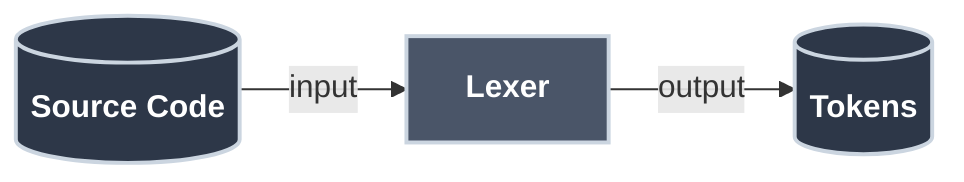
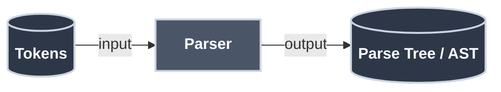
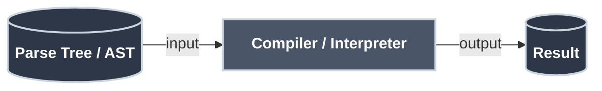
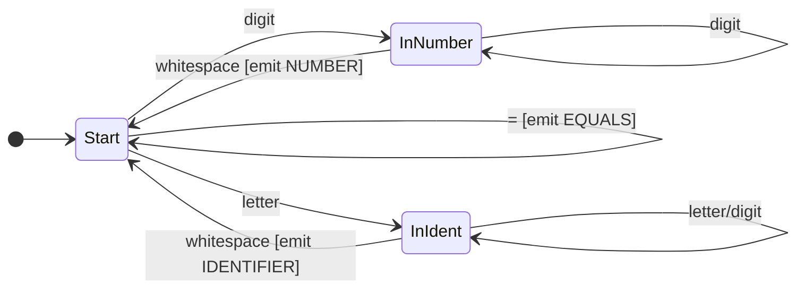

# How Parsers Work

Every time you call `json.loads()`, `yaml.safe_load()`, or `JSON.parse()`, a parser runs. Every time Python reports `SyntaxError: unexpected indent` or Go says `syntax error: unexpected {`, a parser has analyzed your code and found the exact point where it stopped making sense. Every SQL query you write is parsed before it touches a database.

**Parsers are everywhere in your stack — and understanding how they work makes you better at every tool built on top of one.**

Parsing is the process of analyzing text according to a formal grammar. It's how Python knows that `print("hello")` is valid but `print("hello` isn't. It's how browsers turn HTML into a DOM tree. It's how your config files become data structures your code can use.

!!! info "Learning Objectives"

    By the end of this article, you'll be able to:

    - Explain the two-phase pipeline: lexing (tokenizing raw text) then parsing (building a tree)
    - Read a grammar rule and trace how a recursive descent parser uses it to process input
    - Distinguish a concrete syntax tree from an abstract syntax tree (AST)
    - Implement a simple recursive descent parser for arithmetic expressions
    - Explain how operator precedence is encoded in grammar structure — not as special-case logic

## Where You've Seen This

Parsers run constantly behind the scenes in your daily work:

- **Language runtimes** — Python, Go, Node.js, the JVM all parse your source code before executing it
- **JSON and YAML** — `json.loads()`, `yaml.safe_load()`, `JSON.parse()` are all parser calls
- **SQL** — every query goes through a parser before the query planner optimizes it
- **HTML/DOM** — browsers parse HTML into a tree structure; `BeautifulSoup` wraps a parser
- **Template engines** — Jinja2, Handlebars, Helm charts all parse template syntax
- **Config formats** — Docker Compose, Kubernetes manifests, Terraform HCL, `.toml` files
- **GraphQL** — every incoming query is parsed against the schema grammar
- **Your IDE** — syntax highlighting, autocomplete, and linting all use parsers in real time

## Why This Matters for Production Code

=== ":material-code-braces: Language Runtimes"

    Every `SyntaxError: unexpected indent` or `unexpected token` message comes from a parser. The line and column numbers pinpoint exactly where the parser was in the input stream when it failed. Run `python -m ast your_file.py` to print the full parse tree for any Python file — the same structure the runtime uses to execute your code.

    Understanding parsers means understanding what your error messages are actually telling you.

=== ":material-file-cog: Config File Formats"

    YAML, JSON, TOML, HCL, XML — every configuration format in your infrastructure stack is parsed on every deployment. Docker Compose, Kubernetes manifests, Terraform, Helm charts all go through parsers before they do anything. When Kubernetes rejects your manifest with a YAML parsing error, you've violated the grammar.

    The error message quality (and your ability to read it) depends on understanding what a parser does with your input.

=== ":material-database: Query Languages"

    Every SQL query is parsed before it touches a database. The query planner that decides whether to use an index or a full table scan operates on the parsed AST. GraphQL servers parse every incoming query against the schema grammar. ORMs generate SQL strings that get parsed again on the database side.

    Understanding parsers explains why query structure matters and why parameterized queries are safer than string interpolation.

=== ":material-shield: Security Boundaries"

    SQL injection, XSS, and template injection attacks all exploit the gap between what a developer thinks a parser will do with input and what it actually does. The parser boundary — where input transitions from data to structure — is where these vulnerabilities live.

    Parameterized queries work because they keep user input outside the parse boundary. Understanding parsers is foundational to writing code that handles untrusted input safely.

## Why Is Parsing Necessary?

Computers can't directly understand text—not even simple code like `x = 2 + 3`. Here's why parsing is essential:

**The Problem: Text is ambiguous and unstructured**

When you write `2 + 3 * 4`, you know multiplication happens first. But to a computer, it's just a string: `"2 + 3 * 4"`. How does it know:

- What's an operator vs. a number?
- Which operation happens first?
- Whether the syntax is valid?
- How to represent nested structures like `f(g(x))`?

**What Happens Without Parsing?**

Imagine trying to execute code directly from text:

- `"x = 2 + 3 * 4"` - Which `+` or `*` do you do first?
- `"if (x > 5) print(x)"` - Where does the condition end and the body begin?
- `"func(a, b)"` - How do you know `func` is a function call and `a, b` are arguments?

You'd need custom logic for every possible code pattern. It's chaos.

**The Solution: Structured Representation**

Parsing transforms unstructured text into a **tree structure** that:

1. ✓ Validates syntax ("Is this valid code?")
2. ✓ Captures meaning ("What operations are being done?")
3. ✓ Shows relationships ("Which operations happen first?")
4. ✓ Enables execution ("Now I can evaluate/compile this!")

Without parsing, you can't compile, execute, or even validate code. It's the bridge between human-readable text and computer-executable instructions.

## The Big Picture

When a compiler or interpreter processes your code, it goes through three stages:

**Step 1: Lexical Analysis**


**Step 2: Parsing**


**Step 3: Compilation/Interpretation**


| Stage | Input | Output | What It Does |
|:------|:------|:-------|:-------------|
| **Lexer** | Source Code | Tokens | Breaks text into meaningful chunks<br/>Example: `"x = 42"` → `[ID:x, EQUALS, NUM:42]` |
| **Parser** | Tokens | Parse Tree / AST | Builds a tree structure from tokens<br/>Example: Tokens → Tree with assignment node |
| **Compiler/Interpreter** | Parse Tree / AST | Result | Executes or compiles the tree<br/>Example: Tree → machine code or output |

!!! info "What is AST?"

    **AST** stands for **Abstract Syntax Tree** - a simplified tree structure representing the code's meaning and structure, without unnecessary syntax details. More details below!

We'll focus on the first two stages: lexing and parsing.

## Stage 1: Lexical Analysis (Lexing)

The **lexer** (or tokenizer) breaks raw text into meaningful chunks called **tokens**. It's like turning a stream of characters into a stream of words.

### What Tokens Look Like

For the expression `total = price * 2 + tax`:

| Token Type | Value |
|:-----------|:------|
| IDENTIFIER | "total" |
| EQUALS | "=" |
| IDENTIFIER | "price" |
| STAR | "*" |
| NUMBER | "2" |
| PLUS | "+" |
| IDENTIFIER | "tax" |

The lexer doesn't understand grammar — it just recognizes patterns. "Is this a number? A keyword? An operator?" That's all it asks. Simple creature, the lexer.

### Lexer Implementation

Lexers are typically implemented as [Finite State Machines](finite_state_machines.md) and use [Regular Expressions](regular_expressions.md) to define token patterns:



This produces a **list of tokens**, where each token is a tuple of `(TOKEN_TYPE, VALUE)`. The lexer has broken the input string into meaningful pieces that the parser can work with.

## Stage 2: Parsing

The **parser** takes tokens and builds a structured representation—usually a tree—according to the grammar rules.

### Why Trees?

A flat list of tokens doesn't capture the **structure** and **relationships** in code. Consider `2 + 3 * 4`:

- As tokens: `[NUM:2, PLUS, NUM:3, STAR, NUM:4]` - just a flat sequence
- As a tree: Shows that `3 * 4` happens first (nested deeper), then `2 +` the result

Trees naturally represent:

1. **Operator precedence**: Deeper operations execute first (`*` before `+`)
2. **Hierarchical structure**: Nested expressions, function calls, code blocks
3. **Grammar rules**: Each tree node represents a grammar rule being applied
4. **Evaluation order**: Walk the tree to know what to compute when

Without a tree, you'd need complex logic to figure out "which operation happens first?" The tree makes it obvious—start at the leaves, work up to the root.

??? tip "Connection to BNF and RTN"

    BNF and RTN are grammar notations that formally **describe** valid syntax. The parser uses those rules to **build** the tree:

    - **Each BNF rule becomes a tree node**: When the parser applies `<expression> ::= <term> "+" <term>`, it creates an expression node with two term children
    - **RTN paths trace tree construction**: Following an RTN from start to end corresponds to building a subtree
    - **Recursion in grammar = Recursion in tree**: Nested expressions in code become nested nodes in the tree

    The grammar is the blueprint; the tree is the structure built from that blueprint. The parser is the construction worker following the plans. See the Mastery section for the full formal treatment of grammars.

### Parse Trees vs Abstract Syntax Trees

**Parse Tree (Concrete Syntax Tree):** Shows every grammar rule applied.

**Abstract Syntax Tree (AST):** Simplified tree focusing on meaning, not syntax.

For `2 + 3 * 4`:

```text title="Concrete Syntax Tree"
         Expression
              |
    +---------+---------+
    |         |         |
  Term       '+'      Term
    |                   |
  Factor        +-------+-------+
    |           |       |       |
   '2'        Term     '*'   Factor
               |
            Factor              '4'
               |
              '3'
```

```text title="Abstract Syntax Tree"
        +
       / \
      2   *
         / \
        3   4
```

The AST is what most compilers actually work with.

!!! tip "Scheme: Where Parse Tree = AST"
    In Scheme & Parse Trees, you'll see a language where the written code *is* the AST. Because Scheme uses prefix notation with explicit parentheses `(+ 1 (* 2 3))`, there is no ambiguity, and the parse tree matches the code structure 1:1.

!!! info "Why ASTs Drop Punctuation"

    Notice how the AST doesn't include parentheses, commas, or semicolons? That's intentional. Once you've parsed the code and built the tree structure, punctuation has served its purpose—it told the parser how to group things.

    **What gets dropped:**
    - Parentheses `()` - the tree structure already shows grouping
    - Commas `,` - already represented as multiple children
    - Semicolons `;` - just statement separators, not meaningful after parsing
    - Keywords like `then`, `do` - the tree node type already captures the meaning

    **What gets kept:**
    - Operators `+`, `-`, `*` - needed to know which operation to perform
    - Literals `42`, `"hello"` - the actual values
    - Identifiers `x`, `foo` - variable and function names

    The AST keeps only what's needed for execution or compilation. This makes it smaller and easier to work with than the full parse tree.

??? tip "SQL Execution Plans: A Related Concept"

    If you've worked with databases, you might recognize tree structures from SQL execution plans. They're related but different:

    **Parse Tree/AST** (what parsers build):
    - Represents the **syntactic structure** of the code
    - Shows what the query *means* grammatically
    - Created during parsing (before execution)

    **Execution Plan** (what query optimizers build):
    - Represents the **execution strategy** for running the query
    - Shows *how* to efficiently execute the query (which indexes, join order, etc.)
    - Created after parsing, during query optimization

    The full pipeline is: `SQL text → Lexer → Parser → AST → Query Optimizer → Execution Plan → Results`

    When database administrators tune queries by examining execution plans, they're looking at a tree structure that comes *after* parsing—it's the optimized plan for executing the already-parsed query. Both are trees showing hierarchical operations, but the AST captures syntax while the execution plan captures runtime strategy.

## Grammar Ambiguity

Some grammars are **ambiguous**—they allow multiple valid parse trees for the same input. This is a problem because the program's meaning becomes unclear.

### The Classic Example: Dangling Else

Consider this grammar for if-statements:

```bnf title="Ambiguous If-Statement Grammar" linenums="1"
<statement> ::= <if-statement> | <other>
<if-statement> ::= "if" <condition> "then" <statement>
                 | "if" <condition> "then" <statement> "else" <statement>
```

Now parse this code:

```
if a then if b then x else y
```

**Two valid parse trees exist:**

**Interpretation 1:** The `else` belongs to the inner `if`:
```
if a then (if b then x else y)
```

**Interpretation 2:** The `else` belongs to the outer `if`:
```
if a then (if b then x) else y
```

Both are valid according to the grammar! This is the **Dangling Else** problem.

### How Languages Solve It

Most languages resolve this through **precedence rules**:

1. **Convention**: The `else` matches the nearest unmatched `if` (Interpretation 1)
2. **Require explicit delimiters**: Python uses indentation; C uses braces `{ }`
3. **Require `end` keywords**: Pascal and Ada make all blocks explicit

### Why Ambiguity Matters for Parsing

- **Parsers must make choices**: When faced with ambiguity, the parser picks one interpretation (usually via precedence rules)
- **Different parsers might choose differently**: Without explicit rules, two implementations could parse the same code differently
- **Grammar design is crucial**: Good language design avoids ambiguity through careful grammar construction

**Key insight:** Ambiguity is a property of the **grammar**, not the parser. A well-designed grammar eliminates ambiguity before parsing begins.

## Parsing Strategies

Not all grammars are equally easy to parse, and different approaches have different trade-offs. Think of parsing strategies like different tools in a toolbox—a hammer for some jobs, a screwdriver for others.

### Choosing Your Approach

**Why Different Strategies?**

Different parsing strategies exist because:

1. **Grammar constraints**: Some grammars are ambiguous or have features (like left-recursion) that break certain parsing approaches
2. **Implementation complexity**: Hand-written parsers need simplicity; generated parsers can be more complex
3. **Error handling**: Some strategies give better error messages than others
4. **Performance**: Different strategies have different speed and memory characteristics
5. **Parsing power**: Some strategies can handle more complex grammars than others

**Which Strategy Should You Use?**

| Situation | Recommended Strategy | Why? |
|:----------|:--------------------|:-----|
| **Writing by hand** | Top-down (Recursive Descent) | Easy to understand, maps directly to grammar, good error messages |
| **Using a parser generator** | Bottom-up (LR/LALR) | More powerful, handles more grammars, tools do the hard work |
| **Simple expressions** | Top-down | Quick to implement, sufficient for most expression grammars |
| **Complex language (C, Java)** | Bottom-up (via tool) | Handles complex grammar features, proven at scale |
| **Educational purposes** | Top-down | Easier to understand and trace execution |

For most projects: start with **recursive descent** (top-down) because it's intuitive. Only reach for more powerful strategies when you hit limitations.

**Top-down (LL) parsers** start with the goal (e.g., "program") and work down to terminals. Recursive descent is the most common variant — each grammar rule becomes a function. It's intuitive, easy to debug, and produces clear error messages.

**Bottom-up (LR) parsers** start with terminals and work up, deferring decisions until more context is available. They handle more complex grammars but are harder to write by hand. Parser generators like [YACC](https://en.wikipedia.org/wiki/Yacc) and [GNU Bison](https://www.gnu.org/software/bison/) automate the hard parts.

## Working with Parse Trees

Once you have a parse tree or AST, you need to do something with it—evaluate it, compile it, or analyze it. This section covers common operations.

### Evaluating the AST

Once you have an AST, you can walk it to compute results:

=== ":material-language-python: Python"

            ```python title="AST Evaluator in Python" linenums="1"
        def evaluate(node):  # (1)!
            if node[0] == 'number':  # (2)!
                return node[1]
    
            elif node[0] == 'binop':  # (3)!
                op, left, right = node[1], node[2], node[3]  # (4)!
                left_val = evaluate(left)  # (5)!
                right_val = evaluate(right)
    
                if op == '+': return left_val + right_val  # (6)!
                if op == '-': return left_val - right_val
                if op == '*': return left_val * right_val
                if op == '/': return left_val / right_val
    
            raise ValueError(f"Unknown node type: {node[0]}")
    
        # Using our earlier AST
        ast = ('binop', '+', ('number', 2), ('binop', '*', ('number', 3), ('number', 4)))
        print(evaluate(ast))  # 14
            ```

    1. Recursively evaluate an AST node and return its computed value
    2. Base case: if it's a number node, return its value
    3. If it's a binary operation, evaluate both operands and apply the operator
    4. Unpack the operator and operands from the tuple
    5. Recursively evaluate left and right subtrees first
    6. Apply the operator to the evaluated operands

This tree-walking interpreter is the simplest approach. Real interpreters might:

- Compile the AST to bytecode
- Optimize the tree before execution
- Generate machine code

### Error Handling

Good parsers give helpful error messages:

            ```python title="Error Handling in Parser" linenums="1"
    def consume(self, expected_type):
        token = self.current_token()
        if token is None:  # (1)!
            raise SyntaxError(f"Unexpected end of input, expected {expected_type}")
        if token[0] != expected_type:  # (2)!
            raise SyntaxError(
                f"Line {self.line}, column {self.column}: "  # (3)!
                f"Expected {expected_type}, got {token[0]} ('{token[1]}')"
            )
        self.pos += 1
        return token
            ```

1. Check if we've run out of tokens unexpectedly
2. Validate that the token type matches what we expected
3. Provide location information (line and column) for better error messages

More sophisticated parsers can:

- **Recover** from errors and continue parsing
- **Suggest** corrections ("Did you mean...?"')
- **Highlight** the exact location of the problem

## Parser Generators

Writing parsers by hand is educational, but for real projects, consider parser generators:

| Tool | Language | Grammar Style |
|:-----|:---------|:--------------|
| **[ANTLR](https://www.antlr.org/)** | Java, Python, etc. | EBNF-like |
| **[PLY](https://www.dabeaz.com/ply/)** | Python | YACC-like |
| **[Lark](https://github.com/lark-parser/lark)** | Python | EBNF |
| **[Peggy](https://peggyjs.org/)** (formerly PEG.js) | JavaScript | PEG |
| **[GNU Bison](https://www.gnu.org/software/bison/)** | C/C++ | YACC |

You write the grammar, the tool generates the parser code. Parser generators make this pattern practical for complex grammars.

**Example with Lark (Python):**

            ```python title="Parser Generator with Lark" linenums="1"
    from lark import Lark
    
    grammar = """  # (1)!
        start: expr  # (2)!
        expr: term (("|"|"-") term)*  # (3)!
        term: factor (("*"|"/") factor)*  # (4)!
        factor: NUMBER | "(" expr ")"  # (5)!
        NUMBER: /\d+/  # (6)!
        %ignore " "  # (7)!
    """
    
    parser = Lark(grammar)  # (8)!
    tree = parser.parse("2 + 3 * 4")
    print(tree.pretty())
            ```

1. Define grammar using EBNF-like syntax as a multi-line string
2. Entry point of the grammar - must start with an expression
3. Expression handles lowest precedence: addition and subtraction
4. Term handles higher precedence: multiplication and division
5. Factor handles highest precedence: numbers and parenthesized expressions
6. Define what a NUMBER token looks like using regex
7. Ignore whitespace in the input
8. Create parser from grammar - Lark generates all parsing code automatically

## Real-World Parsing

=== ":material-code-json: JSON Parser"

    JSON is simple enough to parse by hand:

    ```
    value   = object | array | string | number | "true" | "false" | "null"
    object  = "{" [ pair { "," pair } ] "}"
    pair    = string ":" value
    array   = "[" [ value { "," value } ] "]"
    ```

    Most languages have built-in JSON parsers because it's so common. The grammar is regular enough that a hand-written recursive descent parser works well.

=== ":material-language-html5: HTML Parser"

    HTML is messy—browsers handle malformed HTML gracefully. Real HTML parsers use complex error recovery:

    ```html title="Malformed HTML Example" linenums="1"
    <p>This is <b>bold and <i>italic</b> text</i>
    ```

    Technically invalid, but browsers render it anyway! The web is wild.

    **Why HTML parsing is hard:**

    - Browsers must handle broken HTML (unclosed tags, misnested elements)
    - Contextual parsing rules (what's valid inside `<script>` differs from `<div>`)
    - Historical quirks mode for backward compatibility

=== ":material-code-braces: Programming Language Parsers"

    Modern language parsers are sophisticated:

    **Error recovery** — IDE features like syntax highlighting and autocomplete work even with incomplete/invalid code

    **Incremental parsing** — Fast re-parsing on edits by only updating changed parts of the tree

    **Loose parsing** modes — Handle incomplete code during typing for real-time feedback

## Technical Interview Context

Parsers come up in security-focused interviews (injection attacks) and in any discussion about building interpreters, config file processors, or DSLs.

??? question "Why does parameterized SQL prevent SQL injection?"

    SQL injection exploits the parser boundary: user input is treated as SQL syntax rather than data. Parameterized queries keep user data outside the parse boundary entirely — the SQL structure is fixed before user input arrives, so no amount of crafted input can modify the query structure.

??? question "What is an AST and where do you see them?"

    An Abstract Syntax Tree is the parsed representation of structured input. Python's `ast` module exposes the AST for any Python file. Linters, type checkers, transpilers, and compilers all operate on ASTs rather than raw source text.

??? question "What's the difference between top-down and bottom-up parsing?"

    Top-down parsers start from the root grammar rule and work toward the leaves; recursive descent parsers are top-down. Bottom-up parsers build the tree from leaves up, recognizing patterns as they accumulate input. Most hand-written parsers are top-down; most generated parsers (yacc, LALR) are bottom-up.

??? question "When would you write a parser vs use an existing library?"

    Use an existing library for any standard format (JSON, YAML, TOML, SQL). Write a parser when you're defining a custom DSL or config format — and even then, parser generators (ANTLR, PLY, `pest` in Rust) are usually faster to build with than hand-rolling from scratch.

## Practice Problems

??? question "Challenge 1: Add Unary Minus"

    Modify the expression grammar and parser to handle unary minus:

    - `-5`
    - `2 + -3`
    - `-(-4)`

    Where does the new rule go in the precedence hierarchy?

    ??? tip "Approach"

        **Where it goes: the `factor` level** — same depth as number literals and parenthesized expressions. This gives unary minus the highest precedence, so `-2 * 3` parses as `(-2) * 3` and `2 + -3` parses as `2 + (-3)`.

        **Updated grammar rule:**

        ```
        factor → NUMBER
               | '(' expression ')'
               | '-' factor          ← new: unary minus
        ```

        **Why `factor` calls itself recursively:** This handles `-(-4)`. The outer `-` consumes itself, then calls `parse_factor()` again — which sees another `-`, consumes it, and parses `4`. Without recursion here, double negation would fail to parse.

        **Parser change:**

        ```python title="Unary Minus in parse_factor()" linenums="1"
        def parse_factor(self):
            if self.current_token.type == 'MINUS':
                self.advance()                        # consume the '-'
                operand = self.parse_factor()         # recursive: handles -(-4)
                return UnaryMinusNode(operand)
            elif self.current_token.type == 'NUMBER':
                # ... existing number handling
            elif self.current_token.type == 'LPAREN':
                # ... existing parenthesis handling
        ```

        **Why not at the `expression` level?** Placing it there would make `-2 + 3` parse as `-(2 + 3) = -5` instead of `(-2) + 3 = 1`. Grammar depth controls precedence — deeper means higher priority.

??? question "Challenge 2: Parse Variable Assignments"

    Extend the grammar to handle:

    ```
    x = 10
    y = x + 5
    ```

    You'll need to track variable names and store their values.

    ??? tip "Approach"

        **Updated grammar:**

        ```
        program    → statement*
        statement  → IDENTIFIER '=' expression    ← assignment
                   | expression                   ← expression statement
        expression → term ('+' term | '-' term)*
        ...
        ```

        **Key additions:**

        **1. Symbol table** — a `dict` mapping variable names to current values:

        ```python title="Symbol Table" linenums="1"
        symbol_table = {}
        ```

        **2. Assignment parsing** — look ahead one token: if the current token is an identifier AND the next is `=`, it's an assignment:

        ```python title="Parsing Assignment" linenums="1"
        if token.type == 'IDENTIFIER' and self.peek().type == 'EQUALS':
            name = token.value
            self.advance()                     # consume identifier
            self.advance()                     # consume '='
            value = self.parse_expression()
            symbol_table[name] = value
        ```

        **3. Variable lookup** — when an identifier appears in expression context, look it up:

        ```python title="Variable Lookup in parse_factor()" linenums="1"
        elif token.type == 'IDENTIFIER':
            if token.value not in symbol_table:
                raise ParseError(f"Undefined variable: {token.value!r}")
            return symbol_table[token.value]
        ```

        **The order matters:** `y = x + 5` only works if `x` was assigned first. Your parser can enforce this at parse time (eager lookup, as above) or defer to evaluation time (build a full AST, evaluate later). Most real compilers do the latter — it enables forward references and function calls before definitions.

??? question "Challenge 3: Error Messages"

    Improve the parser to give line and column numbers in error messages.
    What information do you need to track during lexing?

    ??? tip "Approach"

        **Track position in the lexer** — capture line and column as you scan, and snapshot them at the start of each token:

        ```python title="Line/Column Tracking in the Lexer" linenums="1"
        class Lexer:
            def __init__(self, text):
                self.text = text
                self.pos = 0
                self.line = 1    # ← track line number
                self.col = 1     # ← track column number

            def advance(self):
                if self.pos < len(self.text) and self.text[self.pos] == '\n':
                    self.line += 1
                    self.col = 1
                else:
                    self.col += 1
                self.pos += 1
        ```

        **Store position in every token:**

        ```python title="Token with Position" linenums="1"
        class Token:
            def __init__(self, type, value, line, col):
                self.type = type
                self.value = value
                self.line = line   # ← snapshot at token start
                self.col = col
        ```

        **Use position in parser errors:**

        ```python title="Error Message with Position" linenums="1"
        def expect(self, token_type):
            if self.current_token.type != token_type:
                t = self.current_token
                raise ParseError(
                    f"Expected {token_type} at line {t.line}, col {t.col}, "
                    f"but got {t.type} ({t.value!r})"
                )
        ```

        **Critical insight:** Snapshot line/column at the *start* of each token during lexing — not at parse time. By the time the parser raises an error, the lexer has already moved past the relevant position. This is exactly how Python, Go, and Rust compilers track source positions in their token types, enabling error messages like `SyntaxError: unexpected token '+' at line 3, column 12`.

## Key Takeaways

| Concept | What It Does |
|:--------|:-------------|
| **Lexer** | Breaks text into tokens |
| **Parser** | Builds tree from tokens |
| **Token** | Meaningful chunk (keyword, number, operator) |
| **AST** | Tree representing program structure |
| **Recursive Descent** | Each grammar rule = one function |
| **Precedence** | Handled by grammar structure (nesting depth) |

## Further Reading

**On This Site**

- [Trees](../essentials/trees_basics.md) — Tree structures and hierarchical data
- [Finite State Machines](finite_state_machines.md) — Foundation for lexers

**External**

- [**Crafting Interpreters**](https://craftinginterpreters.com/) by Robert Nystrom — Free online book, excellent deep dive

---

Parsing bridges the gap between human-readable text and computer-manipulable structure. It's where formal grammar theory meets production code — where BNF rules become the error messages you read, the config formats you write, and the query languages you depend on. Every tool that reads structured text runs a parser. Knowing how parsers work turns those tools from black boxes into understandable systems you can reason about, debug, and extend.
