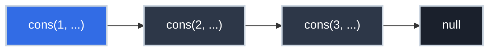
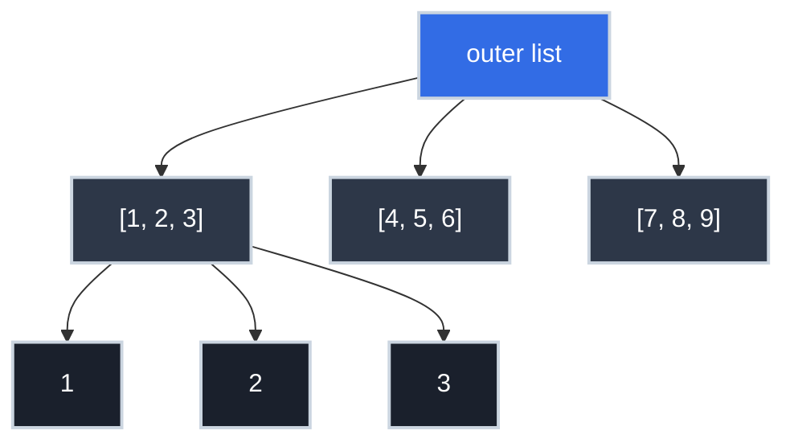

# Lists as Recursive Data Structures

You call `.map()`, `.filter()`, and `.reduce()` on arrays daily. You slice Python lists, spread JavaScript arrays, and range over Go slices. You've probably never stopped to ask: *what is a list, formally?*

Not "how is it stored in memory" — you know about arrays vs. linked lists. The question is deeper: **what is the mathematical structure of a list?** And why does that structure mean recursive operations are the natural way to process lists — not a clever trick, but the only logical approach given what a list actually is?

This is the CS theory behind every `map` and `reduce` you've written.

!!! info "Learning Objectives"

    By the end of this article, you'll be able to:

    - Define a list recursively using the `cons` / `null` formulation from CS theory
    - Explain `head`, `tail`, and `cons` as the three fundamental list primitives
    - Implement `length`, `max`, `reverse`, and `flatten` using the recursive list template
    - Recognize `map`, `filter`, and `reduce` as instances of the fold pattern
    - Connect Scheme/Lisp list theory to Python `list`, JavaScript arrays, and Go slices

## Where You've Seen This

The recursive structure of lists appears everywhere in production code:

- **Functional array methods** — `.map()`, `.filter()`, `.reduce()` in JavaScript; `map()`, `filter()`, `reduce()` in Python; `slice.Map()` helpers in Go — all follow the recursive cons-structure pattern
- **Clojure, Haskell, Erlang** — use linked cons lists as their primary sequence type; `first` and `rest` are literally `car` and `cdr`
- **React state updates** — immutable list patterns like `[newItem, ...existingList]` are the spread syntax equivalent of `cons`
- **Recursive JSON processing** — nested arrays of objects processed with recursive functions follow the same base-case/recursive-case structure
- **Parser output** — parse trees are nested lists; every recursive descent parser is processing a recursive list structure
- **Command pipelines** — `cat file | grep pattern | sort | uniq` is a list of transformations applied in sequence

## Why This Matters for Production Code

=== ":material-layers: Why List Operations Have the Costs They Do"

    Once you understand the recursive structure of lists, the performance characteristics of list operations become obvious rather than memorized.

    A linked list operation that touches every element — `length()`, `sum()`, `find()` — is $O(n)$ because it must traverse the recursive structure from head to tail, one step per recursive call. There's no shortcut.

    An operation that only touches the front — `prepend()`, `head()` — is $O(1)$ because it only needs to create or inspect one cons cell.

    Understanding this at the structural level means you can reason about unfamiliar list operations without looking up their complexity. Ask: does this operation need to visit every element? Then it's $O(n)$. Does it only touch the head? Then it's $O(1)$.

=== ":material-function-variant: Immutable List Patterns"

    Immutable data structures in functional languages (and increasingly in modern JavaScript, Python, and Go) rely on cons-style prepending. When you do `[newItem, ...existingList]` in JavaScript or `[new_item] + existing_list` in Python, you're constructing a new list that shares its tail with the original.

    This is $O(1)$ for prepend (just add a new head), $O(n)$ for append (must traverse to the end). This is why functional style tends to build lists by prepending and then reversing, rather than appending directly.

=== ":material-code-braces: Recursive Data Processing"

    If your data is recursively structured — nested JSON, file trees, ASTs, DOM nodes — recursive functions are the natural fit. The structure of the code mirrors the structure of the data: the base case handles the leaf values, the recursive case processes each nested level.

    Engineers who understand list recursion can generalize it to trees, graphs, and arbitrary recursive structures. The pattern (`null? → base case; else → recurse on cdr`) is the same for all of them.

=== ":material-database: The fold/reduce Family"

    The `list-accumulate` pattern from CS theory is the general form of every `reduce`, `fold`, `aggregate`, and `inject` in modern languages. SQL's `SUM`, `COUNT`, `MAX` are all specializations of fold. Understanding the recursive structure makes the family of operations clear:

    - **fold-left** — accumulate from left to right
    - **fold-right** — accumulate from right to left (the natural recursive form)
    - **map** — fold that produces a new list
    - **filter** — fold that selectively includes elements
    - **reduce** — fold that produces a scalar

    They're all the same recursive pattern with different accumulator functions.

## Technical Interview Context

List operations and their time complexities are classic interview territory. Understanding the recursive structure explains why these operations have the costs they do — rather than requiring you to memorize a lookup table.

**Questions you'll be able to answer:**

- *"What's the time complexity of prepend vs append on a linked list?"* — Prepend is $O(1)$: create a new head that points to the existing list. Append is $O(n)$: traverse to the tail before adding. This asymmetry is why functional languages build lists by prepending and reversing, rather than appending directly.
- *"Implement `map` / `filter` / `reduce` from scratch"* — All three are specializations of the `fold` pattern: recurse to the tail, apply the function (or condition, or accumulator) at each step, combine results on the way back up. Understanding the recursive structure makes implementing them from scratch straightforward.
- *"When would you use a linked list vs an array?"* — Arrays have $O(1)$ random access and cache-friendly sequential access but $O(n)$ insertion at the head. Linked lists have $O(1)$ head insertion but $O(n)$ random access and poor cache locality. In practice, arrays win for most use cases; linked lists are valuable for queue implementations and scenarios requiring frequent head insertion without copying.
- *"What is structural sharing in immutable data structures?"* — When you prepend to an immutable list, the new list shares its tail with the original — both point to the same cons cells. This makes `[new_head] + existing_list` $O(1)$ in both time and space, with no copying required.

## The Recursive Definition of a List

Here is the formal CS definition of a list:

> A **List** is either:
> 1. **`null`** (the empty list), or
> 2. A **pair** consisting of a value followed by a List.

That's it. A list is defined in terms of itself — it's a recursive definition. Reading it symbolically:

```
List ::= null
List ::= (cons Value List)
```

This mirrors grammar rules you've seen in [Regular Expressions](regular_expressions.md) and Backus-Naur Form. The pattern is identical: a recursive rule with a base case to stop the recursion.

From this definition, every list is built the same way:

```
null                           → empty list: ()
(cons 1 null)                  → one-element list: (1)
(cons 1 (cons 2 null))         → two-element list: (1 2)
(cons 1 (cons 2 (cons 3 null))) → three-element list: (1 2 3)
```

### The Three List Primitives

Every list-based language provides three fundamental operations, named after their Lisp origins:

| Operation | Type | What it does |
|:----------|:-----|:-------------|
| `cons` | `Value × List → List` | Creates a new list by prepending a value to an existing list |
| `car` (head/first) | `List → Value` | Returns the first element of a non-empty list |
| `cdr` (tail/rest) | `List → List` | Returns the list with its first element removed |

The names `car` and `cdr` are artifacts of 1959 IBM hardware (Contents of Address Register, Contents of Decrement Register). Modern languages use friendlier names: `head`/`tail` in Haskell and Erlang, `first`/`rest` in Clojure, and `[0]`/`[1:]` in Python slicing.



The highlighted node is the head (`car`). The rest is the tail (`cdr`). `car` of the whole list is `1`. `cdr` of the whole list is `(2 3)`. `car` of `(cdr list)` is `2`. And so on.

### Modern Language Equivalents

=== ":material-language-python: Python"

    ```python title="List Structure in Python" linenums="1"
    from typing import Any

    lst = [1, 2, 3]

    head = lst[0]       # car — the first element: 1  # (1)!
    tail = lst[1:]      # cdr — everything else: [2, 3]  # (2)!

    new_list = [0] + lst  # cons — prepend: [0, 1, 2, 3]  # (3)!

    is_empty = len(lst) == 0  # null? check  # (4)!
    ```

    1. `lst[0]` is the `car` (head) of the list
    2. `lst[1:]` is the `cdr` (tail) — a new list without the first element
    3. `[0] + lst` is the `cons` operation — prepend a value to create a new list
    4. The null check: is this the empty list?

=== ":material-language-javascript: JavaScript"

    ```javascript title="List Structure in JavaScript" linenums="1"
    const lst = [1, 2, 3];

    const head = lst[0];              // car: 1  // (1)!
    const tail = lst.slice(1);        // cdr: [2, 3]  // (2)!

    const newList = [0, ...lst];      // cons: [0, 1, 2, 3]  // (3)!

    const isEmpty = lst.length === 0; // null? check  // (4)!
    ```

    1. Index 0 is `car`
    2. `slice(1)` is `cdr` — returns everything after index 0
    3. Spread syntax is the modern `cons`
    4. Length check for the empty list

=== ":material-language-go: Go"

    ```go title="List Structure in Go" linenums="1"
    lst := []int{1, 2, 3}

    head := lst[0]           // car: 1  // (1)!
    tail := lst[1:]          // cdr: [2, 3]  // (2)!

    newList := append([]int{0}, lst...)  // cons: [0, 1, 2, 3]  // (3)!

    isEmpty := len(lst) == 0  // null? check  // (4)!
    ```

    1. First element is the head
    2. Slice from index 1 is the tail
    3. `append` with a single element prepended is cons (but copies the slice)
    4. `len(lst) == 0` is the null check

=== ":material-language-rust: Rust"

    ```rust title="List Structure in Rust" linenums="1"
    let lst = vec![1, 2, 3];

    let head = lst.first();          // car: Some(1)  // (1)!
    let tail = &lst[1..];            // cdr: [2, 3]  // (2)!

    let mut new_list = vec![0];
    new_list.extend_from_slice(&lst); // cons: [0, 1, 2, 3]  // (3)!

    let is_empty = lst.is_empty();   // null? check  // (4)!
    ```

    1. `first()` returns `Option<&T>` — safe head access
    2. Slice from index 1 is the tail
    3. Prepend 0 and extend with the original list
    4. `is_empty()` is the null check

=== ":material-language-java: Java"

    ```java title="List Structure in Java" linenums="1"
    import java.util.List;
    import java.util.ArrayList;

    List<Integer> lst = List.of(1, 2, 3);

    int head = lst.get(0);                    // car: 1  // (1)!
    List<Integer> tail = lst.subList(1, lst.size()); // cdr: [2, 3]  // (2)!

    List<Integer> newList = new ArrayList<>();
    newList.add(0);
    newList.addAll(lst);                       // cons: [0, 1, 2, 3]  // (3)!

    boolean isEmpty = lst.isEmpty();           // null? check  // (4)!
    ```

    1. `get(0)` is the head
    2. `subList(1, size)` is the tail
    3. Manual cons using add + addAll
    4. `isEmpty()` is the null check

=== ":material-language-cpp: C++"

    ```cpp title="List Structure in C++" linenums="1"
    #include <vector>

    std::vector<int> lst = {1, 2, 3};

    int head = lst.front();                               // car: 1  // (1)!
    std::vector<int> tail(lst.begin() + 1, lst.end());   // cdr: [2, 3]  // (2)!

    std::vector<int> newList = {0};
    newList.insert(newList.end(), lst.begin(), lst.end()); // cons: [0,1,2,3]  // (3)!

    bool isEmpty = lst.empty();                           // null? check  // (4)!
    ```

    1. `front()` is the head
    2. Iterator range from index 1 is the tail
    3. Insert all elements after prepending 0
    4. `empty()` is the null check

## Recursive List Operations

Once you have the recursive definition, recursive procedures are the natural fit. The template is always the same:

```
if (list is empty):         # base case — null
    return base_value
else:
    process head (car)
    recurse on tail (cdr)   # recursive case — smaller list
```

This is not just an elegant pattern — it's the *logical consequence* of the definition. If a list is defined as either null or (cons head tail), then a function on a list must handle exactly those two cases.

### Length

```
length(null)    → 0
length(cons h t) → 1 + length(t)
```

=== ":material-language-python: Python"

    ```python title="Recursive List Length" linenums="1"
    from typing import TypeVar
    T = TypeVar('T')

    def list_length(lst: list) -> int:
        if not lst:           # base case: empty list  # (1)!
            return 0
        return 1 + list_length(lst[1:])  # recursive case  # (2)!

    # Python's built-in len() is iterative for performance,
    # but the logic is identical.
    ```

    1. Empty list is the base case; length is 0
    2. Length of non-empty list = 1 (for the head) + length of tail

=== ":material-language-javascript: JavaScript"

    ```javascript title="Recursive List Length" linenums="1"
    function listLength(lst) {
        if (lst.length === 0) return 0;          // base case  // (1)!
        return 1 + listLength(lst.slice(1));     // recursive case  // (2)!
    }
    ```

    1. Empty array: length is 0
    2. Count the head (1) plus the length of the tail

=== ":material-language-go: Go"

    ```go title="Recursive List Length" linenums="1"
    func listLength(lst []int) int {
        if len(lst) == 0 {                    // base case  // (1)!
            return 0
        }
        return 1 + listLength(lst[1:])        // recursive case  // (2)!
    }
    ```

    1. Empty slice: length is 0
    2. Count the head and recurse on the tail

=== ":material-language-rust: Rust"

    ```rust title="Recursive List Length" linenums="1"
    fn list_length(lst: &[i64]) -> usize {
        if lst.is_empty() {                   // base case  // (1)!
            return 0;
        }
        1 + list_length(&lst[1..])            // recursive case  // (2)!
    }
    ```

    1. Empty slice: base case returns 0
    2. Recurse on the tail slice

=== ":material-language-java: Java"

    ```java title="Recursive List Length" linenums="1"
    import java.util.List;

    static int listLength(List<Integer> lst) {
        if (lst.isEmpty()) return 0;                           // base case  // (1)!
        return 1 + listLength(lst.subList(1, lst.size()));     // recursive case  // (2)!
    }
    ```

    1. Empty list: length is 0
    2. Count head plus length of tail

=== ":material-language-cpp: C++"

    ```cpp title="Recursive List Length" linenums="1"
    #include <vector>

    int listLength(const std::vector<int>& lst) {
        if (lst.empty()) return 0;  // base case  // (1)!
        std::vector<int> tail(lst.begin() + 1, lst.end());
        return 1 + listLength(tail);  // recursive case  // (2)!
    }
    ```

    1. Empty vector: length is 0
    2. Recurse on the tail

### The General Accumulator Pattern

Most recursive list operations share the same structure: apply a combining function to the head and the result of processing the tail. This pattern is called **fold** (or reduce):

```
fold(f, base, null)     → base
fold(f, base, cons h t) → f(h, fold(f, base, t))
```

From this single pattern, all the standard list operations are just specializations:

| Operation | Combining function `f` | Base value |
|:----------|:-----------------------|:-----------|
| `sum(lst)` | `(x, acc) → x + acc` | `0` |
| `product(lst)` | `(x, acc) → x * acc` | `1` |
| `length(lst)` | `(_, acc) → 1 + acc` | `0` |
| `max(lst)` | `(x, acc) → max(x, acc)` | `-∞` |
| `any(predicate, lst)` | `(x, acc) → predicate(x) or acc` | `false` |
| `all(predicate, lst)` | `(x, acc) → predicate(x) and acc` | `true` |

`map` and `filter` are fold operations that produce a new list instead of a scalar — the key insight here is that they all derive from the same recursive structure.

## Lists of Lists

Since the elements of a list can be any value, they can be other lists. This is where recursive processing becomes especially powerful.

A nested list like `[[1, 2, 3], [4, 5, 6], [7, 8, 9]]` has:

- Outer list: a list of 3 elements
- Each element: itself a list of 3 numbers

Processing it requires two levels of recursion — one for the outer structure, one for each inner list.



### Flattening

A common operation: take a list of lists and produce a single flat list.

=== ":material-language-python: Python"

    ```python title="Recursive List Flatten" linenums="1"
    def flatten(nested: list) -> list:
        if not nested:                        # outer base case  # (1)!
            return []
        head = nested[0]
        tail_flat = flatten(nested[1:])       # recurse on outer tail  # (2)!
        if isinstance(head, list):
            return flatten(head) + tail_flat  # head is a list: flatten it too  # (3)!
        else:
            return [head] + tail_flat         # head is a value: include it  # (4)!

    # Equivalent using list comprehension (less explicit, same logic):
    # [item for sublist in nested for item in sublist]
    ```

    1. Base case: empty outer list → empty result
    2. Recursively flatten the tail of the outer list
    3. If the head is itself a list, recursively flatten it
    4. If the head is a scalar value, include it directly

=== ":material-language-javascript: JavaScript"

    ```javascript title="Recursive List Flatten" linenums="1"
    function flatten(nested) {
        if (nested.length === 0) return [];   // base case  // (1)!
        const [head, ...tail] = nested;
        const flatTail = flatten(tail);       // recurse on tail  // (2)!
        if (Array.isArray(head)) {
            return [...flatten(head), ...flatTail]; // flatten nested array  // (3)!
        }
        return [head, ...flatTail];           // scalar: include directly  // (4)!
    }

    // Built-in equivalent: nested.flat(Infinity)
    ```

    1. Empty array: nothing to flatten
    2. Flatten the tail first
    3. If head is an array, recursively flatten it
    4. If head is a scalar, include it directly

=== ":material-language-go: Go"

    ```go title="Recursive List Flatten" linenums="1"
    func flatten(nested []interface{}) []int {
        if len(nested) == 0 {                 // base case  // (1)!
            return []int{}
        }
        head := nested[0]
        tail := flatten(nested[1:])           // recurse on tail  // (2)!
        switch v := head.(type) {
        case []interface{}:
            return append(flatten(v), tail...) // head is a slice  // (3)!
        case int:
            return append([]int{v}, tail...)  // head is a value  // (4)!
        default:
            return tail
        }
    }
    ```

    1. Empty slice: base case
    2. Recurse on the tail
    3. Type switch: if head is a slice, flatten it
    4. If head is an int, prepend it to the result

=== ":material-language-rust: Rust"

    ```rust title="Recursive List Flatten" linenums="1"
    #[derive(Debug)]
    enum NestedList {
        Value(i64),
        List(Vec<NestedList>),  // (1)!
    }

    fn flatten(nested: &[NestedList]) -> Vec<i64> {
        if nested.is_empty() {              // base case  // (2)!
            return vec![];
        }
        let head = &nested[0];
        let mut tail_flat = flatten(&nested[1..]);  // recurse on tail  // (3)!
        match head {
            NestedList::List(inner) => {
                let mut inner_flat = flatten(inner);
                inner_flat.append(&mut tail_flat);
                inner_flat                          // flatten inner list  // (4)!
            }
            NestedList::Value(v) => {
                let mut result = vec![*v];
                result.append(&mut tail_flat);
                result                              // include scalar  // (5)!
            }
        }
    }
    ```

    1. Rust requires explicit recursive enum for nested lists
    2. Empty slice: base case
    3. Recurse on the tail
    4. If head is a nested list, flatten it recursively
    5. If head is a value, prepend it to the result

=== ":material-language-java: Java"

    ```java title="Recursive List Flatten" linenums="1"
    import java.util.*;

    @SuppressWarnings("unchecked")
    static List<Integer> flatten(List<?> nested) {
        if (nested.isEmpty()) return new ArrayList<>();   // base case  // (1)!
        Object head = nested.get(0);
        List<?> rest = nested.subList(1, nested.size());
        List<Integer> flatTail = flatten(rest);           // recurse on tail  // (2)!
        if (head instanceof List<?> innerList) {
            List<Integer> flatHead = flatten(innerList);  // flatten inner list  // (3)!
            flatHead.addAll(flatTail);
            return flatHead;
        } else {
            List<Integer> result = new ArrayList<>();
            result.add((Integer) head);                   // include scalar  // (4)!
            result.addAll(flatTail);
            return result;
        }
    }
    ```

    1. Empty list: base case
    2. Flatten the tail
    3. If head is a List, recursively flatten it
    4. If head is a scalar, prepend it

=== ":material-language-cpp: C++"

    ```cpp title="Recursive List Flatten" linenums="1"
    #include <vector>
    #include <variant>

    using NestedList = std::vector<std::variant<int, std::vector<int>>>;

    std::vector<int> flatten(const NestedList& nested) {
        if (nested.empty()) return {};    // base case  // (1)!
        std::vector<int> result;
        for (const auto& elem : nested) {
            if (std::holds_alternative<int>(elem)) {
                result.push_back(std::get<int>(elem));        // scalar  // (2)!
            } else {
                auto inner = std::get<std::vector<int>>(elem);
                result.insert(result.end(), inner.begin(), inner.end()); // inner list  // (3)!
            }
        }
        return result;
    }
    ```

    1. Empty list: return empty result
    2. Scalar value: append directly
    3. Inner list: extend result with all elements

## Practice Problems

??? question "Practice 1: List Sum"

    Write a recursive `list_sum` function that sums all numbers in a list using only the head/tail (car/cdr) pattern — no built-in `sum()`.

    What is the base case? What is the recursive case?

    ??? tip "Answer"

        ```python title="Recursive List Sum" linenums="1"
        def list_sum(lst: list[int]) -> int:
            if not lst:             # base case: empty list sums to 0
                return 0
            return lst[0] + list_sum(lst[1:])  # head + sum of tail
        ```

        Base case: the sum of an empty list is 0.
        Recursive case: the sum is the first element plus the sum of the rest.

??? question "Practice 2: Tracing the Recursion"

    Trace the execution of `list_sum([1, 2, 3])` step by step, showing each recursive call and return value.

    ??? tip "Answer"

        ```
        list_sum([1, 2, 3])
          = 1 + list_sum([2, 3])
               = 2 + list_sum([3])
                    = 3 + list_sum([])
                              = 0
                    = 3 + 0 = 3
               = 2 + 3 = 5
          = 1 + 5 = 6
        ```

        The recursion bottoms out at `[]`, then unwinds back up adding each element. This is the natural right-to-left evaluation of a right fold.

??? question "Practice 3: Deep Sum"

    Write a function `deep_sum` that sums all numbers in a potentially nested list, like `[1, [2, 3], [4, [5, 6]]]` → `21`.

    ??? tip "Answer"

        ```python title="Deep List Sum" linenums="1"
        def deep_sum(lst) -> int:
            if not lst:                          # base case: empty
                return 0
            head = lst[0]
            tail_sum = deep_sum(lst[1:])         # always recurse on tail
            if isinstance(head, list):
                return deep_sum(head) + tail_sum  # head is nested: recurse into it
            else:
                return head + tail_sum            # head is a number: add directly
        ```

        Two recursive calls: one for each inner list encountered, and one for the tail of the outer list.

## Key Takeaways

| Concept | What to Remember |
|:--------|:----------------|
| Recursive definition | A list is null OR (cons value list) — two cases, nothing else |
| car / head | The first element of a non-empty list |
| cdr / tail | The rest of the list after the first element |
| cons / prepend | Create a new list by adding an element to the front |
| Recursive operations | Base case = empty list; recursive case = process head, recurse on tail |
| Fold/reduce | The universal pattern; map and filter are specializations of it |
| Lists of lists | Two levels of recursion; flatten, deep-sum, deep-map follow the same template |
| Prepend is $O(1)$ | Append is $O(n)$ — the structure makes this inevitable |

## Further Reading

**On This Site**

- [Recursion: Solving Problems by Dividing Them](../essentials/recursion.md) — the general recursion pattern that list operations apply

**External**

- [*Introduction to Computing*](https://computingbook.org/) by David Evans, Chapter 5 — the Scheme-based treatment that defines lists precisely from first principles
- [*Structure and Interpretation of Computer Programs* (SICP)](https://mitp-content-server.mit.edu/books/content/sectbyfn/books_pres_0/6515/sicp.zip/index.html), Chapter 2 — pairs and lists as the foundation of data
- [Clojure docs on sequences](https://clojure.org/reference/sequences) — a modern language where the cons-list structure is the primary abstraction

The next time you chain `.filter().map().reduce()` on an array, you're applying the full recursive list processing toolkit. The methods do the recursion for you — but understanding the recursive structure underneath is what lets you reason about what's happening and why.
