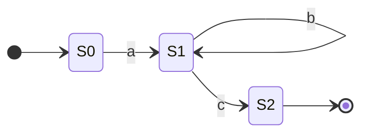

# Regular Expressions: The Formal Model

You already write regex. You know `\d+` matches digits and `.*` matches everything. But when a colleague asks "why did that regex take down the server?" or "why can't I match balanced parentheses with regex?" — the answer isn't in any syntax guide.

**This is the theory behind the tool.**

Understanding how regex engines work explains ReDoS, why some engines are faster than others, why backreferences are controversial, and why your regex-based HTML parser is formally broken. This article assumes you know regex syntax — if you need a refresher, start with [Regular Expressions](../essentials/regular_expressions.md).

!!! info "Learning Objectives"

    By the end of this article, you'll be able to:

    - Explain how Thompson's construction compiles a regex pattern into an NFA
    - Distinguish DFA engines (guaranteed $O(n)$) from NFA/backtracking engines and their practical tradeoffs
    - Identify patterns vulnerable to catastrophic backtracking and explain the mechanism (ReDoS)
    - Explain why backreferences make regex non-regular — and what that means for engine design
    - Know when regex cannot solve a problem and why a parser is the correct tool instead

## Where You've Seen This

These are the situations where the formal model matters:

- **ReDoS CVEs** — Vulnerability reports like Cloudflare's 2019 outage trace back to the backtracking model described here; the root cause is always a mathematical property of the pattern, not a code bug
- **`re2` vs `re`** — Google's `re2` library guarantees $O(n)$ matching by using a DFA engine; Python's `re` module uses backtracking and can be exponential on adversarial input
- **Regex101's "explain" mode** — The NFA diagram it generates is literally what your engine compiles your pattern into
- **"You can't parse HTML with regex"** — This isn't snobbery; it's a formal result about what regular languages can and cannot express
- **Database regex performance** — PostgreSQL's `~` operator and MySQL's `REGEXP` have different performance characteristics based on their underlying engine architectures

## Why This Matters for Production Code

=== ":material-alert: The ReDoS Mechanism"

    In July 2019, a regex in Cloudflare's WAF firewall ruleset caused CPU usage to spike to 100% across their entire network for 27 minutes. A minor pattern update introduced catastrophic backtracking — exponential runtime against certain inputs.

    This was not a bug in the code. It was a mathematical property of the pattern interacting with the backtracking engine. The same mechanism has caused multiple Stack Overflow outages and is tracked as a vulnerability class (CWE-1333).

=== ":material-speedometer: Engine Choice Has Consequences"

    When you install `google-re2` in Python or reach for Rust's `regex` crate, you're trading away backtracking features for guaranteed $O(n)$ performance. That trade-off only makes sense if you understand what the backtracking engine is doing — and when it becomes dangerous.

    High-traffic input validation (URL routing, request filtering, log parsing) benefits from DFA engines. Complex extraction with backreferences requires NFA/backtracking engines. Knowing the difference helps you pick the right tool.

=== ":material-code-not-equal-variant: The Hard Limits Are Real"

    Balanced parentheses, matching XML tags at arbitrary nesting depth, validating that a string has equal numbers of `a`s and `b`s — none of these are regular languages. No regex, no matter how clever, can correctly handle them for all possible inputs. Understanding why tells you when to stop reaching for regex and start reaching for a parser.

## Technical Interview Context

The formal model of regex engines is relevant in security-focused interviews and in systems discussions about high-throughput input processing.

**Questions you'll be able to answer:**

- *"What is ReDoS and how do you prevent it?"* — Regex Denial of Service exploits catastrophic backtracking in NFA/backtracking engines. Patterns with nested quantifiers on the same character class (like `(a+)+`) create exponential backtracking on adversarial input. Prevention: flatten nested quantifiers, switch to a DFA engine (`re2`, Rust's `regex` crate), or add input length limits.
- *"Why is `re2` safer than Python's `re`?"* — `re2` uses a DFA engine with guaranteed $O(n)$ matching regardless of the pattern. Python's `re` uses backtracking and can exhibit exponential runtime on crafted input, making it exploitable if the pattern accepts user-controlled input.
- *"What's the difference between an NFA and a DFA?"* — Both are finite automata, but an NFA can be in multiple states simultaneously; a DFA has exactly one state at each step. DFAs are faster to execute but cannot support backreferences. NFA engines support `\1`-style backreferences; DFA engines structurally cannot.
- *"Can regex match balanced parentheses?"* — No. Balanced parentheses require counting to arbitrary depth, which requires unbounded memory. Finite automata have no memory beyond their current state — this problem is formally outside the regular language class and requires a parser.

## From Pattern to Automaton

When you call `re.compile(r'\d+')`, your regex engine doesn't interpret the pattern character by character at match time. It *compiles* the pattern to a state machine first.

The compilation pipeline:

| Stage | Operation | Output |
|:------|:----------|:-------|
| 1 | Parse the regex | Syntax tree |
| 2 | Thompson's construction | NFA |
| 3 | Subset construction *(optional)* | DFA |
| 4 | Execute against input | Match / No match |

**Thompson's construction** converts a regex to an NFA systematically — each regex operator maps to a small NFA fragment that gets composed into a larger machine:

| Regex | NFA structure |
|:------|:-------------|
| `a` | Two states, one transition labeled `a` |
| `a\|b` | Split state with two paths, both joining at end |
| `ab` | Chain: state for `a` → state for `b` |
| `a*` | Loop: `a` transition back to same state, epsilon path to exit |

The regex `ab*c` compiles to this automaton:



- S0 → S1 on `a` (must see exactly one `a`)
- S1 → S1 on `b` (loop: zero or more `b`s)
- S1 → S2 on `c` (exit loop, accept)

Complex patterns are built by composing these fragments. Every regex you've ever written has an equivalent state machine — regex101's "explain" diagram visualizes exactly this.

## Two Engine Architectures

You already know [how DFAs and NFAs differ](finite_state_machines.md#deterministic-vs-non-deterministic). Real regex engines implement one model or the other, and the choice has concrete consequences for every regex you run in production.

### DFA Engines

DFA engines convert the NFA to a deterministic automaton before execution. At match time, they make exactly one state transition per input character — guaranteed $O(n)$ time regardless of the pattern.

**Common DFA engines:** Google's `re2`, GNU `grep` (basic patterns), Rust's `regex` crate, `awk`, Go's `regexp` package

| Property | Value |
|:---------|:------|
| Time complexity | $O(n)$ always |
| ReDoS vulnerable | No |
| Backreferences (`\1`) | Not supported |
| Variable-length lookbehind | Not supported |

### NFA/Backtracking Engines

NFA engines simulate the automaton using backtracking. When the engine reaches a choice point — `a|b`, or a quantifier like `a+` — it tries one path. If that path fails, it backtracks and tries the next.

**Common NFA/backtracking engines:** Python's `re`, JavaScript, Java, PHP (`preg_*`), Ruby, Perl, most "standard" regex engines

| Property | Value |
|:---------|:------|
| Time complexity | $O(n)$ typical, $O(2^n)$ worst case |
| ReDoS vulnerable | Yes |
| Backreferences (`\1`) | Supported |
| Complex lookahead/lookbehind | Supported |

### Choosing an Engine in Practice

The engine is a library choice, not a language choice. Here's what each major language provides by default — and how to opt into DFA-based matching when it matters:

=== ":material-language-python: Python"

    ```python title="NFA vs DFA Engine in Python" linenums="1"
    import re    # Built-in: NFA/backtracking engine
    import re2   # Alternative: DFA engine (pip install google-re2)

    # NFA engine — backreferences work, but can be exponential
    nfa = re.compile(r'(\w+) \1')          # matches "the the", "error error"
    # re.compile(r'(a+)+b')               # unsafe on adversarial input

    # DFA engine — guaranteed O(n), no ReDoS risk
    dfa = re2.compile(r'\w+')             # safe at any scale
    # re2.compile(r'(\w+) \1')            # raises error: backreferences unsupported
    ```

=== ":material-language-javascript: JavaScript"

    ```javascript title="NFA vs DFA Engine in JavaScript" linenums="1"
    // Built-in RegExp: NFA/backtracking engine
    const nfa = /(\w+) \1/;              // backreferences supported
    // /^(a+)+$/.test('aaaaaaaaac');      // dangerous — can hang

    // RE2 library: DFA engine (npm install re2)
    const RE2 = require('re2');
    const dfa = new RE2('\\w+');          // guaranteed O(n)
    // new RE2('(\\w+) \\1');             // throws: backreferences unsupported
    ```

=== ":material-language-go: Go"

    ```go title="DFA Engine in Go" linenums="1"
    package main

    import "regexp"

    func main() {
        // Go's regexp package uses a DFA engine by design — O(n) guaranteed
        pattern := regexp.MustCompile(`\w+`)
        match := pattern.FindString("hello world")
        _ = match

        // Go intentionally excludes backreferences to eliminate ReDoS
        // regexp.MustCompile(`(\w+) \1`)  // syntax error: invalid escape sequence
    }
    ```

=== ":material-language-rust: Rust"

    ```rust title="DFA vs NFA Engine in Rust" linenums="1"
    use regex::Regex;            // Default: DFA-based, O(n) guaranteed
    // use fancy_regex::Regex;   // Alternative: NFA, supports backreferences

    fn main() {
        // DFA engine — safe for high-volume or user-controlled input
        let dfa = Regex::new(r"\w+").unwrap();
        let found = dfa.find("hello world");

        // For backreferences, use fancy-regex (NFA engine)
        // let nfa = fancy_regex::Regex::new(r"(\w+) \1").unwrap();
    }
    ```

=== ":material-language-java: Java"

    ```java title="NFA Engine in Java (and RE2/J Alternative)" linenums="1"
    import java.util.regex.*;
    // import com.google.re2j.*;  // RE2/J: DFA engine (add to build.gradle)

    public class RegexEngines {
        public static void main(String[] args) {
            // Built-in java.util.regex: NFA/backtracking — can be exponential
            Pattern nfa = Pattern.compile("\\w+");
            Matcher m = nfa.matcher("hello world");

            // RE2/J: DFA-based, O(n) guaranteed
            // com.google.re2j.Pattern dfa = com.google.re2j.Pattern.compile("\\w+");
        }
    }
    ```

=== ":material-language-cpp: C++"

    ```cpp title="NFA vs DFA Engine in C++" linenums="1"
    #include <regex>      // Standard library: NFA/backtracking
    #include <re2/re2.h>  // RE2 library: DFA engine (safer for production)

    int main() {
        // std::regex: NFA/backtracking — vulnerable to ReDoS on adversarial input
        std::regex nfa("\\w+");

        // RE2: DFA engine — O(n) guaranteed, no backreferences
        RE2 dfa("\\w+");
        bool matched = RE2::FullMatch("hello", dfa);
        return 0;
    }
    ```

## Backreferences Break the Model

Here is a result that surprises most working engineers: **backreferences make regex non-regular.**

Consider the pattern `(\w+) \1` — any word followed by a space and the same word. This matches "the the" and "error error" but not "the cat". The language it describes — "a word, a space, the same word" — cannot be recognized by any finite automaton.

Why? To evaluate `\1`, the engine must remember the exact text captured by Group 1. That text could be any length. An FSM has no memory beyond its current state — it can track which state it's in, but not what characters it previously matched. Backreferences require unbounded memory, which puts them outside the class of regular languages entirely.

This has practical implications:

- **DFA engines don't support `\1`** — supporting it would require abandoning the DFA architecture
- **Backtracking engines support `\1`** but can be slow when patterns combine backreferences with quantifiers
- When you write `(\w+)\s+\1`, you're using a feature that technically makes your "regex" more than a regular expression

The same argument applies to any backreference: `\2`, `\3`, and named captures all step outside the formal regular language model.

## Why Backtracking Blows Up

Now the consequence: because backtracking NFA engines support backreferences and other advanced features, they expose you to exponential blowup on adversarial input.

The pattern `(a+)+b` against `aaaaaaaaac` (many a's, ending in something that's not `b`):

The outer `+` can match 1, 2, 3, ... times. Each time, the inner `a+` can consume 1, 2, ... remaining a's. When the overall match fails on `c`, the engine backtracks through every possible way to partition the a's among the outer repetitions.

For $n$ a's, there are $2^{n-1}$ partitions to try:

| Input | Backtracks attempted |
|:------|:---------------------|
| 5 a's + `c` | 16 |
| 10 a's + `c` | 512 |
| 20 a's + `c` | 524,288 |
| 30 a's + `c` | ~500 million |
| 40 a's + `c` | ~500 billion |

A request with 40 adversarial characters can pin a server thread indefinitely.

**Why the fix works:**

```
(a+)+b    →    a+b
```

With a single `a+`, there's exactly one way to match the a's. The engine reaches `c`, sees the `b` doesn't match, and fails immediately — no choice points to revisit.

**The general rule:** nested quantifiers on the same character class create exponential choice points. Flatten them. A linear regex always performs linearly.

## Lookahead and Lookbehind

Lookahead (`(?=...)`) and lookbehind (`(?<=...)`) are **zero-width assertions** — they check a condition at the current position without consuming input characters.

Unlike backreferences, these don't require unbounded memory in most implementations. The lookahead pattern itself is finite. But they do require the engine to "branch" at the assertion point and explore, which is why their support varies:

| Feature | DFA engines | NFA engines |
|:--------|:------------|:------------|
| Positive lookahead `(?=...)` | Limited | Supported |
| Negative lookahead `(?!...)` | Limited | Supported |
| Fixed-length lookbehind `(?<=abc)` | Limited | Supported |
| Variable-length lookbehind `(?<=\w+)` | Not supported | Python only (most don't) |

JavaScript and Java require fixed-length lookbehind. Python's `re` module uniquely supports variable-length lookbehind — most other NFA engines don't.

## The Practical Boundary

| What you need to match | Right tool |
|:-----------------------|:-----------|
| Fixed patterns, no captures | DFA engine (`re2`, Rust `regex`) |
| Capture groups, substitution | NFA engine (Python `re`, JS, Java) |
| Backreferences (`\1`) | NFA engine only |
| Balanced parentheses | Parser — regex cannot do this |
| Nested structures (HTML, XML) | Parser — regex cannot do this |
| Equal counts (`aⁿbⁿ`) | Parser — regex cannot do this |
| Programming language syntax | Parser — regex cannot do this |

The [FSM article](finite_state_machines.md#what-fsms-cannot-do) covers why FSMs — and therefore regex — cannot handle nested or counting problems. When you hit that boundary, the tool you reach for is a [parser](how_parsers_work.md).

## Practice Problems

??? question "Practice Problem 1: Engine Selection"

    You're building an API gateway that validates incoming URLs against a whitelist pattern: `^/api/v\d+/[a-z]+$`. The gateway handles 50,000 requests per second. You have two library choices: one using a DFA engine, one using backtracking.

    Which do you choose and why?

    ??? tip "Answer"

        **DFA engine.** The pattern contains no backreferences or complex lookaheads, so both engines produce correct results. But at 50,000 req/s, the guaranteed $O(n)$ DFA performance matters — and you eliminate the theoretical ReDoS risk if the pattern ever gets extended. The backtracking engine offers no benefit for this problem.

??? question "Practice Problem 2: Identify the ReDoS Risk"

    Which of these patterns is vulnerable to catastrophic backtracking? Why?

    a. `^\d+$`

    b. `^(a|aa)+$`

    c. `^[a-zA-Z0-9._%+-]+@[a-zA-Z0-9.-]+\.[a-zA-Z]{2,}$`

    ??? tip "Answer"

        **b.** `^(a|aa)+$` is vulnerable. At each position the engine can match `a` or `aa` — two choices per character. Against `aaaa...x` (many a's, ending in something that fails `$`), the engine backtracks through $2^n$ combinations.

        **a.** `^\d+$` is safe — single quantifier, no choice points.

        **c.** The email regex has potential: the `[a-zA-Z0-9.-]+` component repeated over the domain can backtrack on adversarial input without the `@`. In practice, the literal `@` and anchors limit the damage — but this class of pattern is why some systems replace regex email validation with a simple contains-`@` check.

??? question "Practice Problem 3: Regular or Not?"

    For each language, decide: regular (expressible by pure regex without backreferences), or not regular?

    a. "All strings where the number of `0`s is divisible by 3"

    b. "All strings of the form `ww` — a string followed by itself"

    c. "All valid IPv4 addresses (four octets 0–255)"

    ??? tip "Answer"

        **a. Regular.** Divisibility by 3 can be tracked with three states (remainder 0, 1, 2) — this is the exact binary divisibility FSM from the [Finite State Machines](finite_state_machines.md) article. No unbounded memory needed.

        **b. Not regular.** Matching `ww` requires remembering the exact string `w`, which could be arbitrarily long. This is the same class of problem as backreferences — no FSM can solve it.

        **c. Technically regular**, but barely. Each octet is bounded (0–255), so you can write a finite regex for it. In practice, the pattern (`(?:25[0-5]|2[0-4]\d|[01]?\d\d?)` per octet) is complex enough that parsing and range-checking in code is more readable and maintainable.

## Key Takeaways

| Concept | What to Remember |
|:--------|:-----------------|
| Thompson's construction | Every regex compiles to an NFA; each operator maps to a small NFA fragment |
| DFA engines | $O(n)$ always; no backreferences (`re2`, Rust `regex`, Go `regexp`) |
| NFA/backtracking engines | Flexible, supports `\1`; can be exponential (Python `re`, JS, Java) |
| Catastrophic backtracking | Nested quantifiers → exponential choice points → ReDoS |
| Backreferences are non-regular | `\1` requires unbounded memory; no DFA can support it |
| Lookahead/lookbehind | Zero-width assertions; variable-length lookbehind is engine-specific |
| The hard boundary | Nested structures and counting problems require a parser, not regex |

## Further Reading

**On This Site**

- [Regular Expressions](../essentials/regular_expressions.md) — Syntax reference: patterns, quantifiers, groups, flags, and practical patterns
- [Finite State Machines](finite_state_machines.md) — The automaton theory this article builds on
- [How Parsers Work](how_parsers_work.md) — The tool you reach for when regex isn't enough

**External**

- [*Regular Expression Matching Can Be Simple And Fast*](https://swtch.com/~rsc/regexp/regexp1.html) by Russ Cox — the technical argument for DFA engines and why `re2` exists
- [Cloudflare Outage Post-Mortem](https://blog.cloudflare.com/details-of-the-cloudflare-outage-on-july-2-2019/) — the 2019 ReDoS incident, explained in detail by Cloudflare's engineering team

---

Regular expressions look like a simple text-processing tool. They are — until a pattern interacts with the backtracking engine on adversarial input, or until you try to match a structure that requires counting or nesting. The backtracking model makes them dangerous in one direction; the regular language boundary makes them wrong in another. Knowing which category your problem falls into is what separates engineers who reach for regex reflexively from engineers who reach for it deliberately.
