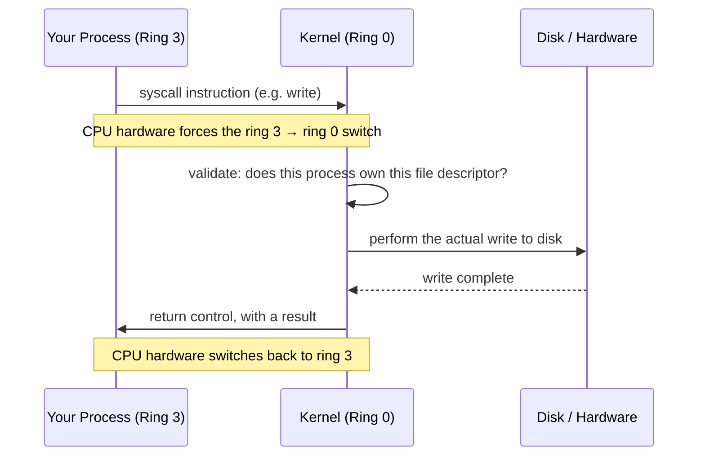

# Operating System Basics: The Kernel, Privilege, and the Syscall

!!! tip "Part of a Learning Path"
    This article is a step in the [How Modern Software Really Runs on a CPU](https://bradpenney.io/pathways/cpu-to-cluster) pathway on [bradpenney.io](https://bradpenney.io) — a guided sequence through the topic. It also stands on its own.

`strace`ing a hung process turns up a wall of unfamiliar function names — `read`, `epoll_wait`, `futex` — before landing on the one where it actually stalled. "Permission denied" shows up for a file a user account plainly owns, and it's never really about the file. And there's a question most engineers eventually run into: why can't a Python script just reach out and write to `/dev/sda` directly, when the hardware is right there?

Here's the answer: it isn't allowed to. Not by convention — by the CPU itself.

That privilege boundary isn't a Linux invention: Windows' NT kernel and macOS's XNU enforce the exact same ring 0/ring 3 split, because it's a feature of the CPU itself, not the operating system running on it. The concrete tools and syscall names used below (`strace`, `epoll_wait`, `futex`, `seccomp`) are Linux's specifically: Linux runs the large majority of production servers and cloud infrastructure, by most estimates well over 80%, which is why it's the default example in systems-level writing like this.

## Where You Might Have Seen This

- **`strace -c your_program`:** every line is a **system call**: a moment where your process stopped running its own instructions and asked the kernel to do something on its behalf.
- **`Permission denied` writing to a file you own, in a directory you don't:** a kernel-enforced check, not an application-level one; no code you wrote can override it.
- **A "kernel panic" or Windows "Blue Screen":** the operating system itself crashing, which is categorically different from *your* program crashing, because of exactly the boundary this article covers.
- **Docker/Podman needing `--cap-add` for certain operations** (binding to port 80, changing file ownership) — you're negotiating with the kernel's privilege model, the same one described here, just from inside a container.

## The Kernel Is the Only Thing That Touches Hardware

The **kernel** is the part of the operating system with direct, unmediated access to the CPU, RAM, disk, and every other physical device. It's the first thing loaded when the machine boots, and it never stops running until shutdown. Everything else (your shell, your browser, the Python interpreter running your code) is a **user-space process**: normal, unprivileged, and physically incapable of touching hardware on its own.

That "physically incapable" is doing real work, not exaggerating. Modern CPUs implement multiple **privilege levels** in hardware — on x86-64, four "rings," though in practice only two are used:

- **Ring 0 (kernel mode):** unrestricted. Can execute any instruction, access any memory address, talk to any device.
- **Ring 3 (user mode):** restricted. A defined subset of instructions is simply refused by the CPU if attempted here; touching memory outside what the process owns triggers a hardware fault, not a polite error.

Your compiled program, the instructions from **[What Actually Happens When Your Code Runs](../../essentials/cpu_and_machine_code.md)**, runs in ring 3. It cannot execute a "read this disk sector" instruction even if you hand-wrote the exact right opcode, because the CPU checks the current privilege level before executing certain instructions at all, and refuses if it's insufficient. This is the actual mechanism behind "an application can't just corrupt the OS" — not a promise, a hardware-enforced wall.

## The System Call: The Only Door Through the Wall

So how does `open("data.csv")` in your code ever *actually* read a file? Through a **system call (syscall)** — a tightly controlled, deliberate mechanism for a ring-3 process to ask ring-0 code to do something on its behalf.



The `syscall` instruction (or `int 0x80` on older x86) is one of the few things a ring-3 process is allowed to execute that touches ring 0 at all. And it doesn't hand over control freely. It jumps to one specific, kernel-controlled entry point, which then decides what's actually permitted: does this process own this file descriptor, does this user have write access, is the target address even valid. Nothing about the syscall boundary trusts the calling process.

You can watch this happen directly:

```bash title="Trace the Syscalls Behind a Trivial Program"
strace -c python3 -c "open('/tmp/test.txt', 'w').write('hi')"
```

```text title="Abbreviated Output"
% time     seconds  usecs/call     calls    syscall
------ ----------- ----------- --------- ----------------
 41.2%    0.000031          31         1 openat
 28.4%    0.000021          21         1 write
 12.1%    0.000009           9         3 mmap
  ...
------ ----------- ----------- --------- ----------------
100.0%    0.000073                    47 total
```

Forty-seven syscalls to run a two-line script — most of them the Python interpreter itself starting up (loading shared libraries, allocating memory), with `openat` and `write` being the two that correspond directly to what your code asked for. Every one of those crossed the ring 3 → ring 0 boundary and came back.

That crossing isn't free. Switching privilege levels, having the kernel validate the request, and switching back costs real cycles — measurably more than a plain function call that stays in user space the whole time. This is the mechanism behind advice like "batch your writes" or "buffer before flushing": each individual `write()` call pays the full syscall cost again, so fewer, larger calls beat many small ones.

## Why This Matters for Production Code

- **"Why is this I/O-heavy loop slow, even though the disk isn't the bottleneck?":** syscall overhead. A loop calling `write()` once per line instead of buffering and writing once per batch pays the ring-crossing cost on every iteration, independent of how fast the underlying disk actually is.
- **Container security is a syscall filtering problem.** `seccomp` profiles (used by Docker, Podman, and Kubernetes) work by allow-listing or block-listing specific syscalls a container's processes may make: the exact mechanism this article describes, restricted further than the kernel's default rules.
- **"Permission denied" in a container that has file permissions on paper** is very often a missing Linux **capability** (`CAP_NET_BIND_SERVICE` to bind port 80, `CAP_CHOWN` to change ownership): the kernel checking, at the syscall boundary, for a specific privilege beyond plain file permissions.
- **`strace`/`dtrace` are the ground truth for "what is this process actually doing"** when application-level logging goes quiet — a hung process is a process stuck in, or endlessly repeating, a specific syscall, and that's visible at this layer even when nothing else is.

## Technical Interview Context

- **"Why can't a user-space process directly access hardware?":** the answer that shows real understanding names the mechanism: CPU privilege rings enforced in hardware, not an OS-level convention that a sufficiently clever program could route around.
- **"What's the performance cost of a system call, and why?":** beyond "it's slower," the real answer is the privilege-level switch itself (flushing/refilling CPU state, validating the request in the kernel) — cost that exists even for a syscall that does almost nothing, which is why syscall *count*, not just I/O volume, is a real optimization target.

## Practice Problems

??? question "Practice Problem 1: The Crash Boundary"

    A buggy program tries to write to a memory address it doesn't own. What actually happens, mechanically?

    ??? tip "Solution"
        The CPU's memory management unit, the same mechanism from **[The Stack, the Heap, and Virtual Memory](../../essentials/stack_heap_virtual_memory.md)**, detects that the virtual address doesn't have a valid translation for this process, and raises a hardware fault. The kernel's fault handler (running in ring 0) catches it and, finding no legitimate reason for the access, sends the process a signal (`SIGSEGV`) that almost always terminates it. The kernel itself is never at risk. The fault is caught and handled entirely from ring 0, and only the offending ring-3 process pays for the mistake.

??? question "Practice Problem 2: Counting the Cost"

    Two versions of a logging function write 10,000 log lines to a file. Version A calls `write()` once per line. Version B buffers all 10,000 lines in memory and calls `write()` once at the end. Why is B dramatically faster, even though both eventually write the same bytes to the same disk?

    ??? tip "Solution"
        Version A pays the ring 3 → ring 0 → ring 3 privilege-switch cost 10,000 times; version B pays it once. The actual disk write time is a small, roughly fixed part of the story. The syscall overhead itself, multiplied by 10,000, dominates. This is precisely why every serious logging library buffers by default instead of calling `write()` per line.

## Key Takeaways

| Concept | What It Means |
|---|---|
| **Kernel** | The only code with direct hardware access — runs in the CPU's most privileged mode |
| **Privilege rings** | Hardware-enforced levels (ring 0 = kernel, ring 3 = user space); not a software convention |
| **System call (syscall)** | The single, controlled mechanism for user-space code to request kernel action |
| **Syscall cost** | Crossing the privilege boundary is measurably slower than a same-ring function call — real, optimizable overhead |
| **`strace`** | Shows you every syscall a process makes — the ground truth when application logs go quiet |

The kernel's whole job is standing between your code and the hardware, refusing almost everything except through one narrow, audited door. The next layer up is what happens once your code is *allowed* through that door at all: how the kernel decides which of possibly hundreds of competing processes gets to run next, and for how long.

## What's Next

**[Processes and Threads](processes_and_threads.md)** covers the unit the kernel actually manages and schedules, and what it costs to switch between them.

---

## Further Reading

### Related Reading

- **[What Actually Happens When Your Code Runs](../../essentials/cpu_and_machine_code.md):** the fetch-decode-execute cycle happening inside both ring 3 and ring 0.
- **[The Stack, the Heap, and Virtual Memory](../../essentials/stack_heap_virtual_memory.md):** the memory the kernel is protecting via this same privilege boundary.
- **[Processes and Threads](processes_and_threads.md):** what the kernel schedules once your code is allowed to run.

### External Resources

- [The Linux `syscalls` man page](https://man7.org/linux/man-pages/man2/syscalls.2.html): the complete, authoritative list of what a Linux process can ask the kernel to do.
- [Linux seccomp documentation](https://man7.org/linux/man-pages/man2/seccomp.2.html): the syscall-filtering mechanism containers use, straight from the source.
