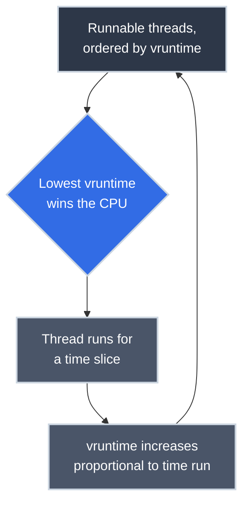

# How the OS Scheduler Actually Decides

!!! tip "Part of a Learning Path"
    This article is a step in the [How Modern Software Really Runs on a CPU](https://bradpenney.io/pathways/cpu-to-cluster) pathway on [bradpenney.io](https://bradpenney.io) — a guided sequence through the topic. It also stands on its own.

`nice -n 19 my_batch_job` gets typed before a backup or a compile, trusting it'll matter, without much idea what reading that number actually does. `top`'s state column shows `R` for a process, and it's a fair question why that's not the same thing as *running*: what actually separates *runnable* from *running*? And "noisy neighbor" incidents on shared boxes keep happening, where one process somehow starves everything else of CPU time it should have been entitled to.

**[Processes and Threads](processes_and_threads.md)** established that the kernel context-switches between runnable threads to create the illusion of simultaneity. It deliberately left one question open: *which thread runs next?* That's the scheduler's entire job.

## Where You Might Have Seen This

- **`nice` and `renice`:** directly adjusting the input to the scheduler's decision, not a vague "priority suggestion" that the OS might honor.
- **A process stuck in `D` state in `top`:** uninterruptible sleep, waiting on I/O, and specifically *not* competing for CPU time at all while it's there.
- **CPU throttling in a container with a CPU limit set**, even though average usage looks fine: a scheduling mechanism, not a bug, and the direct payoff of this article once you reach [Kubernetes resource limits](https://k8s.bradpenney.io/essentials/resource_requests_limits/).
- **A "CPU-bound" process that somehow still feels responsive under load:** modern schedulers actively favor processes that have recently been *waiting* (interactive-feeling work) over ones that have been running flat out, without you configuring anything.

## The Problem: More Runnable Threads Than Cores

At almost any moment, a busy machine has more threads in the **runnable** state (ready to execute, waiting only for a CPU core) than it has cores to run them on. The scheduler's job is to pick, many thousands of times a second, which runnable thread gets the next slice of core time, and for how long.

Get this wrong and the symptoms are specific and painful: an interactive process (a shell, a request handler) waits behind a CPU-hungry batch job and feels laggy even though the machine "isn't that busy" on average; a low-priority background task somehow eats disproportionate CPU; a workload that should be evenly shared instead has one thread monopolizing a core while three others starve.

## Linux's Answer: The Completely Fair Scheduler

Since kernel 2.6.23, Linux's default scheduler for ordinary processes is the **Completely Fair Scheduler (CFS)**. Its guiding idea is genuinely simple, even though the implementation isn't: **every runnable thread should get a share of CPU time proportional to its weight, over any given interval** — as if there were one CPU infinitely divided among every runnable thread at once, and CFS is just simulating that ideal on real, one-thread-at-a-time hardware.

CFS tracks, for every runnable thread, a value called **virtual runtime (`vruntime`)**: roughly, "how much CPU time has this thread actually received, adjusted by its priority weight." The scheduler's decision, at every reschedule point, is almost embarrassingly simple once you see the data structure behind it: **run whichever runnable thread has the lowest `vruntime`.** A thread that's run a lot recently has a high `vruntime` and waits; a thread that's been starved has a low `vruntime` and jumps the queue. Runtime is kept in a red-black tree ordered by `vruntime`, so "find the thread with the least" is a cheap operation, not a scan.



*(Newer kernels, from 6.6 onward, replace CFS with **EEVDF** (Earliest Eligible Virtual Deadline First), a refinement of the same fairness idea with better guarantees about worst-case latency. The `vruntime`-and-fairness mental model above still applies; treat this as CFS's direct successor, not a different philosophy.)*

## `nice`: Adjusting the Weight, Not a Suggestion

`nice` values range from -20 (highest priority) to 19 (lowest), and they aren't a hint the scheduler might consider — they directly set a thread's **weight**, which controls how fast its `vruntime` accumulates. A "nicer" (higher-numbered) process's `vruntime` climbs faster per unit of real CPU time received, so it falls behind in the "lowest `vruntime` wins" race sooner and more often — meaning it gets real CPU time, just proportionally less of it, and reliably so, not as a suggestion the kernel is free to ignore.

```bash title="Watch Priority Actually Change Scheduling Behavior"
nice -n 19 stress --cpu 1 &   # (1)!
stress --cpu 1 &              # (2)!
top -o %CPU                   # (3)!
```

1. Deprioritized CPU-bound load.
2. Normal-priority CPU-bound load, competing for the same core.
3. Watch the `%CPU` column. The normal-priority process consistently receives a larger share, not an exclusive one.

Even at `nice 19`, the deprioritized process still gets *some* CPU time — CFS's fairness guarantee doesn't allow outright starvation for ordinary priority classes, just a smaller proportional share.

## Why This Matters for Production Code

- **Container CPU limits are implemented as a scheduling constraint, not a hard cap on a single moment.** A **[cgroup](https://linux.bradpenney.io/efficiency/namespaces_cgroups/)** CPU quota (covered in depth in [Kubernetes Resource Requests and Limits](https://k8s.bradpenney.io/essentials/resource_requests_limits/)) tells the kernel "this group of threads may only be *scheduled* for X milliseconds out of every Y-millisecond period". The scheduler enforces it by simply refusing to run those threads once the quota's spent for the period, which is the actual mechanism behind CPU throttling with room to spare on the usage graph.
- **"Noisy neighbor" incidents on shared hosts are a fairness-weight problem you can act on.** `nice`/`renice` on a batch job, or `chrt` for real-time priority classes on latency-critical work, are directly manipulating the same `vruntime` mechanism this article describes, not vague tuning knobs.
- **A process in `D` state doesn't compete for CPU scheduling at all.** It's blocked on I/O, off the scheduler's runnable list entirely, which is why a machine can look "not CPU-busy" while still feeling unresponsive: the bottleneck is I/O wait, not the CPU-fairness question this article covers.
- **Real-time or latency-sensitive workloads sometimes need a different scheduling class entirely** (`SCHED_FIFO`, `SCHED_RR` via `chrt`), because CFS's fairness goal is explicitly *not* the same goal as "guarantee this thread runs within N microseconds of becoming runnable" — knowing which goal your workload actually needs prevents reaching for the wrong tool.

## Technical Interview Context

- **"How does the Linux scheduler decide fairness, mechanically?":** the strong answer names `vruntime` and the red-black tree, not just "it tries to be fair" — CFS approximates an ideal of continuous, proportional CPU sharing by always picking the runnable thread that has received the least CPU time so far, adjusted by priority weight.
- **"Why does a CPU limit cause throttling even when average usage looks low?":** because the limit is enforced over fixed periods (commonly 100ms), and a bursty workload can exhaust its entire period's quota in the first few milliseconds, then sit throttled — idle — for the rest of the period, which averages out to a deceptively low number.

## Practice Problems

??? question "Practice Problem 1: Predicting `vruntime` Behavior"

    Two threads at equal priority are both runnable. Thread A has been running heavily for the last second; Thread B just woke up from a long I/O wait. Which one does CFS pick next, and why?

    ??? tip "Solution"
        Thread B. It's been asleep — off the runnable list, accumulating no `vruntime` — while Thread A's `vruntime` climbed the whole time it ran. CFS's "lowest `vruntime` wins" rule means the thread that's received the least CPU time recently jumps ahead, which is exactly the mechanism that makes interactive, I/O-bound processes (a shell, a request handler that mostly waits on the network) feel snappy even on a busy machine: they're rarely running, so their `vruntime` rarely climbs, so they win the next slot as soon as they're ready.

??? question "Practice Problem 2: `nice` vs. a Hard Limit"

    A teammate says `nice -n 19` on a batch job "limits it to almost no CPU." Is that accurate?

    ??? tip "Solution"
        Not quite — `nice` adjusts *relative* weight, not an absolute ceiling. At `nice 19` against normal-priority competitors, the job gets a much smaller proportional share of CPU time, but CFS still guarantees it *some* share; it isn't starved to zero. An actual hard ceiling ("this may never exceed X% of a core, full stop") is a different mechanism: a cgroup CPU quota, the same one behind [Kubernetes CPU limits](https://k8s.bradpenney.io/essentials/resource_requests_limits/).

## Key Takeaways

| Concept | What It Means |
|---|---|
| **CFS (Completely Fair Scheduler)** | Linux's default scheduler: approximates giving every runnable thread a proportional, continuous share of CPU |
| **`vruntime`** | Per-thread accumulated, weight-adjusted CPU time; the scheduler always favors the lowest value |
| **`nice`** | Directly sets scheduling weight: changes proportional share, does not set a hard ceiling |
| **Runnable vs. blocked (`R` vs. `D`)** | Only runnable threads compete for scheduling at all; blocked threads are off the list entirely |
| **cgroup CPU quota** | A hard ceiling enforced by refusing to schedule a group's threads once a period's budget is spent — the mechanism behind container CPU throttling |

This exact problem (many contenders, one resource, a rule for who goes next) doesn't disappear once your process is wrapped in a container. It just moves up one level of altitude: from threads competing for a core, to Pods competing for a Node, decided by a completely different piece of software solving the same shape of problem.

## What's Next

Linux runs the overwhelming majority of production servers, cloud instances, and containers, which is why this scheduling theory is worth seeing applied to one specific, real operating system rather than staying abstract. (Windows and macOS have their own process and scheduling models, worth knowing on their own terms — just not the default here.) **[Linux Processes](https://linux.bradpenney.io/essentials/processes/)** picks up this theory on a real machine.

If you're following the [How Modern Software Really Runs on a CPU](https://bradpenney.io/pathways/cpu-to-cluster) pathway on [bradpenney.io](https://bradpenney.io), this is exactly where it continues.

---

## Further Reading

### Related Reading

- **[Processes and Threads](processes_and_threads.md):** the context switch this article's scheduler decides *when* to trigger.
- **[Operating System Basics](operating_system_basics.md):** the kernel privilege boundary the scheduler itself runs inside.

### External Resources

- [CFS Scheduler documentation (kernel.org)](https://docs.kernel.org/scheduler/sched-design-CFS.html): the canonical technical reference, straight from the kernel source tree.
- [`nice(1)` man page](https://man7.org/linux/man-pages/man1/nice.1.html): the command referenced above, in full.
