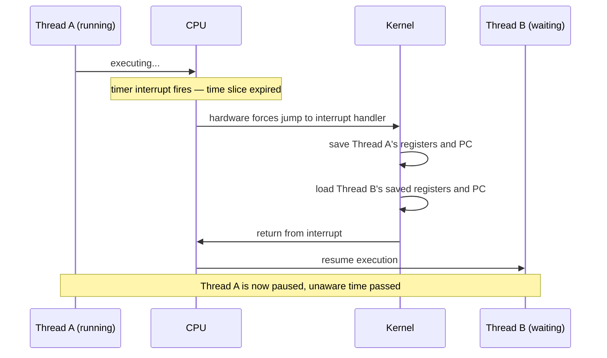

# Processes and Threads: What the OS Actually Schedules

!!! tip "Part of a Learning Path"
    This article is a step in the [How Modern Software Really Runs on a CPU](https://bradpenney.io/pathways/cpu-to-cluster) pathway on [bradpenney.io](https://bradpenney.io) — a guided sequence through the topic. It also stands on its own.

A Python service pinning one CPU core at 100% while seven others sit idle gets explained away with "the GIL" (Global Interpreter Lock) — an answer most engineers accept without quite knowing what it's explaining. A race condition that only shows up in production, never locally, gets filed under "threading issue" as if that settles anything. `nginx` answers concurrency with a handful of worker *processes*; Node answers it with a single *thread* somehow handling thousands of connections — two completely different answers to what looks like the same problem.

Both of those are real architectural choices, and the choice is between two different units the operating system schedules: the **process** and the **thread**.

## Where You Might Have Seen This

- **The Python GIL:** a rule that only one thread in a CPython process may execute Python bytecode at a time, which only matters *because* threads share memory in the first place.
- **`nginx`'s worker processes** vs. **Node.js's single-threaded event loop:** two opposite bets about whether isolation or shared-memory speed matters more for a web server's workload.
- **A crash in one browser tab that doesn't take down the whole browser:** modern browsers run each tab as a separate OS process specifically to buy that isolation.
- **`ulimit -u` or a container's PID limit:** a cap on how many processes (not threads) a user or container may create, because each one carries real OS overhead.

## The Process: An Isolated Universe

A **process** is a running instance of a program, and the operating system gives it everything **[The Stack, the Heap, and Virtual Memory](../../essentials/stack_heap_virtual_memory.md)** described as private: its own virtual address space, its own file descriptors, its own security context (which user it runs as). Two processes cannot see or corrupt each other's memory. Not because they're polite, but because their virtual addresses don't even translate into the same physical RAM.

That isolation is valuable and expensive at the same time. Valuable, because one process crashing doesn't take down another — the reason the Chrome browser moved from one giant process to one-process-per-tab, and the entire reason containers can run untrusted or unrelated workloads on the same kernel without them interfering. Expensive, because creating a process means the kernel building an entirely new virtual address space, page tables, and set of kernel data structures from scratch: real, measurable work.

## The Thread: Doing Several Things, Sharing One Address Space

A **thread** is a separate sequence of execution *within* a process — its own program counter, its own tiny stack, but sharing that process's heap, file descriptors, and everything else. Spawning a new thread is far cheaper than a new process, because there's no new address space to build — just a new execution context inside the one that already exists.

That shared memory is the entire trade. It's what makes threads fast to create and fast to communicate through (no serialization, no IPC — just a shared variable). It's also what makes them dangerous: two threads writing the same variable at the same time, with no coordination, produce a **race condition** — a bug whose entire cause is that the OS makes no promise about which thread's instructions interleave with which. Locks, mutexes, and Python's GIL all exist to put rules back on top of a mechanism that, left alone, guarantees nothing about ordering.

| | Process | Thread |
|---|---|---|
| **Memory** | Fully isolated: separate virtual address space | Shared with every other thread in the same process |
| **Creation cost** | High: new address space, page tables, kernel structures | Low: reuses the existing address space |
| **Crash impact** | Contained to that process | Can corrupt or crash the entire process |
| **Communication** | Explicit: pipes, sockets, shared memory segments | Implicit: just read or write a shared variable |
| **Failure mode** | Isolated crash | Race conditions, deadlocks |

## The Switch That Makes This All Look Simultaneous

A CPU core runs exactly one instruction stream at a time. If there are more runnable threads than cores, which is almost always true, the illusion of everything happening "at once" comes from **context switching**: the kernel periodically stops the running thread, saves its state (registers, program counter — everything needed to resume it later, exactly where it left off), and loads a different thread's saved state in its place.

*What decides when this switch happens, and which thread runs next, is the kernel's **[scheduler](os_scheduler.md)**.*

Like the syscall crossing from **[Operating System Basics](operating_system_basics.md)**, a context switch isn't free — saving and restoring CPU state costs real cycles, and switching between threads of *different processes* costs more still, because the memory management unit has to reload an entirely different page table too. This is the mechanism behind **thrashing**: run far more active threads than you have cores, and the CPU spends a growing share of its time switching between work instead of doing any of it.

## Concurrency vs. Parallelism

These two words get used interchangeably and shouldn't be:

- **Concurrency** is *structuring* a program as multiple independent, interleavable tasks — true even on a single core, via context switching. A single-threaded `async` event loop is concurrent: many tasks in flight, one at a time, none of them blocking the others for long.
- **Parallelism** is *actually running* more than one instruction stream at the exact same instant, which requires more than one CPU core.

A single-core machine can be concurrent but never parallel. A multi-core machine doing genuinely independent work on each core is both.

## Why This Matters for Production Code

- **"Why doesn't adding more threads make my Python CPU-bound code faster?":** the GIL means only one thread executes Python bytecode at a time, so extra threads buy you concurrency (useful for I/O-bound waiting) but not parallelism for CPU-bound work. `multiprocessing` (separate processes, separate GILs) is the actual fix, at the cost of process-creation overhead and explicit inter-process communication.
- **Choosing processes vs. threads for a service architecture is an isolation-vs-speed trade, made explicit.** `nginx`'s multi-process model survives a worker crash without taking down the server; Node's single thread avoids the memory and creation overhead of processes entirely, betting that async I/O covers most of the workload without needing true parallelism.
- **A "hang" that's actually thrashing looks identical to a hang that's actually blocked I/O** until you check context-switch rate (`vmstat`, `pidstat -w`) — high, sustained switching between too many runnable threads is a distinct, diagnosable problem from a thread stuck waiting on a lock or a socket.
- **Container CPU limits interact directly with thread count.** A container limited to one CPU but running a service that spawns eight worker threads doesn't get eight cores' worth of concurrency. It gets one core, aggressively context-switched between eight contenders, which is usually worse than fewer threads would have been.

## Technical Interview Context

- **"What's the actual difference between concurrency and parallelism?":** the sharpest answer draws the single-core case explicitly: a single-core machine can be concurrent (interleaved via context switching) but can never be parallel, because parallelism requires more than one thing physically executing at once.
- **"Why is thread creation cheaper than process creation?":** the mechanism, not just the fact: a new thread reuses the parent process's existing virtual address space and page table, where a new process requires the kernel to build both from scratch.

## Practice Problems

??? question "Practice Problem 1: Diagnosing a Race Condition"

    Two threads in the same process both increment a shared counter (`counter += 1`) a million times each, with no locking. The final value is reliably less than two million. Why?

    ??? tip "Solution"
        `counter += 1` isn't one hardware instruction. It's read the current value, add one, write it back (echoing the multi-instruction reality from **[What Actually Happens When Your Code Runs](../../essentials/cpu_and_machine_code.md)**). If a context switch lands between the read and the write, both threads can read the same value, each add one, and each write back the same result — one increment is silently lost. With no lock, there's no guarantee that "read, add, write" happens as one uninterrupted unit for either thread.

??? question "Practice Problem 2: Process or Thread?"

    You're designing a service that runs untrusted, user-submitted code snippets and returns the result. Should each snippet run in its own thread or its own process?

    ??? tip "Solution"
        Process, without much debate. Untrusted code is exactly the case isolation exists for — a process boundary means a crashing, memory-corrupting, or malicious snippet can't touch the service's own memory or any other snippet's. The higher creation cost is the correct price to pay here; a shared-memory thread would hand untrusted code a direct line into everything else running in the same address space.

## Key Takeaways

| Concept | What It Means |
|---|---|
| **Process** | An isolated unit with its own virtual address space: expensive to create, safe to crash |
| **Thread** | A lightweight execution context sharing its process's memory: cheap to create, dangerous to share carelessly |
| **Context switch** | The kernel saving one thread's state and loading another's — the mechanism behind "simultaneous" execution |
| **Race condition** | Two threads accessing shared memory with no coordination, and no guaranteed ordering |
| **Concurrency vs. parallelism** | Structuring work as interleavable (possible on one core) vs. actually running it at once (needs multiple cores) |

Which threads or processes run *when* isn't left to chance. It's a deliberate decision made thousands of times a second by a specific piece of kernel code with its own rules and trade-offs.

## What's Next

**[How the OS Scheduler Actually Decides](os_scheduler.md)** covers exactly that: the algorithm choosing who runs next, every time a context switch happens.

---

## Further Reading

### Related Reading

- **[Operating System Basics](operating_system_basics.md):** the privilege boundary and syscall mechanism a context switch operates alongside.
- **[The Stack, the Heap, and Virtual Memory](../../essentials/stack_heap_virtual_memory.md):** the isolated address space a process gets and a thread shares.
- **[How the OS Scheduler Actually Decides](os_scheduler.md):** what actually triggers and governs the context switch described here.
- **[Is This Whole Stack Healthy? (python.bradpenney.io)](https://python.bradpenney.io/efficiency/stack_health/):** the GIL and shared-memory trade-off covered here, applied to a real task — when threading a fan-out of network calls actually helps, and why it stops helping the moment the work turns CPU-bound.

### External Resources

- [The Python GIL, explained (Real Python)](https://realpython.com/python-gil/): the concrete, language-specific case of the shared-memory trade-off covered above.
- [Linux `pidstat` man page](https://man7.org/linux/man-pages/man1/pidstat.1.html): `-w` shows context switches per process, the diagnostic tool mentioned above.
