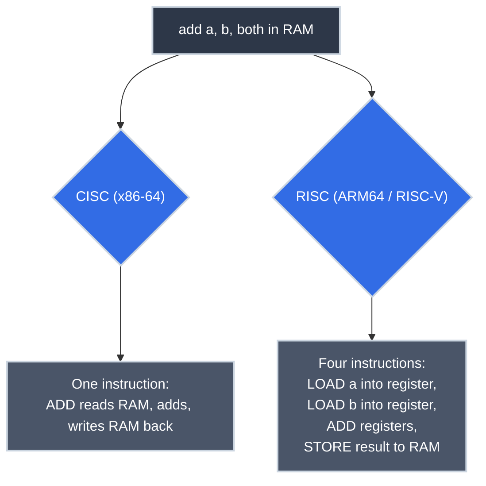

# x86, ARM, and RISC-V: Why Your CPU's Instruction Set Isn't a Detail

<!-- PATHWAY_ROADMAP:START -->
<div class="pathway-pills" markdown>
:material-map-marker-path: <span class="pathway-pills__label">Part of a deep dive:</span> [Operating Systems](operating_system_basics.md){: .pathway-pill }
</div>

??? abstract ":material-map-legend: Consult the map"

    <div class="grid cards" markdown>

    -   :material-desktop-classic: __Operating Systems__ — step 4 of 4

        ---

        ← [How the OS Scheduler Actually Decides](os_scheduler.md) · **you are here** · *(last step)* →

        [Start the deep dive →](operating_system_basics.md)

    </div>
<!-- PATHWAY_ROADMAP:END -->

You go to download a piece of software (VS Code, Docker, a database client), and the page doesn't hand you one file. It hands you a menu: macOS (Apple Silicon), macOS (Intel), Windows, Linux (x86_64), Linux (ARM64). You already know which one matches your machine, and you click it without a second thought, the same way you already know your shoe size. Stop for a second: why does the *exact same program* need five different downloads to do the exact same job?

That menu is a real engineering decision, made at different points in computing history by different chip designers, and it has consequences you've probably paid for without knowing it — a failed Docker build in CI, a cloud bill, a phone that doesn't need a fan. **[What Actually Happens When Your Code Runs](../../essentials/cpu_and_machine_code.md)** established that every program eventually becomes opcodes for one specific instruction set architecture (ISA). This article is about the two (really three) major answers to what that instruction set should look like, and why the answer was never just a technical footnote.

## Where You Might Have Seen This

- **That download menu itself:** one program, five files, because there's no such thing as a single set of opcodes that runs on every architecture.
- **`exec format error`** running a container built for the wrong architecture. The kernel tried to execute opcodes its CPU doesn't have.
- **`docker buildx build --platform linux/amd64,linux/arm64`:** building the *same* source twice, into two genuinely different sets of machine instructions.
- **AWS Graviton, Google Axion, Azure Cobalt:** cloud providers' own ARM-based server chips, sold specifically on a price-performance advantage.
- **Your phone, tablet, and laptop battery life:** all downstream of a chip design choice made in the 1980s, still paying dividends.

## Two Philosophies for the Same Job

**x86-64** (what almost every laptop, desktop, and traditional cloud server runs) is a **CISC** (Complex Instruction Set Computer) design. Its instructions are *variable-length* (anywhere from 1 to 15 bytes) and individually powerful: a single x86 instruction can read from memory, perform arithmetic, and write the result back to memory, all in one opcode, with several different addressing modes for how it locates that memory.

**ARM** (and, differently, **RISC-V**) are **RISC** (Reduced Instruction Set Computer) designs. Instructions are *fixed-length* (32 bits, always, for the mainstream 64-bit instruction sets) and deliberately simple: a **load/store architecture**, where only dedicated `load`/`store` instructions ever touch memory at all, and every arithmetic instruction operates purely on registers.



Same trivial function, same result, genuinely different instructions underneath. Not just different names for the same opcodes.

### Seeing It Happen

Same trivial function, once per language that actually answers the architecture question itself, at build time.

=== ":material-language-go: Go"

    ```go title="add.go" linenums="1"
    package main

    //go:noinline
    func add(a, b int) int {
        return a + b
    }
    ```

    Unlike Python or JavaScript, Go compiles straight to native machine code, so this genuinely has to happen three times. (`//go:noinline` keeps the compiler from inlining `add` away entirely — without it there's nothing left to disassemble.)

    ```bash title="Build for Three Architectures, Then Disassemble Natively"
    GOARCH=amd64   go build -o add-amd64   add.go
    GOARCH=arm64   go build -o add-arm64   add.go
    GOARCH=riscv64 go build -o add-riscv64 add.go

    objdump -d add-amd64          | grep -A2 '<main.add>:'
    aarch64-elf-objdump -d add-arm64   | grep -A2 '<main.add>:'
    riscv64-elf-objdump -d add-riscv64 | grep -A2 '<main.add>:'
    ```

    ```text title="x86-64"
    000000000047a780 <main.add>:
      47a780: 48 01 d8    add    %rbx,%rax
      47a783: c3          ret
    ```

    ```text title="ARM64"
    00000000000845f0 <main.add>:
      845f0: 8b010000    add x0, x0, x1
      845f4: d65f03c0    ret
    ```

    ```text title="RISC-V, RV64GC (compressed extension active — Go's default)"
    000000000006c810 <main.add>:
      6c810: 952e        add a0,a0,a1
      6c812: 00008067    ret
    ```

    Same `go build`, one environment variable, three genuinely different binaries: exactly what `docker buildx --platform` automates for you. All three converge on essentially the same shape here: one register-to-register `add`, one `ret` — the function is trivial enough that architecture barely shows through until the next tab, where `-O0` stops smoothing that over.

=== ":material-language-rust: Rust"

    ```rust title="add.rs" linenums="1"
    #[no_mangle]  // (1)!
    pub extern "C" fn add(a: i32, b: i32) -> i32 {
        a + b
    }
    ```

    1. Without this, Rust mangles the symbol into something like `_ZN3add3add17h...E` to support overloading and generics. `#[no_mangle]` keeps the symbol readable as plain `add` in the disassembly below — it changes nothing about the generated instructions.

    Also compiled ahead of time, also needs a build per target. `--emit=obj` skips linking entirely, since disassembling one function doesn't need a runnable binary — and sidesteps needing a cross-linker for each target:

    ```bash title="Build for Three Architectures, Then Disassemble Natively"
    rustc -O --target x86_64-unknown-linux-gnu   --crate-type lib --emit=obj add.rs -o add-x86_64.o
    rustc -O --target aarch64-unknown-linux-gnu  --crate-type lib --emit=obj add.rs -o add-arm64.o
    rustc -O --target riscv64gc-unknown-linux-gnu --crate-type lib --emit=obj add.rs -o add-riscv64.o

    objdump -d add-x86_64.o             | grep -A2 '<add>:'
    aarch64-elf-objdump -d add-arm64.o  | grep -A2 '<add>:'
    riscv64-elf-objdump -d add-riscv64.o | grep -A2 '<add>:'
    ```

    ```text title="x86-64"
    0000000000000000 <add>:
       0: 8d 04 37    lea    (%rdi,%rsi,1),%eax
       3: c3          ret
    ```

    ```text title="ARM64"
    0000000000000000 <add>:
       0: 0b000020    add w0, w1, w0
       4: d65f03c0    ret
    ```

    ```text title="RISC-V, RV64GC (compressed extension active — the toolchain's default)"
    0000000000000000 <add>:
       0: 9d2d        addw a0,a0,a1
       2: 8082        ret
    ```

    Optimized Rust collapses to almost nothing on all three: one `add`-family instruction and a return. RISC-V and ARM64 land on nearly the same shape; x86-64's `lea` trick is the odd one out, folding the addition into an address calculation. RISC-V's version here is only 2 bytes per instruction, not 4 — real-world RV64GC toolchains default to the compressed extension, which packs common instructions into 16 bits. The next tab turns compression off deliberately, to compare RISC-V against ARM64's always-4-bytes rule on equal footing.

=== ":material-language-cpp: C++"

    ```cpp title="add.cpp" linenums="1"
    int add(int a, int b) {
        return a + b;
    }
    ```

    Compiled straight to native machine code, same as Go and Rust. The same three-target story:

    ```bash title="Build for Three Architectures, Then Disassemble Natively"
    g++ -O0 -c add.cpp -o add-x86_64.o
    aarch64-elf-g++ -O0 -c add.cpp -o add-arm64.o
    riscv64-elf-g++ -O0 -march=rv64g -mabi=lp64d -c add.cpp -o add-riscv64.o   # (1)!

    objdump -d add-x86_64.o             | grep -A20 '<_Z3addii>:'
    aarch64-elf-objdump -d add-arm64.o  | grep -A20 '<_Z3addii>:'
    riscv64-elf-objdump -d add-riscv64.o | grep -A20 '<_Z3addii>:'
    ```

    1. `-march=rv64g` deliberately excludes the compressed extension (the `C` in `RV64GC`), so every instruction below is a full 4 bytes — the fair comparison against ARM64's fixed-length rule. The Rust tab above showed what the same function looks like *with* compression on, which is the more common real-world default.

    ```text title="x86-64 Machine Code"
    0000000000000000 <add(int, int)>:
       0:   55                      push   %rbp
       1:   48 89 e5                mov    %rsp,%rbp
       4:   89 7d fc                mov    %edi,-0x4(%rbp)
       7:   89 75 f8                mov    %esi,-0x8(%rbp)
       a:   8b 55 fc                mov    -0x4(%rbp),%edx
       d:   8b 45 f8                mov    -0x8(%rbp),%eax
      10:   01 d0                   add    %edx,%eax
      12:   5d                      pop    %rbp
      13:   c3                      ret
    ```

    Fourteen bytes across 9 instructions, none the same length: `push` is one byte, `mov %esi,-0x8(%rbp)` is three. The CISC-style `mov` freely reads and writes memory at `-0x4(%rbp)` directly; nothing here is dedicated purely to load or store.

    ```text title="ARM64 Machine Code"
    0000000000000000 <_Z3addii>:
       0:   d10043ff    sub    sp, sp, #0x10
       4:   b9000fe0    str    w0, [sp, #12]
       8:   b9000be1    str    w1, [sp, #8]
       c:   b9400fe1    ldr    w1, [sp, #12]
      10:   b9400be0    ldr    w0, [sp, #8]
      14:   0b000020    add    w0, w1, w0
      18:   910043ff    add    sp, sp, #0x10
      1c:   d65f03c0    ret
    ```

    Every instruction exactly 4 bytes: fixed-length, always. `w0`/`w1` get explicitly `str`'d to the stack and `ldr`'d back before the `add` itself: the load/store discipline, spelled out as separate steps. (The symbol is the C++-mangled `_Z3addii` — "`add`, taking two `int`s" — rather than plain `add`; unlike the Rust tab, this one has no `extern "C"` telling the compiler to skip mangling.)

    ```text title="RISC-V Machine Code (base ISA, compressed extension disabled)"
    0000000000000000 <_Z3addii>:
       0:   fe010113    addi   sp,sp,-32
       4:   00113c23    sd     ra,24(sp)
       8:   00813823    sd     s0,16(sp)
       c:   02010413    addi   s0,sp,32
      10:   00050793    mv     a5,a0
      14:   00058713    mv     a4,a1
      18:   fef42623    sw     a5,-20(s0)
      1c:   00070793    mv     a5,a4
      20:   fef42423    sw     a5,-24(s0)
      24:   fec42783    lw     a5,-20(s0)
      28:   00078713    mv     a4,a5
      2c:   fe842783    lw     a5,-24(s0)
      30:   00f707bb    addw   a5,a4,a5
      34:   0007879b    sext.w a5,a5
      38:   00078513    mv     a0,a5
      3c:   01813083    ld     ra,24(sp)
      40:   01013403    ld     s0,16(sp)
      44:   02010113    addi   sp,sp,32
      48:   00008067    ret
    ```

    Both RISC designs share the same discipline as ARM64 — explicit stack spills, explicit reloads, `add`/`addw` only ever touching registers, never memory directly — but RISC-V's `-O0` output here is noticeably longer: a real frame pointer (`s0`) saved and restored alongside the return address, and an extra `sext.w` to sign-extend the 32-bit result before it's usable as a 64-bit value. Same RISC philosophy, a chattier compiler at this specific optimization level. x86-64 is still the one that looks fundamentally different, because it's the only CISC design of the three.

!!! tip "Where Are Python, JavaScript, and Java?"
    Not shown above on purpose. None of them produce architecture-specific machine code from your source directly — they compile to bytecode for their own virtual machine first (CPython's bytecode, V8's, the JVM's), and that bytecode is identical whether it ends up running on x86-64, ARM64, or RISC-V. The extra step that eventually gets *them* to real machine code (a JIT compiler, at runtime) is covered in [Compilers vs. Interpreters](../compilers_vs_interpreters.md). The three languages above skip straight to the hardware, which is the actual subject of this article.

## Why Fixed-Length, Simple Instructions Win on Power

A CPU has to **decode** every instruction before executing it: work the **[fetch-decode-execute cycle](../../essentials/cpu_and_machine_code.md)** does billions of times a second. The two designs pay a very different price for that.

=== ":material-cpu-64-bit: x86-64 (Variable-Length Decode)"

    Variable-length x86 instructions mean the decoder doesn't know how many bytes the *next* instruction is until it's finished decoding the current one — decoding has to happen mostly in sequence. Modern x86 chips burn real silicon and real power on a dedicated stage that translates these variable-length instructions into simpler internal micro-ops before they even run.

=== ":material-chip: ARM & RISC-V (Fixed-Length Decode)"

    Fixed-length instructions sidestep that entirely: the decoder always knows exactly where the next instruction starts, so multiple instructions can be fetched and decoded in parallel with much simpler circuitry. Simpler decode logic means fewer transistors switching per instruction: less heat, less power drawn. This is the actual mechanism behind "ARM chips run cool enough for a phone with no fan."

!!! tip "How Much Credit Does the ISA Actually Deserve?"
    Apple Silicon's well-known performance-per-watt lead isn't *purely* "RISC beats CISC." It also reflects a genuinely different chip design (unified memory shared between CPU and GPU, an unusually wide out-of-order execution engine, a leading-edge manufacturing process) that a CISC chip couldn't easily copy without hitting the same decode-complexity wall. The ISA sets the ceiling; the implementation decides how close to it you actually get.

## RISC-V: The Open Standard Among RISC Designs

**RISC-V is an open standard**: the specification is public, and anyone can design a chip that implements it without paying a license fee. That's a different thing from what ARM is: a separate, independently designed RISC instruction set, not a version of RISC-V and not built on it.

| | ARM | RISC-V |
|---|---|---|
| **Governed by** | ARM Holdings, a company | RISC-V International, an open standards body |
| **License fee** | Yes: every chip maker pays | None |
| **Who can implement it** | Licensees only | Anyone |
| **Extensibility** | Fixed by ARM Holdings | Modular: base ISA plus optional standardized extensions |

Put plainly: x86-64, ARM, and RISC-V are three separate, mutually incompatible instruction sets, the same relationship the disassembly tabs above already showed you, just extended to a third one. What RISC-V changes isn't the design so much as *who's allowed to build one*, and that combination (genuinely free, genuinely modular) is why it's showing up fastest in exactly the places where paying an ARM license or carrying x86's legacy baggage makes the least sense: microcontrollers, custom accelerator chips, and a growing number of cloud providers building their own silicon rather than licensing someone else's design.

## Why This Matters for Production Code

- **"Works on my M-series Mac, fails in x86 CI" is an architecture bug, not a Docker bug.** A container image built for `linux/arm64` contains ARM64 opcodes; an x86-64 CI runner's kernel can't execute them: `exec format error` is the honest, correct response, not a flaky pipeline.
- **Multi-arch images are a build-time decision, not a runtime one.** `docker buildx build --platform linux/amd64,linux/arm64 -t myimage:tag --push .` compiles the same source twice and publishes both under one **manifest list**: a "fat manifest" that lets `docker pull` transparently fetch the right architecture's image for whatever machine is asking.
- **AWS Graviton's price-performance advantage is a direct consequence of this article, not a marketing trick.** Simpler decode logic and lower power draw per instruction translate into real, measurable throughput-per-dollar gains for the same workload, which is also exactly why it isn't free: anything relying on x86-specific instructions (some SIMD-heavy numerical code, certain JIT runtimes with x86-only fast paths) needs verification, not just a recompile.
- **Cross-compiling is generating a genuinely different program, not translating one.** `GOARCH=arm64 go build` doesn't "convert" your x86 binary. The compiler emits ARM64 opcodes from your source directly, the same as building for x86-64 does, just targeting the other ISA from the start.

## Technical Interview Context

- **"Why does ARM tend to be more power-efficient than x86 for the same workload?":** the mechanism, not the reputation: fixed-length instructions let the decoder work in parallel with simpler circuitry, where x86's variable-length instructions require a dedicated, power-hungry decode stage that translates them into simpler micro-ops before execution — plus, be ready to note that implementation choices (like Apple Silicon's unified memory) compound this, they don't fully explain it alone.
- **"What's the practical difference between ARM and RISC-V?":** both are RISC philosophically; the real-world difference is licensing and governance — ARM is a licensed, company-controlled architecture, RISC-V is an open standard anyone can implement free of royalties, which is why RISC-V adoption is concentrated in cost-sensitive and custom-silicon use cases.

## Practice Problems

??? question "Practice Problem 1: Reading the Instruction Count"

    In the C++ tab, the x86-64 disassembly has 9 instructions; the ARM64 version has 8, but 4 of them (`sub`, two `str`s, and the final `add sp, sp`) exist purely to manage the stack. Why does ARM need explicit stack management instructions that x86 handles more implicitly here?

    ??? tip "Solution"
        Trick framing — x86 needs stack management too (`push %rbp` / `mov %rsp,%rbp` in the x86 version are doing the same job), it's just that CISC's richer addressing modes let some of that bookkeeping ride along inside instructions that are *also* doing something else. RISC's fixed-length, one-job-per-instruction philosophy means the same conceptual work — reserve stack space, spill a register, restore it — has to appear as its own separate, explicit instruction every time. More instructions, but every one of them is simpler and takes the same fixed time to decode.

??? question "Practice Problem 2: Multi-Arch in Practice"

    A team builds a container image only on their ARM-based M-series laptops and pushes to a registry without using `docker buildx --platform`. Their x86-64 production Kubernetes nodes then fail to pull and run it. What's the actual mechanism, and what's the fix?

    ??? tip "Solution"
        The image was built containing ARM64 machine code, and a plain `docker build` on an ARM Mac only ever targets the architecture of the machine building it, by default. Pulling it onto an x86-64 node hands that node's kernel opcodes its CPU doesn't have — `exec format error`, if it doesn't run under an emulation layer first. The fix is `docker buildx build --platform linux/amd64,linux/arm64 ... --push`, which cross-compiles for both architectures in one build and publishes a manifest list so each node's `docker pull` transparently gets the opcodes its own CPU actually understands.

## Key Takeaways

| Concept | What It Means |
|---|---|
| **CISC (x86-64)** | Variable-length, powerful instructions; can touch memory and do arithmetic in one instruction |
| **RISC (ARM, RISC-V)** | Fixed-length, simple instructions; only dedicated load/store instructions touch memory |
| **Why RISC saves power** | Simpler, parallel-friendly decode logic: no dedicated stage to untangle variable-length instructions |
| **RISC-V** | RISC philosophy, but an open, royalty-free, modular standard: not owned by one company |
| **Manifest list ("fat manifest")** | One tag, multiple architecture-specific images underneath, resolved automatically on pull |

Which instruction set your code compiles down to is a real design decision, not a technicality: one with real consequences for power, cost, and whether your container even runs where you pointed it. A phone's battery life and a cloud bill both trace back to the same choice, made differently by different chip designers, decades apart.

## What's Next

Back in **[What Actually Happens When Your Code Runs](../../essentials/cpu_and_machine_code.md)**, the six-language disassembly tabs showed *what* machine code looks like on one ISA. Now you know why choosing the other one is a real decision, not a formality.

---

## Further Reading

### Related Reading

- **[What Actually Happens When Your Code Runs](../../essentials/cpu_and_machine_code.md):** the fetch-decode-execute cycle every one of these ISAs implements, just differently.
- **[Compilers vs. Interpreters](../compilers_vs_interpreters.md):** how source code becomes opcodes for whichever ISA you're targeting.

### External Resources

- [Compiler Explorer (Godbolt)](https://godbolt.org/) — compile the same source for x86-64, ARM64, and RISC-V side by side, live.
- [RISC-V International](https://riscv.org/): the open standard's official technical specifications.
- [AWS Graviton documentation](https://aws.amazon.com/ec2/graviton/): the real-world cloud economics case for ARM in the server room.
