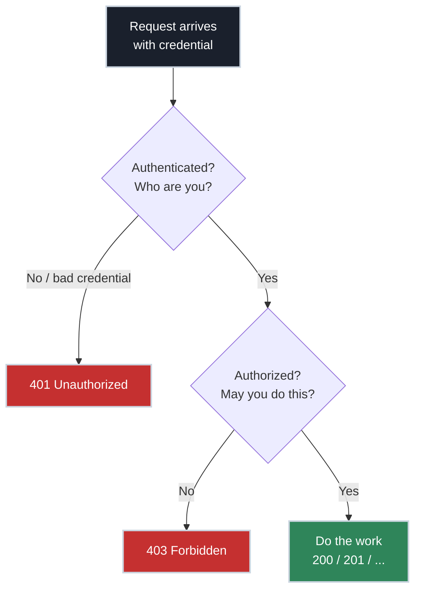

# Authentication vs Authorization in APIs, Clearly

!!! tip "Part of a Learning Path"
    This article is part of the [How APIs Actually Work](https://bradpenney.io/pathways/how-apis-work) pathway on [bradpenney.io](https://bradpenney.io) — a guided sequence through the topic. It also stands on its own.

You've configured plenty of auth: pasted API keys, generated bearer tokens, set up OAuth in a client. You understand the *design concepts* of authenticating a request. But there's a layer underneath that stays muddy — *where* in the flow the check actually happens, why two different things both get called "auth," and what you're really deciding when you "secure an endpoint."

It comes apart cleanly once you see it as **two distinct questions, asked in order, on every single request**:

1. **Authentication** — *Who are you?* (Can you prove your identity?)
2. **Authorization** — *What are you allowed to do?* (Given who you are, may you do this?)

They sound similar and get abbreviated to the same "auth," which is exactly why they blur. Keep them separate and securing an API becomes a clear, two-step decision.

This rests on two earlier ideas: [statelessness](http_statelessness.md) (why identity must travel on every request) and [the request anatomy](anatomy_of_request_response.md) (the `Authorization` header it travels in).

## The Distinction in One Analogy

Think of an office building:

- **Authentication** is the **badge scan at the front door**. It proves you are who you claim to be. Either your badge is valid or it isn't.
- **Authorization** is **which doors your badge opens** once you're inside. You're a verified employee — but the server room and the CFO's office are still off-limits.

Authentication happens **first** and is about **identity**. Authorization happens **second** and is about **permission**. You can pass one and fail the other: a valid badge (authenticated) that won't open the server room (not authorized).

These two outcomes map onto two status codes you already know:

- `401 Unauthorized` → authentication failed. *We don't know who you are.* (Misnamed — it really means "unauthenticated.")
- `403 Forbidden` → authentication succeeded, authorization failed. *We know exactly who you are, and the answer is no.*

## Where You've Seen This

When an API returns `401`, re-pasting a fresh token fixes it — that's an *authentication* problem. When it returns `403` no matter how valid your token is, you lack *permission* — a different problem entirely, and a new token won't help.

## Authentication: Three Ways to Prove Identity

Because HTTP is [stateless](http_statelessness.md), the proof of identity must ride on *every* request, almost always in the `Authorization` header. Three common credentials, from simplest to richest:

<div class="grid cards" markdown>

-   :material-key: __API Keys__

    ---

    A single long secret string identifying the *caller* (usually an app or service, not a human).

    `Authorization: Bearer sk_live_a1b2c3...`

    Simple to issue and use. But it's a static password: if it leaks, it's fully usable until rotated, and by itself it carries no expiry or fine-grained identity.

-   :material-cookie: __Session IDs__

    ---

    An opaque ID in a cookie pointing to a session record the server stored at login.

    `Cookie: session=9f2b...`

    The server looks it up to learn who you are. Easy to revoke (delete the record); the classic choice for browser-based apps.

-   :material-passport: __Signed Tokens (JWT)__

    ---

    A self-contained, cryptographically signed token that *carries* the identity (and often permissions) inside it.

    `Authorization: Bearer eyJhbGc...`

    No server lookup needed — the signature proves authenticity. Fast and scalable, but hard to revoke before expiry.

</div>

The session-vs-token trade-off (where the state lives, how revocation works) is the same one from [statelessness](http_statelessness.md) — here we're noting that each is, at its core, *a way to answer "who are you?"* on a stateless protocol.

!!! warning "The protocols sit on top of these"

    OAuth 2.0 and OpenID Connect — the flows you've configured — are *orchestration* layers that decide how a client safely *obtains* one of these credentials (typically a signed token) from an identity provider. Worth keeping straight: **OAuth 2.0** is about *authorization* — obtaining an **access token** to call an API on your behalf — while **OpenID Connect (OIDC)** layers on *authentication*, adding an **ID token** that proves *who you are*. (They're constantly conflated; naming which is which is a reliable interview signal.) Either way, they're machinery for getting the credential, not a fourth kind of proof. The full flows are a topic of their own; the mental model here is: however the token was obtained, it still answers exactly one question — *who are you?*

## Authorization: The Check That Decides Yes or No

Once the server knows *who* you are, authorization decides whether this specific request is allowed. This is almost always **your application's logic**, because only your app knows your rules:

- *Does this user own order 88, or are they trying to read someone else's?*
- *Is this user an admin, so they may delete other users?*
- *Has this account's plan paid for the feature being requested?*

Two common models you'll hear named:

- **RBAC (Role-Based Access Control)** — permissions attach to *roles* (`admin`, `editor`, `viewer`), and users get roles. "Admins may delete." Simple and the default for most systems.
- **ABAC (Attribute-Based Access Control)** — decisions use *attributes* of the user, resource, and context. "A user may edit a document *if they're in the same department* and *it's during business hours*." More flexible, more complex.

The detail that prevents real breaches: **authorization must check the relationship between *this* user and *this* resource**, not just a generic role. "Is the user logged in?" is not authorization. "Does *this* logged-in user own the order they're requesting?" is.

## The Two Checks in Sequence

Every protected request runs the gauntlet in order. Fail fast at each gate.



## Where Each Check Physically Happens

This is the part that resolves the muddiness, and it's a real design decision:

- **Authentication is often *offloaded* to the edge.** A [reverse proxy or API gateway](https://networking.bradpenney.io/efficiency/api_gateways/reverse_proxies_and_gateways/) sitting in front of your app can verify a token's signature and reject `401`s *before traffic ever reaches your code*. This centralizes credential checking and keeps invalid traffic out.
- **Authorization almost always stays in *your application*.** The gateway can confirm "this is a valid token for user 42," but only your app knows whether user 42 owns order 88. Business-rule permission checks live with the business logic.

So a typical request is authenticated at the gateway and authorized in the service. Knowing this split tells you *where to put which check* — and stops you from either duplicating auth everywhere or, worse, assuming the gateway handled authorization when it only handled authentication.

A concrete form of this offloading is a **sidecar auth proxy** — a small proxy deployed alongside your service that runs the credential checks before requests reach your code. [forevd](https://github.com/firestoned/forevd), for example, externalizes authentication (mTLS or OIDC) and *coarse* authorization (is the caller in an allowed LDAP group or user list?) out of the application, while the per-object, business-rule authorization still lives in the service. It's one of several tools in this space — gateways, service meshes, and sidecars all overlap here.

!!! info "Disclosure"
    I contribute to forevd. It's referenced here as one example of the sidecar auth pattern, not an endorsement.

## Sending and Checking a Credential

The client side is uniform across languages — attach the credential to every request:

=== ":material-language-python: Python"

    ```python title="Authenticated request" linenums="1"
    import requests
    resp = requests.get(
        "https://api.example.com/orders/88",
        headers={"Authorization": f"Bearer {token}"},  # (1)!
    )
    if resp.status_code == 401:   # (2)!
        print("Not authenticated — refresh the token")
    elif resp.status_code == 403: # (3)!
        print("Authenticated, but not allowed")
    ```

    1. The proof of identity rides on every call (statelessness demands it).
    2. `401` → the *who are you* check failed.
    3. `403` → identity was fine; the *may you* check failed.

=== ":material-language-javascript: JavaScript"

    ```javascript title="Authenticated request" linenums="1"
    const resp = await fetch("https://api.example.com/orders/88", {
      headers: { Authorization: `Bearer ${token}` },  // (1)!
    });
    if (resp.status === 401) console.log("Not authenticated");  // (2)!
    else if (resp.status === 403) console.log("Forbidden");     // (3)!
    ```

    1. Credential on every request.
    2. Authentication failure.
    3. Authorization failure.

=== ":material-language-go: Go"

    ```go title="Authenticated request" linenums="1"
    req, _ := http.NewRequest("GET", "https://api.example.com/orders/88", nil)
    req.Header.Set("Authorization", "Bearer "+token)  // (1)!
    resp, _ := http.DefaultClient.Do(req)
    switch resp.StatusCode {
    case 401: // (2)!
        fmt.Println("Not authenticated")
    case 403: // (3)!
        fmt.Println("Forbidden")
    }
    ```

    1. Attach the credential.
    2. Authentication failed.
    3. Authorization failed.

=== ":material-language-rust: Rust"

    ```rust title="Authenticated request" linenums="1"
    let client = reqwest::blocking::Client::new();
    let resp = client
        .get("https://api.example.com/orders/88")
        .header("Authorization", format!("Bearer {token}"))  // (1)!
        .send()?;
    match resp.status().as_u16() {
        401 => println!("Not authenticated"),  // (2)!
        403 => println!("Forbidden"),          // (3)!
        _ => {}
    }
    ```

    1. Attach the credential.
    2. `401` → authentication failed.
    3. `403` → authorization failed.
    4. Free the header list and the handle — libcurl won't, and skipping it leaks.

=== ":material-language-java: Java"

    ```java title="Authenticated request" linenums="1"
    HttpRequest req = HttpRequest.newBuilder()
        .uri(URI.create("https://api.example.com/orders/88"))
        .header("Authorization", "Bearer " + token)   // (1)!
        .build();
    HttpResponse<String> resp =
        client.send(req, HttpResponse.BodyHandlers.ofString());
    switch (resp.statusCode()) {
        case 401 -> System.out.println("Not authenticated");  // (2)!
        case 403 -> System.out.println("Forbidden");          // (3)!
    }
    ```

    1. Attach the credential.
    2. `401` → authentication failed.
    3. `403` → authorization failed.

=== ":material-language-cpp: C++"

    ```cpp title="Authenticated request (libcurl)" linenums="1"
    CURL* curl = curl_easy_init();
    struct curl_slist* headers = nullptr;
    headers = curl_slist_append(headers,
        ("Authorization: Bearer " + token).c_str());   // (1)!
    curl_easy_setopt(curl, CURLOPT_URL, "https://api.example.com/orders/88");
    curl_easy_setopt(curl, CURLOPT_HTTPHEADER, headers);
    curl_easy_perform(curl);
    long status = 0;
    curl_easy_getinfo(curl, CURLINFO_RESPONSE_CODE, &status);
    curl_slist_free_all(headers);                  // (4)!
    curl_easy_cleanup(curl);
    if (status == 401) std::cout << "Not authenticated\n";  // (2)!
    else if (status == 403) std::cout << "Forbidden\n";     // (3)!
    ```

    1. Attach the credential.
    2. `401` → authentication failed.
    3. `403` → authorization failed.

## Why This Matters for Production Code

- **The #1 API vulnerability is broken authorization, not authentication.** The most common real-world breach (industry bodies call it *Broken Object Level Authorization*) is an authenticated user requesting *someone else's* resource — `GET /orders/89` when they own `88` — and the server returning it because it only checked "logged in," not "owns this." Authentication without per-object authorization is a wide-open door.
- **Never authorize on the client.** A front end that hides admin buttons is UX, not security; the user controls the client and can forge the request. Authorization is a *server* decision, every time. (This is the untrusted-client principle from [the lifecycle](client_server_request_response.md).)
- **Right status code, right diagnosis.** Returning `403` for an auth-token problem (should be `401`) or `404` to hide a `403` are real patterns with real consequences for debugging and security audits — get the family right.

## Technical Interview Context

"What's the difference between authentication and authorization?" is nearly guaranteed. The crisp answer: authentication establishes *identity* (who you are), authorization establishes *permission* (what you may do); authentication comes first. The senior-level follow-through is naming *where* each lives — authentication can be centralized at a gateway, authorization belongs with the application that owns the business rules — and citing the classic failure mode: checking that a user is authenticated but not that they're authorized *for the specific resource*, which is the most common API breach in the wild.

## Practice Problems

??? question "Practice Problem 1: Read the Status Code"

    A user reports that one specific endpoint returns `403` for them, but every other endpoint works fine with the same token. Is this an authentication or an authorization problem?

    ??? tip "Solution"

        **Authorization.** The token clearly authenticates them — other endpoints accept it, and a *bad* credential would yield `401` everywhere. A `403` on one endpoint means the server knows who they are and has decided they lack permission *for that specific action*. Issuing a new token won't help; their account needs the right role or ownership of the resource.

??? question "Practice Problem 2: The Dangerous Endpoint"

    An endpoint checks that the request has a valid token, then runs `SELECT * FROM orders WHERE id = :id` using the `id` from the URL and returns it. What's the vulnerability?

    ??? tip "Solution"

        It authenticates but never **authorizes per object**. Any logged-in user can request `GET /orders/<any id>` and receive orders that belong to other people, because the query never checks ownership. This is Broken Object Level Authorization — the most common API breach. The fix is to scope the check to the user: `WHERE id = :id AND owner_id = :current_user` (or an equivalent permission check) so identity alone isn't enough — the user must be allowed *this* resource.

??? question "Practice Problem 3: Where Does It Belong?"

    Your platform team offers an API gateway that validates JWT signatures and rejects invalid tokens. A colleague says, "Great, the gateway handles all our auth — we don't need any checks in the service." Are they right?

    ??? tip "Solution"

        Only half right. The gateway handles **authentication** — it confirms the token is valid and tells your service *who* the caller is. It does **not** handle **authorization**, because it doesn't know your business rules (who owns what, which roles may do what). Those permission checks must still live in your service. Assuming the gateway did authorization is exactly how over-permissive APIs ship.

## Key Takeaways

| Concept | What It Means |
| :--- | :--- |
| **Authentication** | *Who are you?* — proving identity; fails with `401` |
| **Authorization** | *What may you do?* — checking permission; fails with `403` |
| **Order** | Authenticate first, then authorize |
| **Credentials** | API keys, session IDs, signed tokens — all answer "who are you?" |
| **Where checks live** | AuthN can be offloaded to a gateway; authZ belongs in your app |
| **Top breach** | Authenticated user accessing another user's object (missing per-object authZ) |

Securing an endpoint is two questions, never one: *who are you* and *what may you do*. Authentication scans the badge; authorization decides which doors it opens — and the doors are checked by the service that owns them, on the server, on every request. Keep the two questions distinct and in order, and the muddiest part of "how do I secure this?" turns into a checklist you can actually follow.

## Further Reading

### Going Deeper (Mastery)

- **API Design Principles: REST, Idempotency, Versioning** *(Mastery — coming soon)* — where OAuth flows, token lifecycles, and the decisions you can't take back once clients depend on you get the full treatment.

### External Resources

- [OWASP API Security Top 10](https://owasp.org/API-Security/editions/2023/en/0x11-t10/) — broken authorization tops the list for a reason.
- [Auth0: Authentication vs Authorization](https://auth0.com/docs/get-started/identity-fundamentals/authentication-and-authorization) — a clear vendor-neutral explainer.