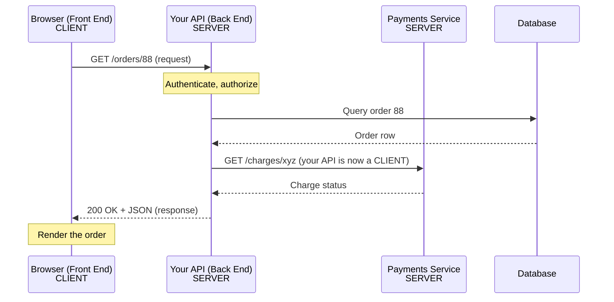

# Client and Server: The Request/Response Lifecycle

!!! tip "Part of a Learning Path"
    This article is part of the [How APIs Actually Work](https://bradpenney.io/pathways/how-apis-work) pathway on [bradpenney.io](https://bradpenney.io) — a guided sequence through the topic. It also stands on its own.

A request leaves your code and, a few milliseconds later, JSON comes back. The bit in between — where "the front end" hands off to "the back end" — is a zone most engineers treat as a black box. It stays a black box right up until someone asks you to *design* that boundary, and then the vague questions turn sharp: what runs where, and who is responsible for what?

The way through is to stop treating the middle as a box and trace it as a sequence. Follow one request from the instant it's initiated to the instant the response renders, name every actor it touches, and the front-end/back-end split stops being a vibe and becomes a diagram you can point at.

This builds on the idea that [an API is a contract](../../essentials/what_is_an_api.md). Here we watch that contract get *executed*, one round trip at a time.

## The Only Two Roles That Exist

Every web interaction, no matter how complex, is built from two roles:

- **The client** — whoever *initiates* the request. It asks for something.
- **The server** — whoever *listens* for requests and *responds*. It answers.

That's the whole model. The hard part is that "client" and "server" are **roles, not machines** — and a single program can play both at different moments.

!!! tip "The insight that clears the fog"

    "Front end" and "back end" are not the same axis as "client" and "server." The front end is almost always a *client*. But your back end is *also a client* whenever it calls another service. The role is defined by **who initiates this particular request**, not by where the code lives.

## Where You've Seen This

Your browser is a client when it loads a page; your back-end service becomes a client the moment it calls the payments API. Same code, different role, depending on who started the conversation.

## A Single Request, Traced End to End

Let's follow one real interaction: a user clicks "View Order" in a web app. Here's every actor the request touches.



Walk through it:

1. **The browser (a client) initiates.** It sends `GET /orders/88` across the network. From this moment it does nothing but wait — it has handed off control.
2. **Your API (a server) receives.** It checks *who* is asking ([authentication](authentication_vs_authorization.md)) and *whether they're allowed* (authorization), then does the work.
3. **Your API becomes a client.** To enrich the response it calls the payments service. For *that* request, your back end is the client and payments is the server. The role flipped.
4. **Your API (server again) responds** to the browser with `200 OK` and a JSON body.
5. **The browser renders.** The round trip is over. The connection can close.

Nothing in that sequence is mysterious once you see that **each arrow is one request/response pair**, and the labels "client" and "server" apply *per arrow*, not per box.

## Why the Front-End/Back-End Split Feels Muddy

The confusion almost always comes from three real overlaps. Naming them dissolves them.

=== ":material-monitor: 'The front end has logic too'"

    Modern front ends (React, Vue) run real code in the browser — validation, routing, state. So it feels like a "back end." But that code is still running on the **client**, on the user's machine, where the user can read and modify all of it. That single fact is why **front-end checks are never security**: anything the client enforces, the client can bypass. The server must re-check everything. The front end's job is *experience*; the back end's job is *truth*.

=== ":material-server: 'The back end calls other back ends'"

    Your service calls payments, which calls a bank, which calls a fraud system. Each hop is a fresh client/server pair. There is no single "the back end" — there's a chain of servers, each acting as a client to the next. Trace one arrow at a time and the chain is simple.

=== ":material-swap-horizontal: 'Who holds the data?'"

    The muddiness peaks around *state*. Where does "the logged-in user" live? Where does the shopping cart live? The answer drives your whole design — and it's subtle enough that [statelessness gets its own article](http_statelessness.md). The short version: by default the server remembers **nothing** between requests, so the client must re-send whatever context the server needs.

## The Same Request in Code

The lifecycle is identical whatever language you write the client in — because they all speak the same contract over the same protocol. Here's the *client* side of one request:

=== ":material-language-python: Python"

    ```python title="A client making one request" linenums="1"
    import requests

    resp = requests.get(  # (1)!
        "https://api.example.com/orders/88",
        headers={"Authorization": "Bearer abc123"},  # (2)!
    )
    print(resp.status_code)  # (3)!
    order = resp.json()      # (4)!
    ```

    1. This line *initiates* — your program is now the client and blocks until the server answers.
    2. The token is how the server will know who's asking — context the client must supply.
    3. The status code is the contract's headline: did it work?
    4. The body is the payload the contract promised.

=== ":material-language-javascript: JavaScript"

    ```javascript title="A client making one request" linenums="1"
    const resp = await fetch(  // (1)!
      "https://api.example.com/orders/88",
      { headers: { Authorization: "Bearer abc123" } }  // (2)!
    );
    console.log(resp.status);   // (3)!
    const order = await resp.json();  // (4)!
    ```

    1. `fetch` initiates the request; `await` waits for the response.
    2. The client supplies its identity on every call.
    3. The status code first, always.
    4. Then the body.

=== ":material-language-go: Go"

    ```go title="A client making one request" linenums="1"
    req, _ := http.NewRequest("GET", "https://api.example.com/orders/88", nil)
    req.Header.Set("Authorization", "Bearer abc123")  // (1)!
    resp, _ := http.DefaultClient.Do(req)             // (2)!
    defer resp.Body.Close()
    fmt.Println(resp.StatusCode)                      // (3)!
    ```

    1. Attach the caller's identity.
    2. `Do` initiates and blocks for the response.
    3. Inspect the status code before trusting the body.

=== ":material-language-rust: Rust"

    ```rust title="A client making one request" linenums="1"
    let client = reqwest::blocking::Client::new();
    let resp = client
        .get("https://api.example.com/orders/88")
        .header("Authorization", "Bearer abc123")     // (1)!
        .send()?;                                      // (2)!
    println!("{}", resp.status());                     // (3)!
    let order: serde_json::Value = resp.json()?;       // (4)!
    ```

    1. Attach the caller's identity.
    2. `send()` initiates and blocks until the server answers.
    3. The status code is the headline.
    4. Then parse the body.

=== ":material-language-java: Java"

    ```java title="A client making one request" linenums="1"
    HttpClient client = HttpClient.newHttpClient();
    HttpRequest req = HttpRequest.newBuilder()
        .uri(URI.create("https://api.example.com/orders/88"))
        .header("Authorization", "Bearer abc123")      // (1)!
        .build();
    HttpResponse<String> resp =
        client.send(req, HttpResponse.BodyHandlers.ofString());  // (2)!
    System.out.println(resp.statusCode());             // (3)!
    String order = resp.body();                        // (4)!
    ```

    1. Attach the caller's identity.
    2. `send` initiates and blocks for the response.
    3. Read the status code first.
    4. Then the body.

=== ":material-language-cpp: C++"

    ```cpp title="A client making one request (libcurl)" linenums="1"
    CURL* curl = curl_easy_init();
    struct curl_slist* headers = nullptr;
    headers = curl_slist_append(headers, "Authorization: Bearer abc123");  // (1)!
    curl_easy_setopt(curl, CURLOPT_URL, "https://api.example.com/orders/88");
    curl_easy_setopt(curl, CURLOPT_HTTPHEADER, headers);
    curl_easy_perform(curl);                            // (2)!
    long status = 0;
    curl_easy_getinfo(curl, CURLINFO_RESPONSE_CODE, &status);  // (3)!
    // the body arrives via a CURLOPT_WRITEFUNCTION callback you register  // (4)!
    curl_slist_free_all(headers);                       // (5)!
    curl_easy_cleanup(curl);
    ```

    1. Attach the caller's identity.
    2. `curl_easy_perform` initiates and blocks for the response.
    3. Read the status code.
    4. The body is delivered through a write callback (C++ has no HTTP client in its standard library, so libcurl is the de facto choice).
    5. Free the header list and the handle — libcurl won't do it for you, so omitting this leaks memory.

Notice what's identical across every one of them: **initiate, wait, read the status, read the body.** That sameness is the contract doing its job — the language is just the kitchen.

!!! danger "Here be dragons: never commit secrets"

    The `Bearer abc123` above is a placeholder. **Never** hardcode a real token, API key, password, or secret into source you commit — once it lands in Git history, it is effectively public and lives there forever (rewriting history won't save you after a push). The fix is the same in every language: read credentials from environment variables or a secrets manager at runtime, and keep them out of the repo entirely.

    ```python title="Read the token from the environment, not the source" linenums="1"
    import os
    token = os.environ["API_TOKEN"]  # (1)!
    headers = {"Authorization": f"Bearer {token}"}
    ```

    1. The secret is supplied by the runtime, never written in code or checked into Git.

    For the full treatment — `.env` files, environment variables, and secrets stores in real Python code — see [Managing Credentials in Python Automation Scripts](https://python.bradpenney.io/essentials/env_and_secrets/).

## Why This Matters for Production Code

- **It tells you where to put security.** Truth lives on the server because the client is untrusted. Validation, authorization, price calculation — server side, every time. The front end may *also* validate for a nicer experience, but it is never the gate.
- **It tells you where latency comes from.** Each arrow is a network round trip. A page that feels slow is often a back end acting as a client to five other services in series. Seeing the chain tells you what to parallelize or cache.
- **It tells you what can fail.** Every arrow can time out or error independently. "The order service is down" might really mean "the payments service your order service depends on is down." Tracing the lifecycle is the first step of every incident.

## Technical Interview Context

A common system-design probe is "walk me through what happens when a user clicks this button." Weak answers jump straight to the database. Strong answers narrate the **lifecycle**: client initiates → request crosses the network → server authenticates and authorizes → server may act as a client to downstream services → server responds → client renders. The detail that separates senior candidates is articulating that **client and server are per-request roles** and that **the client is untrusted, so the server must independently verify everything** — which is exactly why "we validate on the front end" is never a complete answer.

## Practice Problems

??? question "Practice Problem 1: Name the Roles"

    A user's browser calls your API, which calls a third-party email service to send a receipt. In the second call, what role does *your API* play?

    ??? tip "Solution"

        Your API is the **client** in the second call. It *initiated* a request to the email service, which acts as the **server**. Roles are defined per request by who initiates — and your back end is constantly a client to the services it depends on.

??? question "Practice Problem 2: Where's the Gate?"

    Your front end disables the "Delete" button for non-admin users. A curious user re-enables it in their browser's dev tools and clicks it. What stops the deletion?

    ??? tip "Solution"

        **The server must — the front end can't.** The disabled button is a UX nicety running on the *client*, which the user fully controls and just bypassed. The only real protection is the server checking authorization when the delete request arrives. If the server trusts the client's say-so, the record is gone. This is the single most important consequence of the client being untrusted.

??? question "Practice Problem 3: Find the Latency"

    A dashboard takes 4 seconds to load. Your API responds in 50ms when tested alone, but the dashboard calls it after calling three other services one after another, each taking ~1.3s. Where's the time going, and what's one fix?

    ??? tip "Solution"

        The time is in the **chain of downstream requests** — your back end acting as a client to three services *in series* (1.3s × 3 ≈ 4s). Your own code is fast; the round trips aren't. One fix: make the three independent calls **in parallel** instead of sequentially, cutting ~4s to ~1.3s. (Caching results that rarely change is another.) Seeing the lifecycle as a chain of arrows is what makes this obvious.

## Key Takeaways

| Concept | What It Means |
| :--- | :--- |
| **Client** | Whoever initiates a request — defined per request, not per machine |
| **Server** | Whoever listens and responds |
| **Roles flip** | Your back end becomes a client whenever it calls another service |
| **Front end = client** | Runs on the user's machine; fully visible and modifiable by the user |
| **Server holds truth** | The client is untrusted, so the server must re-verify everything |
| **Each arrow = one round trip** | Latency and failure accumulate per hop in the chain |

The front-end/back-end boundary isn't a wall in a building — it's the point where the **client stops and the server starts**, redrawn for every single request. Learn to trace one request, name each actor as it initiates or responds, and remember that the client is never trusted. Do that, and the muddiest part of API design becomes the clearest.

## Further Reading

### Related Reading

- [What an API Actually Is](../../essentials/what_is_an_api.md) — the contract this lifecycle executes.
- [Anatomy of an HTTP Request and Response](anatomy_of_request_response.md) — a close-up of each arrow in the round trip.
- [Why HTTP APIs Forget You: Statelessness](http_statelessness.md) — why the server remembers nothing between these requests.

### External Resources

- [MDN: A typical HTTP session](https://developer.mozilla.org/en-US/docs/Web/HTTP/Session) — the request/response cycle from the protocol's perspective.
- [MDN: Client-Server overview](https://developer.mozilla.org/en-US/docs/Learn/Server-side/First_steps/Client-Server_overview) — a complementary walkthrough.