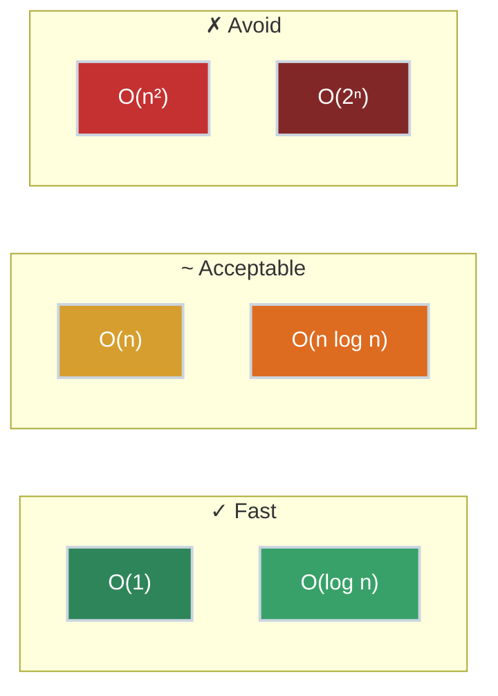

# Big-O Notation: Why Your Code Is Slow

Your PR got rejected. The reviewer said it's "$O(n^2)$" and suggested a "more efficient approach." You nodded, made some changes, and it got approved. But you couldn't quite explain *why* the new version was faster—or predict when your code might become a problem.

**This is the theory you were missing.**

Big-O notation isn't academic gatekeeping. It's the language engineers use to discuss performance, predict scaling issues, and make informed decisions about trade-offs. Understanding it will change how you think about code.

## Where You've Seen This

You've already encountered Big-O thinking, even if you didn't call it that:

- **Database queries**: "This query is fine with 1,000 rows but times out with 1 million"
- **Code review feedback**: "This nested loop will be slow at scale"
- **Production incidents**: "Response times spiked when traffic increased"
- **Interview questions**: "What's the time complexity of your solution?"

Every time someone talks about code "not scaling," they're talking about Big-O.

## What Big-O Actually Measures

Big-O describes how an algorithm's resource usage grows as the input size grows. It answers: **"If I double my input, how much longer will this take?"**

- $O(1)$ — Constant: Time doesn't change with input size
- $O(\log n)$ — Logarithmic: Time grows slowly (doubles input = one more step)
- $O(n)$ — Linear: Time grows proportionally (double input = double time)
- $O(n \log n)$ — Linearithmic: Slightly worse than linear (efficient sorting)
- $O(n^2)$ — Quadratic: Time grows with square of input (double input = 4x time)
- $O(2^n)$ — Exponential: Time doubles with each additional input element



### The Numbers That Matter

| Big-O | n=10 | n=100 | n=1,000 | n=1,000,000 |
|:------|-----:|------:|--------:|------------:|
| $O(1)$ | 1 | 1 | 1 | 1 |
| $O(\log n)$ | 3 | 7 | 10 | 20 |
| $O(n)$ | 10 | 100 | 1,000 | 1,000,000 |
| $O(n \log n)$ | 33 | 664 | 9,966 | 19,931,569 |
| $O(n^2)$ | 100 | 10,000 | 1,000,000 | 1,000,000,000,000 |
| $O(2^n)$ | 1,024 | $1.27 \times 10^{30}$ | $\infty$ | $\infty$ |

That $O(n^2)$ algorithm that runs in 1 second with 1,000 items? With 1 million items, it takes **11.5 days**. That's why Big-O matters.

## Analyzing Your Code

### O(1) — Constant Time

The operation takes the same time regardless of input size.

=== ":material-language-python: Python"

    ```python title="O(1) Examples" linenums="1"
    def get_first(items):
        return items[0]  # (1)!

    def lookup_user(users_dict, user_id):
        return users_dict.get(user_id)  # (2)!

    def check_flag(config):
        return config.get("feature_enabled", False)  # (3)!
    ```

    1. Array index access is O(1) — directly calculated from memory address
    2. Dictionary lookup is O(1) average — hash tables are powerful
    3. Doesn't matter if config has 5 keys or 500

=== ":material-language-javascript: JavaScript"

    ```javascript title="O(1) Examples" linenums="1"
    function getFirst(items) {
        return items[0];  // Array index access
    }

    function lookupUser(usersMap, userId) {
        return usersMap.get(userId);  // Map lookup is O(1)
    }

    function checkFlag(config) {
        return config.featureEnabled ?? false;  // Object property access
    }
    ```

=== ":material-language-go: Go"

    ```go title="O(1) Examples" linenums="1"
    func getFirst(items []string) string {
        return items[0]  // Slice index access
    }

    func lookupUser(users map[string]User, userID string) (User, bool) {
        user, ok := users[userID]  // Map lookup is O(1) average
        return user, ok
    }

    func checkFlag(config map[string]bool) bool {
        return config["featureEnabled"]  // Map access
    }
    ```

=== ":material-language-rust: Rust"

    ```rust title="O(1) Examples" linenums="1"
    fn get_first(items: &[i32]) -> Option<&i32> {
        items.first()  // Slice index access
    }

    fn lookup_user(users: &HashMap<String, User>, user_id: &str) -> Option<&User> {
        users.get(user_id)  // HashMap lookup is O(1) average
    }

    fn check_flag(config: &HashMap<String, bool>) -> bool {
        *config.get("feature_enabled").unwrap_or(&false)
    }
    ```

=== ":material-language-java: Java"

    ```java title="O(1) Examples" linenums="1"
    public String getFirst(List<String> items) {
        return items.get(0);  // ArrayList index access is O(1)
    }

    public User lookupUser(Map<String, User> users, String userId) {
        return users.get(userId);  // HashMap lookup is O(1) average
    }

    public boolean checkFlag(Map<String, Boolean> config) {
        return config.getOrDefault("featureEnabled", false);
    }
    ```

=== ":material-language-cpp: C++"

    ```cpp title="O(1) Examples" linenums="1"
    std::string getFirst(const std::vector<std::string>& items) {
        return items[0];  // Vector index access
    }

    User lookupUser(const std::unordered_map<std::string, User>& users,
                    const std::string& userId) {
        auto it = users.find(userId);  // unordered_map lookup is O(1) average
        return it != users.end() ? it->second : User{};
    }

    bool checkFlag(const std::unordered_map<std::string, bool>& config) {
        auto it = config.find("featureEnabled");
        return it != config.end() ? it->second : false;
    }
    ```

**Where you see $O(1)$:** Hash table lookups (dicts, maps, sets), array indexing, stack push/pop, queue enqueue/dequeue.

### O(n) — Linear Time

The operation examines each element once.

=== ":material-language-python: Python"

    ```python title="O(n) Examples" linenums="1"
    def find_max(items):
        max_val = items[0]
        for item in items:  # (1)!
            if item > max_val:
                max_val = item
        return max_val

    def contains(items, target):
        for item in items:  # (2)!
            if item == target:
                return True
        return False

    def sum_all(numbers):
        total = 0
        for num in numbers:  # (3)!
            total += num
        return total
    ```

    1. One pass through all items
    2. Worst case: target is last or not present
    3. Must touch every element to compute sum

=== ":material-language-javascript: JavaScript"

    ```javascript title="O(n) Examples" linenums="1"
    function findMax(items) {
        let maxVal = items[0];
        for (const item of items) {
            if (item > maxVal) {
                maxVal = item;
            }
        }
        return maxVal;
    }

    function contains(items, target) {
        for (const item of items) {
            if (item === target) {
                return true;
            }
        }
        return false;
    }

    function sumAll(numbers) {
        return numbers.reduce((total, num) => total + num, 0);
    }
    ```

=== ":material-language-go: Go"

    ```go title="O(n) Examples" linenums="1"
    func findMax(items []int) int {
        maxVal := items[0]
        for _, item := range items {
            if item > maxVal {
                maxVal = item
            }
        }
        return maxVal
    }

    func contains(items []string, target string) bool {
        for _, item := range items {
            if item == target {
                return true
            }
        }
        return false
    }

    func sumAll(numbers []int) int {
        total := 0
        for _, num := range numbers {
            total += num
        }
        return total
    }
    ```

=== ":material-language-rust: Rust"

    ```rust title="O(n) Examples" linenums="1"
    fn find_max(items: &[i32]) -> i32 {
        *items.iter().max().unwrap()
    }

    fn contains(items: &[String], target: &str) -> bool {
        items.iter().any(|item| item == target)
    }

    fn sum_all(numbers: &[i32]) -> i32 {
        numbers.iter().sum()
    }
    ```

=== ":material-language-java: Java"

    ```java title="O(n) Examples" linenums="1"
    public int findMax(int[] items) {
        int maxVal = items[0];
        for (int item : items) {
            if (item > maxVal) {
                maxVal = item;
            }
        }
        return maxVal;
    }

    public boolean contains(String[] items, String target) {
        for (String item : items) {
            if (item.equals(target)) {
                return true;
            }
        }
        return false;
    }

    public int sumAll(int[] numbers) {
        int total = 0;
        for (int num : numbers) {
            total += num;
        }
        return total;
    }
    ```

=== ":material-language-cpp: C++"

    ```cpp title="O(n) Examples" linenums="1"
    int findMax(const std::vector<int>& items) {
        return *std::max_element(items.begin(), items.end());
    }

    bool contains(const std::vector<std::string>& items,
                  const std::string& target) {
        return std::find(items.begin(), items.end(), target) != items.end();
    }

    int sumAll(const std::vector<int>& numbers) {
        return std::accumulate(numbers.begin(), numbers.end(), 0);
    }
    ```

**Where you see $O(n)$:** Linear search, iterating through arrays/lists, counting occurrences, finding min/max in unsorted data.

### O(n²) — Quadratic Time (The Performance Killer)

Nested loops where both depend on input size. **This is usually what reviewers flag.**

=== ":material-language-python: Python"

    ```python title="O(n²) — The Problem" linenums="1"
    def find_duplicates_slow(items):
        """O(n²) - comparing every pair"""
        duplicates = []
        for i in range(len(items)):  # (1)!
            for j in range(i + 1, len(items)):  # (2)!
                if items[i] == items[j]:
                    duplicates.append(items[i])
        return duplicates

    def find_duplicates_fast(items):
        """O(n) - using a set"""
        seen = set()
        duplicates = []
        for item in items:  # (3)!
            if item in seen:  # (4)!
                duplicates.append(item)
            seen.add(item)
        return duplicates
    ```

    1. Outer loop: n iterations
    2. Inner loop: up to n iterations for each outer iteration = n × n = n²
    3. Single pass through items
    4. Set lookup is O(1), so total is O(n)

=== ":material-language-javascript: JavaScript"

    ```javascript title="O(n²) — The Problem" linenums="1"
    function findDuplicatesSlow(items) {
        // O(n²) - comparing every pair
        const duplicates = [];
        for (let i = 0; i < items.length; i++) {
            for (let j = i + 1; j < items.length; j++) {
                if (items[i] === items[j]) {
                    duplicates.push(items[i]);
                }
            }
        }
        return duplicates;
    }

    function findDuplicatesFast(items) {
        // O(n) - using a Set
        const seen = new Set();
        const duplicates = [];
        for (const item of items) {
            if (seen.has(item)) {
                duplicates.push(item);
            }
            seen.add(item);
        }
        return duplicates;
    }
    ```

=== ":material-language-go: Go"

    ```go title="O(n²) — The Problem" linenums="1"
    func findDuplicatesSlow(items []string) []string {
        // O(n²) - comparing every pair
        var duplicates []string
        for i := 0; i < len(items); i++ {
            for j := i + 1; j < len(items); j++ {
                if items[i] == items[j] {
                    duplicates = append(duplicates, items[i])
                }
            }
        }
        return duplicates
    }

    func findDuplicatesFast(items []string) []string {
        // O(n) - using a map
        seen := make(map[string]bool)
        var duplicates []string
        for _, item := range items {
            if seen[item] {
                duplicates = append(duplicates, item)
            }
            seen[item] = true
        }
        return duplicates
    }
    ```

=== ":material-language-rust: Rust"

    ```rust title="O(n²) — The Problem" linenums="1"
    fn find_duplicates_slow(items: &[String]) -> Vec<String> {
        // O(n²) - comparing every pair
        let mut duplicates = Vec::new();
        for i in 0..items.len() {
            for j in (i + 1)..items.len() {
                if items[i] == items[j] {
                    duplicates.push(items[i].clone());
                }
            }
        }
        duplicates
    }

    fn find_duplicates_fast(items: &[String]) -> Vec<String> {
        // O(n) - using a HashSet
        let mut seen = std::collections::HashSet::new();
        let mut duplicates = Vec::new();
        for item in items {
            if !seen.insert(item) {
                duplicates.push(item.clone());
            }
        }
        duplicates
    }
    ```

=== ":material-language-java: Java"

    ```java title="O(n²) — The Problem" linenums="1"
    public List<String> findDuplicatesSlow(String[] items) {
        // O(n²) - comparing every pair
        List<String> duplicates = new ArrayList<>();
        for (int i = 0; i < items.length; i++) {
            for (int j = i + 1; j < items.length; j++) {
                if (items[i].equals(items[j])) {
                    duplicates.add(items[i]);
                }
            }
        }
        return duplicates;
    }

    public List<String> findDuplicatesFast(String[] items) {
        // O(n) - using a HashSet
        Set<String> seen = new HashSet<>();
        List<String> duplicates = new ArrayList<>();
        for (String item : items) {
            if (!seen.add(item)) {
                duplicates.add(item);
            }
        }
        return duplicates;
    }
    ```

=== ":material-language-cpp: C++"

    ```cpp title="O(n²) — The Problem" linenums="1"
    std::vector<std::string> findDuplicatesSlow(
            const std::vector<std::string>& items) {
        // O(n²) - comparing every pair
        std::vector<std::string> duplicates;
        for (size_t i = 0; i < items.size(); i++) {
            for (size_t j = i + 1; j < items.size(); j++) {
                if (items[i] == items[j]) {
                    duplicates.push_back(items[i]);
                }
            }
        }
        return duplicates;
    }

    std::vector<std::string> findDuplicatesFast(
            const std::vector<std::string>& items) {
        // O(n) - using unordered_set
        std::unordered_set<std::string> seen;
        std::vector<std::string> duplicates;
        for (const auto& item : items) {
            if (!seen.insert(item).second) {
                duplicates.push_back(item);
            }
        }
        return duplicates;
    }
    ```

**The pattern:** When you see nested loops both iterating over the input, think "Can I use a hash table to eliminate the inner loop?"

### O(log n) — Logarithmic Time

Each step eliminates half the remaining data. This is why binary search and balanced trees are fast.

=== ":material-language-python: Python"

    ```python title="O(log n) — Binary Search" linenums="1"
    def binary_search(sorted_items, target):
        """O(log n) - halving the search space each step"""
        left, right = 0, len(sorted_items) - 1

        while left <= right:
            mid = (left + right) // 2  # (1)!

            if sorted_items[mid] == target:
                return mid
            elif sorted_items[mid] < target:
                left = mid + 1  # (2)!
            else:
                right = mid - 1  # (3)!

        return -1  # Not found
    ```

    1. Check the middle element
    2. Target is larger — eliminate left half
    3. Target is smaller — eliminate right half

=== ":material-language-javascript: JavaScript"

    ```javascript title="O(log n) — Binary Search" linenums="1"
    function binarySearch(sortedItems, target) {
        let left = 0;
        let right = sortedItems.length - 1;

        while (left <= right) {
            const mid = Math.floor((left + right) / 2);

            if (sortedItems[mid] === target) {
                return mid;
            } else if (sortedItems[mid] < target) {
                left = mid + 1;
            } else {
                right = mid - 1;
            }
        }

        return -1;
    }
    ```

=== ":material-language-go: Go"

    ```go title="O(log n) — Binary Search" linenums="1"
    func binarySearch(sortedItems []int, target int) int {
        left, right := 0, len(sortedItems)-1

        for left <= right {
            mid := (left + right) / 2

            if sortedItems[mid] == target {
                return mid
            } else if sortedItems[mid] < target {
                left = mid + 1
            } else {
                right = mid - 1
            }
        }

        return -1
    }
    ```

=== ":material-language-rust: Rust"

    ```rust title="O(log n) — Binary Search" linenums="1"
    fn binary_search(sorted_items: &[i32], target: i32) -> Option<usize> {
        let mut left = 0;
        let mut right = sorted_items.len();

        while left < right {
            let mid = left + (right - left) / 2;

            match sorted_items[mid].cmp(&target) {
                std::cmp::Ordering::Equal => return Some(mid),
                std::cmp::Ordering::Less => left = mid + 1,
                std::cmp::Ordering::Greater => right = mid,
            }
        }

        None
    }
    ```

=== ":material-language-java: Java"

    ```java title="O(log n) — Binary Search" linenums="1"
    public int binarySearch(int[] sortedItems, int target) {
        int left = 0;
        int right = sortedItems.length - 1;

        while (left <= right) {
            int mid = left + (right - left) / 2;

            if (sortedItems[mid] == target) {
                return mid;
            } else if (sortedItems[mid] < target) {
                left = mid + 1;
            } else {
                right = mid - 1;
            }
        }

        return -1;
    }
    ```

=== ":material-language-cpp: C++"

    ```cpp title="O(log n) — Binary Search" linenums="1"
    int binarySearch(const std::vector<int>& sortedItems, int target) {
        int left = 0;
        int right = sortedItems.size() - 1;

        while (left <= right) {
            int mid = left + (right - left) / 2;

            if (sortedItems[mid] == target) {
                return mid;
            } else if (sortedItems[mid] < target) {
                left = mid + 1;
            } else {
                right = mid - 1;
            }
        }

        return -1;
    }
    ```

**Where you see $O(\log n)$:** Binary search, balanced tree operations (insert, lookup, delete), finding elements in sorted data.

**Why it matters:** Searching 1 billion sorted items takes only ~30 comparisons with binary search vs 1 billion with linear search.

## Common Operations Cheat Sheet

| Operation | Array/List | Hash Table | Sorted Array | Balanced Tree |
|:----------|:-----------|:-----------|:-------------|:--------------|
| Access by index | $O(1)$ | — | $O(1)$ | — |
| Search | $O(n)$ | $O(1)$ avg | $O(\log n)$ | $O(\log n)$ |
| Insert at end | $O(1)$ | $O(1)$ avg | $O(n)$ | $O(\log n)$ |
| Insert at start | $O(n)$ | — | $O(n)$ | $O(\log n)$ |
| Delete | $O(n)$ | $O(1)$ avg | $O(n)$ | $O(\log n)$ |

**Key insight:** Hash tables give you $O(1)$ lookup but don't maintain order. Trees give you $O(\log n)$ everything while staying sorted.

## Why This Matters for Production Code

### Database Queries

```sql
-- O(n) - full table scan
SELECT * FROM users WHERE email = 'user@example.com';

-- O(log n) - with index on email column
-- Same query, but database uses B-tree index
```

That's why you add indexes. A B-tree index turns $O(n)$ scans into $O(\log n)$ lookups.

### API Response Times

| Input Size | $O(n^2)$ Time | $O(n)$ Time |
|:-----------|:--------------|:------------|
| $n = 100$ users | 10ms | 0.1ms |
| $n = 10,000$ users | **100 seconds** | 10ms |

Your endpoint works in dev. It times out in production. This is why.

### Memory vs. Time Trade-offs

The $O(n)$ duplicate finder uses extra memory (the set). The $O(n^2)$ version uses no extra memory. Sometimes you choose the slower algorithm because memory is constrained. **Big-O helps you make informed trade-offs.**

## Technical Interview Context

Big-O questions are standard in technical interviews. Interviewers want to see:

1. **You can analyze complexity**: "This is $O(n^2)$ because of the nested loops"
2. **You recognize trade-offs**: "I can get $O(n)$ time by using $O(n)$ extra space"
3. **You can optimize**: "Let me refactor this from $O(n^2)$ to $O(n \log n)$"

Common follow-ups:

- "Can you do better than $O(n^2)$?"
- "What's the space complexity?"
- "What if the input is already sorted?"

## Formal Definition

For the mathematically inclined:

$O(g(n))$ is the set of functions $f(n)$ where there exist positive constants $c$ and $n_0$ such that:

$$0 \leq f(n) \leq c \cdot g(n) \quad \text{for all } n \geq n_0$$

In plain English: Big-O describes an **upper bound** on growth. When we say an algorithm is $O(n^2)$, we mean its running time grows no faster than some constant times $n^2$, once the input is large enough.

**Related notations:**

- $\Omega$ **(Omega)**: Lower bound — "at least this fast"
- $\Theta$ **(Theta)**: Tight bound — "exactly this fast"

In practice, engineers usually say "Big-O" even when they mean $\Theta$.

## Practice Problems

??? question "Problem 1: Analyze This Code"

    What's the time complexity?

    ```python
    def mystery(items):
        result = []
        for item in items:
            if item not in result:
                result.append(item)
        return result
    ```

    ??? tip "Answer"

        **$O(n^2)$**

        The loop runs $n$ times. Inside the loop, `item not in result` checks membership in a list, which is $O(n)$ in the worst case (when result grows to size $n$).

        $n$ iterations $\times$ $n$ membership checks $= O(n^2)$

        **To optimize:** Use a set for $O(1)$ membership checks:

        ```python
        def mystery_optimized(items):
            seen = set()
            result = []
            for item in items:
                if item not in seen:
                    seen.add(item)
                    result.append(item)
            return result
        ```

        Now it's $O(n)$.

??? question "Problem 2: Which Is Faster?"

    Algorithm A: $O(n \log n)$

    Algorithm B: $O(n^2)$

    For what input sizes is A faster than B?

    ??? tip "Answer"

        A is faster for **large inputs**.

        For very small inputs ($n < 10$ or so), the constant factors might make B faster. But as $n$ grows:

        - $n=100$: A ≈ 664 operations, B = 10,000
        - $n=1000$: A ≈ 9,966 operations, B = 1,000,000

        In practice, $O(n \log n)$ beats $O(n^2)$ for any non-trivial input size. This is why efficient sorting algorithms (merge sort, quicksort) are $O(n \log n)$.

??? question "Problem 3: Two Sum"

    Given an array of integers and a target sum, find two numbers that add up to the target. What's the optimal complexity?

    ```python
    # Example: [2, 7, 11, 15], target=9 → return [2, 7]
    ```

    ??? tip "Answer"

        **Optimal: $O(n)$ time, $O(n)$ space**

        ```python
        def two_sum(numbers, target):
            seen = {}  # value -> index
            for i, num in enumerate(numbers):
                complement = target - num
                if complement in seen:
                    return [complement, num]
                seen[num] = i
            return None
        ```

        - Brute force (nested loops): $O(n^2)$
        - Sort + two pointers: $O(n \log n)$
        - Hash table: $O(n)$ — each lookup is $O(1)$

## Key Takeaways

| Concept | What to Remember |
|:--------|:-----------------|
| $O(1)$ | Hash tables, array indexing — instant |
| $O(\log n)$ | Binary search, balanced trees — very fast |
| $O(n)$ | Single loop — acceptable for most cases |
| $O(n \log n)$ | Efficient sorting — the best you can do for comparison sorts |
| $O(n^2)$ | Nested loops — often the thing to optimize away |
| **Trade-offs** | Faster algorithms often use more memory |
| **Indexes** | Database indexes turn $O(n)$ into $O(\log n)$ |

## Further Reading

### Official Resources

- [Big-O Cheat Sheet](https://www.bigocheatsheet.com/) — Visual reference for common data structures and algorithms

### Books

- *Introduction to Algorithms* (CLRS) — The definitive algorithms textbook, Chapter 3 covers asymptotic notation
- *Grokking Algorithms* by Aditya Bhargava — Beginner-friendly with great visualizations

### Practice

- [LeetCode](https://leetcode.com/) — Practice problems sorted by difficulty and topic
- [NeetCode](https://neetcode.io/) — Curated list of 150 essential problems with video explanations

---

**What's Next:** Understanding Big-O is the foundation. Next, explore specific data structures and see how their design determines their Big-O characteristics—starting with arrays, linked lists, and hash tables.
