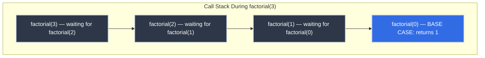

# Recursion: Solving Problems by Dividing Them

You've written a function that caused a `RecursionError` or `stack overflow`. You've stared at a stacktrace that showed the same function name repeated 500 times. You've used recursive functions for tree traversal or directory walking, and they felt elegant — but you couldn't quite explain *why* recursion rather than a loop.

**The "why" is divide-and-conquer.** Recursion isn't a syntax trick — it's the primary computational strategy for problems that have self-similar structure. Once you see it from the CS theory perspective, you'll recognize which problems *demand* recursion and which are just loops in disguise.

!!! info "Learning Objectives"

    By the end of this article, you'll be able to:

    - Identify the base case and recursive step in any recursive function
    - Trace recursive execution using the substitution model
    - Apply the divide-and-conquer pattern to self-similar problems
    - Recognize which problems call for recursion and which are iteration in disguise
    - Reason about call stack depth and explain what causes a stack overflow

## Where You've Seen This

Recursive structure appears in the code you work with every day:

- **Stack traces** — when you see the same function repeated in a stack trace during debugging, that's recursion consuming the call stack; the depth is the recursion depth
- **File system traversal** — `find`, `os.walk()`, and `filepath.WalkDir()` all recurse into subdirectories; you can't loop over an unknown depth without recursion
- **JSON / XML parsing** — nested objects inside arrays inside objects; recursive descent parsers handle arbitrary nesting naturally
- **Git history** — commits form a branching graph that never loops back on itself; `git log` traverses it recursively, which is why branch history and merges appear correctly
- **Dependency resolution** — npm, pip, and cargo resolve packages by recursively expanding dependencies of dependencies
- **DOM traversal** — `querySelectorAll` walks a recursive tree structure; every React component renders child components
- **Database query plans** — recursive CTEs (`WITH RECURSIVE`) express hierarchical queries the same way recursive procedures express hierarchical computation

## Why This Matters for Production Code

=== ":material-tree: When to Choose Recursion Over Loops"

    The rule of thumb: **use recursion when the data structure or problem is recursive.**

    If you're processing a list of known size, a loop is fine. If you're processing a tree, a nested structure, or something of unknown depth, recursion is the natural fit because the code structure mirrors the data structure.

    Iterative tree traversal with an explicit stack (to simulate what the call stack does in recursion) exists and is sometimes necessary, but it's more complex to write and harder to reason about. When you see engineers fighting with explicit stacks for tree traversal, they're manually reimplementing what recursion gives you for free.

=== ":material-alert: Stack Overflow and Tail Recursion"

    Every recursive call adds a frame to the call stack, which consumes memory. Deep recursion (thousands of levels) can exhaust the stack and crash with `RecursionError` (Python), `StackOverflowError` (Java/JVM), or a segfault (C/C++).

    **Tail recursion** is a specific recursive form where the recursive call is the *last thing* the function does — no pending work waits for the result. Languages like Scheme, Haskell, and Scala can recognize tail-recursive calls and optimize them to run in constant stack space (tail-call optimization / TCO). Python and Java do not perform TCO.

    When you hit a recursion depth limit in Python, the common fix is converting to an iterative loop — or raising `sys.setrecursionlimit()`. Understanding *why* the limit exists (call stack memory) tells you which solution to choose.

=== ":material-magnify: Reasoning About Correctness"

    The substitution model makes recursive correctness arguments remarkably clean. To prove a recursive function is correct, you only need to show two things:

    1. **Base case is correct** — the trivial case produces the right answer directly
    2. **Recursive case is correct** — if the recursive call would produce the right answer for its input, does the current call produce the right answer for its input?

    This is mathematical induction. If both conditions hold, the function is correct for all inputs. This is why CS courses prove recursive algorithms with induction — it's the natural tool for this structure.

=== ":material-database: Recursive SQL and Data Processing"

    Recursive CTEs (`WITH RECURSIVE`) solve hierarchical queries — org charts, category trees, bill of materials — that can't be expressed with regular SQL. They follow the same pattern: a base case (the root rows) and a recursive case (rows connected to the previous level).

    ```sql title="Recursive CTE for Org Chart" linenums="1"
    WITH RECURSIVE org_chart AS (
        -- Base case: the CEO
        SELECT id, name, manager_id FROM employees WHERE manager_id IS NULL

        UNION ALL

        -- Recursive case: employees whose manager is in org_chart
        SELECT e.id, e.name, e.manager_id
        FROM employees e
        JOIN org_chart o ON e.manager_id = o.id
    )
    SELECT * FROM org_chart;
    ```

    The base case runs once; the recursive case runs until no new rows are found. Same structure as a recursive procedure.

## The Core Idea: Divide and Conquer

Recursion is the primary technique for *divide-and-conquer* problem solving: take a problem you don't know how to solve directly, break it into simpler subproblems, solve those, and combine the results.

For recursive problems, the subproblem is *the same problem* on a smaller input. This is what distinguishes recursion from other divide-and-conquer strategies: the recursive call solves an identical version of the problem, just with less input.

**Every recursive procedure has exactly two parts:**

1. **Base case** — a direct answer for the trivial input (no recursion needed)
2. **Recursive case** — define the answer in terms of the same function on smaller input

If there's no base case, the function recurses forever. If the recursive case doesn't make the input smaller, it recurses forever. Both are bugs.

## Tracing Recursive Execution: The Substitution Model

When a recursive call happens, the current function call suspends and waits for the inner call to complete. The call stack tracks all suspended calls. When the base case fires, results flow back up through each waiting call.

### Example: Factorial

The factorial of `n` ($n!$) is the product of all integers from 1 to `n`. It's defined recursively:

$$n! = \begin{cases} 1 & \text{if } n = 0 \\ n \times (n-1)! & \text{if } n > 0 \end{cases}$$

Tracing `factorial(4)`:

```
factorial(4)
  = 4 * factorial(3)
       = 3 * factorial(2)
            = 2 * factorial(1)
                 = 1 * factorial(0)
                       = 1          ← base case
                 = 1 * 1 = 1
            = 2 * 1 = 2
       = 3 * 2 = 6
  = 4 * 6 = 24
```

The recursion descends to the base case, then *unwinds*, combining results at each level. The call stack holds 5 frames at peak depth (for `factorial(4)`).

=== ":material-language-python: Python"

    ```python title="Recursive Factorial" linenums="1"
    def factorial(n: int) -> int:
        if n == 0:                          # (1)!
            return 1
        return n * factorial(n - 1)         # (2)!

    print(factorial(4))  # → 24
    print(factorial(0))  # → 1
    ```

    1. Base case: 0! = 1 by definition
    2. Recursive case: n! = n × (n-1)!

=== ":material-language-javascript: JavaScript"

    ```javascript title="Recursive Factorial" linenums="1"
    function factorial(n) {
        if (n === 0) return 1;              // (1)!
        return n * factorial(n - 1);        // (2)!
    }

    console.log(factorial(4));  // → 24
    console.log(factorial(0));  // → 1
    ```

    1. Base case: 0! = 1
    2. Recursive case: n × (n-1)!

=== ":material-language-go: Go"

    ```go title="Recursive Factorial" linenums="1"
    func factorial(n int) int {
        if n == 0 {                         // (1)!
            return 1
        }
        return n * factorial(n-1)           // (2)!
    }

    fmt.Println(factorial(4))  // → 24
    ```

    1. Base case: factorial(0) = 1
    2. Recursive case: n × factorial(n-1)

=== ":material-language-rust: Rust"

    ```rust title="Recursive Factorial" linenums="1"
    fn factorial(n: u64) -> u64 {
        if n == 0 {                         // (1)!
            return 1;
        }
        n * factorial(n - 1)               // (2)!
    }

    println!("{}", factorial(4));  // → 24
    ```

    1. Base case: factorial(0) = 1
    2. Recursive case: n × factorial(n-1)

=== ":material-language-java: Java"

    ```java title="Recursive Factorial" linenums="1"
    static long factorial(long n) {
        if (n == 0) return 1;               // (1)!
        return n * factorial(n - 1);        // (2)!
    }

    System.out.println(factorial(4));  // → 24
    ```

    1. Base case: factorial(0) = 1
    2. Recursive case: n × factorial(n-1)

=== ":material-language-cpp: C++"

    ```cpp title="Recursive Factorial" linenums="1"
    long long factorial(long long n) {
        if (n == 0) return 1;               // (1)!
        return n * factorial(n - 1);        // (2)!
    }

    std::cout << factorial(4);  // → 24
    ```

    1. Base case: factorial(0) = 1
    2. Recursive case: n × factorial(n-1)

### Example: Finding the Maximum

Factorial has one base case and one recursive path. Problems with lists often demonstrate the pattern more clearly — the list itself is recursive structure (see [Lists as Recursive Data Structures](../efficiency/lists_recursive_structure.md)).

To find the maximum of a list:

- **Base case**: a list of one element — that element *is* the maximum
- **Recursive case**: the maximum is whichever is larger between the first element and the maximum of the rest

=== ":material-language-python: Python"

    ```python title="Recursive Maximum" linenums="1"
    def find_max(lst: list[int]) -> int:
        if len(lst) == 1:                          # (1)!
            return lst[0]
        rest_max = find_max(lst[1:])               # (2)!
        return lst[0] if lst[0] > rest_max else rest_max  # (3)!

    print(find_max([3, 1, 4, 1, 5, 9, 2, 6]))  # → 9
    ```

    1. Base case: single element is the maximum
    2. Recursively find maximum of everything after the first element
    3. Return the larger of the first element and the recursive result

=== ":material-language-javascript: JavaScript"

    ```javascript title="Recursive Maximum" linenums="1"
    function findMax(lst) {
        if (lst.length === 1) return lst[0];        // (1)!
        const restMax = findMax(lst.slice(1));       // (2)!
        return lst[0] > restMax ? lst[0] : restMax; // (3)!
    }

    console.log(findMax([3, 1, 4, 1, 5, 9, 2, 6]));  // → 9
    ```

    1. Base case: single-element array
    2. Recursive call on the tail
    3. Compare head against recursive result

=== ":material-language-go: Go"

    ```go title="Recursive Maximum" linenums="1"
    func findMax(lst []int) int {
        if len(lst) == 1 {                          // (1)!
            return lst[0]
        }
        restMax := findMax(lst[1:])                 // (2)!
        if lst[0] > restMax {
            return lst[0]
        }
        return restMax                              // (3)!
    }

    fmt.Println(findMax([]int{3, 1, 4, 1, 5, 9, 2, 6}))  // → 9
    ```

    1. Base case: single element
    2. Recursive call on the tail slice
    3. Return the larger value

=== ":material-language-rust: Rust"

    ```rust title="Recursive Maximum" linenums="1"
    fn find_max(lst: &[i64]) -> i64 {
        if lst.len() == 1 {                         // (1)!
            return lst[0];
        }
        let rest_max = find_max(&lst[1..]);         // (2)!
        if lst[0] > rest_max { lst[0] } else { rest_max }  // (3)!
    }

    println!("{}", find_max(&[3, 1, 4, 1, 5, 9, 2, 6]));  // → 9
    ```

    1. Base case: slice of length 1
    2. Recursive call on a sub-slice
    3. Return the larger value

=== ":material-language-java: Java"

    ```java title="Recursive Maximum" linenums="1"
    static int findMax(int[] lst, int from) {
        if (from == lst.length - 1) return lst[from]; // (1)!
        int restMax = findMax(lst, from + 1);           // (2)!
        return lst[from] > restMax ? lst[from] : restMax; // (3)!
    }
    // Call as: findMax(arr, 0)
    ```

    1. Base case: reached the last element
    2. Recursive call moving one position forward
    3. Return the larger value

=== ":material-language-cpp: C++"

    ```cpp title="Recursive Maximum" linenums="1"
    int findMax(const std::vector<int>& lst, size_t from = 0) {
        if (from == lst.size() - 1) return lst[from]; // (1)!
        int restMax = findMax(lst, from + 1);           // (2)!
        return lst[from] > restMax ? lst[from] : restMax; // (3)!
    }
    ```

    1. Base case: last element
    2. Recurse from the next position
    3. Return the larger value

## Classic Recursive Algorithms

### Euclid's GCD

The greatest common divisor (GCD) of two numbers is the largest number that divides both. Euclid's algorithm, over 2,000 years old, is recursive:

$$\gcd(a, b) = \begin{cases} a & \text{if } b = 0 \\ \gcd(b, a \bmod b) & \text{if } b > 0 \end{cases}$$

The key insight: the GCD of `a` and `b` equals the GCD of `b` and `a mod b`. The recursive case doesn't just reduce by 1 — it reduces *rapidly*, making this one of the most efficient algorithms in existence.

=== ":material-language-python: Python"

    ```python title="Euclidean GCD" linenums="1"
    def gcd(a: int, b: int) -> int:
        if b == 0:              # (1)!
            return a
        return gcd(b, a % b)   # (2)!

    print(gcd(48, 18))  # → 6
    print(gcd(100, 75)) # → 25
    ```

    1. Base case: GCD(a, 0) = a, because a divides itself and 0
    2. Recursive case: GCD(a, b) = GCD(b, a mod b)

=== ":material-language-javascript: JavaScript"

    ```javascript title="Euclidean GCD" linenums="1"
    function gcd(a, b) {
        if (b === 0) return a;          // (1)!
        return gcd(b, a % b);           // (2)!
    }

    console.log(gcd(48, 18));  // → 6
    ```

    1. Base case: GCD(a, 0) = a
    2. Recursive step: GCD(b, a mod b)

=== ":material-language-go: Go"

    ```go title="Euclidean GCD" linenums="1"
    func gcd(a, b int) int {
        if b == 0 {             // (1)!
            return a
        }
        return gcd(b, a%b)     // (2)!
    }

    fmt.Println(gcd(48, 18))  // → 6
    ```

    1. Base case: GCD(a, 0) = a
    2. Recursive step: reduce b to a mod b

=== ":material-language-rust: Rust"

    ```rust title="Euclidean GCD" linenums="1"
    fn gcd(a: u64, b: u64) -> u64 {
        if b == 0 { return a; }   // (1)!
        gcd(b, a % b)             // (2)!
    }

    println!("{}", gcd(48, 18));  // → 6
    ```

    1. Base case: GCD(a, 0) = a
    2. Tail-recursive — Rust can optimize this

=== ":material-language-java: Java"

    ```java title="Euclidean GCD" linenums="1"
    static long gcd(long a, long b) {
        if (b == 0) return a;       // (1)!
        return gcd(b, a % b);       // (2)!
    }

    System.out.println(gcd(48, 18));  // → 6
    ```

    1. Base case: GCD(a, 0) = a
    2. Recursive reduction

=== ":material-language-cpp: C++"

    ```cpp title="Euclidean GCD" linenums="1"
    long long gcd(long long a, long long b) {
        if (b == 0) return a;       // (1)!
        return gcd(b, a % b);       // (2)!
    }

    std::cout << gcd(48, 18);  // → 6
    ```

    1. Base case: GCD(a, 0) = a
    2. Recursive step

Notice that GCD is **tail-recursive**: the recursive call `gcd(b, a % b)` is the very last thing the function does. There's no pending multiplication or addition waiting for the result. Languages with tail-call optimization (Scheme, Haskell, Scala) can run this in $O(1)$ stack space regardless of how many steps it takes.

## The Call Stack in Depth

Each recursive call creates a new *stack frame* holding the function's local variables and return address. The frames pile up until the base case fires, then unwind one by one.



Stack frames consume memory proportional to their number. `factorial(3)` needs 4 frames; `factorial(10000)` needs 10,001 frames. That's why Python's default recursion limit is 1000 — deep recursion is a memory concern, not a correctness concern.

When you see a stack trace that shows `factorial` repeated 100 times, that's this diagram: each repetition is one stack frame, and the error occurred when the stack ran out of room.

## Technical Interview Context

Recursion questions go beyond "implement factorial." Interviewers probe the limits: what happens at depth, why certain languages handle it differently, and whether you understand the relationship between the call stack and your data structures.

??? question "Your recursive solution passes tests but hits a RecursionError in production — what's the actual fix?"

    Not `sys.setrecursionlimit`. The fix is converting to an explicit stack on the heap: every recursive algorithm can be rewritten iteratively because the call stack IS a stack. Iterative DFS manages a `list` explicitly; recursive DFS uses the call stack implicitly. The iterative version eliminates Python's 1,000-frame default limit and gives you control over memory allocation — useful when processing trees with millions of nodes.

??? question "What is tail call optimization, and why doesn't Python implement it?"

    A tail call is when the last operation in a function is a recursive call — nothing happens after it returns. Languages with TCO (Scheme, Erlang, some Scala) convert these into loops, giving $O(1)$ stack space regardless of recursion depth. Python's creator explicitly rejected TCO: it would collapse stack frames and make tracebacks ambiguous. Python prioritizes debuggability over this optimization. Knowing which languages implement TCO changes how you write recursive code in each.

??? question "Can every recursive algorithm be converted to an iterative one?"

    Yes, always — the call stack is a stack, and you can simulate it with an explicit data structure. Iterative DFS uses a `list` as a stack; recursive DFS uses the call stack. The tradeoff: explicit stack gives you more control (custom ordering, early termination) at the cost of more verbose code. The recursive version is clearer when the data structure is itself recursive — trees, grammars, nested structures.

??? question "What's the connection between recursion and mathematical induction?"

    The structure is identical. A proof by induction: base case (prove it for n=0) and inductive step (assume it holds for n, prove it for n+1). A recursive function: base case (return the direct answer for the smallest input) and recursive case (call itself on smaller input, combine results). Writing a correct recursive function is constructing an inductive proof — which is why formal verification tools can prove recursive functions correct more directly than iterative equivalents.

## Practice Problems

??? question "Practice 1: Power Function"

    Write a recursive `power(base, exp)` function. The rules:

    - `power(b, 0)` = 1 (anything to the 0th power is 1)
    - `power(b, n)` = `b × power(b, n-1)` for n > 0

    Trace `power(2, 4)` step by step.

    ??? tip "Solution"

        ```python title="Recursive Power" linenums="1"
        def power(base: int, exp: int) -> int:
            if exp == 0:
                return 1
            return base * power(base, exp - 1)
        ```

        Trace of `power(2, 4)`:
        ```
        power(2, 4)
          = 2 * power(2, 3)
               = 2 * power(2, 2)
                    = 2 * power(2, 1)
                         = 2 * power(2, 0)
                                = 1
                         = 2 * 1 = 2
                    = 2 * 2 = 4
               = 2 * 4 = 8
          = 2 * 8 = 16
        ```

        Result: 16. Peak stack depth: 5 frames.

??? question "Practice 2: Count Elements Matching a Predicate"

    Write a recursive function `count_if(lst, predicate)` that counts how many elements in a list satisfy the predicate.

    For example: `count_if([1, 2, 3, 4, 5], is_even)` → `2`

    ??? tip "Solution"

        ```python title="Recursive count_if" linenums="1"
        def count_if(lst: list, predicate) -> int:
            if not lst:                          # base case: empty list
                return 0
            head_count = 1 if predicate(lst[0]) else 0
            return head_count + count_if(lst[1:], predicate)

        is_even = lambda x: x % 2 == 0
        print(count_if([1, 2, 3, 4, 5], is_even))  # → 2
        ```

        This follows the standard list recursion template: base case on empty list, then combine the head result with the recursive result on the tail.

??? question "Practice 3: When Not to Use Recursion"

    Which of these would you implement with recursion? Which with a loop? Why?

    a. Sum all integers from 1 to N
    b. Traverse a file system directory tree
    c. Find an element in a list of unknown length
    d. Parse a deeply nested JSON structure

    ??? tip "Answer"

        a. **Loop** — the structure is linear, not recursive. A simple `for i in range(1, n+1)` is clearer and more efficient.

        b. **Recursion** — a directory tree is a recursive structure (directories contain directories). The recursion mirrors the data shape perfectly.

        c. **Either** — the list itself isn't recursively structured in most languages, so a loop is natural. But a recursive search works fine for modest sizes.

        d. **Recursion** — JSON nesting is recursive (objects inside arrays inside objects). Recursive processing handles arbitrary depth naturally; loops require an explicit stack to simulate it.

## Key Takeaways

| Concept | What to Remember |
|:--------|:----------------|
| Divide-and-conquer | Break the problem into smaller instances of the same problem |
| Base case | The trivial input that can be answered directly — no recursion |
| Recursive case | Define the answer using the same function on smaller input |
| Call stack | Each recursive call adds a frame; base case triggers the unwind |
| Stack overflow | Too many frames — hit when input is too large or base case is missing |
| Tail recursion | Recursive call is the last operation — enables stack-space optimization |
| When to recurse | When the data structure or problem is self-similar (trees, nested structures) |

## Further Reading

**On This Site**

- [Lists as Recursive Data Structures](../efficiency/lists_recursive_structure.md) — the recursive definition of lists; why list operations naturally follow the recursion template

**External**

- [*Introduction to Computing*](https://computingbook.org/) by David Evans, Chapter 4 — divide-and-conquer and recursive problem solving from first principles
- [*Structure and Interpretation of Computer Programs* (SICP)](https://mitp-content-server.mit.edu/books/content/sectbyfn/books_pres_0/6515/sicp.zip/index.html), Chapter 1 — recursive vs. iterative processes, and the difference between recursion as a syntactic pattern and as a computational process

Recursion is not just a technique — it's a way of thinking. When you look at a problem and ask "if I had the answer for a slightly smaller version, how would I use it to solve the full problem?" — you're thinking recursively. That question unlocks a family of elegant solutions that match the structure of the problems they solve.
