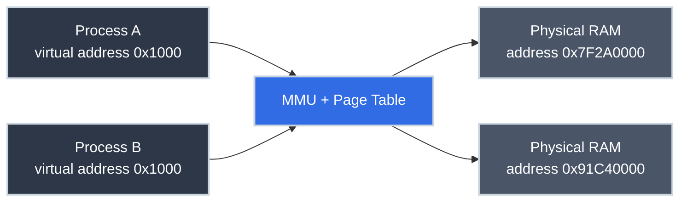

# The Stack, the Heap, and Virtual Memory

!!! tip "Part of a Learning Path"
    This article is a step in the [How Modern Software Really Runs on a CPU](https://bradpenney.io/pathways/cpu-to-cluster) pathway on [bradpenney.io](https://bradpenney.io) — a guided sequence through the topic. It also stands on its own.

In production, setting a memory limit — `resources.limits.memory: 512Mi` on a container, `-Xmx2g` on a JVM flag — is one of the most routine configuration steps there is, and one of the least understood. Cross that limit, and the process doesn't slow down; it gets killed outright, on the spot. A service's memory graph climbing steadily for days before a routine restart is common enough to have its own name in most incident channels: a slow leak.

Neither of those is really about "memory" in the single, vague sense the word usually gets used. A running process has at least two genuinely different regions of memory, and the ceiling being set in each case is more specific than the word "memory" suggests.

## Where You Might Have Seen This

- **A container gets `OOMKilled` even though the app "shouldn't" be using that much memory:** you were closer to a specific, real ceiling than the dashboard made obvious.
- **`RecursionError` / `StackOverflowError` / a C segfault from infinite recursion:** a different, much smaller region ran out, independent of how much RAM the machine actually has free.
- **`malloc` failing, or a language runtime's garbage collector running:** both are managing the *other* region, the one that doesn't clean up automatically just because a function returned.
- **A JVM or Node process configured with `-Xmx` or `--max-old-space-size`:** you're placing a ceiling on one region's growth, because left alone it will claim memory until something stops it.

## Every Process Gets Its Own Universe

When a process starts, the operating system hands it a range of memory addresses to use — commonly, on a 64-bit system, from near zero up to a very large number. The process can read and write anywhere in that range as if it owned the entire machine's RAM, starting at address zero, with nothing else present.

This is called **virtual memory**, and it's a lie in the most literal sense: those addresses don't correspond to real, physical RAM locations at all. The CPU has a component (the **memory management unit**, or MMU) that intercepts every memory access and translates the process's fictional **virtual address** into a real **physical address**, using a lookup structure called a **page table** that the operating system maintains, one process at a time.

Two processes can both use virtual address `0x1000` and never collide, because the MMU sends each of them to a completely different, private location in physical RAM. Neither can even *express* an address that lands in the other's memory. The translation simply doesn't exist for them. This is the actual mechanism behind process isolation: not politeness, not a convention anyone could violate by accident, but a hardware-enforced translation that makes another process's memory literally unaddressable.

Within its own virtual address space, a process's memory is divided into regions with very different rules. Two of them are the ones you fight with daily.

## The Stack: Fast, Automatic, Bounded

The **stack** is a contiguous region that grows and shrinks in a strict, predictable pattern: every function call pushes a new **stack frame** — its local variables, its arguments, the address to return to. And every `return` pops that frame off. Allocation is just moving a single pointer; deallocation is moving it back. There is no bookkeeping, because the order is guaranteed: whatever was allocated last is always freed first.

That guarantee is what makes the stack fast. It's also what makes it strictly bounded — typically a few megabytes per thread, fixed when the thread starts. Recurse too deep, and you run off the end of that fixed region: `RecursionError` in Python, `StackOverflowError` on the JVM, a segfault in C. **[Recursion](recursion.md)** covers the call-stack mechanics of *how* that happens frame by frame; this article is about *where* those frames physically live and why the region has a ceiling at all.

## The Heap: Flexible, Manual (or Managed), Unbounded-ish

The **heap** is the region for everything that has to outlive the function that created it, or whose size isn't known until runtime — an object you return from a function, a list that grows based on user input, anything with a lifetime that doesn't match the tidy push/pop discipline of the stack.

Because heap allocations can be freed in any order, not just last-in-first-out, the operating system and runtime have to actually track what's used and what's free, using structures far more complex than a single pointer. That bookkeeping is real work, which is why heap allocation is measurably slower than stack allocation, and why *deciding when heap memory can be freed* is an entire subfield: manual (`malloc`/`free` in C, `new`/`delete` in C++), reference-counted (Python's default, Swift), or tracing garbage collection (Java, Go, JavaScript). Different languages, same underlying problem: the stack's automatic bookkeeping doesn't apply here, so something else has to.

| | Stack | Heap |
|---|---|---|
| **Allocation speed** | Extremely fast (pointer move) | Slower (find free space, track it) |
| **Lifetime** | Tied to the function call | Independent — until explicitly or automatically freed |
| **Size** | Fixed, small (MBs), set at thread start | Large, grows as needed (up to the process's virtual address space) |
| **Failure mode** | Stack overflow — too much recursion/local data | Out of memory: the allocator can't find or get more space |
| **Who manages it** | The CPU and calling convention, automatically | The language runtime or you, explicitly |

## Why This Matters for Production Code

- **"Why does this recursive function crash on large input but the iterative version doesn't?":** the iterative version uses a handful of stack frames or heap-allocated state; the recursive one adds a stack frame per call, and the stack's fixed size doesn't care how elegant your solution is.
- **Container memory limits are a virtual-memory story, not a physical-RAM story.** A process's `-Xmx4g` or a container's memory limit constrains how much of that fictional virtual address space is allowed to resolve to real physical pages, which is exactly the mechanism behind [`OOMKilled` in Kubernetes](https://k8s.bradpenney.io/essentials/pod_failure_states/).
- **"Large objects on the heap are slow to allocate" is specific, not vague.** Every heap allocation involves the allocator searching for a suitable free block; a tight loop that allocates on every iteration (a common Python or JavaScript performance bug) is paying that search cost repeatedly, where a stack-based or preallocated alternative wouldn't.
- **Passing large structs by value vs. by reference is a stack-size question.** Every argument passed by value gets copied into the callee's stack frame; large value types passed deep into a call chain are quietly inflating every frame along the way.

## Technical Interview Context

- **"What causes a stack overflow, mechanically?":** the answer that actually demonstrates understanding isn't "too much recursion," it's that the stack is a fixed-size region and each call pushes a frame onto it with no bound-checking beyond what the OS provides as a hard limit; recursion is just the most common way to hit that limit predictably.
- **"Why is virtual memory useful even on a machine with plenty of RAM?":** beyond isolation, it lets the OS give every process a clean, contiguous address space regardless of how fragmented physical RAM actually is, and lets it overcommit or page memory to disk (swap) without any process needing to know.

## Practice Problems

??? question "Practice Problem 1: Same Address, Different Memory"

    Two unrelated Python processes both print `id(x)` for a local variable and get the exact same number. Are they looking at the same physical memory?

    ??? tip "Solution"
        No. And this is the whole point of virtual memory. `id()` returns a virtual address within that process's own address space. The operating system's page table maps each process's `0x...` to a completely different location in physical RAM. Identical virtual addresses across two processes are a coincidence with zero significance; the MMU guarantees neither process could accidentally read the other's data even if it tried.

??? question "Practice Problem 2: Stack or Heap?"

    A Go function creates a local `struct` and returns a pointer to it. In a language with manual stack/heap rules, this would be a classic bug (returning a pointer to memory that's about to be freed when the function returns). Why isn't it a bug in Go?

    ??? tip "Solution"
        The Go compiler performs **escape analysis**: it detects that the struct's address "escapes" the function (because a pointer to it survives the return), and automatically allocates it on the *heap* instead of the stack in the first place — even though from the source code, it looks like an ordinary local variable. The stack/heap distinction from this article is still real underneath; the language has just automated the decision of which one to use.

## Key Takeaways

| Concept | What It Means |
|---|---|
| **Virtual memory** | Every process gets its own fictional, private address space. Not real physical addresses |
| **MMU / page table** | The hardware + OS mechanism that translates virtual addresses to physical ones, per process |
| **Stack** | Fast, automatic, fixed-size region for function calls and local variables — LIFO discipline |
| **Heap** | Flexible, larger region for data that outlives its creating function — needs explicit or managed cleanup |
| **Isolation via translation** | Two processes can't collide in memory because their virtual addresses don't even point to the same physical hardware |

The lie every process is told — "you own all the memory, starting at zero" — is also the reason a bug in one process can't silently corrupt another's data. Understanding where that lie is implemented is the last piece needed before the operating system itself: the program that hands out this fiction, one process at a time.

## What's Next

**[Operating System Basics](../efficiency/systems/operating_system_basics.md)** covers the program making all of this possible: the kernel, and the privilege boundary between it and everything else on the machine.

---

## Further Reading

### Related Reading

- **[Recursion](recursion.md):** the call stack, one frame at a time.
- **[What Actually Happens When Your Code Runs](cpu_and_machine_code.md):** the fetch-decode-execute cycle that reads and writes these addresses.
- **[Operating System Basics](../efficiency/systems/operating_system_basics.md):** the kernel component that maintains the page tables this article describes.

### External Resources

- [What Every Programmer Should Know About Memory (Ulrich Drepper)](https://people.freebsd.org/~lstewart/articles/cpumemory.pdf) — dense, but the canonical deep reference on memory hardware and virtual memory.
