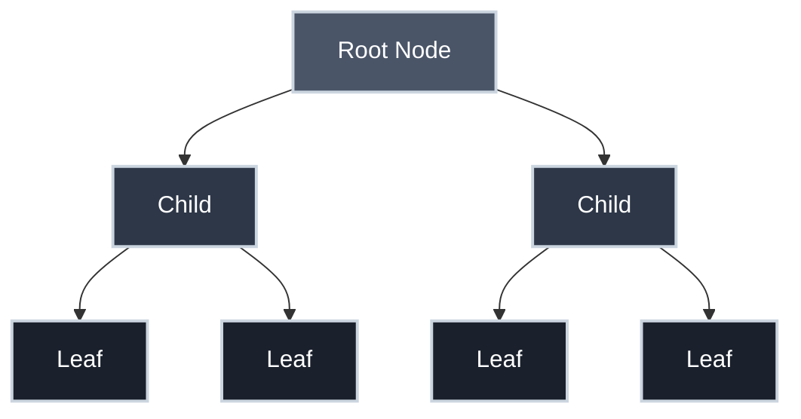
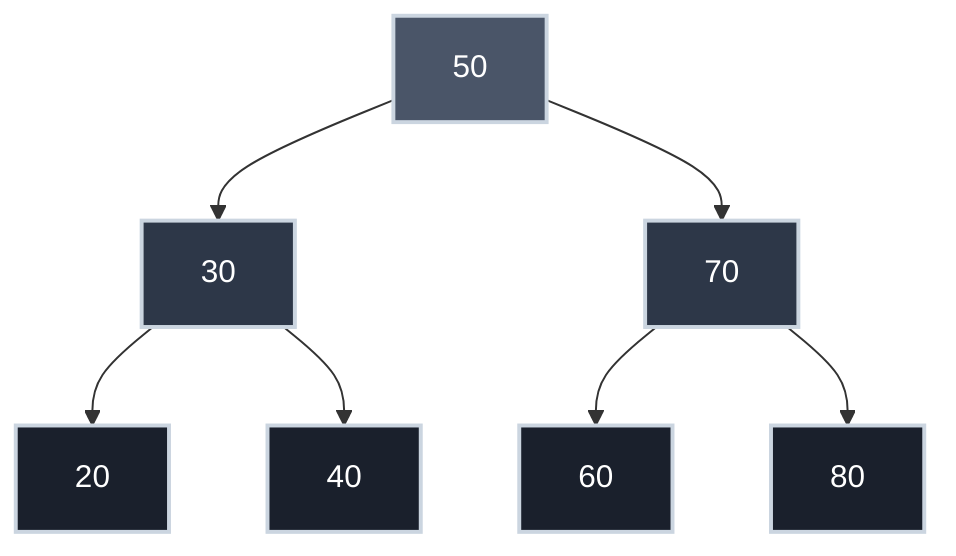
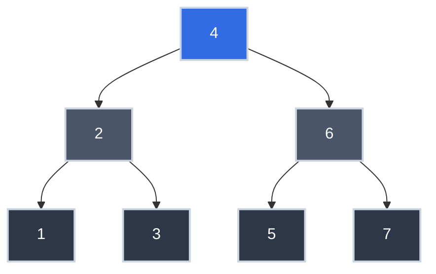

# Trees: The Data Structure Behind Your File System, JSON, and Database Indexes

Your file system navigates to a deeply nested directory in milliseconds. Your database index finds a single row among millions in a handful of comparisons. Your syntax highlighter understands arbitrarily nested function calls. Behind all three is the same data structure: a **tree**.

**This is the CS theory you've been using without knowing it.**

Trees are one of the most fundamental data structures in computer science — and one you interact with constantly as a working engineer. Understanding the formal theory behind them explains why so many tools in your stack are designed the way they are.

!!! info "Learning Objectives"

    By the end of this article, you'll be able to:

    - Define a tree formally using nodes, edges, parent-child relationships, and the root
    - Explain why binary search trees deliver $O(\log n)$ search and what breaks that guarantee
    - Identify where trees appear in your daily work: file systems, JSON, DOM, database indexes, Git
    - Reason about tree height and its relationship to time complexity
    - Explain pre-order, in-order, and post-order traversal and identify which produces sorted output on a BST

## Where You've Seen This

Trees show up everywhere in production systems:

- **Your file system** — every directory is a node, every subdirectory a child. The path `/home/user/documents/report.pdf` is a traversal from root to leaf
- **JSON and XML** — hierarchical data is a tree. Every nested object is a subtree; every key-value pair is a leaf
- **The DOM** — when a browser parses HTML, it builds a tree. `querySelectorAll` is a tree traversal
- **Database indexes** — most database engines use B-trees (a generalization of binary trees) under the hood. This is why indexed queries are fast and full table scans are slow
- **Your compiler** — when Python or Go parses your code, it builds an Abstract Syntax Tree (AST). Every function call, condition, and expression is a node
- **Git** — every commit points to its parent, forming a directed tree. Branches are just named pointers into that tree

## What is a Tree?

A tree is a hierarchical data structure where each **node** has:

- A **value** (data it stores)
- Zero or more **children** (nodes directly below it)
- Exactly one **parent** (except the root, which has none)



**Key terminology:**

| Term | Definition |
|:-----|:-----------|
| **Root** | The topmost node (no parent) |
| **Leaf** | A node with no children |
| **Parent** | A node with children |
| **Child** | A node with a parent |
| **Sibling** | Nodes sharing the same parent |
| **Depth** | Number of edges from root to a node |
| **Height** | Maximum depth in the tree |

## Binary Trees

A **binary tree** is a tree where each node has **at most two children**, called **left** and **right**.

This constraint — at most two children — turns out to be surprisingly powerful. Here's why: at each level of a binary tree, the maximum number of nodes **doubles**.

| Level | Max Nodes | Cumulative Total |
|:------|:----------|:-----------------|
| 0 (root) | 1 | 1 |
| 1 | 2 | 3 |
| 2 | 4 | 7 |
| 3 | 8 | 15 |
| n | \(2^n\) | \(2^{n+1} - 1\) |

A binary tree of depth 20 can hold over one million nodes. A binary tree of depth 30 can hold over one billion. This exponential growth is what makes binary trees so powerful for representing choices, decisions, and searchable data.

### Formal Definition

A binary tree is either:

1. **Empty** (no nodes), or
2. A **root node** with a left subtree and right subtree, each of which is itself a binary tree

This recursive definition mirrors how binary tree algorithms work — operations on trees almost always recursively operate on subtrees.

### Implementing a Tree Node

The formal definition maps directly to code. A node holds a value and optional references to its left and right children:

=== ":material-language-python: Python"

    ```python title="Binary Tree Node in Python" linenums="1"
    from dataclasses import dataclass
    from typing import Optional

    @dataclass
    class TreeNode:
        value: int
        left: Optional['TreeNode'] = None  # (1)!
        right: Optional['TreeNode'] = None

    # Build a small tree:    root (50)
    #                        /   \
    #                      30    70
    root = TreeNode(50)
    root.left = TreeNode(30)
    root.right = TreeNode(70)
    ```

    1. `Optional['TreeNode']` uses a forward reference (string) because the class refers to itself

=== ":material-language-javascript: JavaScript"

    ```javascript title="Binary Tree Node in JavaScript" linenums="1"
    class TreeNode {
        constructor(value) {
            this.value = value;
            this.left = null;   // (1)!
            this.right = null;
        }
    }

    // Build a small tree:    root (50)
    //                        /   \
    //                      30    70
    const root = new TreeNode(50);
    root.left = new TreeNode(30);
    root.right = new TreeNode(70);
    ```

    1. JavaScript uses `null` for absent children — no optional type annotation needed

=== ":material-language-go: Go"

    ```go title="Binary Tree Node in Go" linenums="1"
    type TreeNode struct {
        Value int
        Left  *TreeNode  // (1)!
        Right *TreeNode
    }

    // Build a small tree:    root (50)
    //                        /   \
    //                      30    70
    root := &TreeNode{Value: 50}
    root.Left = &TreeNode{Value: 30}
    root.Right = &TreeNode{Value: 70}
    ```

    1. Go pointers (`*TreeNode`) are `nil` by default — no explicit initialization needed

=== ":material-language-rust: Rust"

    ```rust title="Binary Tree Node in Rust" linenums="1"
    #[derive(Debug)]
    struct TreeNode {
        value: i32,
        left: Option<Box<TreeNode>>,   // (1)!
        right: Option<Box<TreeNode>>,
    }

    // Build a small tree:    root (50)
    //                        /   \
    //                      30    70
    let root = TreeNode {
        value: 50,
        left: Some(Box::new(TreeNode { value: 30, left: None, right: None })),
        right: Some(Box::new(TreeNode { value: 70, left: None, right: None })),
    };
    ```

    1. `Box<TreeNode>` heap-allocates the child — required because Rust needs to know struct size at compile time; a recursive struct without `Box` would be infinite in size

=== ":material-language-java: Java"

    ```java title="Binary Tree Node in Java" linenums="1"
    public class TreeNode {
        int value;
        TreeNode left;   // (1)!
        TreeNode right;

        TreeNode(int value) {
            this.value = value;
            this.left = null;
            this.right = null;
        }
    }

    // Build a small tree:    root (50)
    //                        /   \
    //                      30    70
    TreeNode root = new TreeNode(50);
    root.left = new TreeNode(30);
    root.right = new TreeNode(70);
    ```

    1. Java reference types default to `null` — no special optional type needed for tree nodes

=== ":material-language-cpp: C++"

    ```cpp title="Binary Tree Node in C++" linenums="1"
    #include <memory>

    struct TreeNode {
        int value;
        std::unique_ptr<TreeNode> left;   // (1)!
        std::unique_ptr<TreeNode> right;

        TreeNode(int val) : value(val), left(nullptr), right(nullptr) {}
    };

    // Build a small tree:    root (50)
    //                        /   \
    //                      30    70
    auto root = std::make_unique<TreeNode>(50);
    root->left = std::make_unique<TreeNode>(30);
    root->right = std::make_unique<TreeNode>(70);
    ```

    1. `unique_ptr` gives automatic memory management — the node owns its children and frees them when destroyed; no manual `delete` needed

Notice the pattern across all six languages: a node holds a value and two nullable references to other nodes of the same type. That self-referential structure directly encodes the recursive definition above.

## Binary Search Trees

A **binary search tree** (BST) adds one constraint to a binary tree:

- The **left subtree** contains only values **less than** the node
- The **right subtree** contains only values **greater than** the node



This structure enables **logarithmic search time**. To find 40:

1. Start at 50 → 40 < 50, go left
2. At 30 → 40 > 30, go right
3. Found 40 ✓

Only 3 comparisons to find a value in a 7-node tree. For a balanced BST with 1,000,000 nodes, you need at most **20 comparisons** — because \(\log_2(1{,}000{,}000) \approx 20\). Double the data to 2 million? You need 21 comparisons. This is $O(\log n)$ in action.

This is exactly what [Big-O Notation](big_o_notation.md) is describing when it talks about $O(\log n)$ algorithms.

## Why This Matters for Production Code

=== ":material-database: Database Indexes"

    When you add an index to a database column, the database engine builds a tree structure over that column's values. Queries that filter on that column traverse the tree instead of scanning every row.

    That's why `SELECT * FROM users WHERE id = 42` on an indexed column is nearly instant even with 10 million rows — it's $O(\log n)$ tree traversal, not $O(n)$ sequential scan. The `EXPLAIN` output your DBA keeps asking you to check will tell you whether a query is using an index (tree) or doing a full scan (linear).

=== ":material-code-json: Parsing Hierarchical Data"

    Every time you call `json.loads()` or `JSON.parse()`, the parser builds a tree in memory. The nested structure of JSON maps directly to tree nodes — objects and arrays are interior nodes, strings and numbers are leaves.

    When you write `data['user']['address']['city']`, you're traversing that tree. Deep nesting isn't just a style concern — it's a traversal depth concern.

=== ":material-file-tree: File System Operations"

    Recursive directory operations — `find`, `os.walk()`, `glob` — are tree traversals. Understanding tree depth and branching factor helps you predict performance. A deeply nested directory structure with thousands of files isn't just untidy; it has measurable traversal costs.

=== ":material-code-braces: Compilers and Syntax"

    Your language runtime parses your source code into an AST before executing it. Every `if` statement, function call, and expression becomes a tree node. This is why syntax errors mention line and column numbers — the parser knows exactly where in the tree construction it failed.

    See **[How Parsers Work](../efficiency/how_parsers_work.md)** for the full story.

## Real-World Applications

=== "File Systems"

    Directory hierarchies are trees:

    ```
    /
    ├── home/
    │   ├── user/
    │   │   ├── documents/
    │   │   └── pictures/
    │   └── shared/
    └── var/
        └── log/
    ```

    Each directory is a node. `cd` is a tree traversal. `find` is a depth-first search. `ls -R` is a full tree traversal.

=== "Expression Trees"

    Compilers represent code as trees. The expression `2 + 3 * 4` becomes:

    ```mermaid
    graph TD
        Plus["+"] --> Two["2"]
        Plus --> Times["*"]
        Times --> Three["3"]
        Times --> Four["4"]

        style Plus fill:#4a5568,stroke:#cbd5e0,stroke-width:2px,color:#fff
        style Times fill:#2d3748,stroke:#cbd5e0,stroke-width:2px,color:#fff
        style Two fill:#1a202c,stroke:#cbd5e0,stroke-width:2px,color:#fff
        style Three fill:#1a202c,stroke:#cbd5e0,stroke-width:2px,color:#fff
        style Four fill:#1a202c,stroke:#cbd5e0,stroke-width:2px,color:#fff
    ```

    Post-order traversal evaluates children before parents, which naturally enforces operator precedence: `3 * 4` evaluates first because it's deeper in the tree.

=== "Decision Trees"

    Machine learning models use binary trees where each node tests a feature and each leaf gives a classification. A depth-20 decision tree can model over a million distinct paths through data — all from a series of yes/no questions.

=== "Compression"

    Huffman encoding builds a binary tree where frequent characters get shorter paths (fewer bits) and rare characters get longer paths. This is how ZIP and JPEG achieve compression — common patterns travel fewer tree edges.

??? tip "The 20 Questions Insight"

    The classic "20 Questions" game is a binary tree of depth 20. With 20 yes/no questions, you can distinguish among \(2^{20} = 1{,}048{,}576\) possible answers. This exponential relationship between depth and distinguishable values is the fundamental insight behind binary search, Huffman encoding, and decision trees.

## Tree Traversals

Trees don't have a natural "next element" order like arrays do — you choose a traversal strategy. The three classic depth-first traversal orders differ only in when you visit the current node relative to its subtrees.

Given this tree:



| Order | Rule | Output | Use case |
|:------|:-----|:-------|:---------|
| **Pre-order** | root → left → right | 4, 2, 1, 3, 6, 5, 7 | Serialize/copy a tree (parents before children) |
| **In-order** | left → root → right | 1, 2, 3, 4, 5, 6, 7 | Extract sorted data from a BST |
| **Post-order** | left → right → root | 1, 3, 2, 5, 7, 6, 4 | Evaluate expressions; compute directory sizes |

In-order is the one to burn into memory: on a BST it always produces sorted output — the direct consequence of the left-less-than-right invariant.

=== ":material-language-python: Python"

    ```python title="Tree Traversals in Python" linenums="1"
    class Node:
        def __init__(self, val, left=None, right=None):
            self.val = val
            self.left = left
            self.right = right

    def preorder(node):  # (1)!
        if node is None:
            return []
        return [node.val] + preorder(node.left) + preorder(node.right)

    def inorder(node):  # (2)!
        if node is None:
            return []
        return inorder(node.left) + [node.val] + inorder(node.right)

    def postorder(node):  # (3)!
        if node is None:
            return []
        return postorder(node.left) + postorder(node.right) + [node.val]

    tree = Node(4, Node(2, Node(1), Node(3)), Node(6, Node(5), Node(7)))
    print(preorder(tree))   # [4, 2, 1, 3, 6, 5, 7]
    print(inorder(tree))    # [1, 2, 3, 4, 5, 6, 7]  ← sorted!
    print(postorder(tree))  # [1, 3, 2, 5, 7, 6, 4]
    ```

    1. Root → Left → Right: parent before children
    2. Left → Root → Right: in-order on a BST yields sorted output
    3. Left → Right → Root: children before parent

=== ":material-language-javascript: JavaScript"

    ```javascript title="Tree Traversals in JavaScript" linenums="1"
    class Node {
        constructor(val, left = null, right = null) {
            this.val = val;
            this.left = left;
            this.right = right;
        }
    }

    const preorder = (node) =>
        node ? [node.val, ...preorder(node.left), ...preorder(node.right)] : [];

    const inorder = (node) =>
        node ? [...inorder(node.left), node.val, ...inorder(node.right)] : [];

    const postorder = (node) =>
        node ? [...postorder(node.left), ...postorder(node.right), node.val] : [];

    const tree = new Node(4, new Node(2, new Node(1), new Node(3)),
                             new Node(6, new Node(5), new Node(7)));
    console.log(preorder(tree));   // [4, 2, 1, 3, 6, 5, 7]
    console.log(inorder(tree));    // [1, 2, 3, 4, 5, 6, 7]
    console.log(postorder(tree));  // [1, 3, 2, 5, 7, 6, 4]
    ```

=== ":material-language-go: Go"

    ```go title="Tree Traversals in Go" linenums="1"
    type Node struct {
        Val   int
        Left  *Node
        Right *Node
    }

    func preorder(node *Node) []int {
        if node == nil {
            return nil
        }
        result := []int{node.Val}
        result = append(result, preorder(node.Left)...)
        result = append(result, preorder(node.Right)...)
        return result
    }

    func inorder(node *Node) []int {
        if node == nil {
            return nil
        }
        result := inorder(node.Left)
        result = append(result, node.Val)
        result = append(result, inorder(node.Right)...)
        return result
    }

    func postorder(node *Node) []int {
        if node == nil {
            return nil
        }
        result := postorder(node.Left)
        result = append(result, postorder(node.Right)...)
        result = append(result, node.Val)
        return result
    }
    ```

=== ":material-language-rust: Rust"

    ```rust title="Tree Traversals in Rust" linenums="1"
    enum Tree {
        Nil,
        Node(i32, Box<Tree>, Box<Tree>),
    }

    fn preorder(tree: &Tree) -> Vec<i32> {
        match tree {
            Tree::Nil => vec![],
            Tree::Node(val, left, right) => {
                let mut result = vec![*val];
                result.extend(preorder(left));
                result.extend(preorder(right));
                result
            }
        }
    }

    fn inorder(tree: &Tree) -> Vec<i32> {
        match tree {
            Tree::Nil => vec![],
            Tree::Node(val, left, right) => {
                let mut result = inorder(left);
                result.push(*val);
                result.extend(inorder(right));
                result
            }
        }
    }

    fn postorder(tree: &Tree) -> Vec<i32> {
        match tree {
            Tree::Nil => vec![],
            Tree::Node(val, left, right) => {
                let mut result = postorder(left);
                result.extend(postorder(right));
                result.push(*val);
                result
            }
        }
    }
    ```

=== ":material-language-java: Java"

    ```java title="Tree Traversals in Java" linenums="1"
    import java.util.ArrayList;
    import java.util.List;

    class Node {
        int val;
        Node left, right;
        Node(int val) { this.val = val; }
        Node(int val, Node left, Node right) {
            this.val = val; this.left = left; this.right = right;
        }
    }

    public List<Integer> preorder(Node node) {
        List<Integer> result = new ArrayList<>();
        if (node == null) return result;
        result.add(node.val);
        result.addAll(preorder(node.left));
        result.addAll(preorder(node.right));
        return result;
    }

    public List<Integer> inorder(Node node) {
        List<Integer> result = new ArrayList<>();
        if (node == null) return result;
        result.addAll(inorder(node.left));
        result.add(node.val);
        result.addAll(inorder(node.right));
        return result;
    }

    public List<Integer> postorder(Node node) {
        List<Integer> result = new ArrayList<>();
        if (node == null) return result;
        result.addAll(postorder(node.left));
        result.addAll(postorder(node.right));
        result.add(node.val);
        return result;
    }
    ```

=== ":material-language-cpp: C++"

    ```cpp title="Tree Traversals in C++" linenums="1"
    #include <vector>

    struct Node {
        int val;
        Node* left  = nullptr;
        Node* right = nullptr;
        Node(int v) : val(v) {}
    };

    std::vector<int> preorder(Node* node) {
        if (!node) return {};
        auto result = std::vector<int>{node->val};
        auto left = preorder(node->left);
        auto right = preorder(node->right);
        result.insert(result.end(), left.begin(), left.end());
        result.insert(result.end(), right.begin(), right.end());
        return result;
    }

    std::vector<int> inorder(Node* node) {
        if (!node) return {};
        auto result = inorder(node->left);
        result.push_back(node->val);
        auto right = inorder(node->right);
        result.insert(result.end(), right.begin(), right.end());
        return result;
    }

    std::vector<int> postorder(Node* node) {
        if (!node) return {};
        auto result = postorder(node->left);
        auto right = postorder(node->right);
        result.insert(result.end(), right.begin(), right.end());
        result.push_back(node->val);
        return result;
    }
    ```

## Technical Interview Context

Trees are one of the most common interview topics — both as explicit problems and as the underlying structure in problems about paths, hierarchies, and search.

??? question "What's the difference between BFS and DFS on a tree?"

    BFS uses a queue, explores level by level, and finds the shortest path in unweighted graphs. DFS uses recursion (or an explicit stack) and explores depth-first. In-order, pre-order, and post-order traversals are all DFS variants.

??? question "What are the time complexities for BST operations?"

    Search, insert, and delete are all $O(\log n)$ on a balanced BST, $O(n)$ worst case on a degenerate tree (e.g., inserting sorted data into a plain BST produces a linked list). Database B-trees maintain balance by construction; plain BSTs don't.

??? question "Find the lowest common ancestor of two nodes"

    A classic recursive problem: if both nodes are in the left subtree, recurse left; if both are in the right, recurse right; otherwise the current node is the LCA.

??? question "Validate that a binary tree is a valid BST"

    Not just "left child < parent < right child" per node. The constraint must hold for every node relative to its entire ancestry. The clean approach: pass a valid range `[min, max]` through the recursion, narrowing it at each step.

## Practice Problems

??? question "Practice Problem 1: Binary Search Tree Search"

    Given this binary search tree, trace the path to find the value 35:

    ```
           50
          /  \
        30    70
       /  \   / \
      20  40 60 80
         /
        35
    ```

    How many comparisons are needed? How does this compare to linear search?

    ??? tip "Solution"

        **Trace:**

        1. Start at 50 → 35 < 50, go **left**
        2. At 30 → 35 > 30, go **right**
        3. At 40 → 35 < 40, go **left**
        4. Found 35 ✓

        **Comparisons needed:** 4

        **Linear search comparison:** A flat array [50, 30, 70, 20, 40, 60, 80, 35] requires up to 8 comparisons. The BST halved the work. For a million-item tree, the BST advantage grows to roughly 20 vs. 1,000,000 comparisons.

??? question "Practice Problem 2: Tree Depth Calculation"

    How many distinct values can a binary tree of depth 7 distinguish?

    If you're building a decision tree classifier and need to distinguish among 500 categories, what minimum depth is required?

    ??? tip "Solution"

        **Part 1:** A binary tree of depth \(n\) can distinguish \(2^n\) values.

        Depth 7: \(2^7 = 128\) distinct values.

        **Part 2:** Need \(2^n \geq 500\)

        - \(2^8 = 256\) (too small)
        - \(2^9 = 512\) ✓

        **Minimum depth:** 9. With 9 yes/no decision points, you can distinguish among 512 categories — enough to cover all 500.

??? question "Practice Problem 3: Identify the Tree"

    For each of the following, identify what kind of tree is being used and explain the traversal:

    1. A database query `SELECT name FROM products WHERE price < 50` on an indexed `price` column
    2. A browser rendering `document.getElementById('nav').querySelectorAll('a')`
    3. Python's `os.walk('/var/log')` returning all log files
    4. A compiler reporting "SyntaxError at line 14, column 7"

    ??? tip "Answers"

        1. **B-tree index** — the database traverses a balanced tree structure over `price` values, visiting only nodes where price < 50. $O(\log n)$ instead of $O(n)$.
        2. **DOM tree traversal** — the browser searches the HTML tree rooted at `#nav`, collecting all `<a>` nodes. Depth-first search.
        3. **File system tree traversal** — `os.walk` performs depth-first traversal of the directory tree, yielding each directory and its contents.
        4. **AST construction failure** — the parser was building the abstract syntax tree when it encountered an unexpected token. The line/column pinpoints where in the source the tree construction broke down.

## Key Takeaways

| Concept | What It Means for Your Code |
|:--------|:----------------------------|
| **Tree** | Hierarchical structure — JSON, DOM, file systems, ASTs |
| **Binary tree** | Each node has ≤ 2 children; depth $n$ holds $2^n$ leaf values |
| **Binary search tree** | Left < parent < right; enables $O(\log n)$ search |
| **$O(\log n)$** | Doubling the data adds only one more step |
| **Database index** | A tree over a column — why indexed queries don't scan every row |
| **AST** | How your compiler understands code structure |
| **In-order traversal** | Visits left → root → right; always yields sorted output on a BST |
| **Pre/Post-order** | Pre-order: parents before children (serialization). Post-order: children before parent (evaluation) |

## Further Reading

**On This Site**

- **[Big-O Notation](big_o_notation.md)** — Why $O(\log n)$ matters so much for BST search
- **[Recursion](recursion.md)** — Tree operations are naturally recursive; the substitution model applies directly to tree traversal
- **[How Parsers Work](../efficiency/how_parsers_work.md)** — Building abstract syntax trees from source code

**External**

- [*Introduction to Algorithms* (CLRS)](https://en.wikipedia.org/wiki/Introduction_to_Algorithms), Chapter 12 — the definitive treatment of binary search trees, rotations, and balanced variants
- [*Introduction to Computing*](https://computingbook.org/) by David Evans — recursive data structures and their definitions from first principles

---

Trees are the data structure that bridges two of the most important properties in computing: hierarchical organization and fast search. Every time you query an indexed column, parse a JSON document, or navigate a file path, a tree is doing the work. Knowing the formal theory behind them makes the performance characteristics of those operations predictable — and that predictability is what separates engineers who can reason about their systems from engineers who can only observe them.
