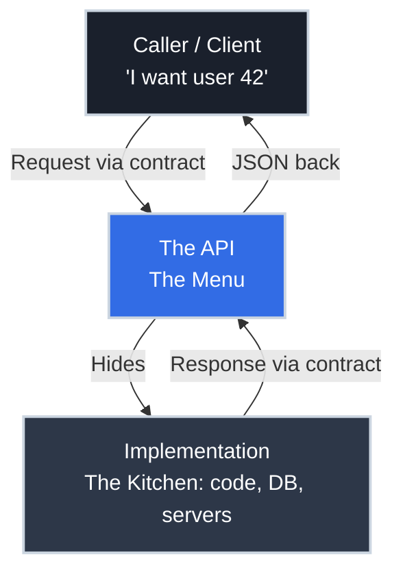

# What an API Actually Is: The Contract Behind the Curl

!!! tip "Part of a Learning Path"
    This article is part of the [How APIs Actually Work](https://bradpenney.io/pathways/how-apis-work) pathway on [bradpenney.io](https://bradpenney.io) — a guided sequence through the topic. It also stands on its own.

You've called APIs a thousand times. You `curl` an endpoint, you click "Send" in Postman, you copy a bearer token into a header and a JSON blob comes back. You can make it work. But when someone asks you to *design* one — "expose an endpoint for the billing team" — the ground shifts. What exactly are you exposing? What is the *thing* you're being asked to build?

**This is the concept you were missing.** Not how to use an API — you've got that — but what an API fundamentally *is*.

The short version: an API is a **contract**, not a piece of software. Once that clicks, everything downstream (how it's secured, where the front end stops and the back end begins, why it returns the status codes it does) stops being muddy.

## The One-Sentence Definition

**An API (Application Programming Interface) is a contract that defines how one piece of software can ask another piece of software to do something — without either side knowing how the other is built.**

Read that again with the emphasis on **contract** and **without knowing how the other is built**. Those two ideas are the whole concept.

- The **contract** says: "Send me a request shaped like *this*, and I promise to respond shaped like *that*."
- The **without knowing** part is the magic: the caller doesn't care if your back end is Python, Go, a mainframe from 1994, or three microservices in a trench coat. It only cares that the contract holds.

## Where You've Seen This

Every time you `curl https://api.example.com/users/42` and trust that you'll get user 42 back as JSON, you're relying on a contract — you never saw the database, the language, or the server.

## The Menu, Not the Kitchen

The most useful mental model for an API is a **restaurant menu**.

When you sit down at a restaurant, you don't walk into the kitchen, inspect the fridge, and instruct the chef on knife technique. You read a **menu** — a defined list of things you're allowed to order, described in a way you understand. You place an order. Food comes out.

- The **menu** is the API: the agreed list of available operations and how to ask for them.
- The **kitchen** is the implementation: the actual code, database, and infrastructure.
- The **waiter** carries your order to the kitchen and the food back, following a fixed set of rules for how to do it — and that rulebook is **HTTP** (in practice almost always **HTTPS**, the same rules over an encrypted connection).

??? info "HTTP vs HTTPS"

    HTTP is the set of rules for that round trip — how a request and a response are formatted. **HTTPS is the *same* HTTP, just carried over an encrypted (TLS) connection**, so no one in between can read or tamper with the order on its way to the kitchen and back. It's why production APIs use HTTPS by default — but it changes nothing about the menu itself, only how the messages travel. (Where that encryption actually happens is its own topic — see [HTTPS for APIs: Where the Connection Gets Secured](https://networking.bradpenney.io/essentials/tls/https_for_apis/) — but here, just know HTTPS = HTTP + encryption.)

The entire point of the menu is that it **hides the kitchen**. The restaurant can fire the chef, switch suppliers, or rebuild the kitchen overnight. As long as the menu still works, you — the diner — never notice. That decoupling is not a side effect of an API. It *is* the API.

## Two Meanings of "API" (and Why People Talk Past Each Other)

A lot of the muddiness around APIs comes from one word meaning two related things.

-   :material-language-python: __Library API__

    ---

    **The contract inside a single program.**

    When you call `json.loads()` in Python or `array.push()` in JavaScript, you're using a *library API*. The functions, their parameters, and their return values are the contract. Same process, same machine, a function call away — no network involved.

-   :material-web: __Web API__

    ---

    **The contract between separate programs over a network.**

    When you `curl https://api.stripe.com`, you're using a *web API*. The request crosses a network to a machine you don't control. This is the kind you've been asked to design — and the kind the rest of this series is about.

??? warning "The classic confusion: `requests.get()` is *both* at once"

    Here's where people trip. When you write `requests.get("https://api.example.com/users/42")`, you're calling the **library API** of the [`requests`](https://python.bradpenney.io/day_one/health_check/) package — an ordinary function call inside your own process. But that function's entire job is to make a **web API** call: it opens a network connection and sends an HTTP request to a machine you don't control.

    So "is `requests.get()` an API call?" has two correct answers — *yes*, the library API you're invoking, **and** *yes*, the web API it invokes on your behalf. The library API is the steering wheel; the web API is the road. Most "wait, which API do you mean?" confusion is exactly this: a local function call that wraps a remote one.

    Want to see that library API in action? **[Is It Still Up?](https://python.bradpenney.io/day_one/health_check/)** on the Python site builds a real health-check poller with `requests`.

Both are APIs because both are *contracts that hide an implementation*. The difference is **distance**: a library API is a function call away; a web API is a network away. That distance is where everything interesting (and everything insecure) lives — but the core idea is identical.

## The Contract Has Three Parts

When you design a web API, you are really designing three promises. Every confusing API debate is secretly an argument about one of these.

| Part of the contract | The promise | Concrete example |
| :--- | :--- | :--- |
| **The address** | "Operations live at predictable locations." | `GET /users/42` reaches user 42 |
| **The request shape** | "Ask in this exact format." | JSON body, a `Content-Type` header, a token |
| **The response shape** | "I'll answer in this exact format." | `200 OK` + a JSON user object, or `404` |

You already know these instinctively from *using* APIs. Designing one just means writing them down on purpose and not breaking them later. (The deep dives — [the request/response lifecycle](../efficiency/web/client_server_request_response.md), [the anatomy of a request](../efficiency/web/anatomy_of_request_response.md) — unpack each part.)

## Why This Matters for Production Code

Treating an API as a contract rather than "some code that returns JSON" changes how you build and operate it:

- **You can change the kitchen freely.** Rewrite the service, swap the database, move to a new cloud — as long as the contract holds, no caller breaks. This is why APIs enable teams to move independently.
- **Breaking the contract breaks *other people's* software.** Renaming a field from `user_name` to `username` isn't a tidy-up; it's a breach. Someone's integration depends on the exact word. This is why APIs get *versioned* instead of casually edited.
- **The contract is your security boundary.** Every field you expose is a door you've agreed to open. "How do I secure this endpoint?" really means "which doors does my contract open, and to whom?" — the subject of [authentication vs authorization](../efficiency/web/authentication_vs_authorization.md).

The reason the front-end/back-end split feels muddy is almost always that the contract is implicit. Make it explicit and the fog lifts.

## A Tiny Concrete Example

Here is a complete contract, in plain English, for one operation:

- **Address:** `GET /products/{id}`
- **Request:** No body. Include header `Authorization: Bearer <token>`.
- **Response (success):** `200 OK`, JSON `{ "id": 7, "name": "Widget", "price_cents": 1999 }`
- **Response (not found):** `404 Not Found`, JSON `{ "error": "product not found" }`

That's it. That short list *is* an API. A front-end developer in another country, using a different language, can build against it without ever seeing your code — because the contract told them everything they're allowed to assume. Whether you write the kitchen in Python, Go, or Rust is your business, not theirs.

## Technical Interview Context

"What is an API?" is a deceptively common interview opener. A junior answer is "it's how programs talk to each other." A stronger answer names the **contract** and the **decoupling**: an API is an agreed interface that lets one system use another without depending on its implementation, which is what allows independent deployment, language-agnostic integration, and stable versioning. If you can also distinguish a *library* API from a *web* API and explain that the difference is the network boundary, you've signalled real understanding rather than buzzword recall.

## Practice Problems

??? question "Practice Problem 1: Menu or Kitchen?"

    Your team rewrites a service from Python to Go for performance. The endpoints, request formats, and response formats are all unchanged. Did the API change?

    ??? tip "Solution"

        **No.** You changed the *kitchen* (the implementation), not the *menu* (the contract). Because the contract — addresses, request shapes, response shapes — is identical, no caller can tell the difference, and none of them break. This is precisely the decoupling an API exists to provide.

??? question "Practice Problem 2: A Breaking Change in Disguise"

    A teammate renames a JSON response field from `created_at` to `createdAt` to match a style guide. The code still compiles and tests pass. Is this safe to ship?

    ??? tip "Solution"

        **No — it's a breaking change.** Every client that reads `created_at` will suddenly get nothing. The contract promised the field name `created_at`, and external callers depend on that exact string. Style preferences don't override the contract. This is why APIs are versioned: you'd expose `createdAt` in a new version, not silently swap it in the old one.

??? question "Practice Problem 3: Library vs Web"

    Calling `json.loads(text)` in Python and calling `GET /parse` on a remote service both "use an API." What's the fundamental difference, and why does it matter?

    ??? tip "Solution"

        `json.loads` is a **library API** — a function call inside your own process, effectively instant and reliable. `GET /parse` is a **web API** — the call crosses a network to a machine you don't control. The difference is the **network boundary**, and it matters because the network introduces latency, failure, and the need for authentication and authorization. A web API can be slow, time out, or reject you; a local function call generally can't.

## Key Takeaways

| Concept | What It Means |
| :--- | :--- |
| **API = contract** | An agreed interface for asking software to do something, not the software itself |
| **Decoupling** | Callers depend on the contract, never the implementation — the kitchen can change freely |
| **Menu vs kitchen** | The menu (API) hides the kitchen (code/DB/servers); HTTP is the waiter |
| **Library vs web API** | Same idea, different distance — a function call vs a network hop |
| **Three parts** | Address, request shape, response shape — the three promises you design |
| **Breaking the contract** | Renaming or removing what callers depend on breaks their software, not just yours |

Once you stop seeing an API as "code that returns JSON" and start seeing it as a **contract that hides a kitchen**, the design questions answer themselves. What should I expose? Only what you're willing to promise. How do I secure it? Decide who's allowed through each door in the contract. Where does the front end stop? Exactly at the contract — everything past it is your kitchen, and no one else's business.

## Further Reading

### Related Reading

- [Client and Server: The Request/Response Lifecycle](../efficiency/web/client_server_request_response.md) — the contract from this article, executed one round trip at a time.
- [Anatomy of an HTTP Request and Response](../efficiency/web/anatomy_of_request_response.md) — the three contract parts (address, request shape, response shape) made concrete.
- [Authentication vs Authorization in APIs](../efficiency/web/authentication_vs_authorization.md) — deciding who may open each door the contract exposes.

### External Resources

- [MDN: An overview of HTTP](https://developer.mozilla.org/en-US/docs/Web/HTTP/Overview) — the protocol most web APIs ride on.
- [How to design APIs (Stoplight)](https://stoplight.io/api-design-guide) — practical guidance on writing contracts that last.