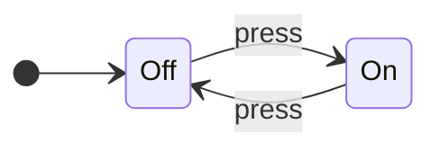
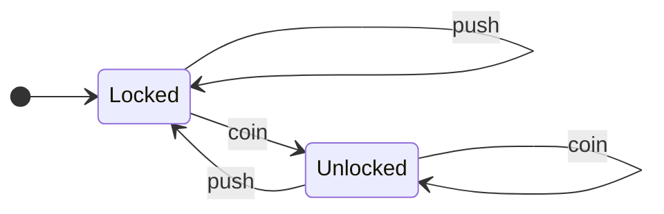
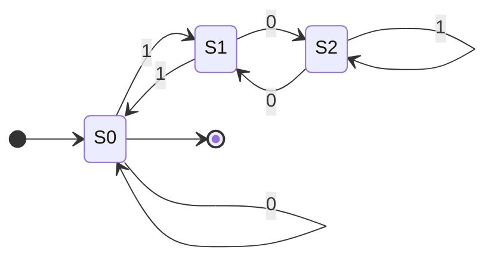
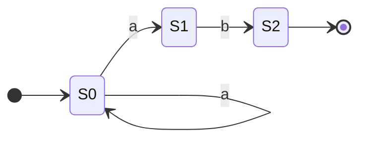
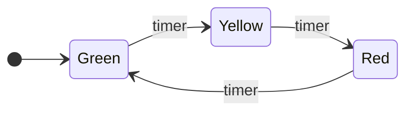
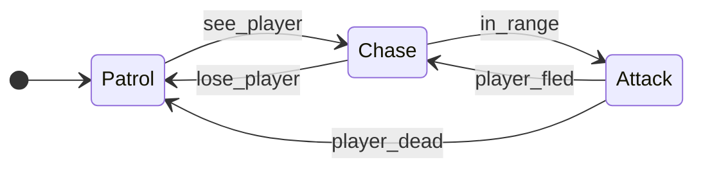
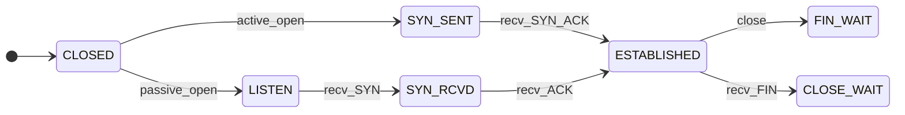
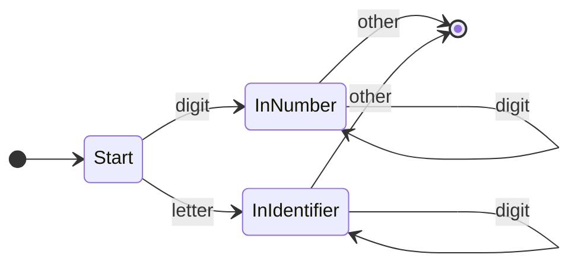

# Finite State Machines (FSMs)

You've seen [Recursive Transition Networks](recursive_transition_networks.md)—those diagrams with nodes and arrows that describe valid strings in a language. But where did that idea come from? Enter the **Finite State Machine**, the theoretical foundation beneath RTNs and one of the most elegant models in computer science.

FSMs are everywhere: traffic lights, vending machines, elevators, video game AI, text parsers, network protocols. Once you understand them, you'll start seeing them in everything. 👀

## What is a Finite State Machine?

A Finite State Machine is an abstract model of computation that:

- Has a finite number of **states** (hence the name)
- Starts in an **initial state**
- **Transitions** between states based on inputs
- May have one or more **accepting states** (success!)

That's it. No infinite memory, no complex calculations—just states and transitions.



This is an FSM for a light switch. Two states (On, Off), one input (press), deterministic behavior. Simple, but powerful.

## Formal Definition

For the mathematically inclined, an FSM is a 5-tuple (Q, Σ, δ, q₀, F):

| Symbol | Meaning |
|:-------|:--------|
| Q | Finite set of states |
| Σ | Finite alphabet (possible inputs) |
| δ | Transition function (state × input → state) |
| q₀ | Initial state |
| F | Set of accepting/final states |

Don't worry if that looks intimidating—we'll work with diagrams.

## Example: Turnstile

A classic FSM example is a subway turnstile:



**States:** Locked, Unlocked

**Inputs:** coin, push

**Behavior:**

- Start Locked
- Insert coin → Unlocked
- Push while Unlocked → Locked (you go through)
- Push while Locked → stays Locked (nothing happens)
- Insert coin while Unlocked → stays Unlocked (thanks for the extra money! 💰)

This is a complete specification of turnstile behavior. No ambiguity.

## Example: Validating Binary Numbers Divisible by 3

Here's where FSMs get interesting. Can we build a machine that accepts binary numbers divisible by 3?



**States represent remainders when dividing by 3:**

- S0 = remainder 0 (divisible by 3!)
- S1 = remainder 1
- S2 = remainder 2

**Trace through "110" (binary for 6):**

1. Start at S0 (remainder 0)
2. Read '1': move to S1 (1 mod 3 = 1)
3. Read '1': move to S0 (3 mod 3 = 0)
4. Read '0': stay at S0 (6 mod 3 = 0)
5. End at S0 — accept! 6 is divisible by 3. ✓

??? tip "Try It Yourself"

    Trace "101" (binary for 5). Does it end in an accepting state?

    What about "1001" (binary for 9)?

## Deterministic vs Non-Deterministic

### Deterministic FSM (DFA)

Every state has exactly one transition for each input. Given a state and input, you *always* know where to go next.

### Non-Deterministic FSM (NFA)

A state might have:
- Multiple transitions for the same input
- Transitions on "ε" (epsilon) — moving without consuming input
- No transition for some inputs



From S0, reading 'a' could go to S0 *or* S1. Non-deterministic!

**The magic:** NFAs and DFAs are equally powerful. Any NFA can be converted to an equivalent DFA (though the DFA might have more states). NFAs are often easier to design; DFAs are easier to implement. Best of both worlds! ✨

## FSMs and Regular Languages

FSMs recognize exactly the **regular languages**—the same languages described by regular expressions. This isn't a coincidence:

| Formalism | Description |
|:----------|:------------|
| FSM (DFA/NFA) | State diagrams |
| Regular Expression | Pattern syntax (`a*b+`) |
| Regular Grammar | Production rules |

They're three different notations for the same thing. If you can describe it with a regex, you can build an FSM for it, and vice versa.

### What FSMs *Cannot* Do

FSMs have no memory beyond their current state. This means they can't:

- Count unbounded quantities ("same number of a's and b's")
- Match nested structures (balanced parentheses)
- Remember arbitrary history

**Example:** The language {aⁿbⁿ | n ≥ 0} — strings like "", "ab", "aabb", "aaabbb" — is NOT regular. You'd need to count how many a's you've seen, and FSMs can't count.

This is where [RTNs](recursive_transition_networks.md) come in. The "recursive" part gives them the power to handle nesting by calling sub-networks (effectively using a call stack for memory).

## Real-World FSMs

### Traffic Light Controller



Real traffic lights are more complex (handling multiple directions, pedestrian buttons, sensors), but the core is an FSM.

### Video Game AI

Enemy behavior in many games:



This creates believable behavior from simple rules. 🎮 Not bad for a bunch of circles and arrows.

### TCP Connection State

Network protocols are often specified as FSMs:



(Simplified—the real TCP state diagram has more states and transitions.)

### Lexical Analysis (Tokenizing)

Compilers use FSMs to recognize tokens:



This FSM distinguishes numbers from identifiers.

## FSMs vs RTNs

| Feature | FSM | RTN |
|:--------|:----|:----|
| Memory | Current state only | State + call stack |
| Power | Regular languages | Context-free languages |
| Recursion | No | Yes |
| Nesting | Can't handle | Handles naturally |
| Simplicity | Simpler | More powerful |

RTNs are essentially FSMs with the ability to "call" other FSMs and return. This call stack gives them memory, enabling recognition of nested structures like parentheses and programming language syntax.

## Implementing an FSM

FSMs translate directly into code. Here's a turnstile in Python:

```python
class Turnstile:
    def __init__(self):
        self.state = "locked"

    def transition(self, input):
        if self.state == "locked":
            if input == "coin":
                self.state = "unlocked"
            # push while locked: stay locked

        elif self.state == "unlocked":
            if input == "push":
                self.state = "locked"
            # coin while unlocked: stay unlocked

        return self.state

# Usage
t = Turnstile()
print(t.transition("push"))   # locked
print(t.transition("coin"))   # unlocked
print(t.transition("push"))   # locked
```

Or using a transition table:

```python
transitions = {
    ("locked", "coin"): "unlocked",
    ("locked", "push"): "locked",
    ("unlocked", "coin"): "unlocked",
    ("unlocked", "push"): "locked",
}

def next_state(current, input):
    return transitions.get((current, input), current)
```

The table-driven approach scales better for complex FSMs.

## Minimizing FSMs

Two FSMs are equivalent if they accept the same language. Often, an FSM can be **minimized**—reduced to fewer states while maintaining the same behavior.

**Why minimize?**

- Fewer states = less memory
- Fewer transitions = faster lookup
- Canonical form enables comparison

There are algorithms (like Hopcroft's) that find the minimal DFA for any given DFA. This is useful when you're generating FSMs from regexes or other specifications.

## Practice Problems

??? question "Challenge 1: Design an FSM"

    Create an FSM that accepts strings over {a, b} that contain an even number of a's.

    Hint: How many states do you need? What do they represent?

??? question "Challenge 2: Vending Machine"

    Design an FSM for a vending machine that:

    - Accepts nickels (5¢), dimes (10¢), and quarters (25¢)
    - Dispenses when total reaches 30¢ or more
    - Returns to start after dispensing

    What are your states? (Hint: think about accumulated amounts)

??? question "Challenge 3: Prove It's Not Regular"

    The language L = {aⁿbⁿ | n ≥ 0} is not regular.

    Try to design an FSM for it. Where do you get stuck?
    What would you need that an FSM doesn't have?

## Key Takeaways

| Concept | Meaning |
|:--------|:--------|
| **State** | A configuration the machine can be in |
| **Transition** | Rule for moving between states |
| **Initial State** | Where computation begins |
| **Accepting State** | Success! Input is valid |
| **DFA** | Deterministic — one transition per input |
| **NFA** | Non-deterministic — multiple options possible |
| **Regular Language** | What FSMs can recognize |

## Further Reading

- [Recursive Transition Networks](recursive_transition_networks.md) — FSMs with recursion
- [Regular Expressions](regular_expressions.md) — Another notation for regular languages
- [Backus-Naur Form](backus_naur_form.md) — Describing context-free languages

---

FSMs are the "hello world" of computation theory—simple enough to fully understand, powerful enough to be genuinely useful. Every computer scientist should have them in their mental toolkit. They're proof that sometimes, constraints (finite states, no memory) force elegant solutions. 🔄
