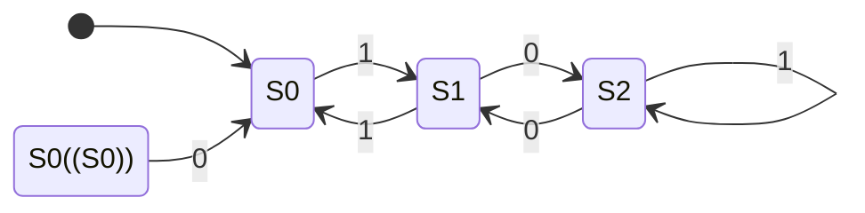
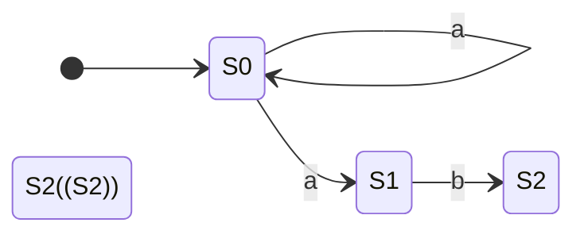
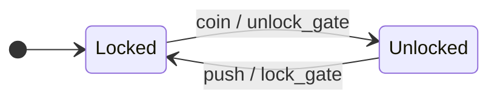
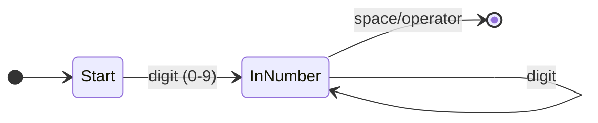
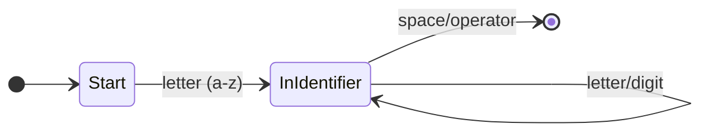
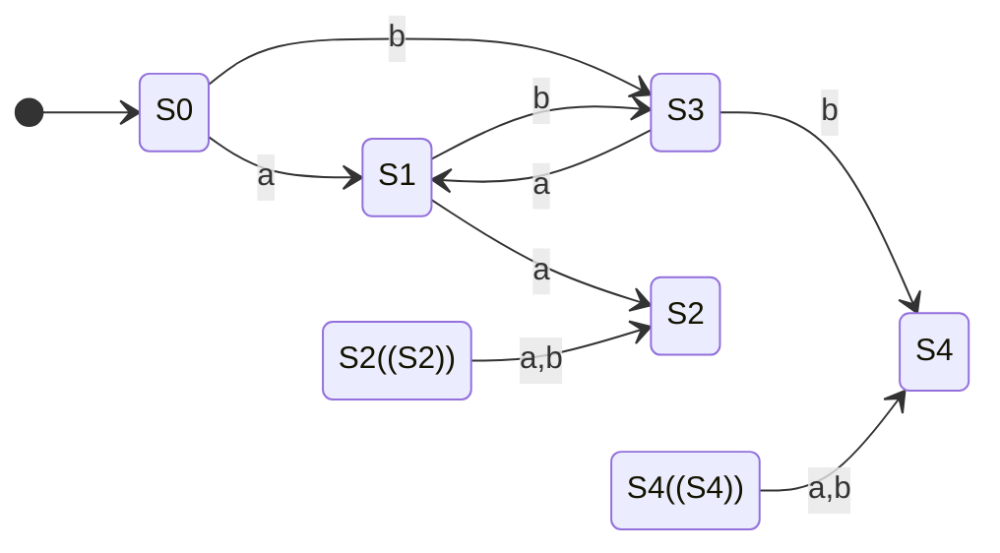
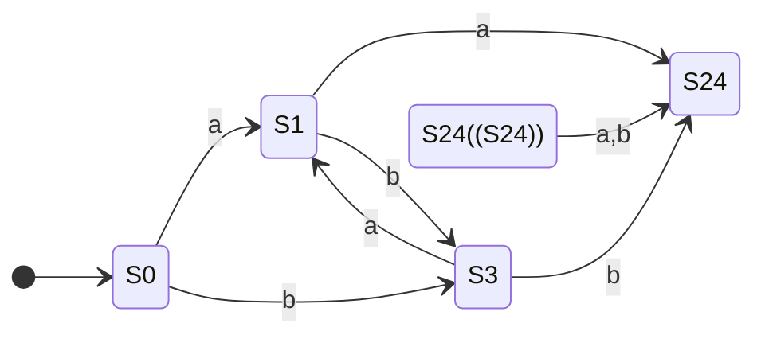

# Finite State Machines (FSMs)

Imagine modeling any system that moves through distinct states—a traffic light cycling through red, yellow, and green; a turnstile that's either locked or unlocked; a video game enemy switching between patrolling, chasing, and attacking. These are all **Finite State Machines**, one of the most elegant and foundational models in computer science.

FSMs are everywhere: traffic lights, vending machines, elevators, video game AI, text parsers, network protocols, compilers. Once you understand them, you'll start seeing them in everything. 👀

Understanding FSMs requires [computational thinking](computational_thinking.md): **decomposing** systems into states, **recognizing patterns** in transitions, **abstracting** away implementation details, and **designing algorithms** to process inputs.

## What is a Finite State Machine?

A Finite State Machine is an abstract model of computation that:

- Has a finite number of **states** (hence the name)
- Starts in an **initial state**
- **Transitions** between states based on inputs
- May have one or more **accepting states** (success!)

That's it. No infinite memory, no complex calculations—just states and transitions.


This is an FSM for a light switch. Two states (On, Off), one input (press), deterministic behavior. Simple, but powerful.

## Formal Definition

For the mathematically inclined, an FSM is a 5-tuple (Q, Σ, δ, q₀, F):

| Symbol | Meaning |
|:-------|:--------|
| Q | Finite set of states |
| Σ | Finite alphabet (possible inputs) |
| δ | Transition function (state × input → state) |
| q₀ | Initial state |
| F | Set of accepting/final states |

Don't worry if that looks intimidating—we'll work with diagrams.

## Example: Turnstile

A classic FSM example is a subway turnstile:


**States:** Locked, Unlocked

**Inputs:** coin, push

**Behavior:**

- Start Locked
- Insert coin → Unlocked
- Push while Unlocked → Locked (you go through)
- Push while Locked → stays Locked (nothing happens)
- Insert coin while Unlocked → stays Unlocked (thanks for the extra money! 💰)

This is a complete specification of turnstile behavior. No ambiguity.

## Example: Validating Binary Numbers Divisible by 3

Here's where FSMs get interesting. Can we build a machine that accepts binary numbers divisible by 3?



**Formal Definition of this FSM:**

- **Q** = {S0, S1, S2}
- **Σ** = {0, 1}
- **q₀** = S0
- **F** = {S0}
- **δ** is defined by the following table:

| State | Input '0' | Input '1' |
|:------|:----------|:----------|
| **S0**| S0        | S1        |
| **S1**| S2        | S0        |
| **S2**| S1        | S2        |

**States represent remainders when dividing by 3:**

- S0 = remainder 0 (divisible by 3!)
- S1 = remainder 1
- S2 = remainder 2

**Trace through "110" (binary for 6):**

1. Start at S0 (remainder 0)
2. Read '1': move to S1 (1 mod 3 = 1)
3. Read '1': move to S0 (3 mod 3 = 0)
4. Read '0': stay at S0 (6 mod 3 = 0)
5. End at S0 — accept! 6 is divisible by 3. ✓

??? tip "Try It Yourself"

    Trace "101" (binary for 5). Does it end in an accepting state?

    What about "1001" (binary for 9)?

## Deterministic vs Non-Deterministic

### Deterministic FSM (DFA)

Every state has exactly one transition for each input. Given a state and input, you *always* know where to go next.

### Non-Deterministic FSM (NFA)

A state might have:

- Multiple transitions for the same input
- Transitions on "ε" (epsilon) — moving without consuming input
- No transition for some inputs



From S0, reading 'a' could go to S0 *or* S1. Non-deterministic!

**The magic:** NFAs and DFAs are equally powerful. Any NFA can be converted to an equivalent DFA (though the DFA might have more states). NFAs are often easier to design; DFAs are easier to implement. Best of both worlds! ✨

## Mealy vs. Moore Machines

FSMs can be further categorized into two types based on how they produce output: **Moore machines** and **Mealy machines**.

### Moore Machine

In a Moore machine, the output is determined *only by the current state*.

- **Example:** Our "divisible by 3" FSM is a Moore machine. The "output" (whether the number so far is divisible by 3) is determined just by being in state `S0`. It doesn't matter how you got there.

```mermaid
stateDiagram-v2
    direction LR
    [*] --> S0
    S0((S0))
    note right of S0 : Output: "Yes"
    S1
    note right of S1 : Output: "No"
    S2
    note right of S2 : Output: "No"

    S0 --> S1 : 1
    S1 --> S0 : 1
    S0 --> S0 : 0
    S1 --> S2 : 0
    S2 --> S1 : 0
    S2 --> S2 : 1
```

### Mealy Machine

In a Mealy machine, the output is determined by both the *current state and the input*. The output is associated with the *transition*.

- **Example:** A vending machine giving change is a Mealy machine. If you're in the "10 cents" state and you input a quarter, the output is "dispense item and give 5 cents change".



Here, the output (`unlock_gate`, `lock_gate`) is written on the transition path, separated by a `/`.

### Key Difference

| Machine | Output Depends On | Example |
|:--------|:------------------|:--------|
| **Moore** | State only | "Is this number valid?" |
| **Mealy** | State and Input | "On this input, do X" |

Any Moore machine can be converted to an equivalent Mealy machine, and vice versa. They are computationally equivalent, but one might be more convenient for a specific problem.

## FSMs and Regular Languages

### What's a "Language" in Computer Science?

A language is simply a set of valid strings. Examples:

- "All strings that start with 'a' and end with 'b'"
- "All valid email addresses"
- "All binary numbers divisible by 3"
- "All strings with balanced parentheses"

### What Does "Recognize" Mean?

An FSM "recognizes" a language if it can correctly accept valid strings (ending in an accepting state) and reject invalid ones (ending in a non-accepting state). The FSM is essentially a validator—give it a string, and it tells you whether it belongs to the language.

### The Fundamental Equivalence

FSMs recognize exactly the **regular languages**—the same languages described by regular expressions. This isn't a coincidence. These three formalisms describe **exactly the same class of languages:**

| Formalism | Description |
|:----------|:------------|
| FSM (DFA/NFA) | State diagrams |
| Regular Expression | Pattern syntax (`a*b+`) |
| Regular Grammar | Production rules |

**Practical meaning:** If you can write a regex for something, you can build an FSM for it, and vice versa. They're two different notations for the **exact same thing**.

### Examples: Regular vs. Not Regular

✅ **Regular languages** (FSM ✓, Regex ✓):

- "Strings with even number of a's" — Regex: `(b*ab*ab*)*`
- "Strings ending with '.com'" — Regex: `.*\.com`
- "Binary numbers divisible by 3" — (we built this FSM earlier!)

❌ **Not regular languages** (FSM ✗, Regex ✗):

- "Same number of a's and b's" — needs counting/memory
- "Balanced parentheses" — needs a stack to track nesting
- "aⁿbⁿ" (equal a's and b's) — needs unbounded counting

### What FSMs *Cannot* Do

FSMs have no memory beyond their current state. This means they can't:

- Count unbounded quantities ("same number of a's and b's")
- Match nested structures (balanced parentheses)
- Remember arbitrary history

**Example: The "Equal A's and B's" Language**

The language {aⁿbⁿ | n ≥ 0} is NOT regular. This notation means "n a's followed by n b's, where n is any number 0 or greater":

- When n=0: "" (empty string)
- When n=1: "ab"
- When n=2: "aabb"
- When n=3: "aaabbb"
- When n=100: 100 a's followed by 100 b's

**Why FSMs Can't Handle This:**

To validate these strings, you'd need to:

1. Count the a's: "I saw 5 a's"
2. **Remember that count**: "I need to see exactly 5 b's"
3. Count the b's and compare: "1... 2... 3... 4... 5... match!"

FSMs can't do step 2. To remember any possible count, you'd need states like:

- state_0_as, state_1_as, state_2_as, state_3_as, ..., state_1000_as, ...

But there are **infinitely many possible counts**, and FSMs must have a **FINITE** number of states. That's the fundamental limitation.

**Contrast with "divisible by 3":** That FSM only needs 3 states (remainder 0, 1, or 2) because we track the remainder, not the actual count. The remainder is bounded—it's always 0, 1, or 2. Counting to arbitrary numbers is unbounded.

For languages requiring this kind of counting or nesting (like balanced parentheses), we need more powerful models that add memory to the state machine concept—like a call stack that tracks where we are in nested structures.

## Real-World FSMs

### Traffic Light Controller


Real traffic lights are more complex (handling multiple directions, pedestrian buttons, sensors), but the core is an FSM.

### Video Game AI

Enemy behavior in many games:


This creates believable behavior from simple rules. 🎮 Not bad for a bunch of circles and arrows.

### TCP Connection State

Network protocols are often specified as FSMs:


(Simplified—the real TCP state diagram has more states and transitions.)

### Lexical Analysis (Tokenizing)

When a compiler reads your code, the first step is **tokenizing**—breaking the code into meaningful chunks called **tokens**.

**Example:** The code `x = 42 + y` gets broken into tokens:

- `x` (identifier/variable name)
- `=` (operator)
- `42` (number)
- `+` (operator)
- `y` (identifier/variable name)

Compilers use FSMs to recognize different token types. Here are two FSMs—one for **numbers**, one for **identifiers** (variable/function names):

!!! note "State Names"
    The state names like "InNumber" and "InIdentifier" are descriptive labels that tell us what the FSM is currently doing:

    - **InNumber** = "currently in the middle of reading a number"
    - **InIdentifier** = "currently in the middle of reading an identifier"

    Just like "Locked/Unlocked" for a turnstile, these names help us understand what's happening in each state.

**Recognizing Numbers:**



**Recognizing Identifiers:**



**How it works:**

- See a **digit** (0-9) first → InNumber state, keep reading digits until hitting something else (space, operator, etc.) → emit a number token
- See a **letter** (a-z, A-Z) first → InIdentifier state, keep reading letters/digits until hitting something else → emit an identifier token

**Example trace for `x42`:**

1. Start state
2. See 'x' (letter) → InIdentifier
3. See '4' (digit, allowed in identifiers) → stay InIdentifier
4. See '2' (digit) → stay InIdentifier
5. See space → done, emit identifier token `x42`

This is how compilers turn source code text into structured tokens for parsing!

## Beyond FSMs: Adding Memory

While FSMs are powerful for many tasks, they hit a fundamental limitation: they can't count or handle nested structures. More powerful computational models extend FSMs by adding memory:

| Feature | FSM | Extended Models |
|:--------|:----|:----------------|
| Memory | Current state only | State + stack/tape |
| Power | Regular languages | Context-free & beyond |
| Recursion | No | Yes |
| Nesting | Can't handle | Handles naturally |
| Simplicity | Simpler | More powerful |

These extended models essentially add a stack or other memory structure to track nesting depth, enabling recognition of nested structures like parentheses, HTML tags, and programming language syntax.

## Implementing an FSM

FSMs translate directly into code. Here's a turnstile in Python:

```python
class Turnstile:
    def __init__(self):
        self.state = "locked"

    def transition(self, input):
        if self.state == "locked":
            if input == "coin":
                self.state = "unlocked"
            # push while locked: stay locked

        elif self.state == "unlocked":
            if input == "push":
                self.state = "locked"
            # coin while unlocked: stay unlocked

        return self.state

# Usage
t = Turnstile()
print(t.transition("push"))   # locked
print(t.transition("coin"))   # unlocked
print(t.transition("push"))   # locked
```

Or using a transition table:

```python
transitions = {
    ("locked", "coin"): "unlocked",
    ("locked", "push"): "locked",
    ("unlocked", "coin"): "unlocked",
    ("unlocked", "push"): "locked",
}

def next_state(current, input):
    return transitions.get((current, input), current)
```

The table-driven approach scales better for complex FSMs.

## Minimizing FSMs

Two FSMs are equivalent if they accept the same language. Often, an FSM can be **minimized**—reduced to fewer states while maintaining the same behavior.

### What Does "Minimal" Mean?

A minimal DFA is the smallest possible FSM (fewest states) that still recognizes the same language. Sometimes you can build different FSMs that accept exactly the same strings, but one has more states than necessary.

**Example:** Two FSMs that both accept "strings ending in 'ab'":

- **Bloated version** (5 states): Might have redundant states that behave identically—like having two different "saw an 'a'" states
- **Minimal version** (3 states): Start → SawA → SawAB (accepting)

Both accept the same language, but the minimal one is more efficient.

### Minimization Example

Consider an FSM that accepts strings containing either "aa" or "bb" as a substring.

**A non-minimal FSM:**

This FSM works, but states `S2` and `S4` are redundant. They are both accepting states, and from there on, any input leads back to the same state. They are functionally identical.



**The minimal FSM:**

By merging the equivalent states `S2` and `S4` into a single accepting state (`S24`), we get a minimal FSM that recognizes the exact same language with fewer states.



### Why Minimize?

- **Fewer states** = less memory
- **Fewer transitions** = faster lookup
- **Canonical form** = minimal DFAs for the same language are identical, enabling comparison

### Hopcroft's Algorithm

**Hopcroft's algorithm** automatically finds and removes redundant states from any DFA, producing the minimal version. It's like a "compression" algorithm for FSMs.

**When is this useful?**

When you write a regex like `a*b+`, there are automatic algorithms that convert it into an FSM. But the generated FSM often has extra, redundant states. Minimization algorithms clean this up, giving you the most efficient FSM possible.

## Practice Problems

??? question "Challenge 1: Design an FSM"

    Create an FSM that accepts strings over {a, b} that contain an even number of a's.

    Hint: How many states do you need? What do they represent?

??? question "Challenge 2: Vending Machine"

    Design an FSM for a vending machine that:

    - Accepts nickels (5¢), dimes (10¢), and quarters (25¢)
    - Dispenses when total reaches 30¢ or more
    - Returns to start after dispensing

    What are your states? (Hint: think about accumulated amounts)

??? question "Challenge 3: Prove It's Not Regular"

    The language L = {aⁿbⁿ | n ≥ 0} is not regular.

    Try to design an FSM for it. Where do you get stuck?
    What would you need that an FSM doesn't have?

## Key Takeaways

| Concept | Meaning |
|:--------|:--------|
| **State** | A configuration the machine can be in |
| **Transition** | Rule for moving between states |
| **Initial State** | Where computation begins |
| **Accepting State** | Success! Input is valid |
| **DFA** | Deterministic — one transition per input |
| **NFA** | Non-deterministic — multiple options possible |
| **Regular Language** | What FSMs can recognize |

## Further Reading

More articles coming soon on related topics:

- Regular Expressions — Another notation for regular languages
- Backus-Naur Form — Describing context-free languages
- Recursive Transition Networks — FSMs with recursion

---

FSMs are the "hello world" of computation theory—simple enough to fully understand, powerful enough to be genuinely useful. Every computer scientist should have them in their mental toolkit. They're proof that sometimes, constraints (finite states, no memory) force elegant solutions. 🔄
