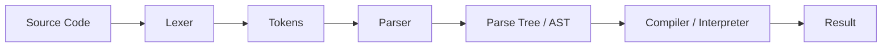
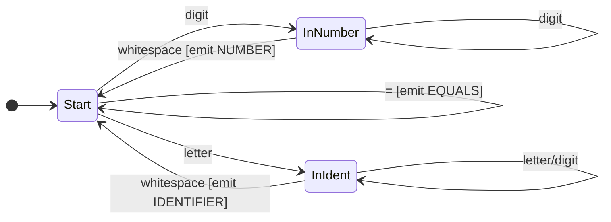

# How Parsers Work

You've learned about [RTNs](recursive_transition_networks.md), [BNF](backus_naur_form.md), and [Finite State Machines](finite_state_machines.md). These are all ways to *describe* languages. But how do we actually *use* these descriptions to process text? How does Python know that `print("hello")` is valid but `print("hello` isn't?

The answer is **parsing**—the process of analyzing text according to a grammar. It's how compilers understand your code, how browsers render HTML, and how your JSON config files become usable data.

## The Big Picture

When a compiler or interpreter processes your code, it goes through several stages:



| Stage | Input | Output | Example |
|:------|:------|:-------|:--------|
| **Lexer** | Raw text | Tokens | `"x = 42"` → `[ID:x, EQUALS, NUM:42]` |
| **Parser** | Tokens | Tree structure | Tokens → Assignment node |
| **Compiler/Interpreter** | Tree | Machine code / result | Tree → execution |

We'll focus on the first two stages: lexing and parsing.

## Stage 1: Lexical Analysis (Lexing)

The **lexer** (or tokenizer) breaks raw text into meaningful chunks called **tokens**. It's like turning a stream of characters into a stream of words.

### What Tokens Look Like

For the expression `total = price * 2 + tax`:

| Token Type | Value |
|:-----------|:------|
| IDENTIFIER | "total" |
| EQUALS | "=" |
| IDENTIFIER | "price" |
| STAR | "*" |
| NUMBER | "2" |
| PLUS | "+" |
| IDENTIFIER | "tax" |

The lexer doesn't understand grammar—it just recognizes patterns. "Is this a number? A keyword? An operator?" That's all it asks.

### Lexer Implementation

Lexers are typically implemented as [Finite State Machines](finite_state_machines.md):



Here's a simple Python lexer:

```python
import re

TOKEN_SPEC = [
    ('NUMBER',   r'\d+'),
    ('IDENT',    r'[a-zA-Z_][a-zA-Z0-9_]*'),
    ('PLUS',     r'\+'),
    ('MINUS',    r'-'),
    ('STAR',     r'\*'),
    ('SLASH',    r'/'),
    ('EQUALS',   r'='),
    ('LPAREN',   r'\('),
    ('RPAREN',   r'\)'),
    ('SKIP',     r'[ \t]+'),
]

def tokenize(text):
    tokens = []
    pos = 0
    while pos < len(text):
        for token_type, pattern in TOKEN_SPEC:
            regex = re.compile(pattern)
            match = regex.match(text, pos)
            if match:
                if token_type != 'SKIP':
                    tokens.append((token_type, match.group()))
                pos = match.end()
                break
        else:
            raise SyntaxError(f"Unknown character: {text[pos]}")
    return tokens

print(tokenize("x = 42 + y"))
# [('IDENT', 'x'), ('EQUALS', '='), ('NUMBER', '42'),
#  ('PLUS', '+'), ('IDENT', 'y')]
```

## Stage 2: Parsing

The **parser** takes tokens and builds a structured representation—usually a tree—according to the grammar rules.

### Parse Trees vs Abstract Syntax Trees

**Parse Tree (Concrete Syntax Tree):** Shows every grammar rule applied.

**Abstract Syntax Tree (AST):** Simplified tree focusing on meaning, not syntax.

For `2 + 3 * 4`:

**Parse Tree:**
```
         Expression
              |
    +---------+---------+
    |         |         |
  Term       '+'      Term
    |                   |
  Factor        +-------+-------+
    |           |       |       |
   '2'        Term     '*'   Factor
               |                 |
            Factor              '4'
               |
              '3'
```

**AST:**
```
        +
       / \
      2   *
         / \
        3   4
```

The AST is what most compilers actually work with.

## Parsing Strategies

### Top-Down Parsing

Start with the goal (e.g., "program") and work down to terminals.

**Recursive Descent** is the most intuitive top-down approach. Each grammar rule becomes a function:

Given this grammar:
```bnf
<expression> ::= <term> { ("+" | "-") <term> }
<term> ::= <factor> { ("*" | "/") <factor> }
<factor> ::= NUMBER | "(" <expression> ")"
```

Here's a recursive descent parser:

```python
class Parser:
    def __init__(self, tokens):
        self.tokens = tokens
        self.pos = 0

    def current_token(self):
        if self.pos < len(self.tokens):
            return self.tokens[self.pos]
        return None

    def consume(self, expected_type=None):
        token = self.current_token()
        if expected_type and token[0] != expected_type:
            raise SyntaxError(f"Expected {expected_type}, got {token}")
        self.pos += 1
        return token

    def parse_expression(self):
        """expression = term { ('+' | '-') term }"""
        left = self.parse_term()

        while self.current_token() and self.current_token()[0] in ('PLUS', 'MINUS'):
            op = self.consume()[1]
            right = self.parse_term()
            left = ('binop', op, left, right)

        return left

    def parse_term(self):
        """term = factor { ('*' | '/') factor }"""
        left = self.parse_factor()

        while self.current_token() and self.current_token()[0] in ('STAR', 'SLASH'):
            op = self.consume()[1]
            right = self.parse_factor()
            left = ('binop', op, left, right)

        return left

    def parse_factor(self):
        """factor = NUMBER | '(' expression ')'"""
        token = self.current_token()

        if token[0] == 'NUMBER':
            self.consume()
            return ('number', int(token[1]))

        elif token[0] == 'LPAREN':
            self.consume('LPAREN')
            expr = self.parse_expression()
            self.consume('RPAREN')
            return expr

        else:
            raise SyntaxError(f"Unexpected token: {token}")

# Usage
tokens = tokenize("2 + 3 * 4")
parser = Parser(tokens)
ast = parser.parse_expression()
print(ast)
# ('binop', '+', ('number', 2), ('binop', '*', ('number', 3), ('number', 4)))
```

??? tip "Notice the Structure"

    The parser functions mirror the grammar exactly:

    - `parse_expression` handles `+` and `-`
    - `parse_term` handles `*` and `/`
    - `parse_factor` handles numbers and parentheses

    This is why BNF translates so directly into code!

### Bottom-Up Parsing

Start with tokens and combine them into larger structures. More powerful but harder to write by hand. Tools like YACC and Bison generate bottom-up parsers.

### LL vs LR Parsers

| Type | Reads | Builds Tree | Used By |
|:-----|:------|:------------|:--------|
| **LL(k)** | Left-to-right | Leftmost derivation | Recursive descent, ANTLR |
| **LR(k)** | Left-to-right | Rightmost derivation | YACC, Bison |

The "(k)" means how many tokens of lookahead. LL(1) looks at one token ahead to decide what to do.

## Handling Operator Precedence

Our grammar naturally handles precedence! Here's why:

1. `expression` handles `+` and `-`
2. `term` handles `*` and `/`
3. `factor` handles numbers and parentheses

Since `term` is nested inside `expression`, multiplication happens "deeper" in the tree—which means it's evaluated first.

For `2 + 3 * 4`:

```
     +          (evaluated last)
    / \
   2   *        (evaluated first)
      / \
     3   4
```

Result: 2 + (3 * 4) = 14 ✓

### Adding More Precedence Levels

Want to add exponentiation (`^`) with highest precedence?

```bnf
<expression> ::= <term> { ("+" | "-") <term> }
<term> ::= <power> { ("*" | "/") <power> }
<power> ::= <factor> [ "^" <power> ]
<factor> ::= NUMBER | "(" <expression> ")"
```

Notice `<power>` calls itself on the right side—this makes `^` right-associative: `2^3^4` = `2^(3^4)`.

## Handling Errors

Good parsers give helpful error messages:

```python
def consume(self, expected_type):
    token = self.current_token()
    if token is None:
        raise SyntaxError(f"Unexpected end of input, expected {expected_type}")
    if token[0] != expected_type:
        raise SyntaxError(
            f"Line {self.line}, column {self.column}: "
            f"Expected {expected_type}, got {token[0]} ('{token[1]}')"
        )
    self.pos += 1
    return token
```

More sophisticated parsers can:

- **Recover** from errors and continue parsing
- **Suggest** corrections ("Did you mean...?")
- **Highlight** the exact location of the problem

## Evaluating the AST

Once you have an AST, you can walk it to compute results:

```python
def evaluate(node):
    if node[0] == 'number':
        return node[1]

    elif node[0] == 'binop':
        op, left, right = node[1], node[2], node[3]
        left_val = evaluate(left)
        right_val = evaluate(right)

        if op == '+': return left_val + right_val
        if op == '-': return left_val - right_val
        if op == '*': return left_val * right_val
        if op == '/': return left_val / right_val

    raise ValueError(f"Unknown node type: {node[0]}")

# Using our earlier AST
ast = ('binop', '+', ('number', 2), ('binop', '*', ('number', 3), ('number', 4)))
print(evaluate(ast))  # 14
```

This tree-walking interpreter is the simplest approach. Real interpreters might:

- Compile the AST to bytecode
- Optimize the tree before execution
- Generate machine code

## Parser Generators

Writing parsers by hand is educational, but for real projects, consider parser generators:

| Tool | Language | Grammar Style |
|:-----|:---------|:--------------|
| **ANTLR** | Java, Python, etc. | EBNF-like |
| **PLY** | Python | YACC-like |
| **Lark** | Python | EBNF |
| **PEG.js** | JavaScript | PEG |
| **Bison** | C/C++ | YACC |

You write the grammar, the tool generates the parser code.

**Example with Lark (Python):**

```python
from lark import Lark

grammar = """
    start: expr
    expr: term (("+"|"-") term)*
    term: factor (("*"|"/") factor)*
    factor: NUMBER | "(" expr ")"
    NUMBER: /\d+/
    %ignore " "
"""

parser = Lark(grammar)
tree = parser.parse("2 + 3 * 4")
print(tree.pretty())
```

## Real-World Parsing

### JSON Parser

JSON is simple enough to parse by hand:

```
value   = object | array | string | number | "true" | "false" | "null"
object  = "{" [ pair { "," pair } ] "}"
pair    = string ":" value
array   = "[" [ value { "," value } ] "]"
```

Most languages have built-in JSON parsers because it's so common.

### HTML Parser

HTML is messy—browsers handle malformed HTML gracefully. Real HTML parsers use complex error recovery:

```html
<p>This is <b>bold and <i>italic</b> text</i>
```

Technically invalid, but browsers render it anyway!

### Programming Language Parsers

Modern language parsers are sophisticated:

- **Error recovery** for IDE features
- **Incremental parsing** for fast re-parsing on edits
- **Loose parsing** modes for incomplete code

## Practice Problems

??? question "Challenge 1: Add Unary Minus"

    Modify the expression grammar and parser to handle unary minus:

    - `-5`
    - `2 + -3`
    - `-(-4)`

    Where does the new rule go in the precedence hierarchy?

??? question "Challenge 2: Parse Variable Assignments"

    Extend the grammar to handle:

    ```
    x = 10
    y = x + 5
    ```

    You'll need to track variable names and store their values.

??? question "Challenge 3: Error Messages"

    Improve the parser to give line and column numbers in error messages.
    What information do you need to track during lexing?

## Key Takeaways

| Concept | What It Does |
|:--------|:-------------|
| **Lexer** | Breaks text into tokens |
| **Parser** | Builds tree from tokens |
| **Token** | Meaningful chunk (keyword, number, operator) |
| **AST** | Tree representing program structure |
| **Recursive Descent** | Each grammar rule = one function |
| **Precedence** | Handled by grammar structure (nesting depth) |

## Further Reading

- [Recursive Transition Networks](recursive_transition_networks.md) — Visual grammars
- [Backus-Naur Form](backus_naur_form.md) — Grammar notation
- [Finite State Machines](finite_state_machines.md) — Foundation for lexers
- **Crafting Interpreters** by Robert Nystrom — Free online book, excellent deep dive

---

Parsing bridges the gap between human-readable text and computer-manipulable structure. It's where theory meets practice—where BNF rules become working code. Once you understand parsing, you can build your own languages, transform code, and peek behind the curtain of every compiler and interpreter you use. That's real power. 🔧
