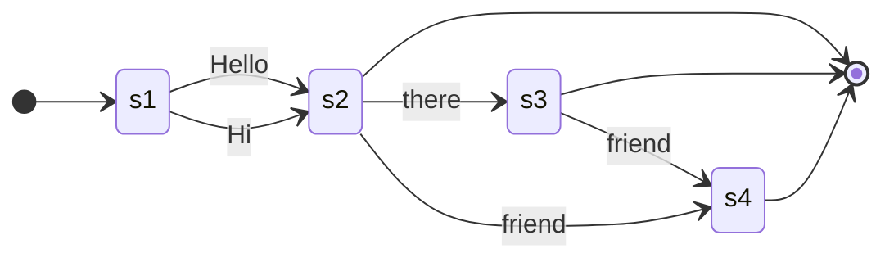
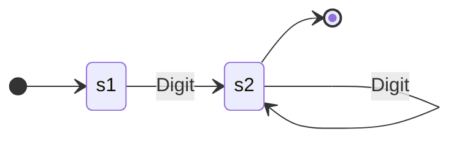
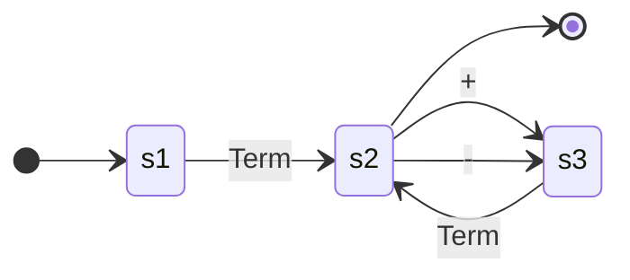
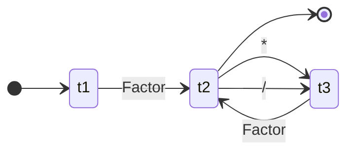
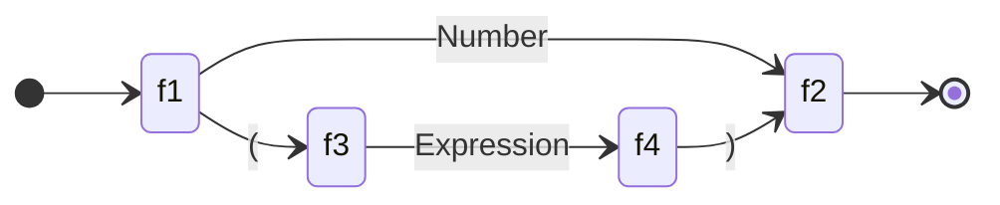
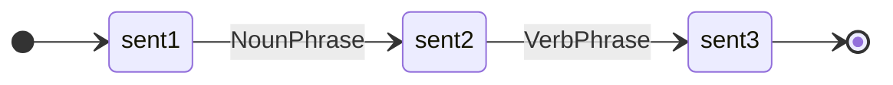
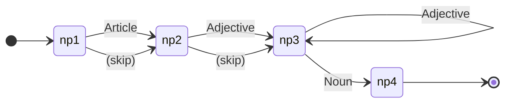
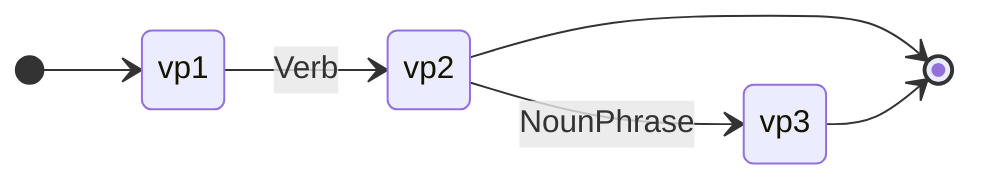

# Recursive Transition Networks (RTNs)

When you write `x = 3 + 4 * 2` in any programming language, the compiler knows—without ambiguity—that this means `3 + (4 * 2)`, not `(3 + 4) * 2`. When you type "The cat sat on the mat," a grammar checker can instantly tell it's valid English, while "Cat the mat on sat the" is nonsense. How do these systems make such determinations?

The answer lies in **Recursive Transition Networks**—a visual, intuitive formalism for describing the grammatical structure of languages, whether programming languages, natural languages, or anything with compositional rules.

RTNs extend [Finite State Machines](finite_state_machines.md) with a crucial capability: the ability to call other networks recursively. This single addition transforms them from recognizers of simple patterns into powerful tools for parsing arbitrarily nested structures.

## What is a Recursive Transition Network?

A Recursive Transition Network is a directed graph that describes a grammar:

- **Nodes** represent states in the parsing process
- **Edges** represent transitions based on input
- **Labels** on edges can be terminals (actual symbols like `+` or `the`) or non-terminals (references to other RTNs)
- **Start state** indicates where parsing begins
- **End state(s)** mark successful completion

The defining feature: edges can reference *other RTNs*. An RTN for "Expression" might call an RTN for "Term," which calls "Factor," which calls back to "Expression." This circular reference—recursion—enables parsing of nested structures like `((1 + 2) * (3 + 4))`.

### Formal Definition

An RTN is defined by a set of networks, where each network N is a 5-tuple (Q, Σ, Γ, δ, q₀, F):

| Symbol | Meaning |
|:-------|:--------|
| Q | Finite set of states |
| Σ | Finite alphabet of **terminal** symbols (actual tokens) |
| Γ | Finite set of **non-terminal** symbols (network names) |
| δ | Transition function: Q × (Σ ∪ Γ) → Q |
| q₀ | Initial state (q₀ ∈ Q) |
| F | Set of final/accepting states (F ⊆ Q) |

The key distinction from finite state machines: transitions can be on **non-terminals**, which invoke other networks recursively.

## A Simple Example: Greetings

Let's build an RTN for simple greetings. Valid greetings include:

- "Hello"
- "Hi"
- "Hello there"
- "Hi friend"
- "Hello there friend"

Here's the RTN:



**How to read this:**

1. Start at the initial state
2. Must consume either "Hello" or "Hi" to reach `s2`
3. From `s2`, can exit (valid greeting), or continue with "there" or "friend"
4. From `s3` (after "there"), can exit or add "friend"
5. Any path reaching a final state is valid

**Trace example:** "Hi there friend"

- Start → (Hi) → s2 → (there) → s3 → (friend) → s4 → End ✓

**Invalid example:** "Hello friend there"

- Start → (Hello) → s2 → (friend) → s4 → (there?) → stuck (no transition)

??? tip "Practice Tracing"

    Try tracing "Hello there" and "Hi" through the network.
    What about just "there friend" without a greeting? Where does it fail?

## Recognizing Unsigned Integers

Let's define a more interesting pattern: unsigned integers (one or more digits).

**Valid:**

- "7"
- "42"
- "1337"

**Invalid:**

- "" (empty)
- "12.5" (contains a decimal point)

**The RTN:**



**Analysis:**

- Requires at least one digit to reach `s2` (rejects empty string)
- Loop on `s2` accepts zero or more additional digits
- Can exit after any digit

This compact representation says "one or more digits"—a pattern that would require infinitely many states if we tried to enumerate every possible number explicitly.

## The Power of Recursion: Arithmetic Expressions

Here's where RTNs demonstrate their real power. We want to parse arithmetic expressions like:

- `5`
- `3 + 7`
- `(2 + 3) * 4`
- `3 + 4 * 2`
- `((1 + 2) * (3 + 4))`

The challenge: expressions can contain other expressions (via parentheses), and we need to enforce operator precedence (`*` and `/` bind tighter than `+` and `-`).

### Why Operator Precedence Matters

When parsing `3 + 4 * 2`, we want:

- **Correct:** `3 + (4 * 2) = 11`
- **Incorrect:** `(3 + 4) * 2 = 14`

The grammar itself must encode this precedence. We accomplish this through a **hierarchy of RTNs**.

### The Three-Level Hierarchy

We define three mutually recursive networks:

1. **Expression** (loosest binding): handles `+` and `-`
2. **Term** (medium binding): handles `*` and `/`
3. **Factor** (tightest binding): handles numbers and parenthesized expressions

**Conceptually:**

- A **Factor** is the smallest unit: a number or a parenthesized expression
- A **Term** is one or more Factors multiplied or divided together
- An **Expression** is one or more Terms added or subtracted together

Thus `3 + 4 * 2` naturally parses as: **(term: 3) + (term: 4 * 2)**

### Expression RTN

An expression is a term, optionally followed by `+` or `-` and another term (repeatable):



**Key observation:** Expression calls Term first, ensuring multiplication/division are handled before returning.

### Term RTN

A term is a factor, optionally followed by `*` or `/` and another factor (repeatable):



**Key observation:** Term calls Factor, grouping numbers/parenthesized expressions before returning to Expression.

### Factor RTN

A factor is either a number or an expression wrapped in parentheses:



**Key observation:** Factor can call Expression recursively, enabling nested parentheses like `((1 + 2))`.

!!! tip "How the Calling Chain Encodes Precedence"

    The recursion structure determines precedence:

    ```mermaid
    graph TD
        E[Expression<br/>handles + and -]
        T[Term<br/>handles * and /]
        F[Factor<br/>handles numbers & parentheses]

        E -->|calls| T
        T -->|calls| F
        F -.->|can call| E

        style E fill:#4a5568,stroke:#cbd5e0,stroke-width:2px,color:#fff
        style T fill:#2d3748,stroke:#cbd5e0,stroke-width:2px,color:#fff
        style F fill:#1a202c,stroke:#cbd5e0,stroke-width:2px,color:#fff
    ```

    **The calling order enforces precedence:**

    1. Expression **must** call Term (can't skip to Factor)
    2. Term **must** call Factor (can't skip to numbers)
    3. Factor **may** call Expression (for parentheses)

    Because Term processes multiplication/division *before* returning to Expression (which handles addition/subtraction), the grammar itself encodes precedence. No special case handling needed.

### Trace Example 1: `3 + 4 * 2`

Step-by-step parsing:

1. **Expression** enters, calls **Term**
2. **Term** calls **Factor** → consumes `3`, returns to **Term**
3. **Term** looks ahead: sees `+` (not `*` or `/`), so returns `3` to **Expression**
4. **Expression** sees `+`, transitions to expect another **Term**
5. Second **Term** calls **Factor** → consumes `4`, returns
6. **Term** sees `*`, transitions to expect another **Factor**
7. **Factor** consumes `2`, returns to **Term**
8. **Term** returns `4 * 2` (as a unit) to **Expression**
9. **Expression** completes with structure: `3 + (4 * 2)`

**Result:** Correctly parsed as `3 + (4 * 2) = 11`, not `(3 + 4) * 2 = 14`.

The hierarchical calling structure forced multiplication to complete before addition.

### Trace Example 2: `(2 + 3) * 4`

Parentheses override precedence:

1. **Expression** calls **Term**
2. **Term** calls **Factor**
3. **Factor** sees `(`, transitions to expect **Expression** (recursive call)
4. **Inner Expression** calls **Term** → **Factor** → consumes `2`
5. **Inner Expression** sees `+`, calls another **Term** → **Factor** → consumes `3`
6. **Inner Expression** completes, returns `2 + 3` to **Factor**
7. **Factor** expects `)`, finds it, returns to **Term**
8. **Term** sees `*`, calls another **Factor** → consumes `4`
9. **Term** completes with structure: `(2 + 3) * 4`
10. **Expression** completes

**Result:** Parentheses created a nested Expression evaluated before the multiplication.

## RTNs for Natural Language

RTNs originated in natural language processing research in the 1970s. They provide a visual way to specify syntactic structure.

### Simple English Sentences

A basic sentence has a noun phrase followed by a verb phrase:



### Noun Phrase RTN

A noun phrase consists of an optional article, zero or more adjectives, and a noun:



### Verb Phrase RTN

A verb phrase is a verb, optionally followed by a noun phrase:



**Example sentences these RTNs accept:**

- "Cats sleep"
- "The cat sleeps"
- "The big fluffy cat chased the tiny mouse"
- "A small dog barked"

**Trace:** "The cat sleeps"

1. Sentence → NounPhrase
2. NounPhrase: `The` (Article) → (no Adjectives) → `cat` (Noun) → complete
3. Sentence → VerbPhrase
4. VerbPhrase: `sleeps` (Verb) → (no NounPhrase) → complete
5. Sentence complete ✓

Of course, real natural language is vastly more complex (prepositional phrases, relative clauses, conjunctions, etc.), but these RTNs demonstrate the principle.

## Historical Context

Recursive Transition Networks were developed in the early 1970s for computational linguistics and natural language understanding. William A. Woods formalized RTNs in his influential 1970 paper "Transition Network Grammars for Natural Language Analysis."

RTNs were part of a broader effort to move beyond simple finite state machines for language processing. They bridged the gap between FSMs (too limited for nested structures) and full context-free grammars (more expressive but less intuitive to work with visually).

**Augmented Transition Networks (ATNs)**, introduced by Woods shortly after, extended RTNs with registers and conditions, making them even more powerful. ATNs were used in early natural language interfaces and question-answering systems.

While modern parsers often use other formalisms (LL, LR, Earley parsers based on context-free grammars), RTNs remain pedagogically valuable for understanding how grammars work.

## Relationship to Other Formalisms

RTNs sit in a hierarchy of formal language tools:

| Formalism | Power | Visual? | Best For |
|:----------|:------|:--------|:---------|
| **Finite State Machine** | Regular languages | Yes | Simple patterns (no nesting) |
| **Recursive Transition Network** | Context-free languages | Yes | Nested structures with visual clarity |
| **Context-Free Grammar** ([BNF](backus_naur_form.md)) | Context-free languages | No | Precise textual specification |
| **Pushdown Automaton** | Context-free languages | Rarely | Theoretical analysis |

RTNs and context-free grammars are **equally powerful**—they recognize the same class of languages (context-free languages). The choice between them is often about convenience and clarity:

- **RTNs**: More intuitive visually; easier to trace by hand
- **[BNF](backus_naur_form.md)/CFG**: More compact textually; easier to process algorithmically

## Implementation Considerations

RTNs translate naturally into recursive descent parsers. Each network becomes a function that calls other functions for non-terminals.

**Pseudocode for Expression RTN:**

```
function Expression():
    result = Term()
    while next_token in ['+', '-']:
        operator = consume_token()
        right = Term()
        result = combine(result, operator, right)
    return result
```

This recursive structure mirrors the RTN diagram directly, making implementation straightforward.

## Limitations of RTNs

Despite their elegance, RTNs have limitations:

### 1. Ambiguity

RTNs can be ambiguous. Consider a grammar where an expression could be parsed multiple ways. The RTN doesn't specify which interpretation to choose.

**Example:** The expression `3 - 4 - 5` could be:

- Left-associative: `(3 - 4) - 5 = -6`
- Right-associative: `3 - (4 - 5) = 4`

Our RTN's loop structure naturally creates left-associativity, but this isn't explicit in the diagram.

### 2. Not All Context-Free Languages

While RTNs recognize context-free languages, they can't enforce context-sensitive constraints like "variables must be declared before use" or "function call has correct number of arguments." These require additional mechanisms (semantic analysis).

### 3. Efficiency

Naive RTN traversal can be inefficient for some grammars, requiring backtracking. Modern parsing algorithms optimize this.

## Why RTNs Matter

Understanding RTNs provides insight into:

- **Compiler design**: How programming languages are parsed
- **Natural language processing**: How sentence structure is analyzed
- **Data validation**: How formats like JSON or XML are validated
- **[Computational thinking](computational_thinking.md)**: Breaking complex structures into composable, recursive pieces

RTNs make the abstract concrete. They turn "grammar" from a vague concept into a precise, traceable mechanism you can follow by hand or implement in code.

## Practice Problems

??? question "Challenge 1: Email Addresses"

    Design an RTN for simplified email addresses like `user@domain.com`.

    Components:
    - Username: one or more letters/digits
    - `@` symbol
    - Domain: one or more letters/digits
    - `.` symbol
    - Extension: one or more letters

    **Hint:** Create separate networks for Username, Domain, and Extension, then combine them.

    ??? tip "Solution Sketch"

        ```mermaid
        stateDiagram-v2
            direction LR
            [*] --> s1
            s1 --> s2: Username
            s2 --> s3: @
            s3 --> s4: Domain
            s4 --> s5: .
            s5 --> s6: Extension
            s6 --> [*]
        ```

        Where Username, Domain, and Extension each follow the "one or more alphanumeric" pattern (similar to our unsigned integer RTN).

??? question "Challenge 2: Trace an Expression"

    Trace `2 * 3 + 4` through the Expression/Term/Factor RTNs.

    What structure does it produce? Is it `(2 * 3) + 4` or `2 * (3 + 4)`?

    ??? tip "Solution"

        **Trace:**

        1. Expression → Term
        2. Term → Factor → `2`
        3. Term sees `*` → Factor → `3`
        4. Term returns `2 * 3` to Expression
        5. Expression sees `+` → Term
        6. Term → Factor → `4`
        7. Expression completes with `(2 * 3) + 4`

        **Result:** `(2 * 3) + 4 = 10`, not `2 * (3 + 4) = 14`. Correct precedence!

??? question "Challenge 3: Extend the Grammar"

    How would you modify the arithmetic RTNs to support exponentiation (`^`), which should have higher precedence than multiplication?

    **Hint:** Where does it fit in the Expression → Term → Factor hierarchy?

    ??? tip "Solution"

        Add a fourth level between Term and Factor:

        - Expression → Term → **Power** → Factor
        - Power handles `^`
        - Term would then call Power instead of Factor

        **Power RTN:**

        ```mermaid
        stateDiagram-v2
            direction LR
            [*] --> p1
            p1 --> p2: Factor
            p2 --> [*]
            p2 --> p3: ^
            p3 --> p2: Factor
        ```

        Now `2 + 3 * 4 ^ 5` parses as `2 + (3 * (4 ^ 5))` ✓

??? question "Challenge 4: Ambiguity"

    The natural language RTNs above are ambiguous. Find a sentence that could have multiple valid parses.

    **Example sentence:** "The cat saw the dog with the telescope"

    ??? tip "Solution"

        This sentence has two interpretations:

        1. The cat used a telescope to see the dog
        2. The cat saw a dog that has a telescope

        Both are structurally valid given our simple RTNs, but mean different things. Resolving such ambiguity requires either:

        - More sophisticated grammar rules (subcategorization)
        - Semantic analysis (understanding meaning)
        - Probabilistic models (choosing most likely interpretation)

        This is a fundamental challenge in natural language processing.

## Key Takeaways

| Concept | Meaning |
|:--------|:--------|
| **RTN** | Finite state machine extended with network calls |
| **Terminal** | Actual token/symbol in input (e.g., `+`, `the`) |
| **Non-terminal** | Reference to another RTN (e.g., `Expression`) |
| **Recursion** | Network calling itself (directly or indirectly) |
| **Precedence** | Hierarchy of networks encodes operator priority |
| **Context-Free** | Class of languages RTNs recognize |
| **Parse Tree** | Structure produced by successful parse |

## Further Reading

- **William A. Woods (1970)** — "Transition Network Grammars for Natural Language Analysis" (the original paper)
- **David Evans, [Introduction to Computing](https://computingbook.org/)** — Chapter 2 covers RTNs and formal languages
- **[Computational Thinking](computational_thinking.md)** — RTNs exemplify decomposition and abstraction
- **[Backus-Naur Form](backus_naur_form.md)** — Textual notation for context-free grammars

---

Recursive Transition Networks transform the abstract notion of "grammar" into something you can see, trace, and reason about. They bridge the gap between finite state machines (too simple for nesting) and full context-free grammars (precise but less visual). In doing so, they make parsing—a fundamental task in computer science—accessible and intuitive.

Every time a compiler checks your code or a grammar checker analyzes your writing, something very much like an RTN is working behind the scenes. Understanding how these networks operate gives you insight into one of the most ubiquitous problems in computing: making sense of structured input.

## Video Summary

<div class="video-wrapper">
  <iframe src="https://www.youtube.com/embed/S2G4QGy5vGE" title="Recursive Transition Networks Explained" allow="accelerometer; autoplay; clipboard-write; encrypted-media; gyroscope; picture-in-picture; web-share" allowfullscreen></iframe>
</div>
