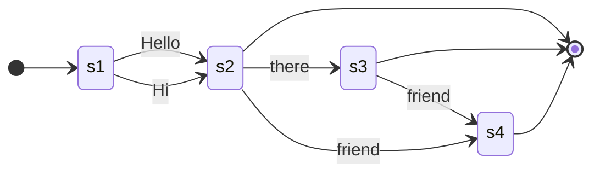
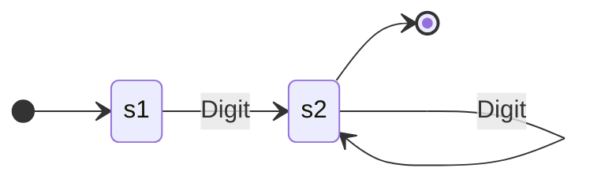
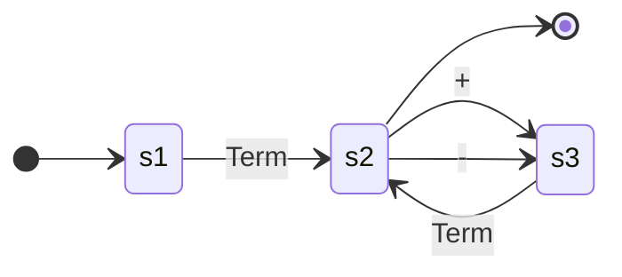
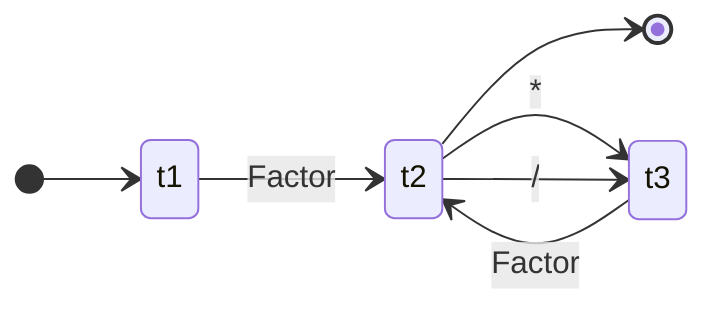
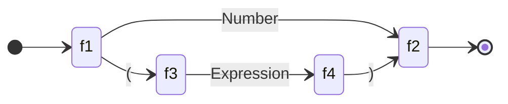
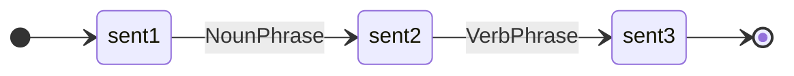
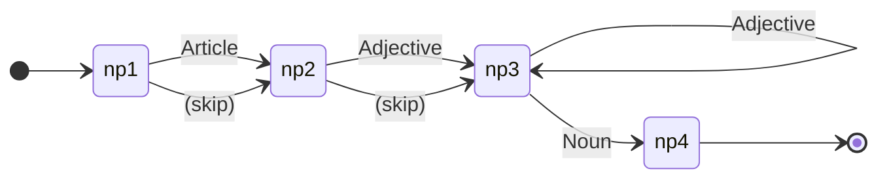
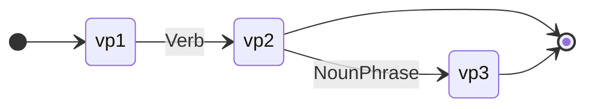

# Recursive Transition Networks (RTNs)

Ever wondered how your computer knows that `print("hello")` is valid Python, but `print "hello)` isn't? Or how a grammar checker can tell that "The cat sat on the mat" is a proper sentence, but "Cat the mat on sat the" is word salad? The answer lies in a elegant little concept called **Recursive Transition Networks** (RTNs).

RTNs give us a visual, intuitive way to describe the *rules* that define what's valid in a language—whether that language is English, Python, or something you invent yourself.

## What is a Recursive Transition Network?

At its core, an RTN is a directed graph that describes a grammar. Think of it as a flowchart for language:

- **Nodes** represent states (where you are in the parsing process)
- **Edges** represent transitions (what you need to see to move forward)
- **Start node** is where parsing begins
- **End node** means "success! this is valid!"

The "recursive" part? RTNs can call *other* RTNs (or even themselves), allowing us to describe complex, nested structures without our diagrams turning into spaghetti. 🍝

## A Simple Example: Greeting Someone

Let's start small. Imagine we want to define all valid ways to greet someone:

- "Hello"
- "Hi"
- "Hello there"
- "Hi friend"
- "Hello there friend"

Here's an RTN that captures this grammar:

**Reading this diagram:**

1. Start at the initial state (`[*]` on the left)
2. You *must* say either "Hello" or "Hi" to reach state `s2`
3. From `s2`, you can end (valid greeting!), or continue with "there" or "friend"
4. From `s3` (after "there"), you can end or add "friend"
5. Any path that reaches the final state (`[*]` on the right) is a valid greeting

??? tip "Try It Yourself"

    Trace through the diagram with "Hi there friend" — does it reach the end state?
    What about "Hello friend there"? (Spoiler: it doesn't work!)

## Numbers: Where Things Get Interesting

Let's define valid unsigned integers. An integer is one or more digits:

- "7" ✓
- "42" ✓
- "1337" ✓
- "" ✗ (empty isn't a number)
- "12.5" ✗ (that's a float, friend)

**What's happening here:**

1. From the start, we need at least one digit to reach `s2`
2. The loop on `s2` lets us add as many additional digits as we want
3. We can exit to the end state whenever we're done

That loop is doing the heavy lifting—it's saying "zero or more additional digits" in a beautifully compact way. Elegant, right? ✨

## The Power of Recursion: Arithmetic Expressions

Here's where RTNs really shine. How would you define valid arithmetic expressions like:

- `5`
- `3 + 7`
- `(2 + 3) * 4`
- `((1 + 2) * (3 + 4))`

The trick is that expressions can contain *other expressions*. This is recursion, and it's why we need **Recursive** Transition Networks, not just regular ones.

Let's build this up with three interconnected RTNs:

### Expression RTN

An expression is a term, optionally followed by `+` or `-` and another term:

### Term RTN

A term is a factor, optionally followed by `*` or `/` and another factor:

### Factor RTN

A factor is either a number OR an expression wrapped in parentheses:

??? note "Notice the Recursion?"

    The **Factor** RTN can call the **Expression** RTN, which calls **Term**, which calls **Factor**...
    which can call **Expression** again! This circular reference is what lets us handle arbitrarily
    nested parentheses like `((((1 + 2))))`.

### Tracing Through an Example

Let's parse `(2 + 3) * 4`:

1. **Expression** calls **Term**
2. **Term** calls **Factor**
3. **Factor** sees `(`, so it expects an **Expression** inside
4. Inner **Expression** calls **Term** → **Factor** → gets `2`
5. Inner **Expression** sees `+`, expects another **Term** → **Factor** → gets `3`
6. Inner **Expression** complete, back to **Factor** which expects `)`
7. **Factor** complete, back to **Term** which sees `*`
8. **Term** expects another **Factor** → gets `4`
9. **Term** complete, **Expression** complete. Valid! 🎉

## RTNs for Natural Language

RTNs aren't just for programming languages. They were originally developed to describe natural language grammars! Here's a simplified RTN for basic English sentences:

### Sentence RTN

### Noun Phrase RTN

### Verb Phrase RTN

These RTNs can parse sentences like:

- "Cats sleep" (simple!)
- "The cat sleeps" 🐱
- "The big fluffy cat chased the tiny mouse"
- "A very small dog barked"

## Why RTNs Matter

RTNs are more than just a theoretical exercise. They're foundational to:

- **Compilers and interpreters**: Every programming language has a grammar, and RTNs (or their cousins, context-free grammars) are how we formally define them
- **Natural language processing**: Understanding sentence structure is the first step in making computers understand human language
- **Validation**: From JSON schemas to regular expressions, the concept of "does this input match this pattern?" is everywhere
- **Computational thinking**: Breaking complex structures into composable, recursive pieces is a skill that transfers to all kinds of problem-solving

## Key Takeaways

| Concept | What It Means |
|:--------|:--------------|
| **Node** | A state in the parsing process |
| **Edge** | A transition requiring a specific input |
| **Start State** | Where parsing begins |
| **End State** | Valid input reaches here |
| **Recursion** | An RTN calling another RTN (or itself) |
| **Terminal** | Actual symbols/tokens (like `+` or `Digit`) |
| **Non-terminal** | References to other RTNs (like `Expression` or `NounPhrase`) |

## Practice Problems

??? question "Challenge 1: Email Addresses"

    Try sketching an RTN for simple email addresses like `user@domain.com`.
    What are the components? (Hint: think about what comes before `@`, after `@`, and after `.`)

??? question "Challenge 2: Trace the Expression"

    Using the arithmetic expression RTNs above, trace through parsing `3 + 4 * 2`.
    Does the grammar naturally handle operator precedence? (Hint: yes, and the structure of the RTNs is why!)

??? question "Challenge 3: Extend the Grammar"

    How would you modify the arithmetic RTNs to support exponentiation (`^`)?
    Where would you add it, and why does placement matter?

## Further Reading

- **David Evans, Introduction to Computing** - Chapter 2 covers language and RTNs in depth
- **Computational Thinking** - RTNs are a great example of abstraction and decomposition in action

---

RTNs take something that could be intimidatingly formal—grammar specification—and turn it into a visual, traceable, almost game-like process. Next time you're wondering why your code won't compile, remember: somewhere, an RTN is shaking its head at you. 😄
