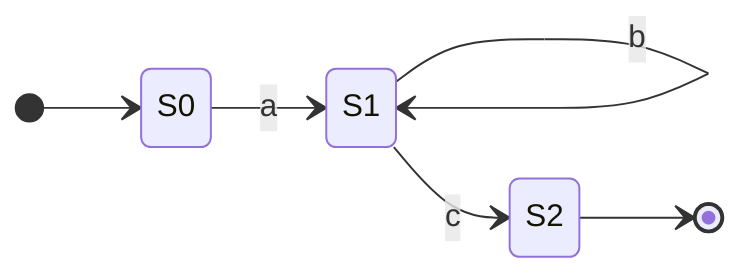

# Regular Expressions

You've seen [Finite State Machines](finite_state_machines.md)—elegant diagrams showing states and transitions. You've seen [BNF](backus_naur_form.md)—formal grammar notation. But when you need to actually *use* pattern matching in your code, you reach for **regular expressions** (regex).

Regex is the practical face of formal language theory. It's the same mathematical power as FSMs, wrapped in a terse syntax that fits in a single line. Love them or hate them (often both), regular expressions are an essential tool.

## Why Regular Expressions Matter

Regular expressions are embedded in virtually every modern programming language and tool. They're the Swiss Army knife of text processing:

- **Validation**: Email addresses, phone numbers, passwords, credit cards
- **Search and Replace**: Find complex patterns across codebases (grep, IDE search)
- **Parsing**: Extract data from logs, CSV files, API responses
- **Lexical Analysis**: The first stage of compilation—breaking source code into tokens
- **Data Cleaning**: Normalize messy input, strip unwanted characters
- **URL Routing**: Web frameworks use regex to match request paths

The return on investment is massive. Spend an hour learning regex fundamentals, unlock decades of productivity. What would take 50 lines of string manipulation code becomes a single elegant pattern.

They're not just for programmers. Journalists use regex to analyze leaked documents. Scientists extract data from research papers. Anyone working with text at scale needs this tool.

## What is a Regular Expression?

A regular expression is a pattern that describes a set of strings. Instead of listing every valid string, you describe the *rules* for what makes a string valid.

``` title="Email Address Pattern" linenums="1"
^[a-zA-Z0-9._%+-]+@[a-zA-Z0-9.-]+\.[a-zA-Z]{2,}$
```

That monstrosity? It matches email addresses. 😅 Let's learn to read (and write) these things.

## Basic Building Blocks

### Literal Characters

Most characters match themselves:

| Pattern | Matches |
|:--------|:--------|
| `cat` | "cat" |
| `hello` | "hello" |
| `123` | "123" |

### Metacharacters

Some characters have special meaning:

| Character | Meaning | Example | Matches |
|:----------|:--------|:--------|:--------|
| `.` | Any single character | `c.t` | "cat", "cot", "c9t" |
| `^` | Start of string | `^hello` | "hello world" (at start) |
| `$` | End of string | `world$` | "hello world" (at end) |
| `\` | Escape special char | `\.` | literal "." |

### Character Classes

Match one character from a set:

| Pattern | Meaning | Matches |
|:--------|:--------|:--------|
| `[aeiou]` | Any vowel | "a", "e", "i", "o", "u" |
| `[0-9]` | Any digit | "0" through "9" |
| `[a-zA-Z]` | Any letter | "a"-"z", "A"-"Z" |
| `[^0-9]` | NOT a digit | anything except "0"-"9" |

### Shorthand Classes

Common patterns have shortcuts:

| Shorthand | Equivalent | Meaning |
|:----------|:-----------|:--------|
| `\d` | `[0-9]` | Digit |
| `\D` | `[^0-9]` | Not a digit |
| `\w` | `[a-zA-Z0-9_]` | Word character |
| `\W` | `[^a-zA-Z0-9_]` | Not a word character |
| `\s` | `[ \t\n\r]` | Whitespace |
| `\S` | `[^ \t\n\r]` | Not whitespace |

??? warning "Unicode Characters"

    By default in many regex engines, `\w` matches only ASCII characters (a-z, A-Z, 0-9, _).

    **This means `\w` WON'T match:**

    - Accented letters: "é", "ñ", "ü"
    - Non-Latin alphabets: "π", "こ", "א"
    - Emoji: "😀"

    **Solutions:**

    - **JavaScript**: Use the `u` flag: `/\w+/u`
    - **Python**: Use `re.UNICODE` flag (default in Python 3): `re.search(r'\w+', text, re.UNICODE)`
    - **Or be explicit**: Use `[a-zA-ZÀ-ÿ]` for Latin with accents, or custom character classes

    For truly international text, consider using Unicode categories like `\p{L}` (any letter) if your engine supports them.

??? example "Concept Check 1: Three-Letter Words"

    Write a regex pattern that matches three letters starting with a vowel.

    ??? tip "Solution"

        **Pattern**: `[aeiouAEIOU][a-zA-Z][a-zA-Z]`

        - `[aeiouAEIOU]` - starts with a vowel
        - `[a-zA-Z]` - second letter
        - `[a-zA-Z]` - third letter

        Note: This matches the pattern anywhere in text. Later we'll learn about word boundaries (`\b`) to match complete words only.

??? example "Concept Check 2: Postal Codes"

    Write a regex pattern that matches a Canadian postal code format (like "K1A 0B1" - letter, digit, letter, space, digit, letter, digit).

    ??? tip "Solution"

        **Pattern**: `[A-Z]\d[A-Z] \d[A-Z]\d`

        - `[A-Z]` - uppercase letter
        - `\d` - digit
        - `[A-Z]` - uppercase letter
        - ` ` - space
        - `\d` - digit
        - `[A-Z]` - uppercase letter
        - `\d` - digit

## Quantifiers: How Many?

Quantifiers specify repetition:

| Quantifier | Meaning | Example | Matches |
|:-----------|:--------|:--------|:--------|
| `*` | Zero or more | `ab*c` | "ac", "abc", "abbc", "abbbc"... |
| `+` | One or more | `ab+c` | "abc", "abbc", "abbbc"... (not "ac") |
| `?` | Zero or one | `colou?r` | "color", "colour" |
| `{n}` | Exactly n | `a{3}` | "aaa" |
| `{n,}` | n or more | `a{2,}` | "aa", "aaa", "aaaa"... |
| `{n,m}` | Between n and m | `a{2,4}` | "aa", "aaa", "aaaa" |

### Greedy vs Lazy

By default, quantifiers are *greedy*—they match as much as possible.

``` title="Greedy Matching Example" linenums="1"
Pattern: <.*>
String:  <div>hello</div>
Match:   <div>hello</div>  (the whole thing!)
```

Add `?` for *lazy* matching—match as little as possible:

``` title="Lazy Matching Example" linenums="1"
Pattern: <.*?>
String:  <div>hello</div>
Match:   <div>  (just the first tag)
```

??? example "Concept Check 3: Password Length"

    Write a regex pattern for a password that's exactly 8-16 characters long (no more, no less).

    ??? tip "Solution"

        **Pattern**: `^.{8,16}$`

        - `^` - start of string
        - `.` - any character
        - `{8,16}` - between 8 and 16 times
        - `$` - end of string

??? example "Concept Check 4: Hashtags"

    Write a regex pattern that matches a hashtag (starts with #, followed by one or more word characters).

    ??? tip "Solution"

        **Pattern**: `#\w+`

        - `#` - literal hashtag
        - `\w+` - one or more word characters

??? example "Concept Check 5: Multiple Spaces"

    Write a regex pattern that matches multiple spaces (two or more consecutive spaces).

    ??? tip "Solution"

        **Pattern**: ` {2,}` or `  +`

        - ` {2,}` - space character, 2 or more times
        - `  +` - two spaces followed by zero or more spaces

## Grouping and Alternatives

### Groups: `( )`

Parentheses group patterns together:

``` title="Grouping Examples" linenums="1"
(ab)+     # One or more "ab": "ab", "abab", "ababab"
(cat|dog) # "cat" or "dog"
```

### Capturing Groups

Groups also *capture* what they match for later use. Think of parentheses as creating a "memory slot" that saves whatever matched inside them.

**Why capture?** You often want to extract specific parts of a match, not just verify a pattern exists.

For example, if you're matching a phone number like `555-1234`, you might want to:

- Extract just the first three digits (`555`)
- Extract just the last four digits (`1234`)
- Rearrange the parts into a different format

**How it works:**

```python title="Capturing Groups in Python" linenums="1"
import re

match = re.search(r'(\d{3})-(\d{4})', 'Call 555-1234')  # (1)!
print(match.group(0))  # "555-1234" (entire match)  # (2)!
print(match.group(1))  # "555" (first capture group)  # (3)!
print(match.group(2))  # "1234" (second capture group)  # (4)!
```

1. Search for pattern with two capturing groups: 3 digits, hyphen, 4 digits
2. Group 0 is always the entire matched string
3. Group 1 captures the first parenthesized sub-pattern (3 digits)
4. Group 2 captures the second parenthesized sub-pattern (4 digits)

**Breaking it down:**

| Part | What it does |
|:-----|:-------------|
| `(\d{3})` | **Group 1**: Captures first 3 digits |
| `-` | Matches literal hyphen (not captured) |
| `(\d{4})` | **Group 2**: Captures last 4 digits |

The parentheses create numbered groups (1, 2, 3...). Group 0 is always the entire match.

**Another example - Parsing dates:**

```python title="Extracting Date Components" linenums="1"
import re

text = "Born on 1995-08-23"
match = re.search(r'(\d{4})-(\d{2})-(\d{2})', text)  # (1)!

year = match.group(1)   # "1995"  # (2)!
month = match.group(2)  # "08"
day = match.group(3)    # "23"

print(f"Year: {year}, Month: {month}, Day: {day}")
# Output: Year: 1995, Month: 08, Day: 23
```

1. Pattern with three groups: 4 digits (year), 2 digits (month), 2 digits (day)
2. Extract each component by accessing numbered capture groups

**Practical use - Reformatting:**

```python title="Reformatting Phone Numbers" linenums="1"
import re

phone = "555-123-4567"
# Capture three groups
match = re.search(r'(\d{3})-(\d{3})-(\d{4})', phone)  # (1)!

# Rearrange into different format
formatted = f"({match.group(1)}) {match.group(2)}-{match.group(3)}"  # (2)!
print(formatted)  # Output: (555) 123-4567
```

1. Capture three groups: area code, exchange, and line number
2. Reconstruct the phone number in a different format using the captured groups

**Key insight:** Parentheses do two things:

1. **Group** patterns together for quantifiers (like `(ab)+`)
2. **Capture** the matched text for later use

When you need grouping but don't want to capture, use non-capturing groups `(?:...)` (explained next).

### Non-Capturing Groups: `(?: )`

When you need grouping but don't need to capture:

``` title="Non-Capturing Group Example" linenums="1"
(?:ab)+   # Groups without capturing
```

### Backreferences

A backreference lets you match *the same text again* that was captured by an earlier group. Instead of matching a pattern, you're matching the exact string that was already captured.

**Why use backreferences?** To find repeated or matching patterns where you don't know in advance what the text will be, only that it should be the same.

**Basic example - Finding duplicate words:**

``` title="Backreference Example" linenums="1"
(\w+)\s+\1   # Matches repeated words: "the the", "is is"
```

**How it works:**

1. `(\w+)` - Captures one or more word characters (this is Group 1)
2. `\s+` - Matches one or more whitespace characters
3. `\1` - Matches *exactly the same text* that Group 1 captured

So if Group 1 captured "the", then `\1` will only match "the" (not "a" or "dog" or anything else).

**Step-by-step with "the the":**

| Step | Pattern Part | Matches | Group 1 Contains |
|:-----|:-------------|:--------|:-----------------|
| 1 | `(\w+)` | "the" | "the" |
| 2 | `\s+` | " " (space) | "the" |
| 3 | `\1` | "the" (must match exactly!) | "the" |

If the text were "the dog", it wouldn't match because `\1` looks for "the" again (not "dog").

**Finding matching HTML tags:**

``` title="Matching Opening and Closing Tags" linenums="1"
<(\w+)>.*?</\1>
```

This matches paired HTML tags like `<div>content</div>` or `<span>text</span>`:

- `<(\w+)>` - Captures the opening tag name (Group 1)
- `.*?` - Matches any content (lazy)
- `</\1>` - Matches closing tag with the *same* name as Group 1

**Breaking it down:**

For the string `<div>hello</div>`:

| Part | Matches | Group 1 |
|:-----|:--------|:--------|
| `<(\w+)>` | `<div>` | "div" |
| `.*?` | "hello" | "div" |
| `</\1>` | `</div>` | "div" |

But `<div>hello</span>` wouldn't match because `\1` is "div", not "span".

**Multiple backreferences:**

``` title="Multiple Backreferences Example" linenums="1"
(\w+) and \1, (\w+) and \2
```

This matches patterns like "cats and cats, dogs and dogs":

- `(\w+)` - Group 1 captures first word
- ` and \1` - Matches " and " followed by same word as Group 1
- `, (\w+)` - Group 2 captures second word
- ` and \2` - Matches " and " followed by same word as Group 2

**Backreference numbers:**

- `\1` refers to Group 1
- `\2` refers to Group 2
- `\3` refers to Group 3
- And so on...

**Important:** Backreferences match the captured *text*, not the *pattern*. If `(\d+)` captures "42", then `\1` will only match "42" exactly, not any other number.

??? example "Concept Check 6: Color Spelling"

    Write a regex pattern that matches either "color" or "colour" using alternation.

    ??? tip "Solution"

        **Pattern**: `colou?r` (simpler) or `col(o|ou)r` (using alternation)

        - Both work, but `colou?r` is more concise

??? example "Concept Check 7: HTML Tag Capture"

    Write a regex pattern that matches HTML tags like `<div>`, `<span>`, `<p>` and captures the tag name.

    ??? tip "Solution"

        **Pattern**: `<(\w+)>`

        - `<` - literal less-than
        - `(\w+)` - capture group for tag name (one or more word chars)
        - `>` - literal greater-than

??? example "Concept Check 8: Doubled Words"

    Write a regex pattern that finds doubled words like "the the" or "is is".

    ??? tip "Solution"

        **Pattern**: `(\w+)\s+\1`

        - `(\w+)` - capture one or more word characters
        - `\s+` - one or more whitespace
        - `\1` - backreference to first captured group (must match the same text)

        Note: This pattern works but may match partial words. Later we'll learn about word boundaries (`\b`) to match complete words only.

## Anchors and Boundaries

| Anchor | Meaning |
|:-------|:--------|
| `^` | Start of string (or line with multiline flag) |
| `$` | End of string (or line with multiline flag) |
| `\b` | Word boundary |
| `\B` | Not a word boundary |

**Word boundaries** are incredibly useful:

``` title="Word Boundary Example" linenums="1"
Pattern: \bcat\b
Matches: "the cat sat" ✓
Doesn't match: "category" ✗, "bobcat" ✗
```

??? example "Concept Check 9: TODO Lines"

    Write a regex pattern that matches lines that start with "TODO:".

    ??? tip "Solution"

        **Pattern**: `^TODO:`

        - `^` - start of line
        - `TODO:` - literal text

??? example "Concept Check 10: File Extensions"

    Write a regex pattern that matches files that end with `.md` or `.txt`.

    ??? tip "Solution"

        **Pattern**: `\.(md|txt)$`

        - `\.` - literal dot (escaped)
        - `(md|txt)` - either "md" or "txt"
        - `$` - end of string

??? example "Concept Check 11: Word Boundaries"

    Write a regex pattern that matches the word "run" as a standalone word (not in "running" or "runner").

    ??? tip "Solution"

        **Pattern**: `\brun\b`

        - `\b` - word boundary
        - `run` - literal text
        - `\b` - word boundary
        - This won't match "running" or "runner" because of the boundaries

## Lookahead and Lookbehind

These match a position without consuming characters:

| Syntax | Name | Meaning |
|:-------|:-----|:--------|
| `(?=...)` | Positive lookahead | Followed by ... |
| `(?!...)` | Negative lookahead | NOT followed by ... |
| `(?<=...)` | Positive lookbehind | Preceded by ... |
| `(?<!...)` | Negative lookbehind | NOT preceded by ... |

**Example: Password Validation**

Password must have a digit and a letter:

``` title="Password Validation Pattern" linenums="1"
^(?=.*\d)(?=.*[a-zA-Z]).{8,}$
```

Breaking it down:

- `^` — start
- `(?=.*\d)` — somewhere ahead, there's a digit
- `(?=.*[a-zA-Z])` — somewhere ahead, there's a letter
- `.{8,}` — at least 8 characters total
- `$` — end

??? example "Concept Check 12: Contains Uppercase"

    Write a regex pattern that matches a string that contains at least one uppercase letter (anywhere).

    ??? tip "Solution"

        **Pattern**: `^(?=.*[A-Z]).+$`

        - `^` - start
        - `(?=.*[A-Z])` - positive lookahead: somewhere there's an uppercase
        - `.+` - one or more characters
        - `$` - end

??? example "Concept Check 13: Password Validation"

    Write a regex pattern for a password with at least one digit AND at least one special character (!@#$%).

    ??? tip "Solution"

        **Pattern**: `^(?=.*\d)(?=.*[!@#$%]).{8,}$`

        - `^` - start
        - `(?=.*\d)` - lookahead: contains a digit
        - `(?=.*[!@#$%])` - lookahead: contains a special character
        - `.{8,}` - at least 8 characters
        - `$` - end

??? example "Concept Check 14: Lookahead Without Capture"

    Write a regex pattern that matches a dollar amount that's followed by "USD" (but don't capture "USD").

    ??? tip "Solution"

        **Pattern**: `\$\d+(?:\.\d{2})?(?= USD)`

        - `\$` - literal dollar sign
        - `\d+` - one or more digits
        - `(?:\.\d{2})?` - optional decimal point and 2 digits
        - `(?= USD)` - positive lookahead: followed by " USD" (not captured)

## Flags and Modifiers

Flags (also called modifiers) change how the regex engine interprets your pattern. They're added after the closing delimiter in most languages.

### Common Flags

| Flag | Name | What It Does |
|:-----|:-----|:-------------|
| `i` | Case insensitive | Match both uppercase and lowercase |
| `g` | Global | Find all matches (not just first) |
| `m` | Multiline | `^` and `$` match line starts/ends, not just string |
| `s` | Dotall | `.` matches newlines too |

### Flag Syntax by Language

**JavaScript:**

``` title="Flags in JavaScript" linenums="1"
/pattern/flags

/hello/i          // Case insensitive
/\d+/g            // Global - find all numbers
/^line/m          // Multiline - ^ matches line starts
/./s              // Dotall - . matches newlines
/hello/gi         // Multiple flags: global + case insensitive
```

**Python:**

``` title="Flags in Python" linenums="1"
import re

re.search(r'hello', text, re.I)              # Case insensitive
re.findall(r'\d+', text)                     # findall is inherently global
re.search(r'^line', text, re.M)              # Multiline
re.search(r'.', text, re.S)                  # Dotall (S = DOTALL)
re.search(r'hello', text, re.I | re.M)       # Multiple flags with |
```

### Example: Case Insensitive Matching

Without flag:

``` title="Case Sensitive (Default)" linenums="1"
/cat/              # Matches: "cat"
                   # Doesn't match: "Cat", "CAT"
```

With `i` flag:

``` title="Case Insensitive" linenums="1"
/cat/i             # Matches: "cat", "Cat", "CAT", "CaT"
```

### Example: Global Flag (JavaScript)

The `g` flag is crucial in JavaScript:

``` title="Global vs Non-Global in JavaScript" linenums="1"
const text = "2024-12-15";

// Without g - finds first match only
text.match(/\d+/)     // ["2024"]

// With g - finds all matches
text.match(/\d+/g)    // ["2024", "12", "15"]
```

### Example: Multiline Flag

Changes how `^` and `$` work:

``` title="Multiline Flag Example" linenums="1"
const text = `Line 1
Line 2
Line 3`;

// Without m: ^ matches only start of entire string
/^Line/              // Matches "Line 1" only

// With m: ^ matches start of any line
/^Line/m             // Matches at start of each line
```

### Example: Dotall Flag

Makes `.` match newlines:

``` title="Dotall Flag Example" linenums="1"
const text = "Hello\nWorld";

// Without s: . doesn't match newlines
/Hello.World/        // Doesn't match

// With s: . matches newlines too
/Hello.World/s       // Matches!
```

??? example "Concept Check 15: Case Insensitive Email"

    Modify the email pattern to match emails regardless of case (e.g., "User@EXAMPLE.COM").

    ??? tip "Solution"

        **JavaScript**: `/^[a-zA-Z0-9._%+-]+@[a-zA-Z0-9.-]+\.[a-zA-Z]{2,}$/i`

        **Python**: `re.search(r'^[a-zA-Z0-9._%+-]+@[a-zA-Z0-9.-]+\.[a-zA-Z]{2,}$', email, re.I)`

        The `i` flag makes the match case insensitive, so you don't need both `[a-z]` and `[A-Z]` anymore.

## Practical Examples

=== ":material-email: Email Address"

    ``` title="Email Address Pattern" linenums="1"
    ^[a-zA-Z0-9._%+-]+@[a-zA-Z0-9.-]+\.[a-zA-Z]{2,}$
    ```

    | Part | Meaning |
    |:-----|:--------|
    | `^` | Start |
    | `[a-zA-Z0-9._%+-]+` | Local part (one or more valid chars) |
    | `@` | Literal @ |
    | `[a-zA-Z0-9.-]+` | Domain name |
    | `\.` | Literal dot |
    | `[a-zA-Z]{2,}` | TLD (at least 2 letters) |
    | `$` | End |

    ??? warning "Email Validation Reality"

        This regex is a simplification. The actual email spec ([RFC 5322](https://www.rfc-editor.org/rfc/rfc5322.html)) is absurdly complex. 🤯
        In practice, just check for `@` and send a confirmation email.

=== ":material-phone: Phone Numbers"

    ``` title="US Phone Number Pattern (Simplified)" linenums="1"
    ^\(?(\d{3})\)?[-.\s]?(\d{3})[-.\s]?(\d{4})$
    ```

    Matches:

    - `5551234567`
    - `555-123-4567`
    - `(555) 123-4567`
    - `555.123.4567`

    ??? warning "Mismatched Parentheses"

        This pattern has a flaw: it allows **mismatched** parentheses!

        **Invalid matches it allows:**

        - `(555-123-4567` (opening paren, no closing)
        - `555)-123-4567` (closing paren, no opening)

        **Fixed version** (requires both or neither):

        ``` title="Phone Number with Matched Parentheses" linenums="1"
        ^(\d{3}|(\(\d{3}\)))[-.\s]?(\d{3})[-.\s]?(\d{4})$
        ```

        Or more explicitly with alternation:

        ``` title="Phone Number - Strict Parentheses" linenums="1"
        ^(\(\d{3}\)|\d{3})[-.\s]?(\d{3})[-.\s]?(\d{4})$
        ```

        This says: "Either `(555)` OR `555`, but not a mix."

=== ":material-ip-network: IP Address"

    ``` title="IPv4 Address Pattern" linenums="1"
    ^(\d{1,3})\.(\d{1,3})\.(\d{1,3})\.(\d{1,3})$
    ```

    ??? warning "This Isn't Perfect"

        This matches `999.999.999.999`, which isn't a valid IP.
        For true validation, you'd need `(?:25[0-5]|2[0-4]\d|[01]?\d\d?)` for each octet,
        or just parse the numbers and check in code.

=== ":material-file-document: Log Parsing"

    ``` title="Log Parsing Pattern" linenums="1"
    ^\[(\d{4}-\d{2}-\d{2} \d{2}:\d{2}:\d{2})\] \[(\w+)\] (.*)$
    ```

    For: `[2024-03-15 14:30:45] [ERROR] Something went wrong`

    - Group 1: `2024-03-15 14:30:45`
    - Group 2: `ERROR`
    - Group 3: `Something went wrong`

## Regex in Different Languages

Most languages use similar syntax, with minor variations:

=== ":material-language-python: Python"

    ```python title="Regular Expressions in Python" linenums="1"
    import re

    # Search for pattern
    match = re.search(r'\d+', 'Order 12345')  # (1)!
    print(match.group())  # "12345"

    # Find all matches
    matches = re.findall(r'\d+', 'Items: 5, 10, 15')  # (2)!
    print(matches)  # ['5', '10', '15']

    # Replace
    result = re.sub(r'\d+', 'X', 'Order 123')  # (3)!
    print(result)  # "Order X"
    ```

    1. `search()` finds the first match in the string and returns a match object
    2. `findall()` returns a list of all non-overlapping matches
    3. `sub()` replaces all matches with a replacement string

=== ":material-language-javascript: JavaScript"

    ```javascript title="Regular Expressions in JavaScript" linenums="1"
    // Test if pattern matches
    /\d+/.test('Order 12345')  // true  // (1)!

    // Find match
    'Order 12345'.match(/\d+/)  // ['12345']  // (2)!

    // Replace
    'Order 123'.replace(/\d+/, 'X')  // "Order X"  // (3)!
    ```

    1. `test()` returns boolean - true if pattern is found anywhere in string
    2. `match()` returns array of matches (use `/g` flag for all matches)
    3. `replace()` substitutes first match with replacement (use `/g` for all)

=== ":material-language-rust: Rust"

    ```rust title="Regular Expressions in Rust" linenums="1"
    use regex::Regex;  // (1)!

    // Search for pattern
    let re = Regex::new(r"\d+").unwrap();
    if let Some(mat) = re.find("Order 12345") {  // (2)!
        println!("{}", mat.as_str());  // "12345"
    }

    // Find all matches
    let caps: Vec<&str> = re
        .find_iter("Items: 5, 10, 15")  // (3)!
        .map(|m| m.as_str())
        .collect();
    println!("{:?}", caps);  // ["5", "10", "15"]

    // Replace
    let result = re.replace_all("Order 123", "X");  // (4)!
    println!("{}", result);  // "Order X"
    ```

    1. Requires `regex` crate: add `regex = "1"` to `Cargo.toml`
    2. `find()` returns `Option<Match>` for the first match
    3. `find_iter()` returns an iterator over all matches
    4. `replace_all()` substitutes all matches with replacement string

=== ":material-console: Command Line (grep)"

    ```bash title="Regular Expressions in grep" linenums="1"
    # Find lines containing "error"
    grep -E 'error' logfile.txt

    # Find lines starting with a date
    grep -E '^[0-9]{4}-[0-9]{2}-[0-9]{2}' logfile.txt
    ```

## The Connection to Theory

Remember how we said [FSMs](finite_state_machines.md) and regular expressions describe the same languages? Here's the connection:

| Regex | FSM Equivalent |
|:------|:---------------|
| `ab` | Sequence of states |
| `a|b` | Branch (two paths from same state) |
| `a*` | Loop back to same state |
| `a+` | Transition + loop |
| `a?` | Optional path (epsilon transition) |

Every regex can be converted to an [NFA (Non-deterministic Finite Automaton)](finite_state_machines.md#deterministic-vs-non-deterministic), then to a [DFA (Deterministic Finite Automaton)](finite_state_machines.md#deterministic-vs-non-deterministic), then executed efficiently. That's what regex engines do under the hood.

**Example:** The regex `ab*c` converts to this FSM:



- Start at S0
- Read 'a' → move to S1
- Read zero or more 'b's → loop on S1
- Read 'c' → move to S2 (accepting state)

## Common Pitfalls

### Catastrophic Backtracking

Some patterns cause exponential backtracking:

``` title="Catastrophic Backtracking" linenums="1"
(a+)+b
```

Against a string like `aaaaaaaaaaaaaaaaac`, the engine tries every possible way to divide the a's among the groups—and there are exponentially many. This can freeze your program. ❄️ Not fun.

**Solutions:**

1. **Refactor to avoid nested quantifiers** (universal solution):

``` title="Avoiding Nested Quantifiers" linenums="1"
# Bad - nested quantifiers
(a+)+b

# Better - single quantifier
a+b
```

2. **Use atomic groups** (advanced, not supported everywhere):

An **atomic group** `(?>...)` matches like a normal group, but once it succeeds, the regex engine "commits" to that match and won't backtrack into it.

**How it works:**

- Normal group `(a+)`: If the overall pattern fails, the engine can backtrack and try matching fewer a's
- Atomic group `(?>a+)`: Once matched, the engine won't reconsider - it's "locked in"

**Example:**

``` title="Atomic Groups" linenums="1"
# Without atomic group - catastrophic backtracking
(a+)+b    # Against "aaaaaac", tries every way to split a's

# With atomic group - no backtracking inside
(?>a+)+b  # Matches all a's in one chunk, can't backtrack into it
```

The atomic group prevents the exponential backtracking by saying "once I've matched the a's, I'm done - don't try different ways to split them up."

3. **Use possessive quantifiers** (advanced, limited support):

Possessive quantifiers (`*+`, `++`, `?+`) work like atomic groups but with shorter syntax - they match and don't give back:

``` title="Possessive Quantifiers" linenums="1"
# Possessive quantifier - no backtracking
a++b
```

??? warning "Limited Support"

    Atomic groups and possessive quantifiers are not supported in all regex engines. JavaScript doesn't support them at all. Stick with solution #1 (refactoring) for maximum compatibility.

### Forgetting Anchors

``` title="Without Anchors" linenums="1"
\d{3}-\d{4}
```

This matches "555-1234" inside "call 555-1234 now". If you want exact matches, use anchors:

``` title="With Anchors" linenums="1"
^\d{3}-\d{4}$
```

### Escaping Special Characters

To match literal special characters, escape them:

``` title="Escaped Special Characters" linenums="1"
\.\*\+\?\[\]\(\)\{\}\^\$\|\\
```

Or use a character class where most specials are literal:

``` title="Special Characters in Character Class" linenums="1"
[.*+?]  # Matches literal ., *, +, or ?
```

## Practice Problems

??? question "Practice Problem 1: URL Validation"

    Write a regex that matches HTTP/HTTPS URLs like:

    - `https://example.com`
    - `http://sub.domain.org/path`
    - `https://site.io/page?id=123`

??? question "Practice Problem 2: Date Formats"

    Match dates in YYYY-MM-DD format where:

    - Year is 4 digits
    - Month is 01-12
    - Day is 01-31

    Bonus: Can you ensure month doesn't exceed 12?

??? question "Practice Problem 3: Find Duplicates"

    Write a regex that finds repeated consecutive words in text, like "the the" or "is is".

    Hint: Use backreferences.

## Key Takeaways

| Concept | Syntax | Example |
|:--------|:-------|:--------|
| Any character | `.` | `a.c` matches "abc", "a1c" |
| Character class | `[...]` | `[aeiou]` matches vowels |
| Negated class | `[^...]` | `[^0-9]` matches non-digits |
| Zero or more | `*` | `a*` matches "", "a", "aaa" |
| One or more | `+` | `a+` matches "a", "aaa" |
| Optional | `?` | `colou?r` matches both spellings |
| Alternation | `\|` | `cat\|dog` matches either |
| Group | `(...)` | `(ab)+` matches "ab", "abab" |
| Word boundary | `\b` | `\bword\b` matches whole word |

## Further Reading

- [Finite State Machines](finite_state_machines.md) — The theory behind regex
- [How Parsers Work](how_parsers_work.md) — How regex fits into lexical analysis and parsing
- [Regular Expressions 101](https://regex101.com/) — Interactive regex tester
- [Backus-Naur Form](backus_naur_form.md) — When regex isn't powerful enough

---

Regular expressions are a superpower with a steep learning curve. They look like line noise until suddenly they don't—and then you'll find yourself reaching for them constantly. The trick is to build them up piece by piece, test frequently, and resist the urge to write everything in one inscrutable line. Your future self will thank you. 🎯

## Video Summary

<div class="video-wrapper">
  <iframe src="https://www.youtube.com/embed/yhZgVeaZiiU" title="Regular Expressions" allow="accelerometer; autoplay; clipboard-write; encrypted-media; gyroscope; picture-in-picture; web-share" allowfullscreen></iframe>
</div>
