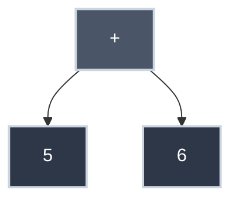
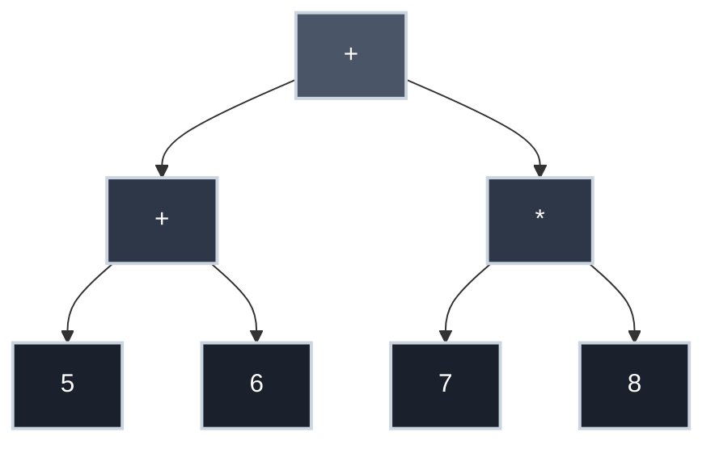
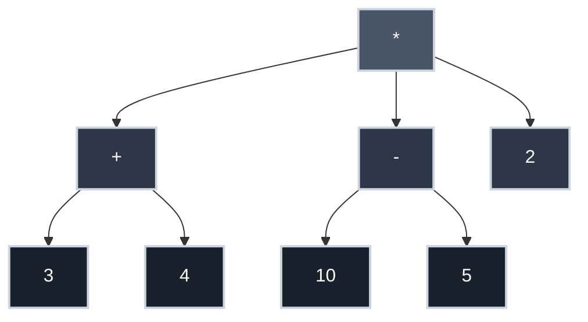

# Scheme, Lisp, and Parse Trees

When you write `3 + 4 * 5` in mathematics, everyone agrees it means `3 + (4 * 5) = 23`, not `(3 + 4) * 5 = 35`. Operator precedence rules—memorized through years of schooling—determine this. But what if there were a notation that never needed precedence rules? What if the structure of the expression itself made evaluation order crystal clear?

Enter **Lisp** and its dialect **Scheme**: languages where parentheses aren't decorative—they're structural. Where `(+ 3 (* 4 5))` is unambiguous. Where the written form directly reflects the parse tree that represents it.

Understanding Scheme's prefix notation and its parse trees reveals something profound: the notation you choose shapes how you think about computation.

## What is Scheme?

Scheme is a minimalist dialect of **Lisp** (LISt Processing), created by Guy L. Steele and Gerald Jay Sussman in 1975. Lisp itself dates to 1958, making it the second-oldest high-level programming language still in widespread use (after Fortran).

**Key characteristics:**

- **Prefix notation**: Operators come before operands
- **Fully parenthesized**: No ambiguity about evaluation order
- **Homoiconic**: Code is data (programs are lists)
- **Functional**: Functions are first-class values
- **Minimal syntax**: Almost everything is a function call

Scheme is often used in computer science education (MIT's famous SICP textbook) precisely because its syntax strips away complexity, letting you focus on computation itself.

## Prefix Notation (Polish Notation)

In most programming languages, you write:

```
3 + 4
```

This is **infix notation**—the operator (`+`) sits between its operands.

In Scheme, you write:

```scheme
(+ 3 4)
```

This is **prefix notation**—the operator comes first, followed by its operands.

**Comparison:**

| Notation | Addition | Multiplication | Nested |
|:---------|:---------|:---------------|:-------|
| **Infix** | `3 + 4` | `4 * 5` | `3 + 4 * 5` |
| **Prefix (Scheme)** | `(+ 3 4)` | `(* 4 5)` | `(+ 3 (* 4 5))` |

### Why Prefix Notation?

**Advantages:**

1. **No precedence rules needed**: Parentheses make structure explicit
2. **Uniform syntax**: Everything is `(function arg1 arg2 ...)`
3. **Easy to parse**: No need for precedence-climbing or shunting-yard algorithms
4. **Variable number of arguments**: `(+ 1 2 3 4 5)` works naturally

**Disadvantages:**

1. **Unfamiliar**: Humans learn infix in school
2. **Lots of parentheses**: Can be harder to read for complex expressions

## S-Expressions

**S-expression** (symbolic expression) is the fundamental data structure in Lisp/Scheme.

An S-expression is either:

1. An **atom**: A number, symbol, string, etc. (`42`, `foo`, `"hello"`)
2. A **list**: Zero or more S-expressions enclosed in parentheses (`()`, `(1 2 3)`, `(+ 1 2)`)

**Examples:**

```scheme
42                  ; Atom (number)
hello               ; Atom (symbol)
"world"             ; Atom (string)
(1 2 3)             ; List of three atoms
(+ 1 2)             ; List (function call)
(+ (* 2 3) 4)       ; List containing another list (nested)
()                  ; Empty list
```

### Lists as Code

In Scheme, **code is lists**. A function call is a list where:

- The first element is the function (operator)
- Remaining elements are arguments (operands)

```scheme
(+ 1 2)             ; Call function + with arguments 1 and 2
(* 3 4)             ; Call function * with arguments 3 and 4
(define x 10)       ; Call define with arguments x and 10
```

This **homoiconicity** (code as data) makes Lisp/Scheme uniquely powerful for metaprogramming—programs that manipulate programs.

## Reading Scheme Expressions

Let's build intuition by reading Scheme expressions aloud.

### Simple Expressions

```scheme
(+ 5 6)
```

**Read as:** "Add 5 and 6"
**Evaluates to:** `11`

```scheme
(* 7 8)
```

**Read as:** "Multiply 7 and 8"
**Evaluates to:** `56`

### Nested Expressions

```scheme
(+ (+ 5 6) (* 7 8))
```

**Read as:** "Add the result of (add 5 and 6) to the result of (multiply 7 and 8)"

**Step-by-step evaluation:**

1. Evaluate inner expressions first:
   - `(+ 5 6)` → `11`
   - `(* 7 8)` → `56`
2. Substitute results: `(+ 11 56)`
3. Evaluate outer expression: `67`

**Key insight:** The structure of nested parentheses **directly mirrors** the evaluation order. Innermost expressions evaluate first, working outward.

### Complex Expressions

```scheme
(+ (* 2 3) (- 10 4) 5)
```

**Read as:** "Add the result of (multiply 2 and 3), the result of (subtract 4 from 10), and 5"

**Evaluation:**

1. `(* 2 3)` → `6`
2. `(- 10 4)` → `6`
3. `(+ 6 6 5)` → `17`

**Notice:** `+` can take more than two arguments in Scheme—another advantage of prefix notation.

## Parse Trees for Scheme

A **parse tree** (or **abstract syntax tree**, AST) represents the grammatical structure of an expression as a tree.

For Scheme, the correspondence between written form and parse tree is particularly direct—parentheses literally define tree structure.

### Simple Expression

**Expression:** `(+ 5 6)`

**Parse Tree:**



**Structure:**

- **Root**: The operator `+`
- **Children**: The operands `5` and `6`

### Nested Expression

**Expression:** `(+ (+ 5 6) (* 7 8))`

**Parse Tree:**



**Structure:**

- **Root**: Outer `+` operator
- **Left subtree**: `(+ 5 6)` — another addition
- **Right subtree**: `(* 7 8)` — a multiplication

**Evaluation order** (post-order traversal):

1. Evaluate left subtree: `5 + 6 = 11`
2. Evaluate right subtree: `7 * 8 = 56`
3. Evaluate root: `11 + 56 = 67`

### Drawing Parse Trees from Scheme

**Algorithm:**

1. The outermost parentheses define the root node (the operator)
2. Each argument becomes a child
3. If an argument is itself a list (nested expression), recurse

**Example:** `(* (+ 3 4) (- 10 5) 2)`

**Step-by-step:**

1. **Root**: `*` (multiply)
2. **First child**: `(+ 3 4)` (a subtree)
   - Root of subtree: `+`
   - Children: `3`, `4`
3. **Second child**: `(- 10 5)` (another subtree)
   - Root of subtree: `-`
   - Children: `10`, `5`
4. **Third child**: `2` (a leaf)

**Resulting tree:**



**Evaluation:**

1. `(+ 3 4)` → `7`
2. `(- 10 5)` → `5`
3. `(* 7 5 2)` → `70`

## Evaluation Order: Post-Order Traversal

Scheme expressions evaluate using **post-order traversal**:

1. Evaluate left subtree
2. Evaluate right subtree
3. Apply operator at root

This ensures arguments are computed before the function that uses them—a fundamental principle in most programming languages.

### Example: `(+ (+ 5 6) (* 7 8))`

**Tree:**

```
       +
      / \
     +   *
    / \ / \
   5  6 7  8
```

**Post-order traversal:**

1. Visit left subtree (`+`):
   - Visit `5` (leaf) → value is `5`
   - Visit `6` (leaf) → value is `6`
   - Apply `+` → `5 + 6 = 11`
2. Visit right subtree (`*`):
   - Visit `7` (leaf) → value is `7`
   - Visit `8` (leaf) → value is `8`
   - Apply `*` → `7 * 8 = 56`
3. Visit root (`+`):
   - Apply `+` to results → `11 + 56 = 67`

**Result:** `67`

The tree structure **guarantees** correct evaluation order—no precedence rules needed.

## Infix vs. Prefix: The Ambiguity Problem

Consider the infix expression: `3 + 4 * 5`

**Two interpretations:**

1. `(3 + 4) * 5 = 35` (if `+` has higher precedence)
2. `3 + (4 * 5) = 23` (if `*` has higher precedence)

Mathematics and most programming languages choose interpretation 2 (multiplication binds tighter than addition). But this is a **convention**, not inherent to the notation.

**In Scheme, there is no ambiguity:**

```scheme
(* (+ 3 4) 5)       ; Interpretation 1: 35
(+ 3 (* 4 5))       ; Interpretation 2: 23
```

Parentheses make the structure explicit. The notation itself encodes the parse tree.

### Parsing Infix Expressions

Parsers for infix notation must:

1. Tokenize the input
2. Apply precedence rules (`*` before `+`)
3. Apply associativity rules (left-to-right for `+`)
4. Build a parse tree respecting these rules

**Algorithm examples:**

- **Shunting-yard algorithm** (Dijkstra, 1960s)
- **Recursive descent with precedence climbing**
- **Operator-precedence parsing**

### Parsing Prefix Expressions

Parsers for prefix notation are trivial:

```python title="Simple Scheme Parser" linenums="1"
def parse(tokens):  # (1)!
    token = tokens.pop(0)
    if token == '(':  # (2)!
        operator = tokens.pop(0)  # (3)!
        operands = []
        while tokens[0] != ')':  # (4)!
            operands.append(parse(tokens))  # (5)!
        tokens.pop(0)  # (6)!
        return (operator, operands)
    else:
        return int(token)  # (7)!
```

1. Recursively parse a list of tokens
2. If we see an opening paren, we're starting a new expression
3. First token after '(' is the operator
4. Collect all operands until we hit the closing paren
5. Each operand might itself be an expression, so recurse
6. Consume the closing paren
7. Base case: if it's not a paren, it's a number (or symbol)

**No precedence table needed.** Structure is explicit.

## Historical Context

### The Birth of Lisp

**Lisp** was created by John McCarthy in 1958 at MIT as part of his research on artificial intelligence. McCarthy wanted a language that:

- Could manipulate symbolic expressions (not just numbers)
- Treated code as data (enabling metaprogramming)
- Supported recursive functions naturally

S-expressions were McCarthy's solution—simple, uniform, and powerful.

### Scheme

**Scheme** emerged from MIT in 1975 as Guy Steele and Gerald Sussman explored λ-calculus and programming language semantics. They wanted a "purer" Lisp:

- Lexical scoping (instead of dynamic)
- First-class continuations
- Tail-call optimization
- Minimalist design

Scheme's simplicity made it ideal for teaching and research, culminating in the influential textbook **Structure and Interpretation of Computer Programs** (SICP) by Abelson and Sussman (1984).

### Influence

Lisp's ideas permeate modern programming:

- **Garbage collection**: Pioneered by Lisp (McCarthy, 1960)
- **First-class functions**: Lisp made them mainstream
- **Closures**: Scheme formalized them
- **Dynamic typing**: Common in scripting languages
- **Homoiconicity**: Inspired Clojure, Julia's metaprogramming

Even languages that don't look like Lisp (JavaScript, Python, Ruby) adopted its core ideas.

## Scheme in Action

### Basic Arithmetic

```scheme
(+ 1 2 3 4 5)       ; 15 (variadic function)
(* 2 3 4)           ; 24
(- 10 3)            ; 7
(/ 20 4)            ; 5
```

### Nested Arithmetic

```scheme
(+ (* 2 3) (/ 10 2) (- 8 3))
; Evaluates to: (+ 6 5 5) → 16
```

### Defining Variables

```scheme
(define pi 3.14159)
(define radius 5)
(* pi (* radius radius))    ; Area of circle: 78.53975
```

### Defining Functions

```scheme
(define (square x)
  (* x x))

(square 7)          ; 49
```

### Conditional Expressions

```scheme
(define (abs x)
  (if (< x 0)
      (- x)
      x))

(abs -5)            ; 5
(abs 3)             ; 3
```

### Recursion

```scheme
(define (factorial n)
  (if (<= n 1)
      1
      (* n (factorial (- n 1)))))

(factorial 5)       ; 120
```

## Why Study Scheme?

You might reasonably ask: why learn Scheme when modern languages like Python, JavaScript, or Rust dominate industry?

**Answers:**

### 1. Conceptual Clarity

Scheme strips away syntax complexity, letting you focus on computational concepts:

- Recursion without boilerplate
- Higher-order functions without ceremony
- Closures and scope made explicit

### 2. Understanding Parsers

Scheme's direct mapping from text to parse tree demystifies how languages work. Once you see how prefix notation avoids precedence, you understand why parsing infix is hard.

### 3. Functional Programming

Scheme is functional-first, teaching patterns now common in JavaScript, Python, Haskell, and Rust:

- `map`, `filter`, `reduce`
- Immutability
- Function composition

### 4. Historical Perspective

Understanding Lisp/Scheme helps you appreciate language evolution. Many "modern" features (lambdas, closures, garbage collection) were invented in Lisp decades ago.

### 5. Academic Rigor

Scheme's minimalism makes it perfect for studying:

- Programming language semantics
- Interpreters and compilers
- Type theory and λ-calculus

MIT's SICP remains a gold standard in CS education precisely because Scheme gets out of the way, letting ideas shine through.

## Comparison: Infix vs. Prefix

### Same Expression, Two Notations

**Expression:** "Add 3 to the product of 4 and 5"

| Notation | Written Form | Parse Tree Depth | Precedence Needed? |
|:---------|:-------------|:-----------------|:-------------------|
| **Infix** | `3 + 4 * 5` | Implicit | Yes |
| **Prefix** | `(+ 3 (* 4 5))` | Explicit | No |

**Infix Parse Tree:**

```
     +
    / \
   3   *
      / \
     4   5
```

**Prefix Parse Tree:**

```
     +
    / \
   3   *
      / \
     4   5
```

**Same tree**, but prefix notation makes it explicit in the written form.

### Complex Nested Example

**Expression:** "Multiply the sum of 2 and 3 by the difference of 10 and 4"

| Notation | Written Form |
|:---------|:-------------|
| **Infix** | `(2 + 3) * (10 - 4)` |
| **Prefix** | `(* (+ 2 3) (- 10 4))` |

**Both require parentheses** for this structure, but Scheme's consistency (always use parentheses) means you never wonder whether you need them.

## Practice Problems

??? question "Practice Problem 1: Reading Scheme"

    What does this Scheme expression evaluate to?

    ```scheme
    (+ (* 3 4) (- 10 2) 5)
    ```

    Show the evaluation steps.

    ??? tip "Solution"

        **Expression:** `(+ (* 3 4) (- 10 2) 5)`

        **Step 1: Evaluate subexpressions**

        - `(* 3 4)` → `12`
        - `(- 10 2)` → `8`

        **Step 2: Substitute results**

        - `(+ 12 8 5)`

        **Step 3: Evaluate outer expression**

        - `12 + 8 + 5 = 25`

        **Answer:** `25`

??? question "Practice Problem 2: Convert Infix to Prefix"

    Convert this infix expression to Scheme prefix notation:

    ```
    (5 + 6) * (7 - 2)
    ```

    Then draw the parse tree.

    ??? tip "Solution"

        **Infix:** `(5 + 6) * (7 - 2)`

        **Prefix (Scheme):** `(* (+ 5 6) (- 7 2))`

        **Parse Tree:**

        ```mermaid
        graph TD
            Times["*"] --> Plus["+"]
            Times --> Minus["-"]
            Plus --> Five["5"]
            Plus --> Six["6"]
            Minus --> Seven["7"]
            Minus --> Two["2"]

            style Times fill:#4a5568,stroke:#cbd5e0,stroke-width:2px,color:#fff
            style Plus fill:#2d3748,stroke:#cbd5e0,stroke-width:2px,color:#fff
            style Minus fill:#2d3748,stroke:#cbd5e0,stroke-width:2px,color:#fff
            style Five fill:#1a202c,stroke:#cbd5e0,stroke-width:2px,color:#fff
            style Six fill:#1a202c,stroke:#cbd5e0,stroke-width:2px,color:#fff
            style Seven fill:#1a202c,stroke:#cbd5e0,stroke-width:2px,color:#fff
            style Two fill:#1a202c,stroke:#cbd5e0,stroke-width:2px,color:#fff
        ```

        **Evaluation:**

        1. `(+ 5 6)` → `11`
        2. `(- 7 2)` → `5`
        3. `(* 11 5)` → `55`

        **Answer:** `55`

??? question "Practice Problem 3: Draw Parse Tree"

    Draw the parse tree for this Scheme expression:

    ```scheme
    (+ (+ 5 6) (* 7 8))
    ```

    Then trace the post-order evaluation.

    ??? tip "Solution"

        **Parse Tree:**

        ```mermaid
        graph TD
            RootPlus["+"] --> LeftPlus["+"]
            RootPlus --> RightTimes["*"]
            LeftPlus --> Five["5"]
            LeftPlus --> Six["6"]
            RightTimes --> Seven["7"]
            RightTimes --> Eight["8"]

            style RootPlus fill:#4a5568,stroke:#cbd5e0,stroke-width:2px,color:#fff
            style LeftPlus fill:#2d3748,stroke:#cbd5e0,stroke-width:2px,color:#fff
            style RightTimes fill:#2d3748,stroke:#cbd5e0,stroke-width:2px,color:#fff
            style Five fill:#1a202c,stroke:#cbd5e0,stroke-width:2px,color:#fff
            style Six fill:#1a202c,stroke:#cbd5e0,stroke-width:2px,color:#fff
            style Seven fill:#1a202c,stroke:#cbd5e0,stroke-width:2px,color:#fff
            style Eight fill:#1a202c,stroke:#cbd5e0,stroke-width:2px,color:#fff
        ```

        **Post-Order Evaluation:**

        1. Visit left subtree (`+`):
           - Visit `5` → `5`
           - Visit `6` → `6`
           - Apply `+` → `5 + 6 = 11`
        2. Visit right subtree (`*`):
           - Visit `7` → `7`
           - Visit `8` → `8`
           - Apply `*` → `7 * 8 = 56`
        3. Visit root (`+`):
           - Apply `+` → `11 + 56 = 67`

        **Answer:** `67`

??? question "Practice Problem 4: Complex Nesting"

    Evaluate this Scheme expression step-by-step:

    ```scheme
    (* (+ 1 2) (- 10 (/ 8 2)) (+ 3 3))
    ```

    ??? tip "Solution"

        **Expression:** `(* (+ 1 2) (- 10 (/ 8 2)) (+ 3 3))`

        **Step 1: Evaluate innermost subexpressions**

        - `(/ 8 2)` → `4`

        **Step 2: Substitute and evaluate next level**

        - `(+ 1 2)` → `3`
        - `(- 10 4)` → `6`
        - `(+ 3 3)` → `6`

        **Step 3: Evaluate outer expression**

        - `(* 3 6 6)` → `108`

        **Answer:** `108`

## Key Takeaways

| Concept | Meaning |
|:--------|:--------|
| **Prefix Notation** | Operator comes before operands: `(+ 1 2)` |
| **S-Expression** | Atom or list of S-expressions |
| **Parse Tree** | Tree representation of expression structure |
| **Post-Order Traversal** | Evaluate children before parent (bottom-up) |
| **Homoiconicity** | Code is data; programs are lists |
| **No Precedence Rules** | Parentheses make structure explicit |
| **Scheme/Lisp** | Languages using prefix notation and S-expressions |

## Why Scheme Matters

Scheme and prefix notation reveal:

- **How notation shapes thought**: Explicit structure changes how you reason about programs
- **How parsers work**: Prefix notation is trivial to parse; infix requires precedence
- **How trees encode meaning**: Parse trees are the "compiled" form of expressions
- **How code can be data**: S-expressions let programs manipulate programs
- **How functional programming works**: Scheme pioneered ideas now common in modern languages

You don't need to write Scheme professionally to benefit from understanding it. The insights it provides—about parsing, recursion, abstraction, and the relationship between notation and computation—are universal.

## Further Reading

- **Abelson & Sussman, [Structure and Interpretation of Computer Programs](https://mitp-content-server.mit.edu/books/content/sectbyfn/books_pres_0/6515/sicp.zip/index.html)** — The definitive Scheme textbook
- **David Evans, [Introduction to Computing](https://computingbook.org/)** — Chapter 2 covers RTNs and parsing
- **[Recursive Transition Networks](recursive_transition_networks.md)** — How grammars define parse trees
- **[Computational Thinking](computational_thinking.md)** — Abstraction and decomposition in practice

---

Scheme strips programming down to its essence: functions, data, and recursion. What remains is computation in its purest form—no syntax tricks, no precedence tables, just structure made explicit through parentheses. It's 

not the notation most programmers use daily, but understanding it changes how you think about all the notations you do use.
