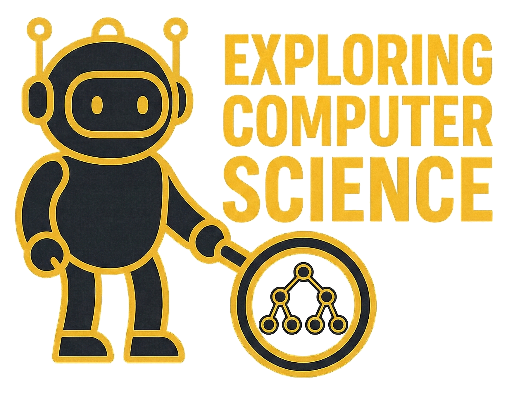

# Welcome to Exploring Computer Science

A subsection of [BradPenney.io](https://bradpenney.io), this site documents my journey through Computer Science concepts as I work toward my degree.

This isn't just a collection of notes - it's a teaching-focused resource. Writing to explain concepts reinforces learning and creates something useful for others exploring the same topics.

## What You'll Find Here

### Fundamentals

The building blocks of computer science:

- **Computational Thinking** - How to approach problems like a computer scientist
- **Finite State Machines** - Modeling systems with states and transitions
- **Recursive Transition Networks** - Parsing natural language structures
- **Backus-Naur Form** - Formal grammar notation for defining languages
- **Regular Expressions** - Pattern matching and text processing
- **How Parsers Work** - From tokens to syntax trees

### Coming Soon

- **Algorithms** - Big-O notation, Turing machines, sorting and searching
- **Programming** - Paradigms, OOP, interpreters vs compilers
- **Systems** - Operating systems, networks, databases
- **Modern Topics** - AI, security, ethics in computing

## About This Project

This site grows alongside my coursework. Each article synthesizes multiple sources into a cohesive explanation with diagrams, code examples, and practice problems.

The goal: if someone asks me to explain a concept, I should be able to point them here.

## Connect

- Main site: [bradpenney.io](https://bradpenney.io)
- Source code: [GitHub](https://github.com/bradpenney/exploring_computer_science)
