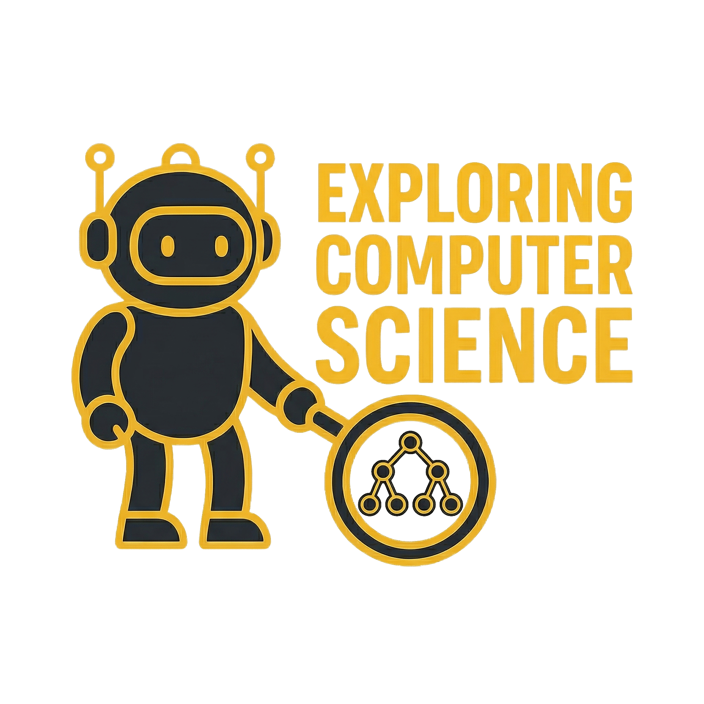

# Exploring Computer Science

**The CS theory behind the production code you write.**

Welcome to a practical guide for working engineers who want to understand the computer science foundations underneath the code they ship every day.

## The Problem

Your PR got rejected because the reviewer said it's "$O(n^2)$". You nodded, made some changes, but couldn't quite explain *why* the new version is faster. You've debugged stack traces without understanding why they're called "stacks." You use hash tables (Python `dict`, JavaScript `Object`) constantly but couldn't explain how they achieve $O(1)$ lookup.

**You know HOW to code. This site teaches you WHY things work.**

## The Solution

While [Exploring Linux](https://linux.bradpenney.io), [Exploring Python](https://python.bradpenney.io), and [Exploring Kubernetes](https://k8s.bradpenney.io) teach practical skills, this site teaches the *theory* that makes you a stronger engineer. Understand these concepts and you'll:

- Confidently discuss time/space complexity in code reviews
- Recognize when your algorithm won't scale
- Understand what's happening under the hood in your tools
- Answer theory questions in technical interviews
- Debug more effectively by understanding fundamentals

## How It's Organized

Content is structured by **practical value and depth**:

-   :material-package-variant: **Essentials**

    ---

    **The CS you need for interviews and understanding performance.** Can't call yourself a well-rounded engineer without these.

    **[What is Computer Science?](essentials/what_is_computer_science.md)** — The CS theory behind the code you write every day

    **[Big-O Notation](essentials/big_o_notation.md)** — Why your code is slow and how to talk about it

    **[Type Systems Basics](essentials/type_systems_basics.md)** — The formal contract behind every variable and function signature

    **[Regular Expressions](essentials/regular_expressions.md)** — The complete syntax reference for writing and reading regex in production code

    **[Recursion](essentials/recursion.md)** — Divide-and-conquer problem solving from first principles

    **[Trees](essentials/trees_basics.md)** — The data structure behind your file system, JSON, and database indexes

    Searching, sorting, stacks, queues (coming soon)

-   :material-lightning-bolt: **Efficiency**

    ---

    **CS that makes you better at debugging and system design.** Deeper understanding that pays dividends.

    **[Computational Thinking](efficiency/computational_thinking.md)** — The mental framework behind good engineering

    **[Finite State Machines](efficiency/finite_state_machines.md)** — The model behind protocols, parsers, and validation

    **[Regular Expressions: The Formal Model](efficiency/regular_expressions.md)** — How regex engines compile patterns to automata, why backtracking causes ReDoS, and what regex can't match

    **[How Parsers Work](efficiency/how_parsers_work.md)** — From raw text to meaning

    **[Compilers vs. Interpreters](efficiency/compilers_vs_interpreters.md)** — What actually happens between your source code and execution

    **[Lists as Recursive Structures](efficiency/lists_recursive_structure.md)** — The CS theory behind every map, filter, and reduce you've written

-   :material-target: **Mastery**

    ---

    **Deep theory for understanding the limits of computation.** For when you want to go beyond practical and into foundational.

    **Information Theory** — Bits, binary, entropy, and why compression has hard limits

    **Recursive Transition Networks** — Visual grammars for nested languages

    **Backus-Naur Form (BNF)** — The notation behind every language specification

    **Scheme: A Primer** — Lambda, closures, and recursion in the language that invented them

    **Higher-Order Functions** — How code becomes data

    **Scheme & Parse Trees** — When code is its own parse tree

    **Abstract Data Types** — The CS theory behind interfaces, protocols, and traits

    Computability: Turing machines, halting problem, P vs NP (coming soon)

## Who This Is For

You're a **back-end engineer, platform engineer, or software developer** who:

- Writes production code daily (Python, Go, Java, JavaScript, etc.)
- Has real-world experience shipping features and debugging issues
- **Lacks formal CS training** and wants to fill that gap
- May be self-taught, bootcamp graduate, or career changer
- Wants to understand the "why" behind the tools you use

You already know how to code. **This site teaches the theory underneath.**

## Integration with Other Sites

This site is part of the [BradPenney.io](https://bradpenney.io) learning ecosystem:

- **[Exploring Linux](https://linux.bradpenney.io)** - Linux commands and system administration
- **[Exploring Kubernetes](https://k8s.bradpenney.io)** - Kubernetes for platform engineers
- **[Exploring Python](https://python.bradpenney.io)** - Python automation and scripting
- **[Exploring Software Development Tools](https://tools.bradpenney.io)** - Git, tmux, vim, and developer tooling

**How they connect:**

- CS site + Python site = Understanding why your code performs the way it does
- CS site + Tools site = Knowing the theory behind `grep` (regex), `git` (DAGs), parsers (compilers)
- CS site + K8s site = Understanding distributed systems concepts

---

**Ready to understand the theory?** Start with **[What is Computer Science?](essentials/what_is_computer_science.md)** for context, then **[Big-O Notation](essentials/big_o_notation.md)** to understand why some code is fast and other code times out at scale.
