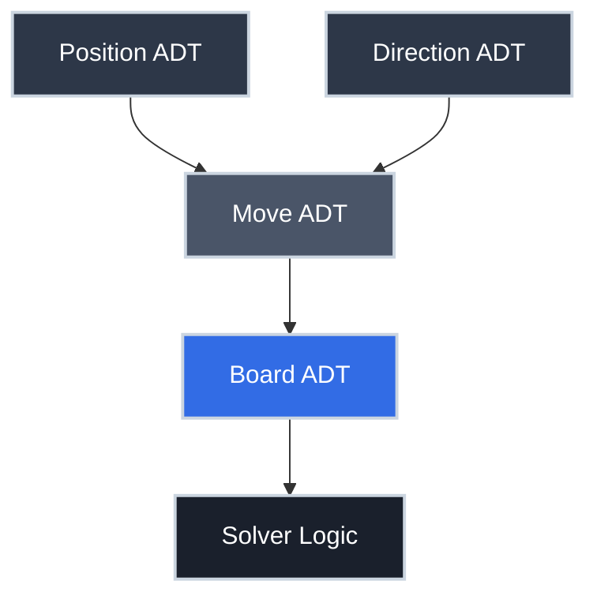

# Abstract Data Types: Designing by Contract

You've had this argument: "Should we use a `dict` or a `list` internally?" Then a senior engineer says "the callers don't care — expose an interface and change the implementation later." You've written a Go interface, a Python ABC, or a Java interface and been told it's "good design" without a clear explanation of *why*.

**The "why" is CS theory.** The principle is called *data abstraction*, and the artifact it produces is called an **Abstract Data Type** (ADT). It's the idea that the most important thing about a data type is not how it stores data — it's what operations it supports and what contracts those operations fulfill.

This is one of the most consequential ideas in software engineering. Every interface, protocol, trait, and ABC in every language exists because of this principle.

## Where You've Seen This

Abstract data types are everywhere in production code:

- **Go interfaces** — `io.Reader`, `io.Writer`, `http.Handler` define what something *does*, not what it *is*; any struct with the right methods satisfies the interface
- **Python protocols and ABCs** — `collections.abc.Sequence`, `collections.abc.Mapping`, and `typing.Protocol` define behavioral contracts
- **Rust traits** — `Display`, `Iterator`, `Clone` are pure behavioral contracts; any type can implement them
- **Java interfaces** — `List<T>`, `Map<K, V>`, `Comparable<T>` are ADTs; `ArrayList` and `LinkedList` are two implementations of the same `List` ADT
- **Database abstraction layers** — your ORM lets you switch from MySQL to PostgreSQL without changing application code; the ADT is the query interface
- **Standard library collections** — Python's `dict`, Go's `map`, Java's `HashMap` are all implementations of the Map ADT, which defines `get`, `put`, `delete`, `contains` regardless of the hash table internals
- **Redux and state management** — a store is an ADT: it defines `dispatch`, `getState`, and `subscribe` without specifying how state is stored

## Why This Matters for Production Code

=== ":material-swap-horizontal: Swapping Implementations"

    The defining benefit of an ADT is that you can change the implementation without changing any code that uses it.

    Java's `List<T>` interface has two common implementations: `ArrayList` (backed by an array, fast random access) and `LinkedList` (backed by a linked list, fast insertion at head). If you write code against `List<T>`, you can switch between them with a one-line change at construction time.

    This isn't academic — it's the pattern behind every database migration, caching layer addition, and storage backend swap you've ever done. The ADT (query interface) stays the same; the implementation changes.

=== ":material-test-tube: Testability Through ADTs"

    ADTs make mocking and testing straightforward. When your code depends on the *interface*, not the *implementation*, you can substitute a test double — a simplified version that records calls, returns predetermined values, or simulates failures.

    Go's `io.Reader` interface is the canonical example. Your file processing code takes an `io.Reader`. In production it gets a real file. In tests it gets a `strings.NewReader` with controlled content. Same code, different implementations.

    Code that depends on concrete implementations (not interfaces) is harder to test because you can't substitute the real thing.

=== ":material-shield-check: Defensive Programming with Type Tags"

    One practical technique from ADT design: **tagged data**. When you represent data internally as a generic structure (a `list`, a `dict`, a `tuple`), you lose track of what *kind* of data it represents. A `[2, 1]` could be a position, a direction, a date, or a pair of IDs.

    Tagged data adds a marker — a type tag — as the first element, so that accessors can verify they're receiving the right kind of data:

    ```python title="Tagged Data for Defensive ADTs" linenums="1"
    def make_position(row, col):
        return ('Position', row, col)  # (1)!

    def position_row(pos):
        if pos[0] != 'Position':       # (2)!
            raise TypeError(f"Expected Position, got {pos[0]}")
        return pos[1]
    ```

    1. The tag `'Position'` is stored as the first element
    2. Every accessor checks the tag before using the data

    This is primitive compared to a real class, but the principle — validate at the boundary of your ADT — applies to every production system. It's defensive programming: if invalid data gets in, you want a clear error close to the source, not a mysterious failure downstream.

=== ":material-alert-circle: The Cost of Abstraction Leaks"

    An **abstraction leak** is when implementation details bleed through the interface. The ADT contract says "this is a Set — order doesn't matter, no duplicates." But if you depend on Python's `set` printing in a particular order, or on `dict` being insertion-ordered in Python 3.7+, you're depending on implementation details that could change.

    Abstraction leaks produce code that's brittle to changes that should be safe. The fix is to only use operations the ADT contract guarantees, not behaviors the implementation happens to have.

## The Formal Definition

An **Abstract Data Type** is defined by:

1. **A set of possible values** — the legal states the data can be in
2. **A set of operations** — the functions that create, query, or transform values of this type
3. **Contracts for each operation** — what each operation does, stated independently of any implementation

The contract is the critical part. It answers: "What can I rely on?" not "How does it work?"

### Example: The Stack ADT

The Stack ADT appears everywhere (call stacks, undo systems, expression parsing). Its contract:

| Operation | Type | Contract |
|:----------|:-----|:---------|
| `make_stack()` | `→ Stack` | Returns a new empty stack |
| `push(s, v)` | `Stack × Value → Stack` | Returns a new stack with `v` on top |
| `pop(s)` | `Stack → Stack` | Returns a new stack with the top removed; error if empty |
| `peek(s)` | `Stack → Value` | Returns the top value without removing it; error if empty |
| `is_empty(s)` | `Stack → Boolean` | Returns true if the stack has no elements |

Notice: no mention of arrays, linked lists, or any implementation. The ADT *is* the contract. You could implement it with an array, a linked list, a Python list, a Go slice, or a Scheme cons list — the contract holds regardless.

### Example: The Map / Dictionary ADT

| Operation | Type | Contract |
|:----------|:-----|:---------|
| `make_map()` | `→ Map<K,V>` | Returns a new empty map |
| `put(m, k, v)` | `Map × K × V → Map` | Associates key `k` with value `v` |
| `get(m, k)` | `Map × K → V or None` | Returns value for key `k`, or None if absent |
| `delete(m, k)` | `Map × K → Map` | Returns map without key `k` |
| `contains(m, k)` | `Map × K → Boolean` | True if key `k` is present |

Python's `dict`, Go's `map[K]V`, Java's `HashMap<K,V>` and `TreeMap<K,V>` are all implementations of this ADT. The contract says nothing about hash tables, red-black trees, or bucket sizes.

## Implementing ADTs

The same ADT can have many implementations. Here's the Stack ADT in each major language, using two different backing structures to show the separation between interface and implementation:

=== ":material-language-python: Python"

    ```python title="Stack ADT — Two Implementations" linenums="1"
    from abc import ABC, abstractmethod  # (1)!
    from typing import TypeVar, Generic

    T = TypeVar('T')

    class Stack(ABC, Generic[T]):        # (2)!
        @abstractmethod
        def push(self, value: T) -> None: ...
        @abstractmethod
        def pop(self) -> T: ...
        @abstractmethod
        def peek(self) -> T: ...
        @abstractmethod
        def is_empty(self) -> bool: ...

    class ArrayStack(Stack[T]):          # (3)!
        def __init__(self):
            self._data: list[T] = []
        def push(self, value: T) -> None:
            self._data.append(value)
        def pop(self) -> T:
            if self.is_empty(): raise IndexError("Stack is empty")
            return self._data.pop()
        def peek(self) -> T:
            if self.is_empty(): raise IndexError("Stack is empty")
            return self._data[-1]
        def is_empty(self) -> bool:
            return len(self._data) == 0

    class LinkedStack(Stack[T]):         # (4)!
        def __init__(self):
            self._head = None            # cons-list backed
        def push(self, value: T) -> None:
            self._head = (value, self._head)
        def pop(self) -> T:
            if self.is_empty(): raise IndexError("Stack is empty")
            val, self._head = self._head
            return val
        def peek(self) -> T:
            if self.is_empty(): raise IndexError("Stack is empty")
            return self._head[0]
        def is_empty(self) -> bool:
            return self._head is None
    ```

    1. Python's `ABC` (Abstract Base Class) module defines the ADT contract
    2. `Stack` is the ADT — pure interface, no implementation
    3. `ArrayStack` implements the ADT using a Python list
    4. `LinkedStack` implements the same ADT using a cons-style linked structure

=== ":material-language-javascript: JavaScript"

    ```javascript title="Stack ADT in JavaScript" linenums="1"
    // JavaScript lacks formal interfaces; we use a class with documentation
    // to define the ADT contract, then provide implementations.

    class ArrayStack {              // (1)!
        #data = [];                 // private — callers can't depend on it

        push(value) {
            this.#data.push(value);
        }
        pop() {
            if (this.isEmpty()) throw new Error("Stack is empty");
            return this.#data.pop();
        }
        peek() {
            if (this.isEmpty()) throw new Error("Stack is empty");
            return this.#data[this.#data.length - 1];
        }
        isEmpty() {
            return this.#data.length === 0;
        }
    }

    class LinkedStack {             // (2)!
        #head = null;               // cons-list backed

        push(value) {
            this.#head = { value, next: this.#head };
        }
        pop() {
            if (this.isEmpty()) throw new Error("Stack is empty");
            const value = this.#head.value;
            this.#head = this.#head.next;
            return value;
        }
        peek() {
            if (this.isEmpty()) throw new Error("Stack is empty");
            return this.#head.value;
        }
        isEmpty() {
            return this.#head === null;
        }
    }
    ```

    1. Array-backed implementation; private `#data` prevents callers from accessing internals
    2. Linked-node implementation; same external API, completely different internals

=== ":material-language-go: Go"

    ```go title="Stack ADT in Go" linenums="1"
    // Go interfaces are the natural ADT mechanism — implicit satisfaction.

    type Stack[T any] interface {   // (1)!
        Push(value T)
        Pop() (T, error)
        Peek() (T, error)
        IsEmpty() bool
    }

    type ArrayStack[T any] struct { // (2)!
        data []T
    }

    func (s *ArrayStack[T]) Push(value T) {
        s.data = append(s.data, value)
    }
    func (s *ArrayStack[T]) Pop() (T, error) {
        if s.IsEmpty() {
            var zero T
            return zero, fmt.Errorf("stack is empty")
        }
        n := len(s.data) - 1
        val := s.data[n]
        s.data = s.data[:n]
        return val, nil
    }
    func (s *ArrayStack[T]) Peek() (T, error) {
        if s.IsEmpty() {
            var zero T
            return zero, fmt.Errorf("stack is empty")
        }
        return s.data[len(s.data)-1], nil
    }
    func (s *ArrayStack[T]) IsEmpty() bool {
        return len(s.data) == 0
    }
    ```

    1. Go `interface` defines the ADT contract; no implementation, no storage
    2. `ArrayStack` satisfies `Stack[T]` implicitly by implementing all methods

=== ":material-language-rust: Rust"

    ```rust title="Stack ADT in Rust" linenums="1"
    // Rust traits define the ADT contract.

    trait Stack<T> {                // (1)!
        fn push(&mut self, value: T);
        fn pop(&mut self) -> Option<T>;
        fn peek(&self) -> Option<&T>;
        fn is_empty(&self) -> bool;
    }

    struct ArrayStack<T> {          // (2)!
        data: Vec<T>,
    }

    impl<T> ArrayStack<T> {
        fn new() -> Self { ArrayStack { data: Vec::new() } }
    }

    impl<T> Stack<T> for ArrayStack<T> {
        fn push(&mut self, value: T) {
            self.data.push(value);
        }
        fn pop(&mut self) -> Option<T> {
            self.data.pop()
        }
        fn peek(&self) -> Option<&T> {
            self.data.last()
        }
        fn is_empty(&self) -> bool {
            self.data.is_empty()
        }
    }
    ```

    1. Rust `trait` is the ADT definition; behavioral contract, no storage
    2. `ArrayStack` implements the trait; any other type could too

=== ":material-language-java: Java"

    ```java title="Stack ADT in Java" linenums="1"
    import java.util.EmptyStackException;

    interface Stack<T> {            // (1)!
        void push(T value);
        T pop() throws EmptyStackException;
        T peek() throws EmptyStackException;
        boolean isEmpty();
    }

    class ArrayStack<T> implements Stack<T> {  // (2)!
        private final java.util.Deque<T> data = new java.util.ArrayDeque<>();

        @Override public void push(T value) { data.push(value); }
        @Override public T pop() {
            if (isEmpty()) throw new EmptyStackException();
            return data.pop();
        }
        @Override public T peek() {
            if (isEmpty()) throw new EmptyStackException();
            return data.peek();
        }
        @Override public boolean isEmpty() { return data.isEmpty(); }
    }

    class LinkedStack<T> implements Stack<T> {  // (3)!
        private record Node<T>(T value, Node<T> next) {}
        private Node<T> head = null;

        @Override public void push(T value) { head = new Node<>(value, head); }
        @Override public T pop() {
            if (isEmpty()) throw new EmptyStackException();
            T val = head.value(); head = head.next(); return val;
        }
        @Override public T peek() {
            if (isEmpty()) throw new EmptyStackException();
            return head.value();
        }
        @Override public boolean isEmpty() { return head == null; }
    }
    ```

    1. Java `interface` is the ADT contract
    2. `ArrayStack` uses a `Deque` internally
    3. `LinkedStack` uses a cons-node structure — same contract, different internals

=== ":material-language-cpp: C++"

    ```cpp title="Stack ADT in C++" linenums="1"
    #include <vector>
    #include <stdexcept>

    template<typename T>
    class Stack {                   // (1)!
    public:
        virtual void push(T value) = 0;
        virtual T pop() = 0;
        virtual T peek() const = 0;
        virtual bool isEmpty() const = 0;
        virtual ~Stack() = default;
    };

    template<typename T>
    class ArrayStack : public Stack<T> {  // (2)!
        std::vector<T> data;
    public:
        void push(T value) override { data.push_back(value); }
        T pop() override {
            if (isEmpty()) throw std::underflow_error("Stack is empty");
            T val = data.back(); data.pop_back(); return val;
        }
        T peek() const override {
            if (isEmpty()) throw std::underflow_error("Stack is empty");
            return data.back();
        }
        bool isEmpty() const override { return data.empty(); }
    };
    ```

    1. Abstract base class with pure virtual methods defines the ADT contract
    2. `ArrayStack` provides the implementation; `data` is private to the class

## Case Study: Designing ADTs for a Complex Problem

Chapter 5 of Evans' *Introduction to Computing* includes a complete case study in ADT design: a solver for the pegboard puzzle (the triangular peg-jumping game at pancake restaurants). The solution is instructive not because of the puzzle itself, but because of *how it's designed*.

The engineer's instinct is to start writing code. The CS approach: **first identify the objects you need to model, design their ADTs, then implement.**

For the pegboard puzzle, the designer identified three ADTs before writing any logic:



**Position ADT** — a row and column on the board:

```python title="Position ADT" linenums="1"
def make_position(row: int, col: int) -> tuple:
    return ('Position', row, col)    # tagged tuple

def position_row(pos: tuple) -> int:
    assert pos[0] == 'Position', f"Expected Position, got {pos[0]}"
    return pos[1]

def position_col(pos: tuple) -> int:
    assert pos[0] == 'Position', f"Expected Position, got {pos[0]}"
    return pos[2]
```

**Board ADT** — the game board with pegs:

```python title="Board ADT Interface (Contract)" linenums="1"
# These operations define what a Board IS.
# The implementation can use any storage structure.

def make_board(rows: int):                  # → Board
    """Create a full board with the given number of rows."""
    ...

def board_contains_peg(board, pos) -> bool:
    """True if there is a peg at the given position."""
    ...

def board_add_peg(board, pos):              # → Board
    """Return a new board with a peg added at pos."""
    ...

def board_remove_peg(board, pos):           # → Board
    """Return a new board with the peg at pos removed."""
    ...

def board_is_winning(board) -> bool:
    """True if exactly one peg remains."""
    ...
```

The solver logic only uses these operations. It doesn't know whether the board is stored as a list of lists (the actual implementation), a set of occupied positions, or a 2D bitmap. **That's the power of the ADT.**

When the designer wanted to try a different board representation for performance, only the five board functions needed to change — every line of solver logic worked unchanged. This is the promise of data abstraction.

## The Design Process

Designing an ADT follows a specific order:

1. **Identify the objects** your problem involves — what things need to be modeled?
2. **List the operations** each object needs — what can be done to/with it?
3. **Write the contracts** — what does each operation guarantee, independent of implementation?
4. **Choose a representation** — only now decide how the data is stored
5. **Implement** — write code that satisfies the contracts
6. **Test against the contract** — not against implementation details

Step 3 before step 4 is the key discipline. If you decide how to store data before you decide what operations you need, your storage choice shapes (and often limits) your interface.

## Practice Problems

??? question "Practice 1: Design a Queue ADT"

    Design the Queue ADT (first-in, first-out). List:
    - The operations it needs
    - The type signature of each operation
    - The contract each operation must fulfill

    Do not discuss implementation.

    ??? tip "Answer"

        | Operation | Type | Contract |
        |:----------|:-----|:---------|
        | `make_queue()` | `→ Queue<T>` | Returns an empty queue |
        | `enqueue(q, v)` | `Queue × T → Queue` | Returns queue with `v` added at the back |
        | `dequeue(q)` | `Queue → T × Queue` | Returns the front element and the queue without it; error if empty |
        | `front(q)` | `Queue → T` | Returns front element without removing; error if empty |
        | `is_empty(q)` | `Queue → Boolean` | True if no elements |

        Key contract: `dequeue` returns elements in the same order they were `enqueued` (FIFO). No implementation detail mentioned.

??? question "Practice 2: Two Implementations"

    The Queue ADT above can be implemented using:
    - A list/array (simple but `dequeue` is $O(n)$)
    - Two stacks (amortized $O(1)$ `dequeue`)

    Both satisfy the same ADT contract. What does this tell you about the relationship between ADTs and performance?

    ??? tip "Answer"

        An ADT contract defines *what* operations do, not *how fast* they are. The same ADT can have implementations with very different performance characteristics. When performance matters, you choose the implementation; the contract remains the same.

        This is why algorithm analysis and ADT design are separate concerns: ADTs answer "is this correct?", complexity analysis answers "is this fast enough?"

??? question "Practice 3: Spot the Abstraction Leak"

    A team defines a `Cache` ADT with operations `get(key)`, `put(key, value)`, and `invalidate(key)`. They implement it with Python's `dict`. Later code starts using `len(cache._store)` and iterating over `cache._store.keys()`.

    What abstraction leak occurred? What problems could result?

    ??? tip "Answer"

        The abstraction leak is depending on `_store` (the internal `dict`), which is an implementation detail.

        Problems:
        - If the team switches to an LRU cache, Redis, or a database-backed cache, all code accessing `_store` breaks
        - Iteration order of `dict` is an implementation detail, not part of the Cache ADT contract
        - Tests that inspect `_store` are testing implementation, not contract — they break on valid refactors

        Fix: add `size()` and `keys()` to the ADT contract if those operations are needed. Then all implementations must provide them, and callers depend only on the interface.

## Key Takeaways

| Concept | What to Remember |
|:--------|:----------------|
| ADT definition | A set of values + a set of operations + contracts for each operation |
| Separation of concerns | Interface (what it does) is separate from implementation (how it works) |
| Same ADT, multiple implementations | ArrayList vs. LinkedList, HashMap vs. TreeMap — same contract, different trade-offs |
| Tagged data | Add a type tag to detect misuse at the boundary |
| Abstraction leak | When callers depend on implementation details, not the contract |
| Design order | Identify objects → define operations → write contracts → then choose storage |
| Testability | Depending on interfaces makes substituting test doubles easy |

## Further Reading

**On This Site**

- [Type Systems Basics](../essentials/type_systems_basics.md) — types as sets of values; ADTs are types with operations attached
- [Lists as Recursive Structures](../efficiency/lists_recursive_structure.md) — the cons-list ADT in detail
- [Higher-Order Functions](functional_programming/higher_order_functions.md) — function types in ADT signatures

**External**

- [*Introduction to Computing*](https://computingbook.org/) by David Evans, Section 5.6 — the pegboard puzzle as a complete ADT design case study
- [Go blog: "The Laws of Reflection"](https://go.dev/blog/laws-of-reflection) — excellent practical treatment of interface-driven ADT design in a production language

When you define a Go interface, write a Python ABC, or create a Rust trait, you're doing what CS has called Abstract Data Type design for decades. The principle is always the same: decide what your data *does* before you decide what it *is*.
