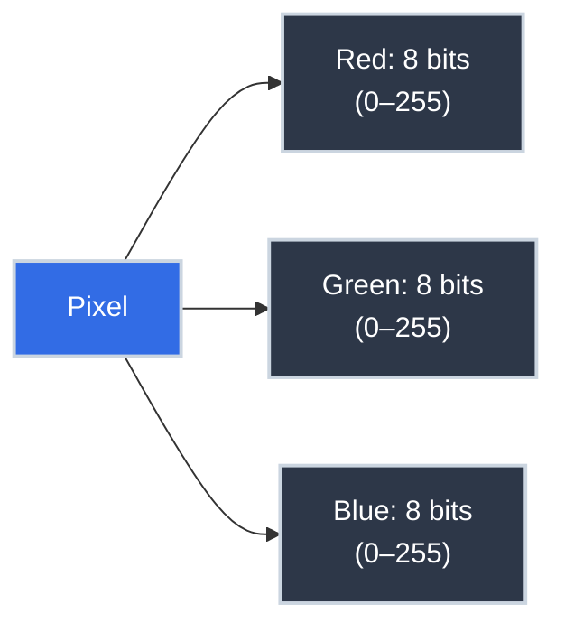

# Information Theory: The Mathematics of Data

You store data in databases, send it over APIs, compress it for storage, and encrypt it for transit. But "data" is an informal word. What *is* information, formally? How much of it is in a file? Is there a limit to how much you can compress it?

**These questions have precise mathematical answers.** In 1948, Claude Shannon published *A Mathematical Theory of Communication*, establishing information theory as a field. His framework is the theoretical foundation of every compression algorithm, every communications protocol, and every error-correcting code — from ZIP files to Wi-Fi to QR codes. Understanding it makes the design decisions in these systems legible rather than mysterious.

## Where You've Seen This

Information theory underlies engineering decisions you make constantly:

- **File compression** — ZIP, gzip, and brotli all work by exploiting redundancy; Shannon's entropy formula tells you the theoretical minimum size for any file
- **Database storage** — column types are size decisions; `BOOLEAN` takes 1 bit of information, `UUID` takes 128 bits; choosing the right type is choosing how much information you need to store
- **API response design** — over-fetching (returning unused fields) wastes bandwidth; GraphQL exists partly as an information efficiency argument
- **Hashing and cryptography** — SHA-256 produces 256 bits of output; that fixed size represents the information capacity of the digest; collision resistance depends on those bits being high-entropy
- **Machine learning feature engineering** — low-entropy features (a column that's always `True`) carry no information and don't improve model accuracy; this is the intuition behind information gain in decision trees
- **Network protocols** — TCP header fields, HTTP/2 header compression (HPACK), and protocol buffer encoding are all information-theoretic engineering decisions

## Why This Matters for Production Code

=== ":material-database: Choosing the Right Data Types"

    Every data type is an information budget. When you define a database column or a struct field, you're deciding how many bits to allocate and implicitly how much information that field can carry.

    | Data | Theoretical bits needed | Practical storage |
    |:-----|:------------------------|:-----------------|
    | True/false flag | 1 bit | 1 byte (minimum addressable) |
    | Day of week | ~2.8 bits (log₂7) | 1 byte (as integer) |
    | UUID / random ID | 122 bits | 16 bytes |
    | IPv4 address | 32 bits | 4 bytes |
    | IPv6 address | 128 bits | 16 bytes |
    | SHA-256 hash | 256 bits | 32 bytes |

    Understanding information content helps you evaluate trade-offs. A `VARCHAR(255)` for a field that only ever holds 3 values is an information mismatch — you're allocating space for much more information than you'll use.

=== ":material-zip-box: Why Compression Has Limits"

    Shannon's source coding theorem proves that you cannot compress data below its entropy. If a file has N bits of entropy, no lossless algorithm can produce an output smaller than N bits on average.

    This has a practical implication you've almost certainly encountered: already-compressed data (JPEG images, MP4 videos, encrypted files) doesn't compress further with gzip or zip. That's not a bug in gzip — it's Shannon's theorem in action. The entropy of already-compressed or encrypted data is already close to maximum; there's no redundancy left to remove.

    Conversely, highly repetitive data (log files full of the same error message, CSVs with many null values) compresses dramatically because its entropy is much lower than its size.

=== ":material-lock: Entropy and Security"

    A cryptographic key's security is measured in bits of entropy. A 128-bit AES key that was generated from a truly random source has 128 bits of entropy — an attacker has to try 2¹²⁸ keys to brute-force it. A "128-bit key" generated from a user's four-word password has far less entropy, because most of those 2¹²⁸ bit patterns are unreachable.

    This is why password managers generate random keys and why password strength meters estimate entropy: security isn't in the size of the key, it's in the unpredictability. A 256-bit key with low entropy is weaker than a 64-bit truly random key.

=== ":material-chart-bell-curve: Information Gain in Machine Learning"

    Decision trees split data on the feature that provides the most *information gain* — the reduction in uncertainty about the target variable. This is directly Shannon's entropy applied to classification.

    A feature that splits a binary classification dataset into {50% positive, 50% negative} on each side provides zero information gain; the split was useless. A feature that perfectly separates the classes has maximum information gain. SQL `EXPLAIN` plans reason about selectivity the same way.

## What Is Information?

In everyday use, "information" means knowledge. Shannon gave it a precise definition:

> **Information is the reduction of uncertainty.**

If you already know something with certainty, being told it gives you zero information. If you learn something you had no prior knowledge of, you receive maximum information. The amount of information in a message is inversely proportional to how expected that message was.

Formally, the information content of a message with probability $p$ is:

$$I = -\log_2(p) \text{ bits}$$

Some examples:

| Event | Probability | Information Content |
|:------|:------------|:--------------------|
| Coin lands heads | 1/2 | $-\log_2(1/2) = 1$ bit |
| Fair die shows 6 | 1/6 | $-\log_2(1/6) \approx 2.58$ bits |
| Random byte is 0xFF | 1/256 | $-\log_2(1/256) = 8$ bits |
| "The sun rose today" | ~1.0 | $-\log_2(1) = 0$ bits |

The formula captures the intuition: rare events carry more information. Winning the lottery provides more information than learning it rained in Seattle in November.

## The Bit: The Atomic Unit of Information

A **bit** (binary digit) is the minimum unit of information — the amount needed to eliminate exactly two equally likely possibilities. One bit answers one yes/no question where both answers were equally likely.

One bit can represent:

- Heads or tails
- True or false
- 0 or 1

Two bits can represent four possibilities: `00`, `01`, `10`, `11`. Three bits represent eight possibilities. In general, $n$ bits represent $2^n$ possibilities.

This is the foundation of digital representation: any information can be encoded as a sequence of bits, and the number of bits needed is determined by the number of possibilities.

### How Many Bits Does Something Need?

To represent one of $N$ equally likely values, you need $\lceil \log_2 N \rceil$ bits:

| Values to represent | Bits needed | Why |
|:--------------------|:------------|:----|
| 2 (yes/no) | 1 | $\log_2 2 = 1$ |
| 4 (suit of a card) | 2 | $\log_2 4 = 2$ |
| 8 (day + AM/PM + ...) | 3 | $\log_2 8 = 3$ |
| 256 (one byte) | 8 | $\log_2 256 = 8$ |
| 65,536 (Unicode BMP) | 16 | $\log_2 65536 = 16$ |
| 4.3 billion (IPv4 addresses) | 32 | $\log_2 2^{32} = 32$ |

This is why `uint8` holds values 0–255 (256 values = $2^8$), `uint16` holds 0–65535, and `uint32` holds 0–4,294,967,295.

## Binary Numbers

Computers store everything as bits, so all data must ultimately be represented in **binary** — base 2 notation, using only digits 0 and 1.

Binary works exactly like decimal, but with base 2 instead of base 10:

| Position | Decimal value of position | Binary digit | Contribution |
|:---------|:--------------------------|:-------------|:-------------|
| 3 | $2^3 = 8$ | 1 | 8 |
| 2 | $2^2 = 4$ | 0 | 0 |
| 1 | $2^1 = 2$ | 1 | 2 |
| 0 | $2^0 = 1$ | 1 | 1 |

So binary `1011` = 8 + 0 + 2 + 1 = **11** in decimal.

Converting decimal 42 to binary:

```
42 ÷ 2 = 21 remainder 0  → least significant bit: 0
21 ÷ 2 = 10 remainder 1
10 ÷ 2 =  5 remainder 0
 5 ÷ 2 =  2 remainder 1
 2 ÷ 2 =  1 remainder 0
 1 ÷ 2 =  0 remainder 1  → most significant bit: 1

Reading remainders bottom-up: 101010
```

Binary `101010` = 42 in decimal.

### Hexadecimal: Shorthand for Binary

Reading long binary strings is error-prone. **Hexadecimal** (base 16) is a compact notation where each hex digit represents exactly 4 binary bits:

| Hex | Binary | Decimal |
|:----|:-------|:--------|
| 0–9 | 0000–1001 | 0–9 |
| A | 1010 | 10 |
| B | 1011 | 11 |
| C | 1100 | 12 |
| D | 1101 | 13 |
| E | 1110 | 14 |
| F | 1111 | 15 |

You see hex everywhere: `#FF5733` (RGB color), `0xDEADBEEF` (memory addresses), `3a:f2:c1:08:d4:bb` (MAC addresses), SHA hashes like `a3f8...`. Each pair of hex digits is one byte (8 bits).

## Representing Data as Bits

Every kind of data — text, images, audio, video — is ultimately stored as binary numbers. The choice of representation is called an **encoding**.

### Text: ASCII and Unicode

The oldest text encoding is **ASCII** (American Standard Code for Information Interchange), which maps each character to a 7-bit number:

| Character | ASCII decimal | Binary |
|:----------|:--------------|:-------|
| `A` | 65 | `01000001` |
| `a` | 97 | `01100001` |
| `0` | 48 | `00110000` |
| `space` | 32 | `00100000` |

ASCII covers 128 characters (7 bits = $2^7$). It's sufficient for English but not for the world's languages. **Unicode** (encoded as UTF-8, UTF-16, or UTF-32) expands this to cover over 140,000 characters using 1–4 bytes per character in UTF-8.

When you see a `UnicodeDecodeError` or mojibake (garbled characters), you're seeing an encoding mismatch — bytes interpreted with the wrong encoding scheme.

### Images: Pixels and RGB

A digital image is a grid of **pixels**. Each pixel stores color information. In RGB:

- Red channel: 0–255 (8 bits)
- Green channel: 0–255 (8 bits)
- Blue channel: 0–255 (8 bits)

Total: **24 bits per pixel** (3 bytes). A 1920×1080 image has 2,073,600 pixels × 3 bytes = ~6 MB uncompressed. That's why JPEG and PNG exist — they compress this down using the fact that adjacent pixels in real images are highly correlated (low entropy).



### Numbers: Integers and Floats

Computers represent integers directly in binary (two's complement for signed integers). Floating-point numbers (decimals) use the IEEE 754 standard: a sign bit, exponent bits, and mantissa bits — analogous to scientific notation in binary.

This is why `0.1 + 0.2 ≠ 0.3` in most languages: 0.1 cannot be represented exactly in binary floating point (just as 1/3 cannot be represented exactly in decimal). You're seeing the limits of binary representation, not a bug.

## Entropy: Measuring Information Density

Shannon defined **entropy** as the average information content of a message source — essentially, how unpredictable it is:

$$H = -\sum_{i} p_i \log_2 p_i \text{ bits per symbol}$$

Intuitively:

- **Low entropy** — predictable, repetitive data. The string `AAAAAAAAAA` has near-zero entropy; knowing any character tells you everything about the others.
- **High entropy** — unpredictable, random-looking data. A random byte sequence has 8 bits of entropy per byte — maximum for a byte.

| Source | Entropy | Example |
|:-------|:--------|:--------|
| Constant value | 0 bits | Always `true` |
| Fair coin flip | 1 bit | `HTHTHHTTHT...` |
| English text | ~4.5 bits/char | Highly correlated letters |
| Random bytes | 8 bits/byte | Encrypted or compressed data |

English text has ~4.5 bits of entropy per character despite using 8-bit ASCII characters — that's the redundancy that compression exploits. ZIP compresses English text by roughly 50% by encoding the patterns.

## Compression: Shannon's Source Coding Theorem

Shannon proved that data can be compressed losslessly down to — but not below — its entropy. This is the **source coding theorem**:

$$\text{Minimum compressed size} = \text{Entropy of the source}$$

**Lossless compression** (ZIP, gzip, PNG) removes redundancy without discarding information. The decompressed output is bit-for-bit identical to the original.

**Lossy compression** (JPEG, MP3, H.264) removes information that is perceptually insignificant — high-frequency image detail, inaudible audio frequencies. The decompressed output is *similar* but not identical. Once information is thrown away, it cannot be recovered.

The engineering implication: once data is compressed (especially lossily), trying to compress it again is futile — the entropy is already close to maximum. This is why transcoding a video from one format to another repeatedly degrades quality: each lossy step discards more information, and the losses accumulate.

## Practice Problems

??? question "Practice 1: Bit Counting"

    a. How many bits are needed to represent the 52 cards in a standard deck?

    b. How many bits are needed to represent a four-digit PIN (0000–9999)?

    c. A database stores a user's subscription tier: `free`, `pro`, or `enterprise`. What is the minimum number of bits needed?

    ??? tip "Answers"

        a. $\lceil \log_2 52 \rceil = \lceil 5.7 \rceil = 6$ bits (6 bits can hold $2^6 = 64$ values, enough for 52)

        b. $\lceil \log_2 10000 \rceil = \lceil 13.3 \rceil = 14$ bits (but in practice stored as `SMALLINT` or 2 bytes for alignment)

        c. $\lceil \log_2 3 \rceil = \lceil 1.58 \rceil = 2$ bits — 2 bits can hold 4 values, which covers 3 tiers

??? question "Practice 2: Binary Conversion"

    Convert these values:

    a. Binary `10110011` to decimal

    b. Decimal 200 to binary

    c. Hex `FF` to decimal

    ??? tip "Answers"

        a. `10110011` = $128 + 32 + 16 + 2 + 1 = 179$

        b. 200 = $128 + 64 + 8 = 11001000_2$

        c. `FF` = $15 \times 16 + 15 = 255$ (also: `1111 1111` in binary, all 8 bits set)

??? question "Practice 3: Entropy and Compression"

    A log file has the following character distribution:

    - `[` and `]` appear 40% of the time combined
    - Digits appear 30% of the time
    - Space appears 20% of the time
    - All other characters together appear 10% of the time

    Would you expect this log file to compress well with gzip? Why?

    ??? tip "Answer"

        Yes, it compresses well. The distribution is highly skewed — a few characters dominate — which means the entropy is low. gzip (which uses Huffman coding + LZ77) would assign short bit codes to the frequent characters and longer codes to rare ones, significantly reducing the average bits per character below the 8 bits ASCII uses.

        Additionally, log files tend to have repetitive line patterns (same timestamps, same prefixes, same error messages), which LZ77's back-reference compression exploits heavily. Large log files commonly compress to 5-15% of their original size.

## Key Takeaways

| Concept | What to Remember |
|:--------|:----------------|
| Information | The reduction of uncertainty; rare events carry more information |
| Bit | The unit of information; answers one equally-probable yes/no question |
| $\lceil \log_2 N \rceil$ bits | Minimum bits to represent N equally likely values |
| Binary | Base-2 number system; all data is ultimately binary |
| Hexadecimal | Base-16 shorthand for binary; each hex digit = 4 bits |
| Encoding | The scheme for representing data as bits (ASCII, UTF-8, RGB, IEEE 754) |
| Entropy | Average information content; measures unpredictability/compressibility |
| Source coding theorem | Lossless compression cannot reduce data below its entropy |
| Lossy vs. lossless | Lossless preserves all data; lossy discards perceptually insignificant information |

## Further Reading

**On This Site**

- [What is Computer Science?](../essentials/what_is_computer_science.md) — processes, procedures, and computers; the broader context for why information theory matters
- [Type Systems Basics](../essentials/type_systems_basics.md) — types as sets of values; data types are information budgets

**External**

- [*A Mathematical Theory of Communication*](https://people.math.harvard.edu/~ctm/home/text/others/shannon/entropy/entropy.pdf) by Claude Shannon (1948) — the original paper; surprisingly readable
- [*Introduction to Computing*](https://computingbook.org/) by David Evans, Chapter 1 — the treatment of bits and information that inspired this article
- [Unicode Standard](https://www.unicode.org/standard/standard.html) — the definitive reference for text encoding in modern systems

Every byte in every database, every packet on every network, and every pixel on every screen is an application of this theory. Shannon's framework is why digital communication works at all — and why the limits you encounter (can't compress encrypted files, can't losslessly recover from JPEG encoding) are not engineering failures but mathematical certainties.
