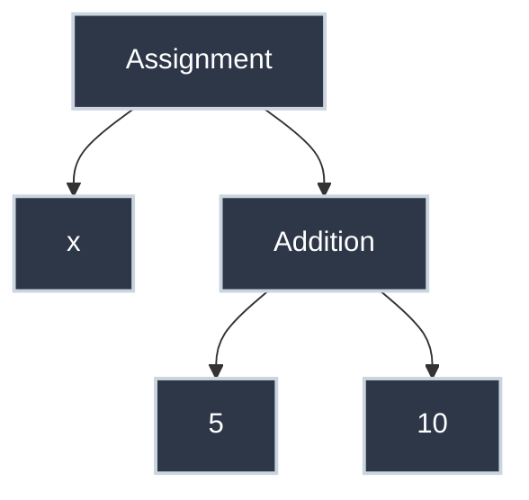

# How Interpreters Work: Tokens, Parsing, and Evaluation

When you type `x = 5 + 10` into a Python terminal, the computer doesn't see "math." It sees a string of characters: `x`, space, `=`, space, `5`, space, `+`, space, `1`, `0`.

To turn this raw text into action, an **Interpreter** follows a three-step assembly line: **Tokenizing**, **Parsing**, and **Evaluating**.

---

## Step 1: The Tokenizer (Lexer)

The first step is to break the text into meaningful chunks called **Tokens**. 

Think of this like breaking a sentence into individual words. A space isn't a word, but it helps you see where one word ends and the next begins.

For the input `x = 5 + 10`, the Tokenizer produces a list like this:
1.  `NAME` ("x")
2.  `EQUALS` ("=")
3.  `NUMBER` (5)
4.  `PLUS` ("+")
5.  `NUMBER` (10)

The Tokenizer ignores "noise" like extra spaces or comments. It just wants to know the "vocabulary" of your line.

---

## Step 2: The Parser

Now that we have a list of tokens, we need to understand the **Grammar**. Is `5 + = x` a valid sentence? The Tokenizer says yes (those are all valid words), but the **Parser** says no (that's a nonsense sentence).

The Parser organizes the tokens into a structure called a **Syntax Tree** (or Abstract Syntax Tree - AST).

For `x = 5 + 10`, the tree looks like this:

The Parser ensures that the code follows the rules of the language (e.g., you can't have two plus signs in a row). If the tree can't be built, you get a **Syntax Error**.

---

## Step 3: The Evaluator

The final step is the **Evaluator**. It "walks" the tree and performs the actual calculations.

1.  It sees the **Addition** node.
2.  It looks at the children: `5` and `10`.
3.  It performs the addition ($5 + 10 = 15$).
4.  It sees the **Assignment** node.
5.  It stores the value `15` in the memory location for `x`.

---

## Recursive Descent Parsing

One common way to build the Parser is through **Recursive Descent**.

In this method, the Parser has a dedicated function for every rule in the language (e.g., `parse_expression()`, `parse_statement()`, `parse_loop()`). These functions call each other recursively to "descend" through the levels of the tree.

-   To parse an **Assignment**, it calls the function to parse a **Value**.
-   To parse a **Value**, it might call the function to parse an **Expression**.

This "divide and conquer" approach makes it possible to handle complex, nested code like `x = (5 + (2 * 3))`.

## Summary: The Interpreter Pipeline

| Component | Responsibility | Output |
| :--- | :--- | :--- |
| **Tokenizer** | Break text into "words". | List of Tokens. |
| **Parser** | Check the "grammar" and structure. | Syntax Tree (AST). |
| **Evaluator** | Execute the logic. | Results / State Changes. |

---

## Practice Problems

??? question "Practice Problem 1: Tokenizing"

    What are the tokens in the expression `y = x * 2`?

    ??? tip "Solution"
        1. `NAME` ("y")
        2. `EQUALS` ("=")
        3. `NAME` ("x")
        4. `MULTIPLY` ("*")
        5. `NUMBER` (2)

??? question "Practice Problem 2: Syntax Error"

    At which stage would the error `5 + * 10` be caught?

    ??? tip "Solution"
        **The Parser.**
        
        The Tokenizer would successfully identify the `5`, `+`, `*`, and `10`. However, when the Parser tries to build a tree, it will see that a `*` cannot immediately follow a `+`. Since this breaks the grammar rules, the Parser throws a **Syntax Error**.

---

By understanding how interpreters break down, structure, and execute our code, we gain a deeper appreciation for the "magic" that happens every time we hit the Enter key in a programming environment.
