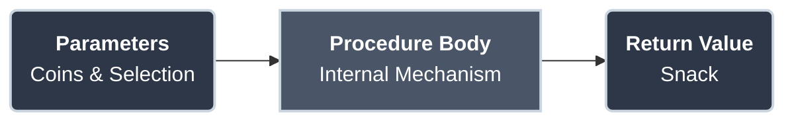
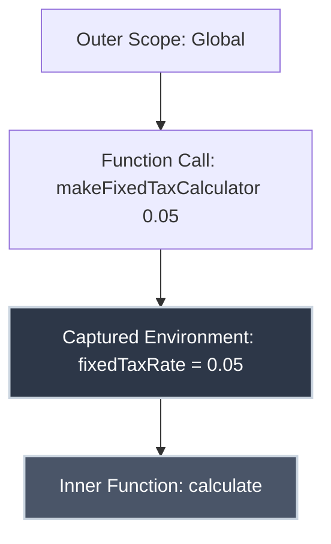

# Procedures and Higher-Order Functions

When you calculate the total price of an item including tax, you don't rederive the formula every time. You have a mental procedure: multiply the price by the tax rate, add the result to the original price, done. When a chef teaches an apprentice to make a sauce, they don't list every molecular interaction—they provide a procedure: heat butter, add flour, whisk until smooth, gradually add milk.

Procedures are recipes for computation. They package sequences of steps into reusable units with names. But what happens when procedures themselves become ingredients—when you pass one procedure to another, or return a new procedure as a result? That's when you enter the realm of **higher-order functions**, one of the most powerful ideas in computer science.

## What is a Procedure?

A **procedure** (also called a function, subroutine, or method) is a named sequence of instructions that performs a specific task.

??? info "Terminology Across Languages"
    While we use the general term "procedure," you'll encounter different names depending on the language you use:
    
    *   **Functions**: The most common term. Used in **Python** (`def`), **JavaScript** (`function`), **C**, **C++**, **Go** (`func`), and **Rust** (`fn`).
    *   **Methods**: Used in **Java**, **C#**, and **Ruby**. This term usually refers to a function that is part of a class or an object.
    *   **Subroutines**: Often used in **Fortran**, **BASIC**, and **Assembly** language.
    *   **Procedures**: Specifically used in **Pascal** and **Ada** (often to distinguish functions that do *not* return a value from those that do).

**Key characteristics:**

- **Name**: Identifies the procedure (`calculateTotal`, `sortList`, `findMax`)
- **Parameters**: Inputs the procedure needs (also called arguments)
- **Body**: The sequence of steps to execute
- **Return value**: Output the procedure produces (optional)

### The Vending Machine Analogy

Think of a procedure like a vending machine. You don't need to know how the gears turn inside; you just need to know what to put in and what you'll get out.



*   **Parameters (Inputs):** You insert coins and press a button.
*   **Body (The Black Box):** The internal mechanism does the work. You don't see or worry about the motors and sensors.
*   **Return Value (Output):** You receive your snack.

The machine's internal complexity is hidden—you only interact through its interface.

## Pseudocode: A Language-Neutral Format

**Pseudocode** is a way to describe algorithms without committing to a specific programming language's syntax. It prioritizes clarity and readability over executability.

**Characteristics:**

- Uses plain English mixed with programming constructs
- No strict syntax rules (as long as meaning is clear)
- Focuses on logic, not implementation details

**Common conventions:**

| Construct | Pseudocode Example |
|:----------|:-------------------|
| **Assignment** | `x ← 5` or `x = 5` |
| **Function call** | `result ← calculateTax(100, 0.05)` |
| **If statement** | `if x > 0 then` ... `endif` |
| **Loop** | `while x < 10 do` ... `endwhile` |
| **Function definition** | `function name(param1, param2)` ... `return value` |
| **Comment** | `// This is a comment` |

### Why Use Pseudocode?

1. **Language-agnostic**: Describe algorithms before choosing Python, Java, C++, etc.
2. **Focus on logic**: Don't get bogged down in syntax details
3. **Communication**: Share ideas with non-programmers or different dev teams
4. **Planning**: Design before coding (avoiding premature implementation)

## Defining a Simple Procedure

### Anatomy of a Procedure

Before we look at examples, let's understand the basic structure of a procedure.

**Structure:**

```
function name(parameter1, parameter2, ...)
    // Procedure body: sequence of statements
    // Can include variables, conditionals, loops, etc.
    return value  // Optional
endfunction
```

**Components:**

| Component | Purpose | Example |
|:----------|:--------|:--------|
| **Name** | Identifies the procedure | `COMP-COST` |
| **Parameters** | Inputs (can be zero or more) | `price`, `taxRate` |
| **Body** | Steps to execute | `salesTax ← price * taxRate` |
| **Return** | Output value | `return totalCost` |

**Parameters vs. Arguments:**

- **Parameters**: Variables in the function definition (`price`, `taxRate`)
- **Arguments**: Actual values passed when calling (`100`, `0.05`)

### Examples

=== "Squaring a Number"

    **Task:** Create a procedure that squares a number.

    === ":material-text: Pseudocode"

        ```
        function square(x)
            result ← x * x
            return result
        endfunction
        ```

        **Usage:**

        ```
        answer ← square(5)    // answer = 25
        ```

    === ":material-language-python: Python"

        ```python title="Square Function" linenums="1"
        def square(x):
            result = x * x
            return result
        ```

    === ":material-language-javascript: JavaScript"

        ```javascript title="Square Function" linenums="1"
        function square(x) {
            let result = x * x;
            return result;
        }
        ```

    === ":material-language-go: Go"

        ```go title="Square Function" linenums="1"
        func square(x int) int {
            result := x * x
            return result
        }
        ```

    === ":material-language-rust: Rust"

        ```rust title="Square Function" linenums="1"
        fn square(x: i32) -> i32 {
            let result = x * x;
            return result; // or just 'x * x'
        }
        ```

    === ":material-language-java: Java"

        ```java title="Square Function" linenums="1"
        public static int square(int x) {
            int result = x * x;
            return result;
        }
        ```

    === ":material-language-cpp: C++"

        ```cpp title="Square Function" linenums="1"
        int square(int x) {
            int result = x * x;
            return result;
        }
        ```

=== "Computing Total Cost"

    **Task:** Calculate the total cost of an item including sales tax.

    === ":material-text: Pseudocode"

        ```
        function COMP-COST(price, taxRate)
            salesTax ← price * taxRate
            totalCost ← price + salesTax
            return totalCost
        endfunction
        ```

        **Usage:**

        ```
        total ← COMP-COST(100, 0.05)
        // total = 105
        ```

    === ":material-language-python: Python"

        ```python title="Total Cost Function" linenums="1"
        def comp_cost(price, tax_rate):
            sales_tax = price * tax_rate
            total_cost = price + sales_tax
            return total_cost
        ```

    === ":material-language-javascript: JavaScript"

        ```javascript title="Total Cost Function" linenums="1"
        function compCost(price, taxRate) {
            let salesTax = price * taxRate;
            let totalCost = price + salesTax;
            return totalCost;
        }
        ```

    === ":material-language-go: Go"

        ```go title="Total Cost Function" linenums="1"
        func compCost(price float64, taxRate float64) float64 {
            salesTax := price * taxRate
            totalCost := price + salesTax
            return totalCost
        }
        ```

    === ":material-language-rust: Rust"

        ```rust title="Total Cost Function" linenums="1"
        fn comp_cost(price: f64, tax_rate: f64) -> f64 {
            let sales_tax = price * tax_rate;
            let total_cost = price + sales_tax;
            return total_cost;
        }
        ```

    === ":material-language-java: Java"

        ```java title="Total Cost Function" linenums="1"
        public static double compCost(double price, double taxRate) {
            double salesTax = price * taxRate;
            double totalCost = price + salesTax;
            return totalCost;
        }
        ```

    === ":material-language-cpp: C++"

        ```cpp title="Total Cost Function" linenums="1"
        double compCost(double price, double taxRate) {
            double salesTax = price * taxRate;
            double totalCost = price + salesTax;
            return totalCost;
        }
        ```

## Why Procedures Matter

Procedures provide:

### 1. [Abstraction](../building_blocks/computational_thinking.md#abstraction)

Hide complexity behind a simple interface. Users don't need to know *how* `COMP-COST` works, just *what* it does.

### 2. Reuse

Write once, use many times:

```
total1 ← COMP-COST(50, 0.08)
total2 ← COMP-COST(200, 0.08)
total3 ← COMP-COST(75, 0.08)
```

Without procedures, you'd duplicate the calculation logic three times.

### 3. Maintainability

If the tax calculation formula changes (e.g., adding rounding), update one place:

```
function COMP-COST(price, taxRate)
    salesTax ← round(price * taxRate, 2)  // Round to 2 decimal places
    totalCost ← price + salesTax
    return totalCost
endfunction
```

All callers automatically benefit.

### 4. Testability

Test procedures in isolation:

```
assert COMP-COST(100, 0.05) = 105
assert COMP-COST(13, 0.05) = 13.65
assert COMP-COST(0, 0.05) = 0
```

### 5. Readability

Compare:

**Without procedures:**

```
total1 ← 100 + (100 * 0.05)
total2 ← 200 + (200 * 0.05)
```

**With procedures:**

```
total1 ← COMP-COST(100, 0.05)
total2 ← COMP-COST(200, 0.05)
```

The second version clearly communicates intent.

## Higher-Order Functions

A **higher-order function** is a function that:

1. **Takes one or more functions as parameters**, and/or
2. **Returns a function as its result**

This treats functions as first-class values—they can be passed around like numbers or strings.

### Why "Higher-Order"?

The terminology comes from mathematics:

- **First-order** functions operate on data (numbers, strings, etc.)
- **Higher-order** functions operate on functions themselves

**Example from calculus:**

The derivative operator takes a function and returns a new function:

```
d/dx(f) → f'
```

If \(f(x) = x^2\), then \(f'(x) = 2x\). The derivative operator is higher-order.

??? quote "1930s: The Theoretical Foundation (Lambda Calculus)"
    Long before modern computers, **Alonzo Church** invented **λ-calculus**, a formal system where *everything* is a function.
    
    In this system, `add(3, 4)` looks like `(λx. λy. x + y)(3)(4)`. This concept is the theoretical bedrock for all functional programming.

### Higher-Order Function Examples

=== "Partial Application"

    ### The Problem

    Suppose you run a retail store with a fixed 5% sales tax. Every time you calculate total cost, you must specify the tax rate:

    ```
    total1 ← COMP-COST(50, 0.05)
    total2 ← COMP-COST(100, 0.05)
    total3 ← COMP-COST(75, 0.05)
    total4 ← COMP-COST(120, 0.05)
    ```

    Repeating `0.05` is tedious and error-prone. If the tax rate changes, you must update every call.

    ### The Solution

    Create a specialized version of `COMP-COST` that "bakes in" the tax rate:

    === ":material-text: Pseudocode"

        ```
        function makeFixedTaxCalculator(fixedTaxRate)
            function calculate(price)
                return COMP-COST(price, fixedTaxRate)
            endfunction
            return calculate
        endfunction
        ```

        **Usage:**

        ```
        calcWith5PercentTax ← makeFixedTaxCalculator(0.05)

        total1 ← calcWith5PercentTax(50)      // 52.50
        total2 ← calcWith5PercentTax(100)     // 105.00
        ```

    === ":material-language-python: Python"

        ```python title="Partial Application" linenums="1"
        def make_fixed_tax_calculator(fixed_tax_rate):  # (1)!
            def calculate(price):  # (2)!
                return comp_cost(price, fixed_tax_rate)  # (3)!
            return calculate  # (4)!
        ```

        1.  **Outer Function**: Takes the configuration value (tax rate).
        2.  **Inner Function**: Defines the behavior we want to return.
        3.  **Closure Capture**: Uses `fixed_tax_rate` from the outer scope.
        4.  **Return**: Sends the *function itself* back to the caller.

        **Usage:**

        ```python
        calc_with_5_percent = make_fixed_tax_calculator(0.05)
        total1 = calc_with_5_percent(50)  # 52.50
        ```

    === ":material-language-javascript: JavaScript"

        ```javascript title="Partial Application" linenums="1"
        function makeFixedTaxCalculator(fixedTaxRate) {
            return function(price) {
                return compCost(price, fixedTaxRate);
            };
        }
        ```

        **Usage:**

        ```javascript
        const calcWith5Percent = makeFixedTaxCalculator(0.05);
        let total1 = calcWith5Percent(50); // 52.50
        ```

    === ":material-language-go: Go"

        ```go title="Partial Application" linenums="1"
        // Go supports closures
        func makeFixedTaxCalculator(fixedTaxRate float64) func(float64) float64 {
            return func(price float64) float64 {
                return compCost(price, fixedTaxRate)
            }
        }
        ```

        **Usage:**

        ```go
        calcWith5Percent := makeFixedTaxCalculator(0.05)
        total1 := calcWith5Percent(50.0) // 52.50
        ```

    === ":material-language-rust: Rust"

        ```rust title="Partial Application" linenums="1"
        fn make_fixed_tax_calculator(fixed_tax_rate: f64) -> impl Fn(f64) -> f64 {
            // 'move' captures fixed_tax_rate by value
            move |price| comp_cost(price, fixed_tax_rate)
        }
        ```

        **Usage:**

        ```rust
        let calc_with_5_percent = make_fixed_tax_calculator(0.05);
        let total1 = calc_with_5_percent(50.0); // 52.50
        ```

    === ":material-language-java: Java"

        ```java title="Partial Application" linenums="1"
        import java.util.function.Function;

        public static Function<Double, Double> makeFixedTaxCalculator(double fixedTaxRate) {
            return (price) -> compCost(price, fixedTaxRate);
        }
        ```

        **Usage:**

        ```java
        Function<Double, Double> calcWith5Percent = makeFixedTaxCalculator(0.05);
        double total1 = calcWith5Percent.apply(50.0); // 52.50
        ```

    === ":material-language-cpp: C++"

        ```cpp title="Partial Application" linenums="1"
        #include <functional>

        std::function<double(double)> makeFixedTaxCalculator(double fixedTaxRate) {
            return [fixedTaxRate](double price) {
                return compCost(price, fixedTaxRate);
            };
        }
        ```

        **Usage:**

        ```cpp
        auto calcWith5Percent = makeFixedTaxCalculator(0.05);
        double total1 = calcWith5Percent(50.0); // 52.50
        ```

=== "Map (Functions as Parameters)"

    ### The Problem

    You have a list of numbers and want to perform various operations (square, double, negate) without rewriting the loop logic every time.

    ### The Solution

    ??? tip "1958: The First Functional Language (Lisp)"
        **John McCarthy** created **Lisp**, the first language to treat functions as "first-class citizens"—meaning they could be passed around just like numbers.
        
        For a deeper look at Lisp's descendant and how it represents code as data, check out our article on **[Scheme and Parse Trees](../building_blocks/scheme_and_parse_trees.md#historical-context)**.

    Define a general `map` function that applies *any* function to each element:

    === ":material-text: Pseudocode"

        ```
        function map(func, numbers)
            result ← []
            for each num in numbers
                result.append(func(num))
            endfor
            return result
        endfunction
        ```

    === ":material-language-python: Python"

        ```python title="Map Function" linenums="1"
        def map_function(func, numbers):  # (1)!
            result = []
            for num in numbers:
                result.append(func(num))  # (2)!
            return result
        ```

        1.  Takes a **function** as an argument (`func`) along with the data.
        2.  **Higher-Order Magic**: Calls the passed-in function on each element.

    === ":material-language-javascript: JavaScript"

        ```javascript title="Map Function" linenums="1"
        function map(func, numbers) {
            let result = [];
            for (let num of numbers) {
                result.push(func(num));
            }
            return result;
        }
        ```

    === ":material-language-go: Go"

        ```go title="Map Function" linenums="1"
        func mapInts(f func(int) int, numbers []int) []int {
            result := make([]int, len(numbers))
            for i, v := range numbers {
                result[i] = f(v)
            }
            return result
        }
        ```

    === ":material-language-rust: Rust"

        ```rust title="Map Function" linenums="1"
        fn map_vec(func: fn(i32) -> i32, numbers: &Vec<i32>) -> Vec<i32> {
            let mut result = Vec::new();
            for &num in numbers {
                result.push(func(num));
            }
            return result;
        }
        ```

    === ":material-language-java: Java"

        ```java title="Map Function" linenums="1"
        import java.util.List;
        import java.util.ArrayList;
        import java.util.function.Function;

        public static List<Integer> map(Function<Integer, Integer> func, List<Integer> numbers) {
            List<Integer> result = new ArrayList<>();
            for (Integer num : numbers) {
                result.add(func.apply(num));
            }
            return result;
        }
        ```

    === ":material-language-cpp: C++"

        ```cpp title="Map Function" linenums="1"
        #include <vector>
        #include <functional>

        std::vector<int> map(std::function<int(int)> func, const std::vector<int>& numbers) {
            std::vector<int> result;
            for (int num : numbers) {
                result.push_back(func(num));
            }
            return result;
        }
        ```

    **Usage:**

    Once `map` is defined, you can pass any transformation function to it.

    ```python
    # Example (Python)
    squared = map_function(square, [1, 2, 3]) # [1, 4, 9]
    doubled = map_function(double, [1, 2, 3]) # [2, 4, 6]
    ```

## Closures

A **closure** is a function that "closes over" (captures) variables from its surrounding scope. This allows a function to access variables that were present when it was *created*, even if those variables are no longer in scope when it is *called*.

In the "Partial Application" example above, `makeFixedTaxCalculator` creates a closure.

**Visualizing Capture:**

1.  You call `makeFixedTaxCalculator(0.05)`.
2.  A new local environment is created where `fixedTaxRate = 0.05`.
3.  The `calculate` function is defined *inside* this environment.
4.  When `makeFixedTaxCalculator` returns, `calculate` carries that environment with it like a backpack.



When you later call `calcWith5Percent(50)`, it reaches into its "backpack" (the captured environment) to find `fixedTaxRate`. Without closures, partial application would be impossible.

## Currying

**Currying** is the technique of translating the evaluation of a function that takes multiple arguments into evaluating a sequence of functions, each with a single argument.

If you have a function `f(x, y, z)`, you normally call it like this:

```
result = f(x, y, z)
```

Currying transforms it so you call it like this:

```
result = f(x)(y)(z)
```

### How it Works

Imagine a factory assembly line.

1.  **Standard Function:** You dump all raw materials (`x`, `y`, `z`) into the machine at once. It crunches them and spits out the product.
2.  **Curried Function:**
    *   **Station 1:** Takes `x`. It adjusts its settings based on `x` and returns a *new machine* (Station 2).
    *   **Station 2:** Takes `y`. It adjusts based on `y` and returns a *new machine* (Station 3).
    *   **Station 3:** Takes `z`. It finally has everything it needs, does the work, and returns the product.

This "chain of machines" allows you to stop at any point. If you only have `x`, you can run Station 1 and save the resulting Station 2 for later use. This is effectively **Partial Application**.

??? info "Origins of Currying"
    While named after the American logician **Haskell Curry**, the concept was originally introduced in 1924 by the Russian mathematician **Moses Schönfinkel**. Curry later developed the idea extensively, leading to its widespread adoption in logic and computer science.

    Currying is a fundamental concept in **combinatory logic** and the **lambda calculus**. It allows functions that take multiple arguments to be expressed using only functions that take a single argument, which simplifies the mathematical study of computation. Today, Haskell Curry's legacy lives on in languages like **Haskell**, which are built entirely on these functional principles.

### Currying Examples

=== "Addition"

    **Task:** transform a standard addition function `add(x, y)` into a sequence of functions `add(x)(y)`.

    === ":material-text: Pseudocode"

        **Normal function:**

        ```
        function add(x, y)
            return x + y
        endfunction

        result ← add(3, 4)  // 7
        ```

        **Curried version:**

        ```
        function addCurried(x)
            function inner(y)
                return x + y
            endfunction
            return inner
        endfunction
        ```

        **Usage:**

        ```
        add3 ← addCurried(3)     // Returns a function that adds 3
        result ← add3(4)         // 7

        add10 ← addCurried(10)   // Returns a function that adds 10
        result2 ← add10(5)       // 15
        ```

        **Or inline:**

        ```
        result ← addCurried(3)(4)  // 7
        ```

    === ":material-language-python: Python"

        ```python title="Curried Add" linenums="1"
        def add_curried(x):  # (1)!
            def inner(y):  # (2)!
                return x + y
            return inner  # (3)!
        ```

        1.  **Stage 1**: Accepts the first argument `x`.
        2.  **Stage 2**: Defines a new function waiting for `y`.
        3.  **Pause**: Returns the Stage 2 function, pausing execution until called again.

        **Usage:**

        ```python
        add3 = add_curried(3)
        result = add3(4) # 7

        # Inline
        result2 = add_curried(3)(4) # 7
        ```

    === ":material-language-javascript: JavaScript"

        ```javascript title="Curried Add" linenums="1"
        // Using arrow functions for brevity
        const addCurried = x => y => x + y;
        ```

        **Usage:**

        ```javascript
        const add3 = addCurried(3);
        let result = add3(4); // 7

        // Inline
        let result2 = addCurried(3)(4); // 7
        ```

    === ":material-language-go: Go"

        ```go title="Curried Add" linenums="1"
        func addCurried(x int) func(int) int {
            return func(y int) int {
                return x + y
            }
        }
        ```

        **Usage:**

        ```go
        add3 := addCurried(3)
        result := add3(4) // 7

        // Inline
        result2 := addCurried(3)(4) // 7
        ```

    === ":material-language-rust: Rust"

        ```rust title="Curried Add" linenums="1"
        fn add_curried(x: i32) -> impl Fn(i32) -> i32 {
            move |y| x + y
        }
        ```

        **Usage:**

        ```rust
        let add3 = add_curried(3);
        let result = add3(4); // 7

        // Inline is slightly more verbose in Rust due to borrowing rules
        // but conceptually the same.
        ```

    === ":material-language-java: Java"

        ```java title="Curried Add" linenums="1"
        import java.util.function.Function;

        public static Function<Integer, Integer> addCurried(int x) {
            return (y) -> x + y;
        }
        ```

        **Usage:**

        ```java
        Function<Integer, Integer> add3 = addCurried(3);
        int result = add3.apply(4); // 7

        // Inline
        int result2 = addCurried(3).apply(4); // 7
        ```

    === ":material-language-cpp: C++"

        ```cpp title="Curried Add" linenums="1"
        #include <functional>

        std::function<int(int)> addCurried(int x) {
            return [x](int y) {
                return x + y;
            };
        }
        ```

        **Usage:**

        ```cpp
        auto add3 = addCurried(3);
        int result = add3(4); // 7

        // Inline
        int result2 = addCurried(3)(4); // 7
        ```

=== "Logging (Configuration)"

    **Task:** Create a reusable logger where the log level ("INFO", "ERROR") is fixed, so you don't have to repeat it.

    === ":material-text: Pseudocode"

        **Normal function:**

        ```
        function log(level, message)
            print(level + ": " + message)
        endfunction
        ```

        **Curried version:**

        ```
        function logCurried(level)
            function inner(message)
                print(level + ": " + message)
            endfunction
            return inner
        endfunction
        ```

        **Usage:**

        ```
        logError ← logCurried("ERROR")
        logInfo ← logCurried("INFO")

        logError("File not found")      // ERROR: File not found
        logInfo("Server started")       // INFO: Server started
        ```

    === ":material-language-python: Python"

        ```python title="Curried Logger" linenums="1"
        def log_curried(level):
            def inner(message):
                print(f"{level}: {message}")
            return inner
        ```

        **Usage:**

        ```python
        log_error = log_curried("ERROR")
        log_error("File not found")
        # Output: ERROR: File not found
        ```

    === ":material-language-javascript: JavaScript"

        ```javascript title="Curried Logger" linenums="1"
        const logCurried = level => message => {
            console.log(`${level}: ${message}`);
        };
        ```

        **Usage:**

        ```javascript
        const logError = logCurried("ERROR");
        logError("File not found");
        // Output: ERROR: File not found
        ```

    === ":material-language-go: Go"

        ```go title="Curried Logger" linenums="1"
        import "fmt"

        func logCurried(level string) func(string) {
            return func(message string) {
                fmt.Printf("%s: %s\n", level, message)
            }
        }
        ```

        **Usage:**

        ```go
        logError := logCurried("ERROR")
        logError("File not found")
        ```

    === ":material-language-rust: Rust"

        ```rust title="Curried Logger" linenums="1"
        fn log_curried(level: String) -> impl Fn(String) {
            move |message| println!("{}: {}", level, message)
        }
        ```

        **Usage:**

        ```rust
        let log_error = log_curried(String::from("ERROR"));
        log_error(String::from("File not found"));
        ```

    === ":material-language-java: Java"

        ```java title="Curried Logger" linenums="1"
        import java.util.function.Consumer;

        public static Consumer<String> logCurried(String level) {
            return (message) -> System.out.println(level + ": " + message);
        }
        ```

        **Usage:**

        ```java
        Consumer<String> logError = logCurried("ERROR");
        logError.accept("File not found");
        ```

    === ":material-language-cpp: C++"

        ```cpp title="Curried Logger" linenums="1"
        #include <iostream>
        #include <string>
        #include <functional>

        std::function<void(std::string)> logCurried(std::string level) {
            return [level](std::string message) {
                std::cout << level << ": " << message << std::endl;
            };
        }
        ```

        **Usage:**

        ```cpp
        auto logError = logCurried("ERROR");
        logError("File not found");
        ```

### Why Curry?

**Partial application**: Create specialized versions by fixing some arguments.

**Benefit:** `logError` and `logInfo` are reusable, self-documenting functions.

## Real-World Applications

??? success "Today: Mainstream Adoption"
    What started as abstract math is now standard in modern development:

    - **JavaScript**: `.map()`, `.filter()`, `.reduce()`, arrow functions
    - **Python**: `map()`, `filter()`, lambda expressions, decorators
    - **Java**: Streams API, method references (Java 8+)
    - **C++**: `std::function`, lambdas (C++11+)
    - **Rust**: Closures, iterator adapters

=== "GUI Event Handlers"

    In graphical user interfaces (GUIs), you often pass functions to handle user interactions like clicks or text changes.

    ```javascript title="JavaScript Event Handling"
    button.onClick(saveDocument);
    textBox.onChange(validateInput);
    ```

    Here, `onClick` and `onChange` are higher-order functions—they take the `saveDocument` and `validateInput` functions as parameters and execute them when the event occurs.

=== "Asynchronous Callbacks"

    Higher-order functions are essential for handling tasks that take time to complete, such as fetching data from a network.

    ```javascript title="Asynchronous Callback"
    fetchDataFromServer(url, function(response) {
        processData(response);
    });
    ```

    The second parameter is a **callback function**. The program doesn't wait for the data; instead, it provides a "recipe" (the function) to be executed whenever the data finally arrives.

=== "Functional Programming"

    Modern languages provide built-in higher-order functions like `map`, `filter`, and `reduce` to process collections of data efficiently.

    **Map:** Apply a function to every element.
    ```python
    squared = list(map(lambda x: x**2, [1, 2, 3, 4]))
    # Result: [1, 4, 9, 16]
    ```

    **Filter:** Keep only elements that match a condition.
    ```python
    evens = list(filter(lambda x: x % 2 == 0, [1, 2, 3, 4, 5, 6]))
    # Result: [2, 4, 6]
    ```

    **Reduce:** Combine all elements into a single value.
    ```python
    from functools import reduce
    product = reduce(lambda x, y: x * y, [1, 2, 3, 4])
    # Result: 1 * 2 * 3 * 4 = 24
    ```

=== "Decorators & Middleware"

    **Decorators** (Python) and **Middleware** (Web Frameworks) wrap existing functions to add behavior like logging, security checks, or performance timing.

    ```python title="Python Decorator"
    @log_execution_time
    def slow_function():
        # ... logic ...
        pass
    ```

    The `@log_execution_time` decorator is a higher-order function. It takes `slow_function`, wraps it with timing logic, and returns a new, "enhanced" version of the function.

## Practice Problems

??? question "Practice Problem 1: Define COMP-COST"

    Write a procedure `COMP-COST` in pseudocode that:

    - Takes two parameters: `price` and `taxRate`
    - Calculates sales tax as `price * taxRate`
    - Returns total cost (price + tax)

    Test with `COMP-COST(13, 0.05)` → expected result: 13.65

    ??? tip "Solution"

        ```
        function COMP-COST(price, taxRate)
            salesTax ← price * taxRate
            totalCost ← price + salesTax
            return totalCost
        endfunction
        ```

        **Test:**

        ```
        result ← COMP-COST(13, 0.05)
        // salesTax = 13 * 0.05 = 0.65
        // totalCost = 13 + 0.65 = 13.65
        ```

        **Result:** 13.65 ✓

??? question "Practice Problem 2: Fixed Tax Rate Version"

    Create a higher-order function `makeFixedTaxCalculator(taxRate)` that returns a new function accepting only `price`.

    Use it to create `calcWith5Percent` and calculate totals for prices [10, 20, 30].

    ??? tip "Solution"

        ```
        function makeFixedTaxCalculator(fixedTaxRate)
            function calculate(price)
                return COMP-COST(price, fixedTaxRate)
            endfunction
            return calculate
        endfunction

        // Create specialized calculator
        calcWith5Percent ← makeFixedTaxCalculator(0.05)

        // Use it
        total1 ← calcWith5Percent(10)     // 10.50
        total2 ← calcWith5Percent(20)     // 21.00
        total3 ← calcWith5Percent(30)     // 31.50
        ```

        **Results:** [10.50, 21.00, 31.50]

??? question "Practice Problem 3: Implement Map"

    Write a `map` function in pseudocode that takes a function and a list, applying the function to each element.

    Define a `triple` function that multiplies by 3, then use `map` to triple the list [1, 2, 3, 4].

    ??? tip "Solution"

        ```
        function map(func, list)
            result ← []
            for each item in list
                result.append(func(item))
            endfor
            return result
        endfunction

        function triple(x)
            return x * 3
        endfunction

        numbers ← [1, 2, 3, 4]
        tripled ← map(triple, numbers)
        // tripled = [3, 6, 9, 12]
        ```

        **Verification:**

        - `triple(1) = 3`
        - `triple(2) = 6`
        - `triple(3) = 9`
        - `triple(4) = 12`

        **Result:** [3, 6, 9, 12] ✓

??? question "Practice Problem 4: Curry a Function"

    Write a curried version of a `multiply(x, y)` function.

    Use it to create a `double` function (multiply by 2) and a `triple` function (multiply by 3).

    ??? tip "Solution"

        ```
        function multiplyCurried(x)
            function inner(y)
                return x * y
            endfunction
            return inner
        endfunction

        // Create specialized functions
        double ← multiplyCurried(2)
        triple ← multiplyCurried(3)

        // Use them
        result1 ← double(5)     // 10
        result2 ← triple(5)     // 15
        result3 ← double(7)     // 14
        ```

        **Alternative inline usage:**

        ```
        result ← multiplyCurried(4)(5)  // 20
        ```

## Key Takeaways

| Concept | Meaning |
|:--------|:--------|
| **Procedure** | Named sequence of instructions with parameters and return value |
| **Pseudocode** | Language-neutral algorithm description prioritizing clarity |
| **Higher-Order Function** | Function that takes or returns other functions |
| **Closure** | Function that captures variables from surrounding scope |
| **Currying** | Transforming multi-argument function into sequence of single-argument functions |
| **Partial Application** | Fixing some arguments to create specialized function |
| **First-Class Functions** | Functions treated as values (can be passed, returned, stored) |

## Why Procedures and Higher-Order Functions Matter

These concepts are fundamental because they enable:

- **Abstraction**: Hide complexity, expose simple interfaces
- **Reuse**: Write once, use everywhere
- **Composability**: Combine simple functions into complex behaviors
- **Maintainability**: Change logic in one place
- **Expressiveness**: Code that reads like the problem domain

Higher-order functions, in particular, represent a shift in thinking: instead of just operating on data, you operate on *operations themselves*. This meta-level reasoning unlocks powerful patterns—from event handling to functional programming to domain-specific languages.

## Further Reading

- **David Evans, [Introduction to Computing](https://computingbook.org/)** — Chapters 3-4 cover procedures and abstraction
- **Abelson & Sussman, [Structure and Interpretation of Computer Programs](https://mitp-content-server.mit.edu/books/content/sectbyfn/books_pres_0/6515/sicp.zip/index.html)** — Definitive text on procedures and higher-order functions
- **[Computational Thinking](../building_blocks/computational_thinking.md)** — Abstraction and algorithm design
- **[Scheme and Parse Trees](../building_blocks/scheme_and_parse_trees.md)** — First-class functions in Scheme

---

Procedures transform sequences of steps into reusable building blocks. Higher-order functions let you compose those blocks in infinitely flexible ways. Together, they form the foundation of abstraction—the single most important idea in computer science. Master them, and you've mastered the art of managing complexity.


