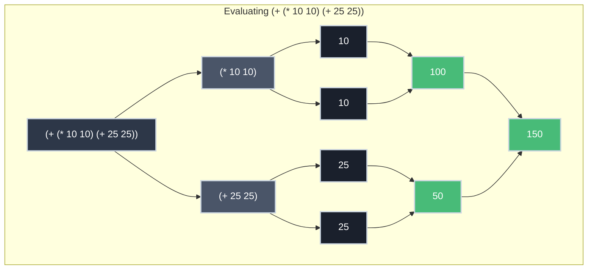
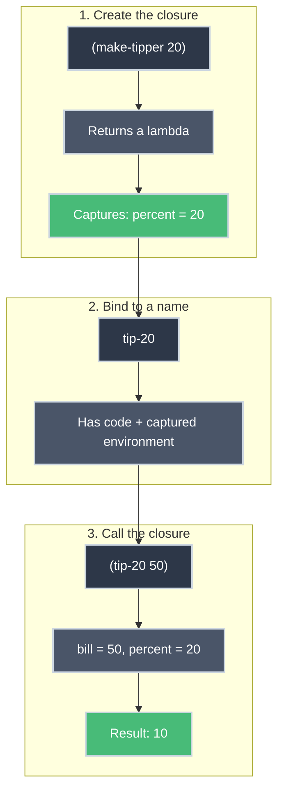

# A Beginner's Guide to Scheme

Scheme is one of the most elegant programming languages ever designed. Created in the 1970s at MIT by Guy Steele and Gerald Sussman, it strips programming down to its essential elements: expressions, definitions, and procedures. While Scheme isn't widely used in industry today, learning it teaches you to think about computation in a fundamentally different way.

This guide will take you from zero to writing your first Scheme programs.

## Why Learn Scheme?

Before diving in, let's address the obvious question: why learn a language that most professional programmers never use?

**Simplicity reveals fundamentals.** Scheme's syntax is so minimal that you can learn nearly the entire language in an afternoon. This simplicity lets you focus on *what* you're computing rather than fighting with syntax. As David Evans notes in *Introduction to Computing*:

> The primary advantage of using Scheme to learn about computing is its simplicity and elegance. The language is simple enough that this chapter covers nearly the entire language.

**It changes how you think.** Scheme forces you to think recursively and functionally. These patterns appear everywhere in modern programming—from JavaScript's array methods to React's component model to data processing pipelines.

**Historical significance.** Many "modern" features—garbage collection, first-class functions, closures—were invented in Lisp/Scheme decades ago. Understanding Scheme helps you appreciate where programming languages came from.

## Getting Started with DrRacket

The easiest way to start programming in Scheme is with [DrRacket](https://racket-lang.org/), a free IDE designed for learning. DrRacket provides:

- Syntax highlighting and error messages designed for beginners
- Multiple "language levels" for gradual learning
- An interactive REPL (Read-Eval-Print Loop) for experimentation

### Installation

1. Download DrRacket from [racket-lang.org](https://racket-lang.org/)
2. Install and open the application
3. Select a language: **Language → Choose Language → Teaching Languages → Beginning Student**

For the examples in this guide, you can also select **Other Languages → R5RS** for standard Scheme, or simply use `#lang scheme` at the top of your file.

> **Note:** If you are using the **Beginning Student** language level in DrRacket, you do **not** need to include `#lang scheme` at the top of your file. That directive is for when you are running standard Racket/Scheme scripts.

??? tip "DrRacket's Two Panels"

    DrRacket has two main areas:

    - **Definitions Window** (top): Where you write your program
    - **Interactions Window** (bottom): Where you can type expressions and see results immediately

    Click the **Run** button (or press Ctrl+R / Cmd+R) to execute your definitions, then experiment in the interactions window.

## Expressions: The Building Blocks

Everything in Scheme is an **expression**—a piece of code that evaluates to a value.

### Primitive Expressions

The simplest expressions are primitives that evaluate to themselves:

```scheme title="Primitive Expressions" linenums="1"
42          ; Evaluates to 42
3.14159     ; Evaluates to 3.14159
-17         ; Evaluates to -17
#t          ; Evaluates to true
#f          ; Evaluates to false
"hello"     ; Evaluates to "hello" (a string)
```

### Application Expressions

To do anything useful, you apply procedures (functions) to arguments. Scheme uses **prefix notation**—the procedure comes first, followed by its arguments, all wrapped in parentheses:

```scheme title="Application Expressions (Prefix Notation)" linenums="1"
(+ 1 2)         ; Add 1 and 2 → 3
(* 3 4)         ; Multiply 3 and 4 → 12
(- 10 3)        ; Subtract 3 from 10 → 7
(/ 20 4)        ; Divide 20 by 4 → 5
```

**Key insight:** Every application follows the same pattern: `(procedure arg1 arg2 ...)`. There are no special cases for operators vs. functions—they all work the same way.

### Nested Expressions

Expressions can be nested to build complex computations:

```scheme title="Nested Expressions" linenums="1"
(+ (* 10 10) (+ 25 25))    ; (10*10) + (25+25) = 100 + 50 = 150
(* (+ 2 3) (- 10 4))       ; (2+3) * (10-4) = 5 * 6 = 30
```

The innermost expressions evaluate first, then their results flow outward. This is called **post-order evaluation**.



The leaves (primitives) evaluate first, then results propagate up to the root.

??? info "Prefix vs. Infix Notation"

    Most languages use **infix notation** where operators go between operands: `3 + 4 * 5`. This requires precedence rules (PEMDAS) to determine order.

    Scheme's **prefix notation** eliminates ambiguity. The expression `(+ 3 (* 4 5))` explicitly shows that multiplication happens first. No memorization required.

    For a deeper dive into why this matters, see [Scheme & Parse Trees](../building_blocks/scheme_and_parse_trees.md).

### Built-in Procedures

Scheme provides many primitive procedures. Here are the essentials:

| Procedure | Description | Example | Result |
|:----------|:------------|:--------|:-------|
| `+` | Add numbers | `(+ 1 2 3)` | `6` |
| `-` | Subtract | `(- 10 3)` | `7` |
| `*` | Multiply | `(* 2 3 4)` | `24` |
| `/` | Divide | `(/ 15 3)` | `5` |
| `=` | Equal? | `(= 5 5)` | `#t` |
| `<` | Less than? | `(< 3 5)` | `#t` |
| `>` | Greater than? | `(> 3 5)` | `#f` |
| `<=` | Less or equal? | `(<= 5 5)` | `#t` |
| `>=` | Greater or equal? | `(>= 3 5)` | `#f` |
| `zero?` | Is zero? | `(zero? 0)` | `#t` |

Notice that `+` and `*` can take any number of arguments—another advantage of prefix notation.

## Definitions: Naming Things

Computation becomes useful when you can name values and reuse them. The `define` form creates a name and binds it to a value:

```scheme title="Defining Constants" linenums="1"
(define cups-per-day 3)
(define days-per-year 365)
(define cost-per-cup 4.50)

cups-per-day                          ; → 3
cost-per-cup                          ; → 4.50
```

Once defined, you can use names in expressions:

```scheme title="Using Definitions in Expressions" linenums="1"
; Calculate annual coffee spending
(* cups-per-day days-per-year cost-per-cup)
; → 4927.50
```

### Naming Conventions

Scheme names can include letters, digits, and special characters like `-`, `?`, and `!`:

```scheme title="Naming Convention Examples" linenums="1"
(define pi 3.14159)
(define my-favorite-number 42)
(define is-valid? #t)
```

Good names are:
- Descriptive: `cups-per-day` not `cpd`
- Hyphenated: `cost-per-cup` not `costPerCup`
- Question-marked for predicates: `zero?`, `even?`, `is-valid?`

## Procedures: Defining Your Own Functions

The real power comes from defining your own procedures. Scheme uses `lambda` (λ) to create procedures:

```scheme title="Anonymous Procedure (Lambda)" linenums="1"
(lambda (x) (* x x))    ; A procedure that squares its input
```

This creates an **anonymous procedure**—it exists but has no name. To use it, you can apply it directly:

```scheme title="Applying a Lambda Directly" linenums="1"
((lambda (x) (* x x)) 5)    ; → 25
```

But usually, you'll bind procedures to names with `define`:

```scheme title="Binding Procedures to Names" linenums="1"
(define square (lambda (x) (* x x)))

(square 2)      ; → 4
(square 7)      ; → 49
(square 1/4)    ; → 1/16
```

### Shorthand Definition Syntax

Defining named procedures is so common that Scheme provides a shorthand:

```scheme title="Shorthand vs. Lambda Syntax" linenums="1"
; These are equivalent:
(define square (lambda (x) (* x x)))
(define (square x) (* x x))
```

The shorthand moves the parameter list next to the name. Most Scheme code uses this form.

### Multiple Parameters

Procedures can take multiple inputs:

```scheme title="Procedure with Multiple Parameters" linenums="1"
(define (calculate-tax price rate)
  (* price rate))

(calculate-tax 9.99 0.14)    ; → 1.3986
```

### Practical Examples

Here are some useful procedures:

```scheme title="Practical Procedure Examples" linenums="1"
; Cube a number
(define (cubed x) (* x x x))
(cubed 3)    ; → 27

; Calculate the area of a circle
(define (circle-area radius)
  (* 3.14159 radius radius))
(circle-area 5)    ; → 78.53975

; Convert Fahrenheit to Celsius
(define (f-to-c fahrenheit)
  (* (- fahrenheit 32) 5/9))
(f-to-c 212)    ; → 100
(f-to-c 32)     ; → 0
```

## Conditionals: Making Decisions

Real programs need to make decisions. The `if` expression chooses between two values based on a condition:

```scheme title="If Expression Syntax" linenums="1"
(if condition
    consequent    ; evaluated if condition is true
    alternate)    ; evaluated if condition is false
```

For example:

```scheme title="Conditional Examples" linenums="1"
(if (> 5 3)
    "yes"
    "no")
; → "yes"

(if (= 1 2)
    "equal"
    "not equal")
; → "not equal"
```

### The `cheaper` Procedure

Let's build a procedure that returns the lower of two prices:

```scheme title="The cheaper Procedure" linenums="1"
(define (cheaper price1 price2)
  (if (< price1 price2) price1 price2))

(cheaper 4.50 3.75)    ; → 3.75
(cheaper 2.99 5.49)    ; → 2.99
(cheaper 4.00 4.00)    ; → 4.00
```

**How it works:**

1. `(< price1 price2)` compares the two prices
2. If `price1` is less, return `price1`
3. Otherwise, return `price2`

### Important: `if` is a Special Form

Unlike normal procedures, `if` doesn't evaluate all its arguments. Only the selected branch is evaluated:

```scheme title="Short-Circuit Evaluation" linenums="1"
(if (> 3 4)
    (/ 1 0)      ; Would cause error, but never runs
    7)
; → 7
```

This is called **short-circuit evaluation**—crucial for avoiding unnecessary computation or errors.

This pattern is ubiquitous across computing. In most programming languages, `&&` and `||` operators short-circuit: `false && expensive()` never calls `expensive()`. You'll find the same behavior in the UNIX shell:

```bash title="Short-Circuit Evaluation in Bash" linenums="1"
mkdir mydir && cd mydir      # Only cd if mkdir succeeds
test -f config || exit 1     # Only exit if file doesn't exist
```

The shell's `&&` only runs the second command if the first succeeds; `||` only runs the second if the first fails. Same principle, different syntax.

### Nested Conditionals

You can nest `if` expressions for multiple conditions:

```scheme title="Nested Conditionals" linenums="1"
(define (sign n)
  (if (> n 0)
      "positive"
      (if (< n 0)
          "negative"
          "zero")))

(sign 5)     ; → "positive"
(sign -3)    ; → "negative"
(sign 0)     ; → "zero"
```

??? tip "The `cond` Alternative"

    For multiple conditions, Scheme also provides `cond`:

    ```scheme title="Using cond for Multiple Conditions" linenums="1"
    (define (sign n)
      (cond
        [(> n 0) "positive"]
        [(< n 0) "negative"]
        [else "zero"]))
    ```

    This is often clearer than nested `if` expressions.

## Data Structures: Lists

Scheme stands for **LISP** (LISt Processing), so it's no surprise that lists are its fundamental data structure. A list is an ordered sequence of elements.

### Creating Lists

You can create a list using the `list` procedure:

```scheme title="Creating Lists" linenums="1"
(list 1 2 3)            ; → (1 2 3)
(list "a" "b" "c")      ; → ("a" "b" "c")
(list 1 "apple" 3.14)   ; → (1 "apple" 3.14) (lists can be mixed)
```

You can also construct lists using `cons` (construct). `cons` adds an element to the front of a list:

```scheme title="Using cons" linenums="1"
(cons 1 (list 2 3))     ; → (1 2 3)
(cons "first" empty)    ; → ("first")
```

`empty` (or `'()`) represents an empty list.

### Accessing List Elements

Scheme provides two primary procedures for taking lists apart:

*   **`first`** (or `car`): Returns the first element of the list.
*   **`rest`** (or `cdr`): Returns the list containing everything *except* the first element.

```scheme title="Accessing Elements" linenums="1"
(define my-numbers (list 10 20 30 40))

(first my-numbers)      ; → 10
(rest my-numbers)       ; → (20 30 40)

(first (rest my-numbers)) ; → 20
```

> **Historical Note:** `car` stands for "Contents of the Address part of Register" and `cdr` (pronounced "could-er") stands for "Contents of the Decrement part of Register". These names refer to the architecture of the IBM 704 computer where Lisp was first implemented! Most modern Scheme teaching languages prefer `first` and `rest`.

## Recursion: Where are the Loops?

You might have noticed that this guide hasn't mentioned `for` or `while` loops. That's because Scheme doesn't have them! In Scheme, we use **recursion**—procedures that call themselves—to handle repetition.

For example, if you wanted to sum a list of numbers, you wouldn't use a loop. You would say: "The sum is the **first** number plus the **sum of the rest** of the numbers."

```scheme title="Recursion Example: Summing a List" linenums="1"
(define (sum-list numbers)
  (if (empty? numbers)
      0                               ; Base case: the sum of nothing is 0
      (+ (first numbers)              ; Recursive case: add the first...
         (sum-list (rest numbers))))) ; ...to the sum of the rest!

(sum-list (list 1 2 3 4 5))           ; → 15
```

While it might feel strange at first, recursion is a more powerful and flexible way to express computation.

## Higher-Order Procedures

One of Scheme's most powerful features is that procedures are **first-class values**. They can be:

- Passed as arguments to other procedures
- Returned as results from procedures
- Stored in data structures

### Procedures That Return Procedures

Here's a procedure that creates other procedures:

```scheme title="Procedures That Return Procedures" linenums="1"
(define make-tipper
  (lambda (percent)           ; (1)!
    (lambda (bill) (* bill (/ percent 100))))) ; (2)!

; Create a procedure that calculates a 20% tip
(define tip-20 (make-tipper 20))
(tip-20 50)    ; → 10
(tip-20 75)    ; → 15

; Create a procedure that calculates a 15% tip
(define tip-15 (make-tipper 15))
(tip-15 80)    ; → 12
```

1. Outer lambda takes `percent` and returns an inner lambda
2. Inner lambda "closes over" `percent`, remembering its value

**What's happening:**

1. `(make-tipper 20)` returns `(lambda (bill) (* bill (/ 20 100)))`
2. This new procedure "remembers" that `percent` is `20`
3. When called with `50`, it computes `(* 50 0.20)` → `10`

This "memory" is called a **closure**—the procedure captures the environment where it was created.



### Procedures as Arguments

You can pass procedures to other procedures:

```scheme title="Passing Procedures as Arguments" linenums="1"
(define (apply-twice f x)  ; (1)!
  (f (f x)))               ; (2)!

(define (add-one x) (+ x 1))

(apply-twice add-one 5)    ; → 7  (adds 1 twice: 5→6→7)
(apply-twice square 2)     ; → 16 (squares twice: 2→4→16)
```

1. `f` is a procedure passed as an argument
2. Apply `f` to `x`, then apply `f` to that result

This is the foundation of functional programming patterns like `map`, `filter`, and `reduce`.

## Putting It All Together

Let's build a complete example that uses everything we've learned:

```scheme title="Complete Scheme Program" linenums="1"
#lang scheme

; Constants for coffee habit calculation
(define cups-per-day 3)
(define days-per-year 365)
(define cost-per-cup 4.50)

; Basic functions
(define (squared x) (* x x))
(define (cubed x) (* x x x))

; Practical calculation
(define (calculate-tax price rate) (* price rate))

; Decision making
(define (cheaper p1 p2) (if (< p1 p2) p1 p2))

; Higher-order function
(define make-tipper
  (lambda (percent)
    (lambda (bill) (* bill (/ percent 100)))))

; Recursive function processing a list
(define (calculate-total prices)
  (if (empty? prices)
      0
      (+ (first prices) 
         (calculate-total (rest prices)))))

; Using our definitions
(define tip-20 (make-tipper 20))
(define tip-15 (make-tipper 15))
(define my-orders (list 4.50 3.75 2.99))  ; A list of coffee prices

; Try them out!
(* cups-per-day days-per-year cost-per-cup)    ; Annual coffee cost
(squared 12)                                    ; 144
(calculate-tax 9.99 0.14)                       ; Tax amount: 1.3986
(cheaper 4.50 3.75)                             ; Returns 3.75
(tip-20 50)                                     ; Returns 10
(calculate-total my-orders)                     ; Returns 11.24
```

## Practice Exercises

??? question "Exercise 1: Cube Procedure"

    Define a procedure `cube` that takes one number and returns its cube.

    ```scheme title="Expected Behavior" linenums="1"
    (cube 3)    ; should return 27
    (cube 5)    ; should return 125
    ```

    ??? tip "Solution"

        ```scheme title="Solution" linenums="1"
        (define (cube x) (* x x x))
        ```

??? question "Exercise 2: Absolute Value"

    Define a procedure `abs-value` that returns the absolute value of a number.

    ```scheme title="Expected Behavior" linenums="1"
    (abs-value 5)     ; should return 5
    (abs-value -7)    ; should return 7
    (abs-value 0)     ; should return 0
    ```

    ??? tip "Solution"

        ```scheme title="Solution" linenums="1"
        (define (abs-value x)
          (if (< x 0)
              (- x)      ; negate if negative
              x))
        ```

??? question "Exercise 3: Bigger Magnitude"

    Define `bigger-magnitude` that returns whichever input has the greater absolute value.

    ??? tip "Hint"
        You can use the `abs-value` procedure you defined in Exercise 2 to help with the comparison!

    ```scheme title="Expected Behavior" linenums="1"
    (bigger-magnitude 5 -7)    ; should return -7 (|-7| > |5|)
    (bigger-magnitude 9 -3)    ; should return 9
    ```

    ??? tip "Solution"

        ```scheme title="Solution" linenums="1"
        (define (bigger-magnitude a b)
          (if (> (abs-value a) (abs-value b))
              a
              b))
        ```

??? question "Exercise 4: Seconds in a Year"

    Write a Scheme expression to calculate the number of seconds in a year. Define meaningful names for intermediate values.

    ??? tip "Solution"

        ```scheme title="Solution" linenums="1"
        (define seconds-per-minute 60)
        (define minutes-per-hour 60)
        (define hours-per-day 24)
        (define days-per-year 365)

        (* seconds-per-minute
           minutes-per-hour
           hours-per-day
           days-per-year)
        ; → 31536000
        ```

??? question "Exercise 5: Make Multiplier"

    Define a higher-order procedure `make-multiplier` that takes a number and returns a procedure that multiplies its input by that number.

    ```scheme title="Expected Behavior" linenums="1"
    (define double (make-multiplier 2))
    (define triple (make-multiplier 3))

    (double 5)    ; should return 10
    (triple 5)    ; should return 15
    ```

    ??? tip "Solution"

        ```scheme title="Solution" linenums="1"
        (define (make-multiplier n)
          (lambda (x) (* n x)))
        ```

## Key Takeaways

| Concept | Syntax | Example |
|:--------|:-------|:--------|
| **Primitive** | `value` | `42`, `#t`, `#f`, `"hello"` |
| **Application** | `(proc args...)` | `(+ 1 2 3)` |
| **Definition** | `(define name value)` | `(define pi 3.14)` |
| **Procedure** | `(lambda (params) body)` | `(lambda (x) (* x x))` |
| **Named Procedure** | `(define (name params) body)` | `(define (square x) (* x x))` |
| **Conditional** | `(if test then else)` | `(if (> a b) a b)` |

## What's Next?

This primer covers the core of Scheme. To go deeper:

- **[Scheme & Parse Trees](../building_blocks/scheme_and_parse_trees.md)** — Understand why Scheme's syntax directly mirrors computation structure
- **[Procedures & Higher-Order Functions](procedures_and_higher_order_functions.md)** — Explore the full power of functions as values
- **[Recursion](../algorithms_complexity/recursion.md)** — Dive deeper into recursive problem solving.

## Further Reading

- **[Structure and Interpretation of Computer Programs](https://mitp-content-server.mit.edu/books/content/sectbyfn/books_pres_0/6515/sicp.zip/index.html)** (Abelson & Sussman) — The classic MIT textbook
- **[Introduction to Computing](https://computingbook.org/)** (David Evans) — A key reference for learning Scheme
- **[Racket Documentation](https://docs.racket-lang.org/guide/intro.html)** — Official guide to Racket/Scheme
- **[Teach Yourself Racket](https://cs.uwaterloo.ca/~plragde/flaneries/TYR/)** — University of Waterloo tutorial
- **[CSC 151 Course Materials](https://rebelsky.cs.grinnell.edu/Courses/CSC151/2025Sp/readings/intro-scheme.html)** — Grinnell College's introduction to Scheme

---

Scheme's power lies in its simplicity. With just expressions, definitions, procedures, and conditionals, you can express any computation. The challenge isn't learning more syntax—it's learning to think in terms of these fundamental building blocks.
